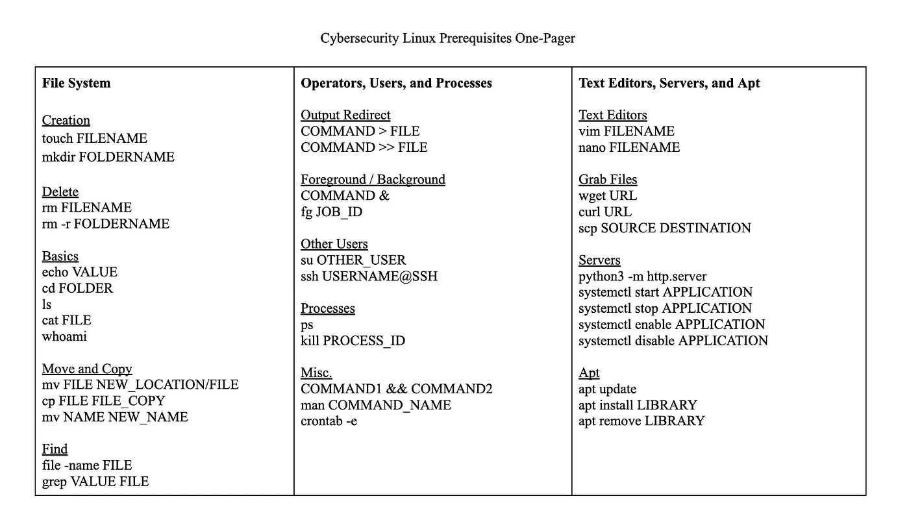

# 网络安全初学者的 Linux 先决条件

> 原文：<https://medium.com/geekculture/linux-prerequisites-for-cybersecurity-beginners-8d8614588612?source=collection_archive---------8----------------------->

## 介绍性 Linux 命令的摘要和备忘单


Image from [Pixabay](https://pixabay.com/photos/matrix-data-network-software-code-4493783/)

# 概观

最近，我开始探索网络安全的奇妙世界。在探索了一些学习资源后，我选定了一个网络安全培训平台 [TryHackMe](https://tryhackme.com/) 。

[](https://tryhackme.com/) [## 网络安全培训

### TryHackMe 是一个免费的学习网络安全的在线平台，使用动手练习和实验室，通过您的…

tryhackme.com](https://tryhackme.com/) 

作为一个完全的初学者，我从他们的初学者轨迹开始，学习理论和基本面。在这篇博客中，我将分享课程中更实用的 Linux 基础技能的概述。



Image by Author, a guide to all of the commands discussed in this blog

# 第一部分:基础知识

## 基本命令

首先，Linux 有两个“hello world”命令。第一个是`echo`，它将打印一个值。例如，要打印 hello world，可以这样写:

```
echo hello world
```

接下来，`whoami`返回用户的用户名。

```
whoami
```

## 文件系统

如果您以前使用过终端，您会或多或少地熟悉这些命令。在终端中，您可以访问和操作系统中的每个文件。Linux 的基础是改变目录的`cd`和列出目录中所有文件的`ls`。(将目录本质上视为一个文件夹。)

```
cd FOLDER_NAMEls
```

接下来，要查看文件的内容，使用`cat`(代表“连接”)。

```
cat FILE_NAME
```

## 在文件中搜索和

要查找文件，请使用`find`工具。

```
find -name FILE
```

有一点很方便，那就是`find`可以使用代表任何值的`*`通配符。例如，如果要查找所有 txt 文件，可以使用以下命令:

```
find -name *.txt
```

接下来，要查看文件内部的内容，可以使用`grep`。

```
grep PHRASE FILE
```

例如，如果我想在日志`example.log`中搜索某个 IP 地址，我可以输入:

```
grep INSERT_THE_IP_ADDRESS_HERE example.log
```

## 经营者

可以在命令之上使用运算符来实现某些目标。例如，`&`可以用来在后台运行命令。如果命令需要很长时间，这可能特别有用。

```
cp big_file big_file_copy &
```

接下来，`&&`将同时运行两个命令。例如，要输入和读取文件夹的命令，可以使用:

```
cd Folder && ls Folder
```

`>`给某物分配一个输出。例如，如果我想用`echo`创建一个文件，就说“Cybersec 是史诗级的！”，我可以写:

```
echo Cybersec is Epic! > epic.txt
```

最后，`>>`类似于`>`,但是它将它添加到文件中。例如，如果我想添加到`epic.txt`，我可以使用`>>`:

```
echo Infosec is Epic! >> epic.txt
```

# 第二部分:导航 Linux

## 嘘

SSH 是 Linux 对于 cybersec 最重要的部分之一！有了这个，你可以连接到不同的机器。例如，在 TryHackMe 中，您需要频繁地从一台机器连接到另一台机器。为此，您需要知道用户的(1) IP 地址，(2)用户名，(3)密码。要连接，请键入:

```
ssh USERNAME@IP_ADDRESS
```

> 注意:用实际的用户名和 IP 地址替换用户名和 IP 地址。

在提示中，将要求您确认是否继续。键入“是”接下来，系统会提示您输入密码。如果一切正常，您将连接到另一台机器，并可以在上面执行命令！

## 扩展命令

大多数命令有额外的能力，可以通过标志解锁。例如，当查看目录的内容时，`ls`会排除任何以`.`开头的文件。但是，使用`--all`或`-a`标志，它会显示所有文件，包括带有`.`的文件:

```
ls -a
```

要找到一个命令标志的完整列表，你可以通过终端查看它的手册或`man`。

```
man ls
```

## 文件系统:管理

就像你如何在 Google Drive 或 Microsoft Word 中创建、删除和复制文件一样，你也可以通过你的终端做同样的事情！要创建一个文件夹，需要做一个目录或者`mkdir`。例如:

```
mkdir NewFolder
```

通过`cd`进入文件夹。

```
cd NewFolder
```

接下来，在文件夹中，您可以用`touch`创建一个新文件。

```
touch NewFile
```

有了文件，可以用`cp`复制。

```
cp NewFile NewFileCopy
```

也可以用`mv`移动。我们先创建一个新文件夹，然后将 NewFileCopy 移动到该文件夹中。

```
mkdir NewerFolder && mv NewFileCopy NewerFolder/NewFileCopy
```

`mv`很酷，因为它也可以用来重命名文件。例如，如果我想将 NewFile 重命名为 OldFile，我可以写:

```
mv NewFile OldFile
```

最后，您可以使用`file`来确定文件的文件类型。例如，让我们向 OldFile 添加内容，然后查看它的文件类型。

```
echo Some Content! > OldFile && file OldFile
```

## 切换用户

有时，您需要在用户之间切换。您可以通过`su`完成此操作。

```
su OTHERUSER
```

然后会提示您输入其他用户的密码。此外，要进入其他用户的主目录，添加标志`-l`:

```
su -l OTHERUSER
```

# 第三部分:导航 Linux

## 文本编辑器

类似于 Visual Studio Code 或者 Sublime，终端有几个内置的文本编辑器，包括`nano`和`vim`。

`nano`是更简单明了的文本编辑器。要使用它，键入`nano FILENAME`，然后按照底部的命令列表进行更改。

```
nano FILENAME
```

`vim`稍微复杂一些。简而言之，要使用它，键入`i`来编辑(“插入”)文本。要退出并保存，请按 escape 键，然后键入`wq!`。

```
vim FILENAME
```

## 抓取文件

要从 URL(包括电脑的 URL)下载文件，您可以使用`wget`或`curl`。

```
wget URL
```

要在两台计算机之间安全地复制文件，可以使用`scp`。

```
scp SOURCE DESTINATION
```

最后，您可以在终端上托管 web 服务器，通过它您可以检索文件。要创建 web 服务器，只需运行:

```
python3 -m http.server
```

## 处理

在计算机上运行的程序称为进程。使用`ps`查看所有内容。

```
ps
```

结果的一列将具有 PID 或进程 ID。您可以使用它来管理流程。例如，要停止一个进程，使用`kill`命令。

```
kill PID_OF_PROCESS
```

另一组有用的命令是`systemctl`。例如，要启动、停止、启用或禁用 apache2，可以使用:

```
systemctl start apache2systemctl stop apache2systemctl enable apache2systemctl disable apache2
```

最后，与`&`在后台执行命令相反，要在前台执行命令，请使用`fg`。

```
fg JOB_ID
```

> 注意:当您在后台运行该命令时，会打印作业 ID。

## 时间单位

要计划和重复任务，您可以使用`cron`。要查看所有定期运行的任务，请运行`crontab -e`。

```
crontab -e
```

Cron 作业包含六个值:分钟、小时、一月中的某一天、月、星期几和作业本身。要让某个东西定期运行，可以用一个`*`来代替这个值。第一个值也可以替换为系统重启时运行的类似`@reboot`的事件。

## 图书馆

Linux 最棒的地方在于一切都是开源的。要安装和删除库，您可以使用`apt`。

```
apt updateapt install LIBRARYapt remove LIBRARY
```

# 第四部分:结论和资源

这就结束了我对用于网络安全的基本 Linux 命令的概述！如果您有兴趣深入研究这个领域，我会推荐 TryHackMe 模块。这篇博客很大程度上基于他们的 Linux 基础模块。除了实用的 Linux 和 Windows 技能，我一直很喜欢它们提供的理论，以真正理解系统如何工作才能穿透它们。

[](https://tryhackme.com/) [## 网络安全培训

### TryHackMe 是一个免费的学习网络安全的在线平台，使用动手练习和实验室，通过您的…

tryhackme.com](https://tryhackme.com/) 

我也一直在尝试探索捕捉旗帜，并一直在使用[皮科 CTF](https://play.picoctf.org/) 。最后，概括一下，这是所有命令的完整列表:


Image by Author, a guide to all of the commands discussed in this blog