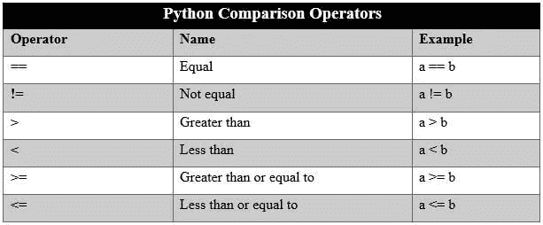
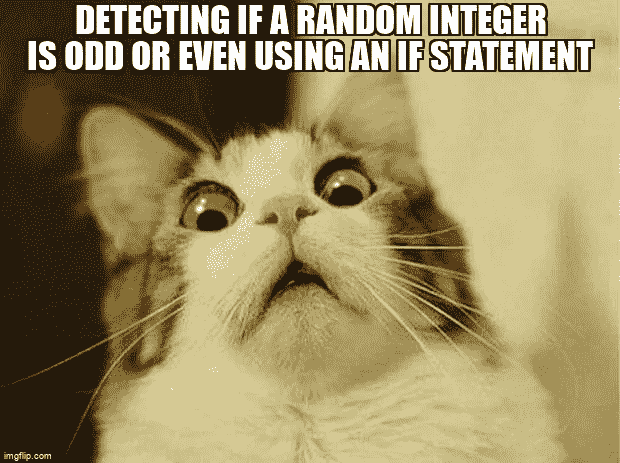
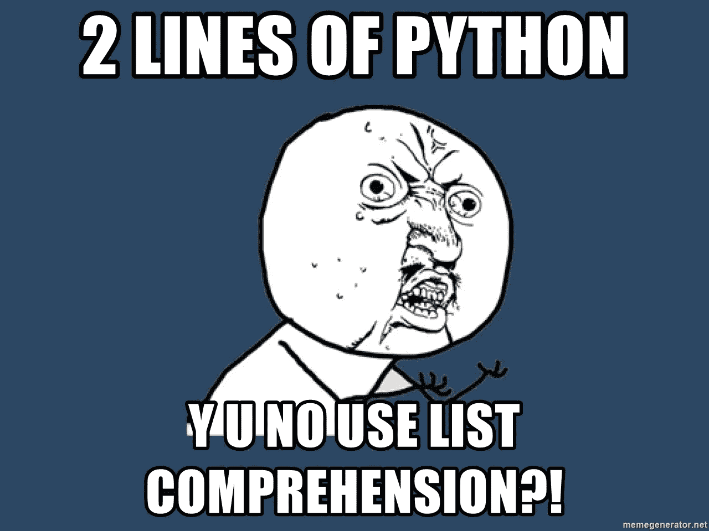
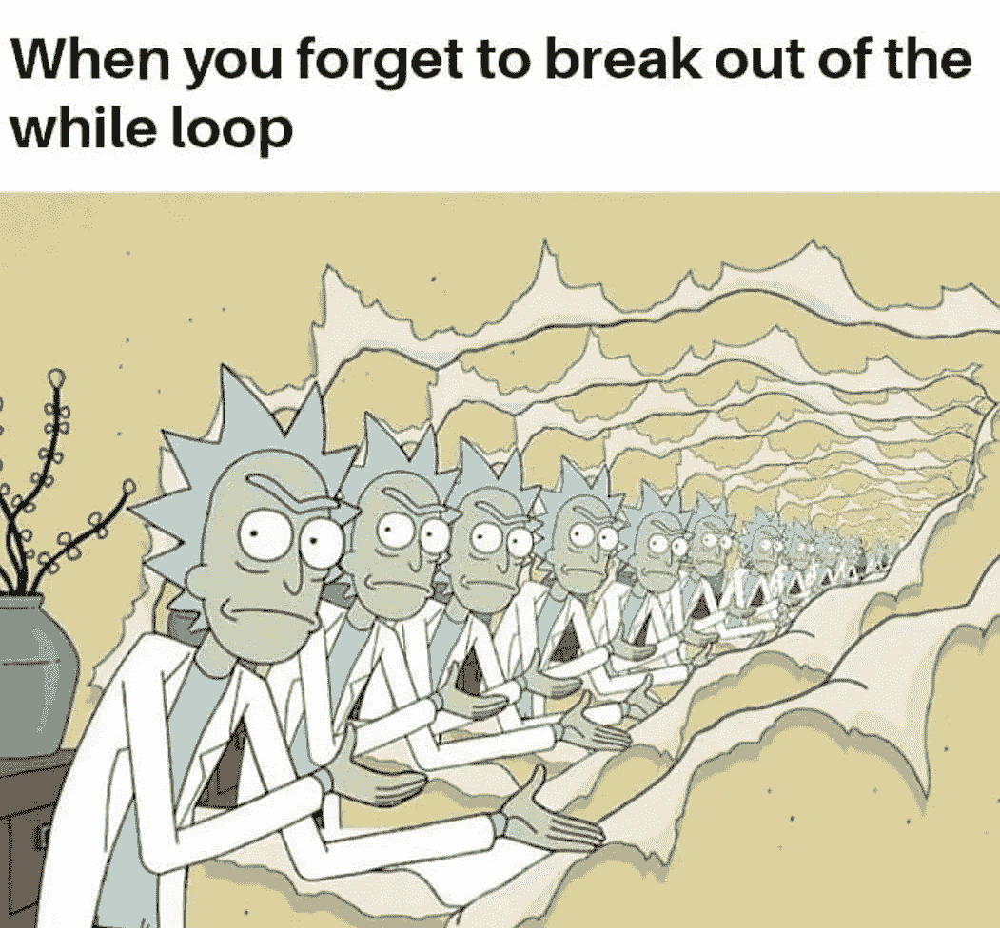
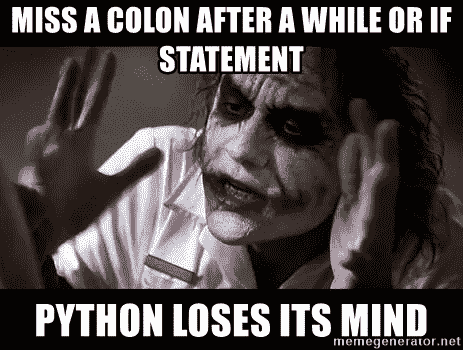

# 列表理解、条件和循环语句(快速代码-Python)

> 原文：<https://medium.com/geekculture/list-comprehension-conditional-and-looping-statements-in-python-16db4ea9e58b?source=collection_archive---------1----------------------->


Credit: Unsplash

在这个**快速代码-Python** 系列的**第四章**中，我们将理解并实现 Python 中可用的各种条件和循环语句。与此同时，我们将看到如何使用列表理解来高效地编写代码。

> 注意:我已经以线性的方式编写了**快速代码-Python** 系列，这样即使是新手也可以按照这个系列来理解 Python 实际能做什么。对于擅长基础知识的人来说，你可以跟随这个系列来更新你的概念，或者选择这个系列中你想了解更多的章节。

## 比较运算符

在理解条件语句和循环语句之前，我们先来理解什么是比较和逻辑运算符。比较运算符可以定义为比较两个值。输出可以是真或假(布尔值)。

下面给出了基本的比较运算符，



Credit: engineering big data

```
12 == 12
**O/P: True**12 > 8
**O/P: True**z = 5
x = 4
z == x
**O/P: False**a = 'makeshift'
b = 'makeshift'
a == b
**O/P: True**a = 'makeshift' #python is case-sensitive
b = 'Makeshift'
a == b
**O/P: False**12 != 3
**O/P: True**
```

## **逻辑运算符**

逻辑运算符主要用在条件语句中，条件语句为 true 时执行语句，为 false 时不执行语句。我们将在 python 中使用最重要的逻辑操作符是逻辑 AND、逻辑 or。

如果你熟悉逻辑门，那么同样的原理也适用于这里。

```
**#AND operator**
1 and 0 = 0
1 and 1 = 1
0 and 1 = 0
0 and 0 = 0**#OR operator**
1 or 1 = 1
1 or 0 = 1
0 or 0 = 0
0 or 1 = 1
```

请注意，在上面的解释中，您可以将 0 替换为 False，将 1 替换为 True。例，`TRUE and FALSE = FALSE`，`TRUE OR FALSE = TRUE`等等。

## **条件语句**

条件语句是我们在 python 中使用的 if、elif 和 else 语句，用来检查给定的条件是真还是假。

`if`条件为真，那么 if 条件中的代码将运行，如果为假，那么它将不会运行。

`elif`elif 中给定的条件为真，则 elif 中的代码将运行，如果为假，则不会运行。

`else`当没有其他条件为真时，将运行 else 语句中的代码。

```
if 3 == 4:
    print('First statement is true')
elif 2 == 4:
    print('Second statement is true')
else:
    print('Last statement is true')**O/P:
Last statement is true**
```

> 阻止萨姆进入大学校园的代码

```
name = input('Enter your name: ')if name == 'sam':
    print('Sam You are Blocked here')
else:
    print('Welcome!!')**O/P:
Enter your name: sam
Sam You are Blocked here**
```

> 山姆可能会用他朋友的名字骗我们进入校园，让我们确保这不会发生

```
name = input('enter your name: ')if name == 'sam' or name == 'josh' or name == 'kate':
    print('Access Denied')
else:
    print('Access Granted')**O/P:
enter your name: josh
Access Denied**
```

> 代码只返回字典中大于 25 的元素。注意，有更有效的方法可以做到这一点，但是现在让我们用 if 条件来做这件事。

```
inp_dict = {'a': 23, 'b': 40, 'c': 34}
out_dict = []if inp_dict['a'] >= 25:
    out_dict.append(inp_dict['a'])if inp_dict['b'] >= 25:
    out_dict.append(inp_dict['b'])

if inp_dict['c'] >= 25:
    out_dict.append(inp_dict['c'])else:
    print('No Elements Found!!')

out_dict**O/P:
[40, 34]**
```

> 用于检查随机生成的数字和用户输入的数字是否相同的代码

```
import random
random_val = random.randint(1,50)
user = int(input('enter numbers 1 to 50: '))if random_val == user:
    print('You got it right !!')
    print('random value is: ',random_val)
elif random_val > user:
    print('Nope !! little higher')
    print('random value is: ',random_val)
else:
    print('Nope!! little lower')
    print('random value is: ',random_val)**O/P:
enter numbers 1 to 50: 34
Nope!! little lower
random value is:  2**
```

> 表示整数位数的代码

```
x = int(input('Enter a positive integer: '))if 0 <= x <= 9:
    print("Number is single digit")
elif 10 <= x <= 99:
    print("Number is double digit")
elif 100 <= x <= 999:
    print("Number is 3 digits")
elif 1000 <= x <= 9999:
    print("Number is 4 digits")
else:
    print("Number is more than 4 digits")**O/P:
Enter a positive integer: 134
Number is 3 digits**
```

> 用于确定一个数字是偶数还是奇数的代码

```
x = int(input("Enter an integer: "))if x % 2==0:
    print('Number is Even')
else:
    print('Number is odd')**O/P:
Enter an integer: 34
Number is Even**
```

> 仅当标记大于 75 时，才从字典中向列表追加标记

```
marks_dict = {'math': 45, 'science': 89, 'physics': 90}
output_list = []z = list(marks_dict.values())if z[0] >= 75:
    output_list.append(z[0])
if z[1] >= 75:
    output_list.append(z[1])
if z[2] >= 75:
    output_list.append(z[2])

output_list**O/P:
[89, 90]**
```

## **为循环**

python 中的循环用于检查条件是否为真，然后在块中连续执行一段代码，直到条件为假。python 中的主要循环语句是 for、嵌套循环，而和其他概念(如列表理解、范围)理解起来也很重要。

*   `break()`用于退出 for 循环或 while 循环
*   `continue()`用于跳过当前块，并返回到 For 或 while 语句。

```
names = ['sam', 'kate','aj', 'moen','john']for i in names:
    print(i)**O/P:
sam
kate
aj
moen
john**
```

for 循环中的`i`用于遍历循环，并从列表中为我们获取值。

> 在循环中使用 break 语句来中断循环

```
names = ['sam', 'kate','aj', 'moen','john']for i in names:
    print(i)
    if i == 'moen':
        break**O/P:
sam
kate
aj
moen**
```

> 在循环中使用 Continue 语句打印列表中的奇数

```
my_list = [1, 2, 3, 4, 5, 6, 7, 8, 9, 10]for i in my_list:
    if i%2 == 0:
        continue
    print(i)**O/P:
1
3
5
7
9**
```

在上面的代码中，我们告诉 for 循环检查偶数，如果是，那么在 if 条件下什么都不做，继续 for 循环。如果只使用一个 if 条件，我们将很难做同样的操作。我们必须为列表中的每个元素编写条件，并检查它们是偶数还是奇数



credit meme overflow

> 计算列表中数字的总和

```
num_list = [3,4,5,6,7,8]sum_num = 0for i in num_list:
    sum_num = sum_num + iprint(sum_num)**O/P:
33**
```

> 让我们用`enumerate()`给我们学生的列表一个索引

```
names = ['sam', 'kate','aj', 'moen','john']for i,name in enumerate(names):
    print(i,name)**O/P:
0 sam
1 kate
2 aj
3 moen
4 john**
```

## **列表理解**

列表理解提供了一种简洁的方式来创建列表。常见的应用是创建新的列表，其中每个元素都是应用于另一个序列或循环语句的每个成员的一些操作的结果。也可以根据特定列表上设置的条件来创建它们，并将结果放入新列表中。

让我们看看两个版本的代码，一个使用普通方法对列表中的元素求平方，另一个版本使用列表理解。

> 不使用列表理解

```
my_list = [1, 2, 3, 4]output_list = []for i in my_list:
    output_list.append(i **2)print(output_list)**O/P:
[1, 4, 9, 16]**
```

> 使用列表理解

```
out_list = [i**2 for i in my_list]
out_list**O/P:
[1, 4, 9, 16]**
```

看起来很简单对吧！！我喜欢列表理解，因为它让我不用为简单的列表操作和计算写更多的代码。



Credit: meme generator

让我们看看另一个例子，打印给定列表中偶数的平方

> 不使用列表理解，

```
numbers = [1, 2, 3, 4, 5, 6, 7, 8, 9, 10]even_list = []for i in numbers:
    if i % 2==0:
        even_list.append(i**2)
print(even_list)**O/P:
[4, 16, 36, 64, 100]**
```

> 利用列表理解，

```
even_list = [i**2  for i in numbers if i %2 ==0  ]
even_list**O/P: 
[4, 16, 36, 64, 100]**
```

## **嵌套循环**

嵌套循环就是循环中的循环。当我们想在循环的主循环中循环时，我们可以使用嵌套循环。一个例子是打印乘法表。

> 打印第四和第五乘法表

```
for x in range(4,6):
    for y in range(1,11):
        print('{} * {} = {}'.format(x,y,x*y))**O/P:
4 * 1 = 4
4 * 2 = 8
4 * 3 = 12
4 * 4 = 16
4 * 5 = 20
4 * 6 = 24
4 * 7 = 28
4 * 8 = 32
4 * 9 = 36
4 * 10 = 40
5 * 1 = 5
5 * 2 = 10
5 * 3 = 15
5 * 4 = 20
5 * 5 = 25
5 * 6 = 30
5 * 7 = 35
5 * 8 = 40
5 * 9 = 45
5 * 10 = 50**
```

让我们浏览一下上面的代码，了解一下是怎么回事。

第一个 For 循环`x`，通过 4 和 5 循环(使用范围功能时上限-1)。当我们在 4(开始循环)时，我们进入另一个循环`y`，该循环从 1 到 10。然后我们使用 print 函数打印表格。完成第 4 个表后，即从 1 到 10 打印，我们返回到`x`循环，从 5 开始，以同样的方式打印。

## **范围**

我们在 for 循环中使用 range 函数来指定循环执行期间迭代的次数。

范围内的索引从 0 开始，以(n-1)结束。

示例:range(0，11)表示迭代 0 到 10

```
for i in range(4, 10):
    print(i)**O/P:
4
5
6
7
8
9**
```

我们甚至可以在范围中使用一个步数，来指定迭代循环时范围的增加或减少

```
for i in range(1, 10, 2):
    print(i)**O/P:
1
3
5
7
9**for i in range(10, 0, -2):
    print(i)**O/P:
10
8
6
4
2**
```

## **While 循环**

只要某个条件保持为真，while 循环就可以用来执行一组语句。记住在最后指定条件，否则程序将无限运行，你将不得不中断并重新启动内核。相信我，这在我身上发生过很多次了，最好避免这个问题。



Credit: ah see it

> 创建一个简单的 while 循环来打印数字

```
i = 0while i <=5:
    print(i)
    i = i +1**O/P:
0
1
2
3
4
5**
```

> 我们将看到如何运行一个循环，在初始阶段保持它`True`，而在最后指定条件。

```
i = 3
while True:
    print(i)
    i = i +1
    if i >=7:
        break**O/P:
3
4
5
6**
```

请记住，在条件语句或循环语句后插入冒号是强制性的，这样 IDE 将自动缩进下一个代码块。



Credit: Meme generator

## 使用上述概念的一些实际例子

> 使用列表理解打印输入字符串中的数字

```
statement = 'my name is shreedhar and I am 22 years old'
number = [i  for i in statement if i.isdigit()]
print(number)**O/P:
['2', '2']**
```

> 打印名单上除“凯特”之外的所有名字

```
names = ['sam', 'kate','aj', 'moen','john']i = 0
while i < len(names):
    name = names[i]
    i += 1

    if name == 'kate':
        continue

    print(name)**O/P:
sam
aj
moen
john**
```

> 生成下表的代码

```
1 1 1
2 4 8
:
(upto)
:
10 100 100for x in range(1, 11):
    print('{} {} {}'.format(x, x*x, x*x*x))**O/P:
1 1 1
2 4 8
3 9 27
4 16 64
5 25 125
6 36 216
7 49 343
8 64 512
9 81 729
10 100 1000**
```

> 打印给定范围内的偶数

```
min = int(input('lower limit: '))
max = int(input('upper limit: '))for i in range(min,max):
    if i % 2 == 0:
        print(i)**O/P:
lower limit: 12
upper limit: 34
12
14
16
18
20
22
24
26
28
30
32**
```

> 根据用户提供的长度，使用随机字母、标点符号和数字为用户生成密码的代码

```
import string
import randompassword_char = string.ascii_letters + string.punctuation + string.digitslength = int(input('Enter the length of the password: '))
password = ""for i in range(0, length):
    password = password + random.choice(password_char)print(password)**O/P:
Enter the length of the password: 13
Oha/(CJU^Wxxx**
```

> 从用户给出的回复中对句子中的单词进行排序

```
sentence = input("How are you doing : ")words = sentence.split()
words.sort()print("Here are the sorted words :")
for word in words:
   print(word)**O/P:
How are you doing : I am doing very good
Here are the sorted words :
I
am
doing
good
very**
```

希望您已经理解了如何实现循环、条件语句以及使用列表理解来显著减小代码的大小。

> 注意:如果你在智能手机上阅读博客，代码可能不太适合你。如果你不能正确理解代码，请在 PC/MAC 上阅读博客

仅仅阅读博客是不够的。通过在 IDE 上复制粘贴来运行代码。自己改变变量，看看输出如何变化。最后，试着自己写代码。

> 查看**快速代码-Python** 系列的[上一章](/geekculture/3-strings-lists-dictionaries-tuples-and-sets-quick-code-python-84232f05a3df)。