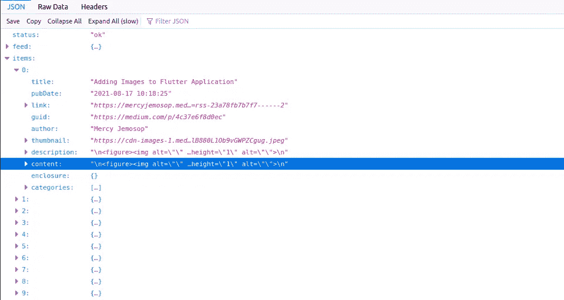
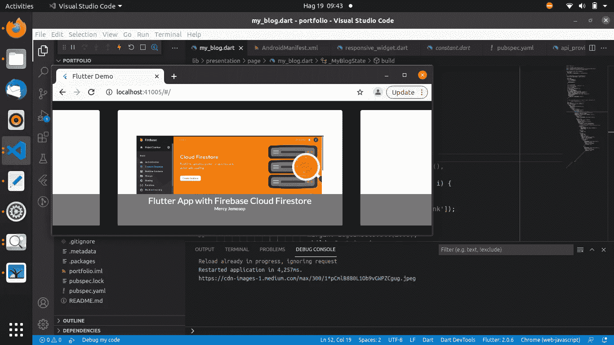
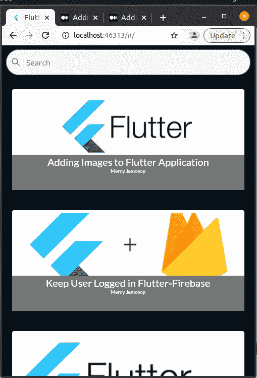

# 列表视图类

> 原文：<https://medium.com/geekculture/list-view-class-f307e6c0d8e?source=collection_archive---------10----------------------->

在 flutter 中显示 listview.builder 中的项目


## 介绍

线性排列的可滚动部件列表，它沿着滚动方向一个接一个地显示其子部件。在横轴上，孩子们被要求填写[列表视图](https://api.flutter.dev/flutter/widgets/ListView-class.html)。

有四种方法可以构造列表视图

*   [列表<小部件>](https://api.flutter.dev/flutter/dart-core/List-class.html) 这是默认设置，它适用于具有少量子视图的列表视图，因为构建[列表](https://api.flutter.dev/flutter/dart-core/List-class.html)需要为列表视图中可能显示的每个子视图做工作，而不仅仅是那些实际可见的子视图。
*   [ListView.builder](https://api.flutter.dev/flutter/widgets/ListView/ListView.builder.html) 是一个合适的大而无限的子。它采用 IndexedWidgetBuilder，按需构建子节点。
*   [ListView.separated](https://api.flutter.dev/flutter/widgets/ListView/ListView.separated.html) 接受两个 IndexedWidgetBuilders: `itemBuilder`按需构建子项，`separatorBuilder`同样构建出现在子项之间的分隔符子项。此构造函数适用于子元素数量固定的列表视图。
*   [ListView.custom](https://api.flutter.dev/flutter/widgets/ListView/ListView.custom.html) 提供定制子模型附加方面的能力。例如，SliverChildDelegate 可以控制用于估计实际上不可见的子级大小的算法。

**我们将使用 listView.builder 构造函数来显示来自 API 的列表**

从您的 API 获取数据，在我的情况下，我将从媒体端点检索数据。将您的用户名编辑为中等用户名。注意:你可以使用任何端点，这只是一个例子。

```
const BLOG_API ='https://api.rss2json.com/v1/api.json?rss_url=https://medium.com/feed/@yourusername';
```

步骤 1:从介质/端点获取数据。apiProvider.dart

```
import 'dart:convert';import 'package:portfolio/application/theme/config.dart';
import 'package:http/http.dart' as http;const BLOG_API =
    '[https://api.rss2json.com/v1/api.json?rss_url=https://medium.com/feed/@mercyjemosop'](https://api.rss2json.com/v1/api.json?rss_url=https://medium.com/feed/@mercyjemosop');class ApiProvider {
  Future getBlogs() async {
    final response = await http.get(Uri.parse(Constants.BLOG_API));
    if (response.statusCode == 200) {
      var data = response.body;
      return jsonDecode(data);
    } else {
      return response.statusCode;
    }
  }
}
```

将 http 包添加到您的 pubspec.yaml 中，查看其文档中的最新版本。

```
http: ^0.13.3
```

## 步骤 2:在我们的应用程序中提供来自 API 的数据/响应

创建 getMediumData()方法，该方法调用 ApiProvider 类中的 getBlogs()方法，该类包含来自 medium 的响应/数据。

若要调用方法，首先要创建类的一个实例

```
ApiProvider apiProvider = ApiProvider();
```

然后，使用该实例，您可以访问该方法

```
var mediumData = await apiProvider.getBlogs();
```

为了理解如何从 API 中检索特定数据，下面是一个结构示例



我们的主要兴趣，是其中包含的项目，标题，链接到页面，博客文章图像(缩略图)。去取那些东西

```
/// get the first image in the array
imageUrl = mediumData['items'][0]['thumbnail'];
/// get all items
itemsList = mediumData['items'];
/// get title in an array
mediumData['items'][i]['title']
/// get the author
mediumData['items'][i]['author'],
```

为了使这些数据在我们的小部件中可用而无需点击任何东西，我们将把该方法添加到 initState()，这将在用户不手动调用它的情况下被调用。

```
[@override](http://twitter.com/override)
  void initState() {
    super.initState();
    getMediumData();
  }
```

要从我们的小部件显示 url，请将启动器包添加到 pubspec.yaml

```
url_launcher: ^6.0.9
```

步骤 3:现在我们在 listview.builder 中显示我们的数据

创建一个按需创建的可滚动的线性小部件阵列。提供一个非空的`itemCount`提高了[列表视图](https://api.flutter.dev/flutter/widgets/ListView-class.html)估计最大滚动范围的能力。只有索引大于或等于零且小于`itemCount`时，才会调用`itemBuilder`回调。`itemBuilder`应该总是返回一个非空的小部件，并在被调用时实际创建小部件实例。避免使用返回先前构建的小部件的构建器。阅读更多关于 [listview builder](https://api.flutter.dev/flutter/widgets/ListView/ListView.builder.html) 的内容。

```
/// listview builder basic format
final List<String> entries = <String>['A', 'B', 'C'];
final List<int> colorCodes = <int>[600, 500, 100];

ListView.builder(
  padding: const EdgeInsets.all(8),
  itemCount: entries.length,
  itemBuilder: (BuildContext context, int index) {
    return Container(
      height: 50,
      color: Colors.amber[colorCodes[index]],
      child: Center(child: Text('Entry ${entries[index]}')),
    );
  }
);
```

记住上面的知识，让我们在小部件中添加一个 listview


This is the output

这些项目是可滚动的。如果您希望它们在水平方向滚动。

```
/// add this property inside ListView.builderscrollDirection: Axis.horizontal,
```



## 让我们在应用程序中添加一个搜索和过滤器

**第一步:设计一个文本字段**

```
/// initialize your controller
TextEditingController editingController = TextEditingController();child: TextField(
 onChanged: (value) {
   setState(() {
     searchTerm = value;
   });
 },
 controller: editingController,
 decoration: InputDecoration(
     labelText: "Search",
     hintText: "Search",
     fillColor: Colors.white,
     filled: true,
     prefixIcon: Icon(Icons.search),
     border: OutlineInputBorder(
  borderRadius: BorderRadius.all(Radius.circular(25.0)))),
),
```

如果 Controller 为空，则返回所有项目(您没有在文本字段中键入任何内容)。

```
editingController.text.isEmpty
```

仅返回包含键入值的项目

```
mediumData['items'][i]['title']
.toLowerCase()
.contains(editingController.text)
```

完全码

[https://gist . github . com/mercykip/72e 398505 fecd 3221 ea B4 ba 7 b 01 b 170](https://gist.github.com/mercykip/72e398505fecd3221eaba4ba7b01b170)



就这么简单。[这里是我的 GitHub 回购供参考](https://github.com/mercykip/flutter_portfolio)

编码快乐！！！！！！！！！！！！！！！！！！！！！！！！！！！！！！！！！！！！！！