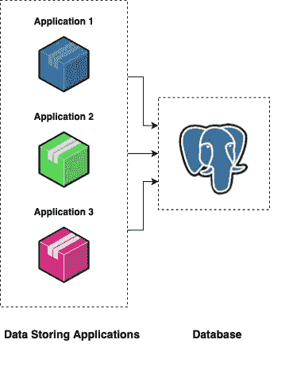
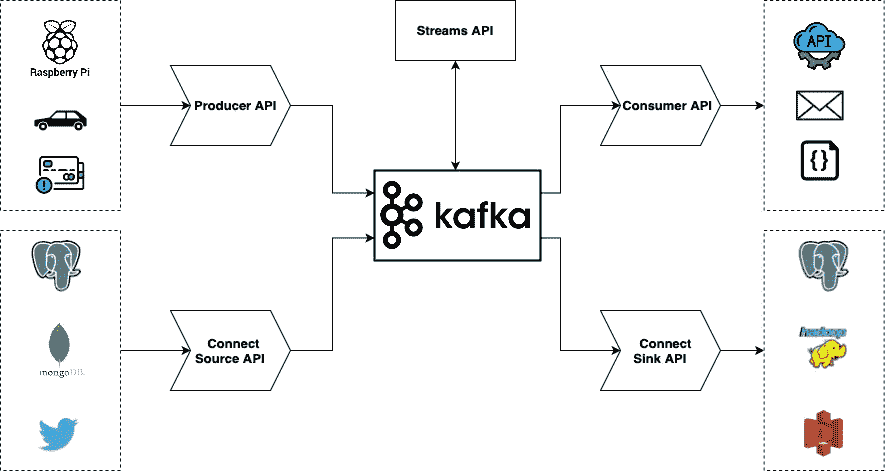
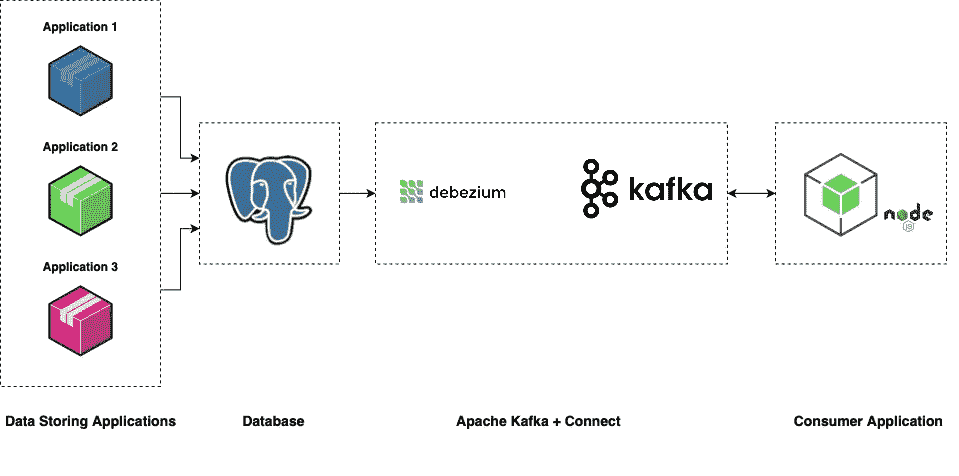

# 用阿帕奇卡夫卡听 Postgres 的变化

> 原文：<https://medium.com/geekculture/listen-to-database-changes-with-apache-kafka-35440a3344f0?source=collection_archive---------0----------------------->


如果您曾经遇到过不同的应用程序和数据源在同一个数据库中插入数据的情况，并且您希望根据存储的、更新的或删除的数据采取行动，本文可能会帮助您。

考虑下图中的一个案例:



Different applications using the same database

使用相同数据库的不同应用程序

该系统使用微服务，将数据处理分解成更小的任务。每个应用程序将其数据输入数据库。您希望对数据库中的某些更改做出反应，例如，当其中一条记录更新时。你不想让自己和团队的其他成员的生活变得更加复杂。您希望避免这样的情况，即每个应用程序都有一段代码发送通知，告知数据库中的某些内容已被更新。

**变更数据捕获(CDC)** 开始发挥作用——一种软件设计模式，用于监控数据的变更，并根据数据变更执行某些操作。这主要包括读取、更新或删除操作。这些动作大多来自另一个系统(或者在本例中是多个服务)。

**这样的方法有什么好处？**
原始数据库(我们监听的)保持不变——我们没有添加任何触发器或日志表。这很有帮助，因为这样的操作会降低数据库的性能，最终会影响整个系统。

为了实现 CDC 软件设计模式，我们需要在管道中添加两个项目:

*   监听数据库中行更改的服务
*   流式传输数据的服务

对于数据流来说， **Apache Kafk** a 已被证明是业内许多主要参与者的理想组合——*Pinterest、Airbnb、思科、Cloudflare、高盛、LinkedIn、Mozilla Firefox、甲骨文、Paypal、Spotify、Shopify、腾讯、Twitter、*等等。
与 Apache Kafka 一起， **Debezium** 被证明是 Postgres(和其他数据库)的原生 CDC 连接器之一。为了让 Apache Kafka 和 Debezium 进行通信，使用了 Apache Connector 它是一个**开箱即用的** **解决方案**,作为一个集中式数据中心，用于数据库、键值存储、搜索索引和文件系统之间的简单数据集成。

## 什么是阿帕奇卡夫卡和德贝兹姆？

这里简单介绍一下将要使用的技术，它们的主要功能和优点。

**Apache Kafka**
简而言之，Apache Kafka 是一个开源的分布式事件流媒体平台。它是一个分布式的发布-订阅消息传递系统，是作为现有解决方案的高度**快速**、**可伸缩**和**持久**的替代方案而创建的。它也是可靠的，因为它会在发生故障时自动平衡消费者。

总共有 5 个 Kafka 核心 API，其中一些将数据发送到 Kafka 主题，而另一些从 Kafka 主题读取和使用数据:



Apache Kafka Producer, Connect Source, Streams, Consumer and Connect Sink API

*   **Kafka Producer API:** 允许应用程序向 Kafka 集群中的主题发送数据流。(日志、物联网、流)。
*   **Kafka Connect Source API:** 允许实现不断从某个源系统或应用程序拉入 Kafka 或从 Kafka 推入某个接收系统或应用程序(REST API、CDC、MySQL、Postgres、MongoDB、Twitter、Slack)的连接器。
*   **Kafka Streams API / KSQL:** 允许将数据流从输入主题转换为输出主题。
*   **Kafka 消费者 API:** 允许应用程序从 Kafka 集群中的主题读取数据流。(发送电子邮件、请求、存储到文件)
*   **Kafka Connect Sink API** :允许应用程序读取流并将其存储到目标存储中(Kafka to S3、HDFS、PostgreSQL、MongoDB、Telegram)

**Debezium**

Debezium 构建于 Apache Kafka 项目之上，使用 Kafka 将变更从一个系统传输到另一个系统。它利用*变更数据捕获*模式。它确保所有数据更改都被**捕获**，非常**低延迟**，不改变数据模型。它可以捕获已删除的事务 id 和附加元数据。一些主要特征是:

*   **快照** —虽然是可选的，但是如果连接器已经启动并且不是所有日志都存在，您可以获取数据库的当前状态。
*   **过滤器** —您可以使用包含/排除列表过滤器配置捕获的模式、表和列的集合。
*   **屏蔽** —特定列中的值可以被屏蔽，例如，当它们包含敏感数据时。
*   **监控**
*   **随时可用的消息转换**

最后，Apache Kafka 发布的消息由终端*消费者*或*接收器*消费——事实上，这可以是各种各样的事情——取决于用例。

如果你想把你的数据流式传输到一个众所周知的服务中，比如另一个数据库(psql，Maria DB，Mongo DB)，Elastic Search，Hadoop，AWS S3 桶，你会使用开箱即用的可配置连接器——**sinks**。

如果你想有一个定制的逻辑，你将使用**消费者 API** 。

# 概念证明(示例)

在这个例子中，我将使用 Postgres、Debezium、Apache Connect + Apache Kafka 和一个将充当消费者的 NodeJS 应用程序来展示整个工作流。

除了 NodeJS 应用程序之外的所有东西都在 docker 容器中，所以我创建了一个单独的 **docker-compose.yml** 文件，其中包含了您需要知道的所有东西。

系统的架构概述:



Apache Kafka + Connect (Debezium) secure that all database changes will be reported to the Consumer Application

1.  应用程序 1、2 和 3 将各自把自己的数据存储到 Postgres 数据库中。既然这已经是广为人知的事情，我就不在这上面浪费时间了，我们就直接在 psql(简单更新)里面做更新吧。
2.  一旦 Postgres 中的数据发生变化，Debezium 就会检测到，并将变化发送给 Kafka
3.  Kafka 会将数据发布到一个特定的主题中(*servername . schema . table*)
4.  之前订阅的 NodeJS 消费者将收到 Apache Kafka 发布的数据

我设法将除消费者应用程序之外的所有内容放在一个单独的 *docker-compose.yml* 中，因此您只需复制/粘贴下面的配置即可完成所有内容:

它由四项服务组成:

1.  **Zookeeper**—Zookeeper**跟踪 Kafka 集群节点的状态**，它还跟踪 Kafka 主题、分区等。Zookeeper 允许多个客户端同时执行读写操作，并作为系统内的共享配置服务。
2.  **kafka** — Apache Kafka 服务器
3.  **postgres** — Postgres 数据库
4.  **postgres-connector** —用于变更数据捕获的 Debezium connect 实例

在运行所有服务之前，您可以看到我们正在使用一个`${HOST_IP}` 环境变量。如果你想了解更多关于`${HOST_IP}`的用法，看看 [Kafka Connectivity](https://github.com/wurstmeister/kafka-docker/wiki/Connectivity) 。

按照这个一步一步的例子，如何把所有的东西放在一起工作。

**运行码头集装箱:**

*   打开终端并创建新文件夹
*   将`docker-compose.yml`复制/粘贴到一个文件中并保存
*   设置`HOST_IP`地址(环境变量):

`export HOST_IP=$(ifconfig | grep -E "([0-9]{1,3}\.){3}[0-9]{1,3}" | grep -v 127.0.0.1 | awk '{print $2}' | cut -f2 -d: |head -n1)`

*   运行`docker-compose up -d` →这将创建四个容器，初始化可能需要一段时间(几秒钟)。
*   可选:您可以通过执行`docker ps.`来检查 docker 容器的状态

```
b1b37bf623db   debezium/example-postgres:1.3   "docker-entrypoint.s…"   About a minute ago   Up About a minute     0.0.0.0:5433->5432/tcp, :::5433->5432/tcp                                                                       postgres1b9a3be29c09   debezium/zookeeper:1.3          "/docker-entrypoint.…"   About a minute ago   Up 58 seconds         2888/tcp, 3888/tcp, 8778/tcp, 0.0.0.0:2181->2181/tcp, :::2181->2181/tcp, 9779/tcp                               zookeeper
```

**创建 postgres 数据库:**

*   通过执行以下命令连接到 psql 实例:`docker exec -it postgres bash`
*   登录到您的 psql 服务器:`psql -U postgres`
*   输入 postgres 密码(如果您遵循示例，密码为“postgres”)
*   创建新表格:

您可以检查是否存储了新插入的记录:

```
postgres=# select * from customers;id | name
----+------
1 | john
2 | jack
3 | jane
(3 rows)
```

*   退出 psql 服务器和 postgres 容器

**配置 Kafka Connect (Debezium)连接到数据库:**

*   Kafka Connect 有一个 REST 端点，我们可以使用它来查看容器中启用了哪些连接器(并测试连接):

如果一切正常，这将返回一个空数组[ ]。

*   为 Kafka Connector (Debezium)创建一个配置文件，以便它能够连接到数据库并监听更改。

Debezium configurational file — pg-source-config.json

将此复制到一个文件中，并将该文件保存在`pg-source-config.json.`下

下面将启动一个连接器，从源 postgres 数据库中读取 customer 表:

这应该会返回一个与您发送的 JSON 对象相同的响应。

现在，您应该有一个启动并运行的管道——数据表“Customers”中的每个更改都将传输到 Kafka，并发布到**my server . public . Customers**topic。

为什么是这个名字？Kafka 将根据 **pg-source-config.json** 中的**database . server . name(my server)**属性自动创建一个主题，然后是模式和数据表(分别为 **public** 、 **customers** )。

**创建消费者应用**

我们只能创建一个消费者应用程序，它将使用 Apache Kafka 发布的更改。为此，我创建了一个简单的 NodeJS 应用程序。您可以通过以下步骤完成同样的操作:

*   用`npm init`创建一个新的 NodeJS 文件夹和项目
*   安装依赖项:`npm i --save dotenv ip kafkajs`
*   创建环境文件(。环境):

TOPIC 是我们的 KafkaJS 消费者应用程序将要监听的主题。

*   在 NodeJS 文件夹中创建`kafka.js`文件，用于配置 Kafka 消费者。

*   在 NodeJS 项目中创建`index.js`文件，该文件将消费者连接到 Kafka broker，订阅“myserver.public.consumer”模式，并为每个接收到的消息设置一个处理程序:

通过执行`node index.js`运行应用程序。

这应该会在控制台中输出一个响应:

```
[
 ‘pg_connect_statuses’,
 ‘myserver.public.customers’,
 ‘__consumer_offsets’,
 ‘pg_connect_offsets’,
 ‘pg_connect_configs’
]
{“level”:”INFO”,”timestamp”:”2021–08–25T07:44:20.562Z”,”logger”:”kafkajs”,”message”:”[Consumer] Starting”,”groupId”:”nodejs-consumer”}
{“level”:”INFO”,”timestamp”:”2021–08–25T07:44:44.686Z”,”logger”:”kafkajs”,”message”:”[ConsumerGroup] Consumer has joined the group”,”groupId”:”nodejs-consumer”,”memberId”:”node-consumer-5e4e7ecc-2330–4038–9d28–1dc089c7af31",”leaderId”:”node-consumer-5e4e7ecc-2330–4038–9d28–1dc089c7af31",”isLeader”:true,”memberAssignment”:{“myserver.public.customers”:[0]},”groupProtocol”:”RoundRobinAssigner”,”duration”:24124}
```

此时，您应该已经连接了整个管道。当 postgres 数据库中的数据发生变化时，Debezium 会检测到并将其传输到 Kafka。Kafka 将根据服务器名称、模式和表，将其发布到特定主题。

**在数据库中插入记录**

现在，是测试一切的时候了。我们将在之前创建的表 *customers* 中插入一条记录。连接到 postgres 容器中的 psql 数据库。运行以下命令:

简言之，您应该会看到 NodeJS 应用程序控制台日志:

```
{
  before: null,
  after: { id: 4, name: 'josip' },
  source: {
    version: '1.3.1.Final',
    connector: 'postgresql',
    name: 'myserver',
    ts_ms: 1629878089981,
    snapshot: 'false',
    db: 'postgres',
    schema: 'public',
    table: 'customers',
    txId: 606,
    lsn: 34250448,
    xmin: null
  },
  op: 'c',
  ts_ms: 1629878090452,
  transaction: null
}
```

## 最后的话

虽然使用简单的数据库触发器也可以产生类似的结果，但是该解决方案提供了更多的功能:

*   您不会遇到数据库性能下降的情况
*   使用的技术(debezium，kafka)可以通过配置文件轻松调整
*   容器化允许您在任何服务器上轻松、快速、高效地运行这个管道
*   Kafka 连接器是现成的产品，您不需要为其编写任何代码，而是开箱即用
*   使用已经建立的强大公司使用的技术，这些公司背后有一个庞大的社区
*   技术是快速的、可扩展的、持久的和可靠的
*   如果需要，您可以轻松地更改每个组件

无论如何，我认为这个解决方案非常有效，尽管一开始设置起来有点复杂，因为它与底层事务日志交互。