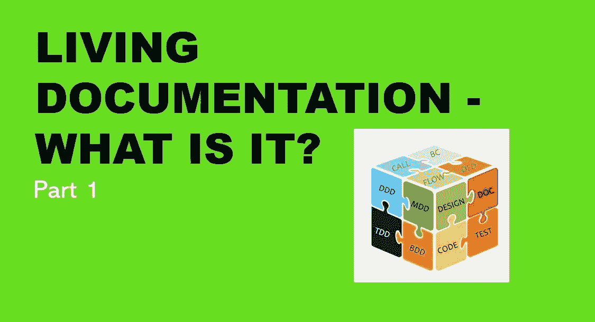

# 活文档——概念的简史和演变

> 原文：<https://medium.com/geekculture/living-documentation-brief-history-and-evolution-of-the-concept-4492fafb5d7?source=collection_archive---------9----------------------->

## 第一部分

# 概观

在第一篇文章中，我想通过概述什么是活文档，以及工程过程中知识的类型和流动来设置场景。未来的文章将涵盖当前可用的工具和选项。