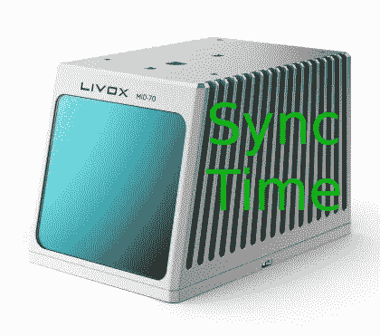

# 树莓 Pi 4 上的 Livox PTP 时间同步

> 原文：<https://medium.com/geekculture/livox-ptp-time-sync-on-raspberry-pi-4-bb31b78db838?source=collection_archive---------5----------------------->

## 电脑不支持硬件时间戳如何同步 Livox 时间？

Image by Author

# 背景

如今，我们可以看到许多机器人在我们身边奔跑，许多自动驾驶汽车正在开发中。下面的主要技术是激光雷达探测和激光雷达构建的高清地图。通常，小型机器人…