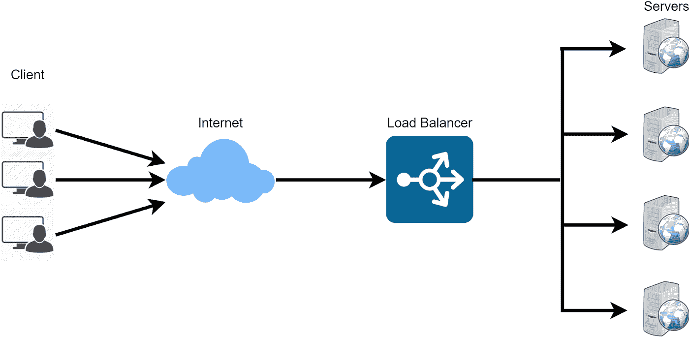
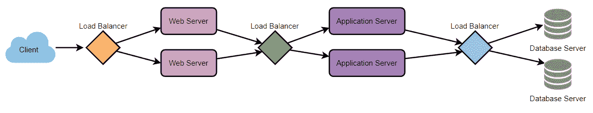

# 负载平衡

> 原文：<https://medium.com/geekculture/load-balancing-da0bde7882f1?source=collection_archive---------20----------------------->

## 为什么我们甚至需要负载平衡器，它们是如何工作的？

负载平衡器(LB)是任何分布式系统的关键组件。它有助于将流量分散到服务器集群中，以提高应用程序、网站或数据库的响应能力和可用性。LB 还在分发请求时跟踪所有资源的状态。如果一个服务器不能接受新的请求或者没有响应，或者错误率很高，LB 将停止向这样的服务器发送流量。

通常，负载平衡器位于客户端和服务器之间，接受传入的网络和应用程序流量，并使用各种算法将流量分布在多个后端服务器上。通过在多个服务器之间平衡应用程序请求，负载平衡器可以减少单个服务器的负载，防止任何一个应用程序服务器成为单点故障，从而提高整体应用程序的可用性和响应能力。

为了充分利用可伸缩性和冗余性，我们可以平衡系统各层的负载。我们可以在三个地方添加 LBs:

*   在用户和网络服务器之间。
*   在 web 服务器和内部平台层之间，比如应用服务器或缓存服务器。
*   内部平台层和数据库之间。

# 负载平衡的优势

*   用户体验更快、不间断的服务。用户不必等待一台苦苦挣扎的服务器来完成之前的任务。相反，他们的请求会立即传递给更容易获得的资源。
*   服务提供商体验到更少的停机时间和更高的吞吐量。即使服务器完全故障也不会影响最终用户的体验，因为负载平衡器会简单地将其路由到健康的服务器。
*   负载平衡使系统管理员更容易处理传入的请求。
*   智能负载平衡器提供了预测分析等优势，可以在流量瓶颈发生之前确定它们。因此，智能负载平衡器为组织提供了切实可行的见解。这些是自动化的关键，有助于推动业务决策。

# 负载均衡器如何选择后端服务器？

负载平衡器在将请求转发到后端服务器之前会考虑两个因素。他们将首先确保他们选择的服务器适当地响应请求，然后使用预先配置的算法从一组健康的服务器中选择一个。

## 健康检查

负载平衡器应该只将流量转发到“健康的”后端服务器。为了监控后端服务器的健康状况，“健康检查”会定期尝试连接到后端服务器，以确保服务器正在侦听。如果服务器运行状况检查失败，它将自动从池中删除，并且流量不会转发给它，直到它再次响应运行状况检查。

## 负载平衡算法

有多种负载平衡方法，它们针对不同的需求使用不同的算法。

## 最少联系方法

此方法将流量定向到活动连接最少的服务器。当许多持久的客户端连接不均匀地分布在服务器之间时，这种方法相当实用。

## 最短响应时间法

该算法将流量定向到具有最少活动连接和最低平均响应时间的服务器。

## 最小带宽法

此方法选择当前服务最少流量的服务器，流量以每秒兆位(Mbps)衡量。

## 循环法

该方法循环遍历服务器列表，并将每个新请求发送到下一个服务器。当它到达列表的末尾时，它从头开始。当服务器规格相同并且没有很多持久连接时，它最有用。

## 加权循环法

加权循环调度旨在更好地处理具有不同处理能力的服务器。每个服务器被分配一个权重(一个指示处理能力的整数值)。权重较高的服务器在权重较低的服务器之前接收新连接。

## IP 哈希

在这种方法下，计算客户机 IP 地址的散列来将请求重定向到服务器。

# 冗余负载平衡器

负载平衡器可能是单点故障。为了克服这个问题，可以将第二个负载均衡器连接到第一个负载均衡器，形成一个集群。每个负载均衡器监控另一个负载均衡器的运行状况，并且由于两个负载均衡器同样能够提供流量和故障检测，因此当主负载均衡器出现故障时，第二个负载均衡器会接管。