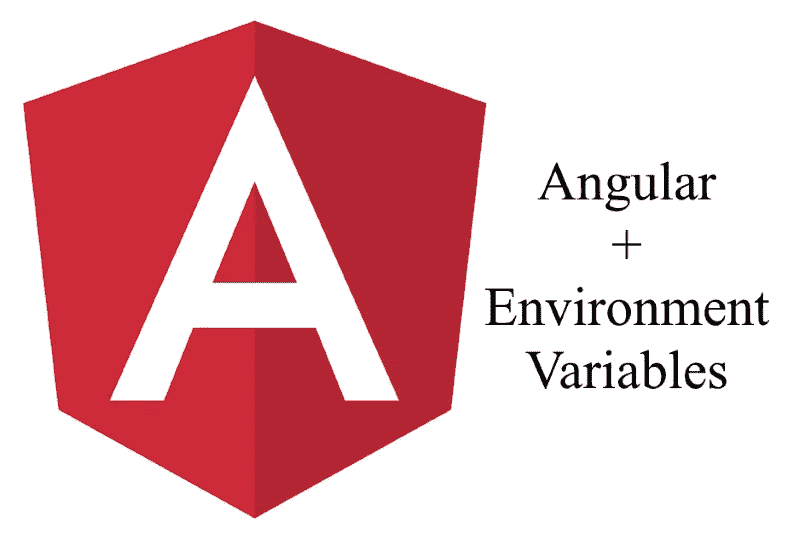

# 使用 SSR 时，有效地将配置环境变量加载到 Angular 中

> 原文：<https://medium.com/geekculture/load-configuration-environment-variables-into-angular-efficiently-when-using-ssr-6474c34bb675?source=collection_archive---------6----------------------->



通常，在不重新构建项目的情况下加载环境变量是很有用的，比如将同一个项目部署到具有不同配置的不同服务器(或 docker 实例)上。

目标是加载配置而不等待，并执行 HTTP 请求。这种技术避免了对第一个加载页面的负面影响(有人说是灯塔吗？).

因此，最佳策略是在运行服务器端渲染(SSR)节点进程时加载环境变量，并将它们存储到 index.html 文件中。
看看怎么做:

1.  将环境变量放入一个 json 文件中，并作为 env.json 保存到 assets 文件夹中:

```
env.json{
 "apiUrl": "[https://example.com](https://example.com)",
 "version": "1.1",
 …
}
```

2.修改 index.html 放置一个占位符，便于替换变量:

```
index.html<html>
 <head>
 <!-- ENV BEGIN -->
 <!-- ENV END -->
 …
 </head>
</html>
```

3.运行节点 SSR 流程时，将变量加载并替换到 index.html 文件中:

```
server.ts...
const injectEnvInline = function (filename, envs) {
 let _template_index = fs.readFileSync(filename).toString();// Find env script link
 const env_begin_position = _template_index.indexOf('<!-- ENV BEGIN -->');
 const env_end_position = _template_index.indexOf('<!-- ENV END -->');
 const env_link = _template_index.substring(env_begin_position, env_end_position);

 // Remove env script link and injecting inline environment variables_template_index = _template_index.replace(env_link, envs);
 fs.writeFileSync(filename , _template_index, {encoding: 'utf-8'});
};// Read environment settings
const settings = JSON.parse(fs.readFileSync('assets/env.json').toString());
const env: any = [];
let inline_env = '<!-- ENV BEGIN --><script>window[\'_env\'] = []; ';
for (const key in settings) {
 if (settings.hasOwnProperty(key)) {
 env[key] = settings[key];
 inline_env += 'window[\'_env\'].' + key + '= \'' + settings[key] + '\'; ';
 }
}
inline_env += '</script>';injectEnvInline('index.html', inline_env);
```

4.只有当我们使用 angular service worker (ngsw):
由于我们修改了 index.html 文件，然后我们必须更新他的散列存储到 ngsw.json 文件。

```
server.ts...
const changeIndexHtmlHash = function (filename, newHash: string) {
  let _template_ngsw = fs.readFileSync(filename).toString();// Find index.html hash row
  const index_begin_position = template_ngsw.lastIndexOf('"/index.html": "');
  const index_end_position = index_begin_position + 57;
  const new_index_hash = _template_ngsw.substring(index_begin_position, index_end_position);_template_ngsw = _template_ngsw.replace(new_index_hash, '"/index.html": "' + newHash + '"');
  fs.writeFileSync(filename , _template_ngsw, {encoding: 'utf-8'});
};// Change index.html hash into ngsw.json
const shasum = crypto.createHash('sha1');
const indexHtmlStream = fs.ReadStream('./index.html');
indexHtmlStream.on('data', function(d) { shasum.update(d); });
indexHtmlStream.on('end', function() {
  const newHash = shasum.digest('hex');
  changeIndexHtmlHash('ngsw.json', newHash);
});
```

5.当运行服务器端模式时，传递变量并将它们注入到相关服务中:

```
server.ts...
app.get('*', function(req, res) {
 res.render('index', {
  req, res, providers: [
   { provide: 'envSettings', useValue: env }
   ]
  }
 });
});
```

6.创建环境服务文件:

```
env.service.tsimport {Inject, Injectable, Optional} from '[@angular/core](http://twitter.com/angular/core)';export interface IEnvService {
  "apiUrl": string;
  "version": string;
}[@Injectable](http://twitter.com/Injectable)({providedIn: 'root'})
export class EnvService {
  settings: IEnvService = {} as null;
  constructor([@Inject](http://twitter.com/Inject)('envSettings') [@Optional](http://twitter.com/Optional)() private envSettings?: any) {
    if (envSettings) {
      this.settings = envSettings;
    }
  }
}
```

7.将 env 服务注入 app.server.module.ts 文件:

```
...
providers: [EnvService]
```

8.运行客户端模式时加载环境变量:
(注意:我们在**开发**模式下运行时加载 env.json 文件，在**生产**模式下运行时读取窗口['_env']键)

```
main.ts...
document.addEventListener('DOMContentLoaded', () => {const start = (settings) => {
         // environment.settings = settings.settings;
         platformBrowserDynamic([{provide: 'envSettings', useValue: settings}])
   .bootstrapModule(AppModule, {preserveWhitespaces: true})
           .catch(err => console.log(err));
       };let _env: any = {};
       // In **production** mode
       if (window && window['_env'] !== undefined) {
         const browserWindow = window;
         const browserWindowEnv = browserWindow['_env'] || {};// Assign environment variables from browser window to env
         for (const key in browserWindowEnv) {
           if (browserWindowEnv.hasOwnProperty(key)) {
             _env[key] = window['_env'][key];
           }
         }start(_env);
       }
       // In **development** mode
       else {
         const xhttp = new XMLHttpRequest();
         xhttp.onreadystatechange = function () {
           if (this.readyState === 4 && this.status === 200) {
             const response: IEnvService = JSON.parse(xhttp.responseText);
             _env = response;start(_env);
           }
         };
         xhttp.open('GET', 'assets/env.json', true);
         xhttp.send();
       }
});
```

9.随时使用环境服务:

```
app.module.tsimport {EnvService} from './env.service';
...
constructor(private envService: EnvService) {}foo() {
 console.log('version', this.envService.settings.version);
}
```

通过这些简单的步骤，我们已经达到了加载环境变量的目标，无需重新构建项目，无需 HTTP 请求
，并且在开发过程中使用相同的文件配置(env.json)。