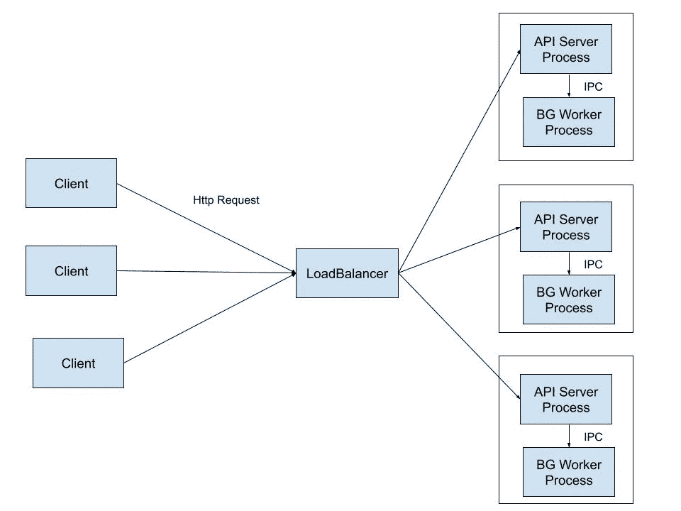
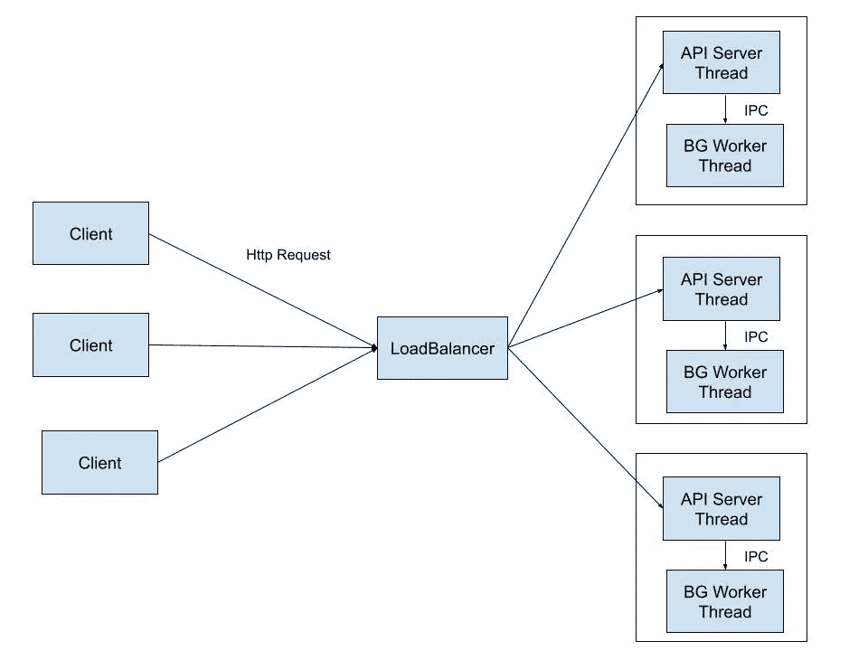
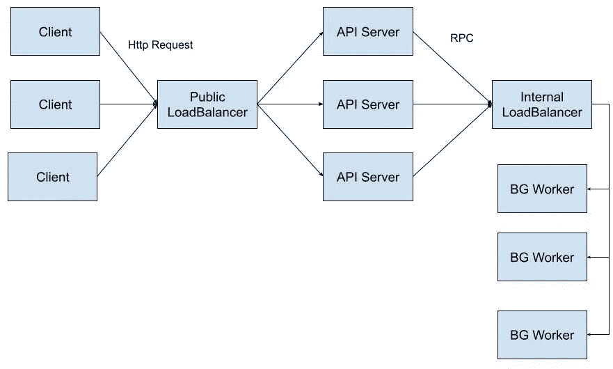
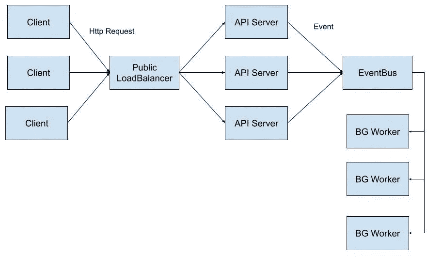

# Node.js 中后台作业的加载控制

> 原文：<https://medium.com/geekculture/load-control-with-background-jobs-in-node-js-ce570ead46d?source=collection_archive---------6----------------------->

正如你可能知道的，Node.js 真的很难处理大量 CPU 密集型操作，因为它的异步架构，但有时我们需要在不降低整个服务速度的情况下处理它们。今天我们将讨论如何将应用程序的负载划分到后台作业中。

让我们假设我们正在开发一些 SaaS 应用程序，我们需要为一个新客户生成一张发票。PDF 的生成是一个漫长和 CPU 密集型的操作，如果它在控制器中正确执行，你将失去对 CPU 加载的控制，一些俄罗斯黑客可以轻松地 DDoS 你的应用程序。此外，如果您执行同步操作，您有阻塞 Node.js 事件循环的风险，因此您的应用程序中的所有端点都会响应缓慢。

解决方案很简单，不要在 API 服务器中执行繁重的操作，而是在后台作业中执行。控制器只调度 CPU 密集型操作，工人处理它们。在大多数情况下，不需要等到工人完成处理，一旦作业被调度，控制器就可以用一个成功的结果来响应。如何实现这种架构有几种选择:

*   [**群集**](https://nodejs.org/api/cluster.html) **或** [**子进程**](https://nodejs.org/docs/latest/api/child_process.html) 。借助集群和子进程，您可以为每个应用运行多个进程。这种方法允许您在一个进程中处理 http 请求，在另一个进程中执行后台操作。听起来很酷，但是在这种情况下，API 服务器和后台工作器是紧密耦合的，没有 API 服务器，工作器就不能在不同的服务器上运行。它在单个服务器上运行良好，但是在多个服务器和 Kubernetes 上，这种架构很难扩展。

*   [**工作线程**](https://nodejs.org/api/worker_threads.html) 。这与集群和子进程解决方案非常相似，只是工作线程使用线程而不是进程。和前面的方法一样，工作线程很难在多台服务器上扩展。

*   **微服务 RPC(远程过程调用)。** Worker 是一个独立的微服务，提供一个接口(API，gRPC，JSON-RPC 等。)要执行后台任务，该接口应该只能从内部网络获得，以避免 DDoS 攻击。这种解决方案易于扩展，API 服务和后台工作人员可以在一台或多台服务器上独立执行。此外，微服务方法允许您为不同的任务使用不同的堆栈，换句话说，您可以用更适合您的任务的其他语言编写后台作业处理程序，例如 Python 用于机器学习任务，Golang 用于 CPU 密集型操作。

*   **微服务事件总线。**与前面的方法一样，后台工作者是一个独立的微服务，但它没有提供 RPC 接口，而是订阅了 EventBus (RabbitMQ、Kafka、亚马逊 SQS 等。).这是一个非常灵活的解决方案，API 服务器不需要知道调用什么和在哪里调用，它只是向 EventBus 发出一个事件。当需要为单个事件执行多个后台操作时，这非常方便。如果您使用 AWS SQS，后台工作人员可以部署为 AWS Lambda，您不必担心伸缩性。

*   **任务调度。**它非常类似于 EventBus 解决方案，但是任务调度的思想不同于事件发出。API 服务器将执行某项作业的任务添加到存储中，后台工作人员提取该任务。Node.js 的任务调度有几个库，最流行的有: [Bull](https://www.npmjs.com/package/bull) 、 [Kue](https://www.npmjs.com/package/kue) 和 [Agenda](https://www.npmjs.com/package/agenda) 。Bull 和 Kue 用 Redis 做存储，Agenda 用 MongoDB。如果您没有也不想将 EventBus 添加到项目中，但是您的基础设施中已经部署了 Redis，那么这种方法可能是一种选择。任务调度的主要好处是一种更加可定制的方式来控制负载。例如，使用 Bull，您可以配置作业速率限制、处理并发性、优先级、重试次数，并保证作业的唯一性，您可以在此处查看文档。此外，Bull 支持延迟和重复的作业执行，但这是另一个话题，我们将在下一篇文章中讨论。

总之，如果您有长时间或 CPU 密集型操作，您不应该在 API 服务器中执行它们。如果您的项目很简单，并且您不想让它过于复杂，您可以使用集群、子进程或工作线程。对于更复杂和可扩展的解决方案，微服务是在后台执行操作的最佳选择。但是如果你需要一种更灵活的方法来控制负载，你应该选择一种任务调度方法。

请记住，没有解决任何问题的灵丹妙药，每个解决方案都适合您当前架构中的特定问题。

*今天就到这里吧！下次见，瑟维斯！*