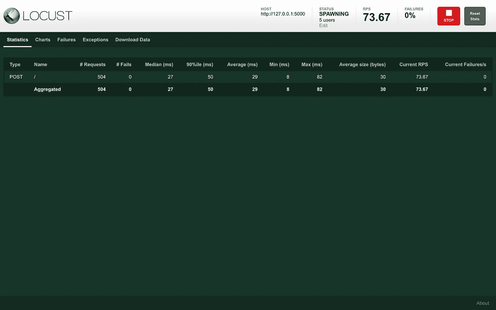
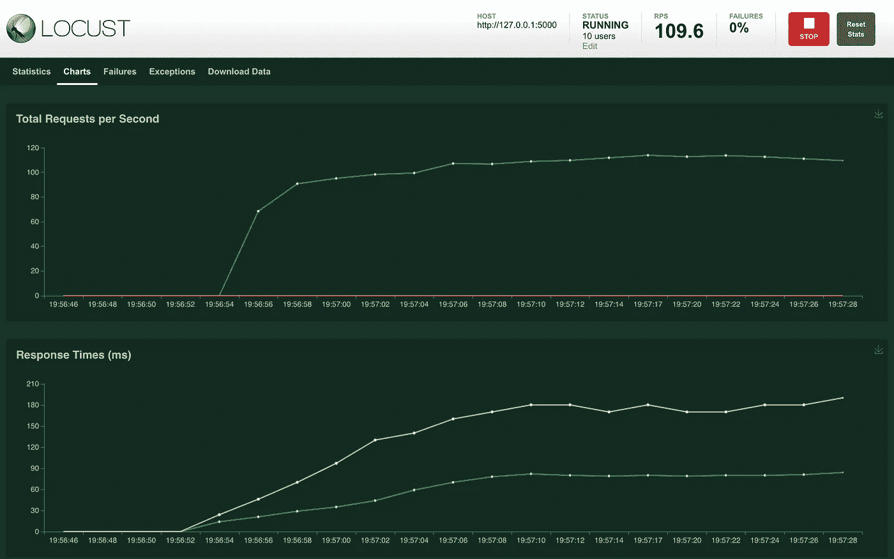
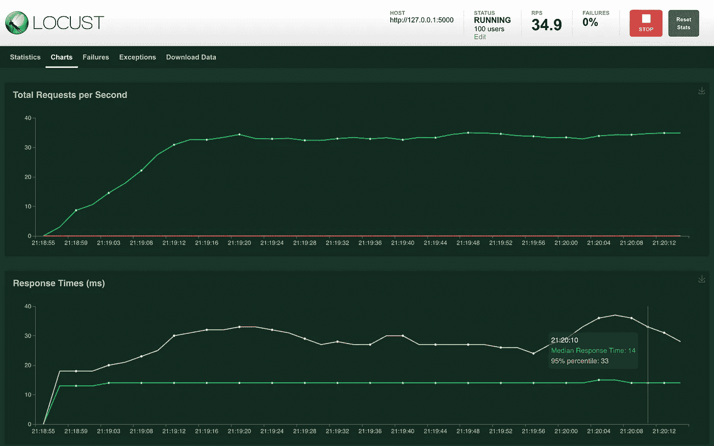

# 如何用 Python 对机器学习 API 进行负载测试

> 原文：<https://medium.com/geekculture/load-testing-a-ml-model-api-e48ec0a0dffc?source=collection_archive---------3----------------------->

## 通过使用 Flask 和 Locust 对 Python 中的 API 进行负载测试，了解如何放心地将 ML 模型部署到生产环境中


Photo by [Danist](https://unsplash.com/@danist07) on [Unsplash](https://unsplash.com/photos/8Gg2Ne_uTcM)

# 自信地部署

将机器学习(ML)模型部署为由业务关键型系统使用或直接由最终用户使用的实时服务可能是一个可怕的前景。系统的需求越大，你的模型出现问题破坏系统的风险就越高。然而，你也不能把你的模型困在笔记本里。他们需要为你的客户和你的企业创造价值。

有很多方法可以减轻这些焦虑。一种方法(理论上)很简单:拥有一个健壮的测试策略。最终，有效的测试策略可以帮助您在 ML 系统中建立更高程度的信心。事实上，就像任何其他软件系统一样，你应该将深思熟虑的测试策略视为任何 ML 系统部署的必要先决条件。

然而，您所采用的测试策略和技术将根据您的系统被开发和部署的环境而有所不同。对于部署为某种形式的 web 服务(例如 REST API)的软件系统来说，一个特别重要的技术是*负载测试*的思想。而且，如果你没有猜到这一页的标题，这就是这篇文章的主题:负载测试 ML 模型 API。

这里的目的是让您熟悉负载测试背后的动机和概念，回顾负载测试可以用来探索的一些重要的设计考虑事项，并提供一个简短的示例，说明如何对作为基本 web 应用程序部署的 Scikit-Learn 模型(包括模板存储库)进行负载测试。

# 什么是负载测试？

让我们从一般的软件工程观点开始。大多数现代网站至少有一些对外部 web 服务的依赖。这些服务从通知管理器到分析工具，再到认证和支付服务等核心基础设施。

当对这些服务进行更改时，确保系统不被中断是很重要的。这对于高流量平台尤其重要，因为服务停机或中断会导致重大财务损失。当您部署新服务(或更新现有服务)时，您希望确信您的服务能够承受“真实世界”的需求。

这就是负载测试派上用场的地方。负载测试是[非功能测试](https://en.wikipedia.org/wiki/Non-functional_testing)的一种形式:它的目的是测试系统行为，而不是系统功能的细节。换句话说，负载测试的目的是探索您的服务在负载下如何响应——顾名思义。具体来说，它可用于在不同负载和不同操作条件下(包括不同类型的用户和用户行为)表征您的系统。根据您使用的框架或工具，您通常可以对这些条件和行为进行细粒度的控制，并定制您自己的测试来反映特定于您的服务的交互动态。

这里的目的是证明在您指定的条件下，您的服务可以*保持*期望的性能特征。但是你问有什么性能特点呢？通常，负载测试关注两个关键指标:*延迟*和*吞吐量*。让我们来定义这些:

*   **延迟** —服务响应所需的时间。它通常也被称为响应时间。它通常以毫秒(ms)为单位。延迟非常低的服务可以被描述为*高响应*。
*   **吞吐量** —在给定的时间范围内，服务可以处理的请求总数。例如，每秒请求数(RPS)是量化吞吐量特性的常用指标。

此外，与任何工程问题一样，描述系统的局限性也很重要。除了有助于确定服务可以支持预期的需求和性能约束之外，负载测试还可以(也应该)用于了解服务的上限。这有助于确定在什么条件下您的服务开始降级(并最终完全失败)。有了这类信息，您可以更自信地将您的服务部署到“生产”中，并且还可以了解随着您的服务的扩展，它可能会如何执行——在当前*和*随着对您的服务的需求的增长(希望如此)。

# 这和 ML 有什么关系？

到目前为止，一切顺利。让我们把它映射回一个具体的 ML 问题。假设你是一家经营在线市场的公司的数据科学家。您的任务是创建一个定价模型，以帮助市场用户更有竞争力地为他们销售的产品定价。您已经构建了模型，执行了各种评估任务，现在您已经准备好进行部署了。在仔细考虑了您的选择之后，您决定将您的模型作为一个简单的 HTTP web 服务部署到您的工程团队(和内部服务！)在其他功能中使用。对你来说，这正是这篇文章要解决的情况。

与任何类似的服务一样，你需要问自己的第一个问题是:“这项服务的响应速度是否足以确保良好的用户体验？”。这可以通过多种方式进行分解，但由此产生的一些自然问题包括:

*   您的服务是否有足够的“物理”资源(CPU、RAM 等)。)来支持您的预期(和“激增”)使用？
*   你的系统设计有瓶颈吗？仔细考虑您依赖的其他服务，特别是在负载下可能出现的任何速率限制或并发限制。
*   是否存在响应性较差的行为或请求类型？考虑您的模型如何执行推理，以及是否值得添加额外的约束来限制用户为了保证性能而可以发出的请求类型。

在这一点上，同样值得认识到的是，不仅要考虑你的“[幸福之路](https://en.wikipedia.org/wiki/Happy_path)”(即预期的“正常”行为)也很重要。例如，您应该确保在出现错误的情况下提出上述问题:如果您将一堆无效查询添加到混合查询中，您的系统会发生什么情况？当您的服务收到无效查询时，它会突然挂起并阻止进一步的请求吗？还是快速优雅地处理错误？

确保您的负载测试策略能够回答诸如此类的问题是很重要的。对立地思考如何测试系统的设计和实现(包括 ML 方面)是值得的——不仅仅是在负载测试环境中！

# 实践中的负载测试

希望你现在已经接受了负载测试的效用。也许你正在思考这与你自己的工作有什么关系。也许你已经在用这种方式思考你的 ML 项目了，在这种情况下:干得好！

正如你可能意识到的，有各种各样的工具用于软件测试，负载测试的子领域也不例外。然而，这些工具的用户友好性是……可变的。其中一个对用户更友好的工具是[蝗虫](https://locust.io/)，尤其是对大多数数据科学家来说。Locust 是一个负载测试工具和框架，使用 Python 编写和控制。

实际上，这意味着您可以用纯 Python 定义您的测试(包括定义模拟的客户行为)。您用 Python 编写您的用户行为，指定您想要模拟的用户数量，然后您就可以开始了！此外，作为一名数据科学家，即使你不是“超级用户”，你也有可能至少熟悉 Python。我自己的经验表明，在实践中，Locust 是此类工具中门槛最低的工具之一，它可以为数据科学/ML 团队带来相关的采用和合规性优势。

也不仅仅是*简单易用。它也可以扩展到大型应用程序。例如，据报道，DICE (战地视频游戏系列 fame)的人们[用它来负载测试他们的服务器，谷歌](https://locust.io/)[和微软](https://locust.io/)的各个团队也用它。*

除了 Pythonic 式设计提供的易用性，Locust 还提供了几个有用的附加特性。首先，它允许您以 CSV 格式导出测试的统计数据，以供进一步分析或存档。这可能是跟踪负载测试实验的一种简便的低技术方法。

另一方面，它也有一个简单但信息丰富的用户界面(UI)。开箱即用，UI 允许您配置您想要模拟的用户数量，指向您想要测试的主机，并设置您想要将用户添加到模拟中的速率，并立即启动您的测试套件。

运行时，UI 提供了几个选项卡，为您提供一系列信息，从列表统计、延迟、吞吐量和用户数的“实时”图表，到测试发现的故障和错误的详细信息。对于具有单一路由(`/`)的服务的最小情况，统计数据的顶级列表视图如下所示:



A minimal example of the Locust dashboard for an API with a single endpoint. Image by author.

如您所见，您可以获得服务当前正在处理的每秒请求数(RPS)的信息(即顶级吞吐量统计)。您还可以获得平均、中间、最小和最大延迟的统计数据(都以毫秒为单位)。当考虑测试中的每条路线时，这些信息可以让您对系统在负载下的行为有一个惊人的全面了解——这正是您想要的。也有一些漂亮的“实时”图表显示这些信息:



An example of the real-time monitoring dashboard provided by Locust. Image by author.

这是蝗虫在 30000 英尺高的视角。是时候用一个具体的例子来使用它了！

# 正在设置

密码时间到了。这篇文章的其余部分将向您展示如何配置一个基本的负载测试设置，该设置演示了上面概述的关于本地机器上的最小 ML API 的一些想法。我整理的示例项目包括一些用于部署到您最喜欢的云提供商的实用程序，负载测试 API 的一般过程对于部署的服务也是一样的，尽管部署设置的实际过程超出了本文的范围。也就是说，这个过程与我之前的帖子非常相似，在这里:

[](https://mark.douthwaite.io/getting-production-ready-a-minimal-flask-app/) [## 生产中的 Flask:最小的 Web APIs

### Flask 是一个流行的用 Python 构建 web APIs 的“微框架”。然而，将一个 Flask API“投入生产”…

马克·道斯韦特](https://mark.douthwaite.io/getting-production-ready-a-minimal-flask-app/) 

首先，最基本的。我决定在本教程中使用 [Flask](https://flask.palletsprojects.com/en/1.1.x/) ,因为它有一个很棒的社区(至少在我看来),功能丰富且易于使用。另外，它被用于各种各样的项目中，所以掌握好 Flask *可能比 Python 中的其他 web 框架更有用。*

也就是说，如果你正在寻找 Flask 的替代品，你最好看一看 [FastAPI](https://fastapi.tiangolo.com/) ，这是一个较新的“微网络框架”，填补了 Flask 的类似空白，但在设计上侧重于速度。通过扩展，如果 API 的响应是最重要的，那么*可能是*更好的起点。否则，Flask 很可能是一个强有力的赌注！

[](https://fastapi.tiangolo.com/) [## FastAPI

### FastAPI 框架，高性能，简单易学，快速编码，准备生产文档…

fastapi.tiangolo.com](https://fastapi.tiangolo.com/) 

对于本演练，您需要熟悉示例项目存储库:

[](https://github.com/markdouthwaite/sklearn-flask-api-demo) [## markdouthwaite/sk learn-flask-API-demo

### 这个模板库为“生产就绪”的 Flask API Scikit-Learn 项目提供了一个最小的配置。它…

github.com](https://github.com/markdouthwaite/sklearn-flask-api-demo) 

要使用这个库，您应该[派生库](https://docs.github.com/en/github/getting-started-with-github/fork-a-repo)(您也可以[从模板](https://docs.github.com/en/github/creating-cloning-and-archiving-repositories/creating-a-repository-from-a-template)创建您自己的版本)并将它[克隆到您的工作环境中。您还需要确保您正在运行 **Python 3.7 或更高版本**来运行代码。如果您确实从模板创建了您的项目，请确保在这样做之前选中`Include all branches`框！](https://docs.github.com/en/github/creating-cloning-and-archiving-repositories/cloning-a-repository)

都准备好了吗？太棒了。是时候安装一些依赖项了。为此，导航到新下载的项目并运行以下命令:

```
make develop
```

这将安装您的模型 API *和*开发依赖项的需求，包括测试包和样式工具(例如优秀的[黑色](https://github.com/psf/black)和 [isort](https://github.com/PyCQA/isort) 包)。

# 盒子里是什么？

下一个明显的问题是:你刚刚下载了什么？谢谢关心。如前所述，这个项目的结构在很大程度上与其派生的 [vanilla Flask 项目](https://github.com/markdouthwaite/minimal-flask-api)中定义的结构相同。如果你还没有看过，我建议你看看贯穿其中的博客文章。

上面的“香草”烧瓶项目和我们现在看到的这个`scikit-learn`口味的有几个关键的区别。这些区别主要是添加了以下目录:

*   `data` -对于这个例子，这是任何数据(包括中间产品，如模型和模型度量)将被存储的地方。默认情况下，它存储一个数据集(`heart-disease.csv`，来自 [Kaggle](https://www.kaggle.com/) )和一个示例`payload.json`，为您将要部署的 API 提供一个说明性的请求负载。在实践中，你应该考虑使用一个专用的云存储服务来存储所有的数据和工件(比如谷歌[云存储](https://cloud.google.com/storage)或者 [AWS S3](https://aws.amazon.com/s3/) )。
*   `steps` -这是*训练*、*评估*和*监控*模型所需的任何(自动)步骤应该位于的位置。实际上，该目录可能包含多个 Python 脚本，每个脚本都用于训练、评估和验证您的模型和输出。然而，在这个例子中，它只包含一个训练简单的`scikit-learn`分类器管道的`train.py`脚本。

你可能还注意到 Flask 应用程序代码也略有不同，并且*与我之前整理的相关教程非常相似:*

[](https://github.com/markdouthwaite/serverless-scikit-learn-demo) [## markdouthwaite/无服务器-scikit-learn-demo

### 为部署轻量级 Scikit 提供建议的项目结构和简单设计模式的存储库-了解…

github.com](https://github.com/markdouthwaite/serverless-scikit-learn-demo) 

接下来，您需要创建一个您的 API 可以加载和公开的[酸洗](https://docs.python.org/3/library/pickle.html)模型工件。为此，只需运行:

```
python steps/train.py --path=data/heart-disease.csv
```

这将在[UCI 心脏病数据集](https://archive.ics.uci.edu/ml/datasets/heart+disease)上训练一个 [Scikit-Learn 管道](https://scikit-learn.org/stable/modules/generated/sklearn.pipeline.Pipeline.html)，对其进行处理并将其导出到`data`目录(以及一些重要的元数据)。请随意深入`steps/train.py`文件，以便更好地了解这里发生了什么。

# 启动模型服务器

在继续之前，有必要检查一下您的模型服务器是否配置正确并且可以运行。要在本地运行模型服务器(公开您的 API)，您只需运行:

```
make start
```

在项目的顶层目录中。这将创建一个运行 Flask 应用程序的`gunicorn`服务器。然后，您应该能够发送查询:

```
curl [http://localhost:8080/health](http://localhost:8080/health)
```

看看人们的反应:

```
OK
```

状态代码为 200。要直接查询模型，您可以使用`data/payload.json`示例中的数据并发送:

```
curl --location --request POST 'http://localhost:8080/predict' --header 'Content-Type: application/json' -d @data/payload.json
```

您应该会看到类似以下内容的响应:

```
{"diagnosis":"heart-disease"}
```

这意味着你的模型是活的。您可以让模型服务器暂时运行，因为您需要它处于活动状态来运行 Locust。

现在要编写一两个负载测试…

# 模拟用户行为

正如您之前看到的，负载测试的主要目标不是评估 API *本身*的正确性(或者在 ML 上下文中:准确性/您选择的其他度量标准)。这是为了探索您的 API 在不同负载下的表现，了解 API 在所述负载下是否、何时、如何以及为什么开始降级，并最终根据这些信息将您的 API 部署到“生产”环境中。

实际上，第一步是定义你期望用户如何与你的服务交互。对于具有单个端点的 API，这个*可能*只是一种交互类型。事实上，它*应该*是单一类型的交互(例如查询单一模型)。这个例子就是这种情况。然而，如果你开发一个更完整的 API，比如说一个有很多端点的成熟的 REST API，可能的用户交互数量可能会大得多。

在 Locust 的世界中，以编程方式定义用户行为非常简单。这个框架提供了一个`User`类，你可以用它来构建你的行为。此外，由于这是建立在纯 Python 之上的，它确保您可以用非常复杂的行为来定义用户，如果您愿意的话。这里有一个最小蝗虫`User`的例子:

```
from locust import HttpUser, task class SimpleUser(HttpUser): 
    @task 
    def get_health(self): 
        self.client.get("/health")
```

这是什么？在这个例子中，您有一个来自所提供的`HttpUser`类的用户，并且定义了一个`task`行为，在这个例子中是`get_health`。以下是这些事情的具体含义:

*   `HttpUser`-`HttpUser`类是 Locust `User`的一个特殊子类，它提供对`client`属性的访问。这个`client`属性反过来提供了一个可以用来查询 API 的 HTTP 客户机(当然，前提是它公开了一个 HTTP 接口！).注意，在这个文件中没有任何地方引用了 API 的基本 URL。这是在运行时通过 Locust CLI 或从 Locust web UI 中提供给 Locust 的。我们稍后再看。
*   这个方法定义了你想要为你的 API 模拟的用户行为。在这种情况下，只需向`/health`路线发送一个`GET`请求。换句话说，检查`GET /health`端点是否以非错误状态代码响应。`client`属性公开了一个全功能的 HTTP 客户端，因此您能够向您选择的服务发送任意的 HTTP 请求。您可以在每个方法中使用`client`进行多次调用，这意味着如果需要，您可以构建任意复杂的用户流。
*   `task` -这个*装饰器*将它关联的方法标记为任务。这告诉 Locust 在测试过程中初始化`User`时执行该方法。您可以用这个装饰器标记任意多的方法，因此一个`User`可以定义多个`task`，实际上，这允许您构建更复杂的用户行为，正如您可能看到的。

如果你查看`tests/load/locustfiles/api.py`文件，你会看到这个例子和那里提供的相似。但是，您可能会注意到这里介绍的最小案例和这个文件中的案例之间的一些区别。首先，在这个类上有一个设置为`between(1, 5)`的`wait_time`属性。这确保了 Locust 在`User`执行后续动作(或者用 Locust 术语来说:执行另一个`task`)之前会等待一秒到五秒的随机时间。此外，鉴于它是一个类变量，这是为蝗虫初始化的所有 `DefaultUser`类*配置的。*

# 简短的警告

在继续一个稍微高级一点的案例之前，我想提出一个重要的概念点，根据我的经验，这个概念点与您应该如何着手为 ML APIs 设置蝗虫测试特别相关。Locust 初始化您为每个被模拟的用户定义的每个`User`的一个实例。换句话说，如果您定义了一个`User`，并且您的负载测试模拟了 100 个并发用户， *Locust 将创建这个类*的 100 个实例。

这对您如何创建自定义的`User`类有影响。例如，当定义测试 ML 模型 API 的用户行为时，加载历史数据作为样本负载来测试您的 API 可能很有诱惑力。这个*可能*又涉及为每个用户加载 CSV 作为`pandas`数据帧，潜在地导致为这一百个用户中的每一个初始化数据集。很明显，你需要仔细考虑这是否适合你的问题。有一些方法可以有效地测试你的 API*而不需要*一次将大量数据加载到内存中并且(潜在地)使你的机器崩溃！

现在让我们来看一个选项。

# 查询您的模型

好吧。你知道蝗虫的基本组成`User`。让我们再深入一点。最简单的情况是发送一个固定的有效负载来查询您的模型 API。如果您还记得的话，在`data/payload.json`文件中有一个示例负载。如果我们基于该数据结构创建一个自定义用户，可能会是这样:

```
class FixedPayloadUser(HttpUser): 
    payload = { 
        "sex": 0, 
        "cp": 1, 
        "restecg": 0, 
        ... 
    } 
    @task 
    def get_diagnosis_with_valid_payload(self):
        self.client.post("/predict", json=self.payload)
```

这个`User`然后将发送一个固定的有效载荷(由类变量`payload`定义)到`POST /predict`端点。很简单，对吧？这当然比什么都没有好，而且在许多情况下可能就足够了。然而，像这样的测试的效用显然会被 API 前面的任何缓存层所击败，并且所选择的有效负载可能不会像您所希望的那样扩展您的 API。

这就是随机有效载荷有时能派上用场的地方。同样，我们对“绝对模型准确性”的概念并不特别感兴趣，而是对服务的吞吐量和弹性感兴趣，因此，如果随机有效负载不是“物理上合理的”(即，现实价值)，这通常不会有太大影响。此外，如果您的 API *要求*查询在特定范围内，可以使用相同的方法，只需稍加修改，以确保您的服务器端验证如您所愿地工作。下面是一个如何为 API 设置随机查询的例子:

```
import random 
from dataclasses import dataclass, asdict random.seed(42) @dataclass 
class Payload: 
    sex: int = random.randint(0, 1) 
    cp: int = random.randint(0, 3) 
    restecg: int = random.randint(0, 1) 
    ... # other attributes here. def iter_random_payloads() -> dict: 
    while True: 
        yield asdict(Payload())
```

然后，我们可以通过以下方式定义我们的用户行为:

```
from locust import HttpUser, between, task class RandomizedPayloadUser(HttpUser):     # wait between requests from one user for between 1 and 5 seconds. 
    wait_time = between(1, 5)     def __init__(self, *args, **kwargs): 
        super().__init__(*args, **kwargs) 
        self.payloads = iter_random_payloads()     @task 
    def get_diagnosis_with_valid_payload(self): 
        payload = next(self.payloads) 
        self.client.post("/predict", json=asdict(payload))
```

这种方法有几个好处。正如你所见，`iter_random_payloads`函数是一个 Python *生成器*，它将产生无限多的随机`Payload`对象。在这篇文章中，我不打算深究生成器的优点和缺点，只想说生成器可以帮助你创建内存高效的迭代器。具体来说，在这种情况下，`RandomizedPayloadUser`的每个实例都会在内存中同时拥有一个`Payload`实例。

正如前面提到的，当你有数百个(甚至数千个)这样的用户被初始化时，这是一个重要的考虑因素，因为它可以消除一次初始化大量潜在的非常大的有效载荷的需要(例如，如果你使用一个普通的 Python `list`而不是一个生成器，你就会这样)。这可能*特别有助于*处理图像或类似大型数值数组的应用。

在这一点上，我建议你将上面的片段复制到路径`tests/load/locustfiles/randomized.py`下的一个新文件中。完成这些后，您可以使用以下命令启动 Locust:

```
locust -f tests/load/locustfiles/randomized.py
```

打开一个浏览器到`http://localhost:8089`(或者跟随终端中的链接)。系统将提示您提供要模拟的用户总数(即您希望运行的最大并发用户数)、生成率(即您希望从启动开始多快增加新用户)，最后是您的 API 的主机。由于这个例子是在本地运行的，您可以将它设置为`http://localhost:8080`(假设您使用了前面的`make start`命令)。点击`Start swarming`，你将被重定向到蝗虫仪表盘。过一会儿，您应该会看到类似这样的内容:



An example of a Locust dashboard for a live test against a locally-running model API. Image by author.

# 变得敌对

太好了！您已经针对您的模型 API 运行了一个简单的测试！对于这篇文章的其余部分，您将希望确保您已经提交了到目前为止所做的任何更改，然后您应该签出存储库的`locust-tests`分支。完成了吗？我们继续。

负载测试的部分目标是描述您的服务在预期负载下的行为。如果你有工程思维，你会意识到这包括当一定比例的流量发送错误的请求，或者以你意想不到的方式运行时会发生什么。实际上，从反面思考用户可能如何与你的服务进行交互并相应地进行测试是非常有帮助的。

> *实际上，从反面思考用户可能如何与你的服务交互并相应地进行测试会非常有帮助。*

记住这一点，您可以以类似于前面所示的方式定义一个随机有效负载生成器，但是这一次您可以修改生成的有效负载以省略必需的字段，例如。这可能看起来有点像这样:

```
def iter_random_invalid_payloads() -> dict: 
    fields = list(asdict(Payload()).keys()) 
    while True: 
        field = random.choice(fields) 
        payload = asdict(Payload()) 
        # missing field 
        del payload[field] 
        yield payload
```

显然，您会认为畸形的有效负载会在您的 API 中产生某种类型的错误。具体来说，在这种情况下，您可能会认为这会返回某种类型的`4xx`错误(即客户端错误)。对于这个项目中的 API(至少在`locust-tests`分支上)，这种类型的错误被配置为返回状态代码`400`(错误请求)。Locust 允许您检查来自 API 的响应，以确保它们按照您的预期得到处理。要将这种行为合并到之前定义的`RandomizedPayloadUser`用户中，您可以:

```
class RandomizedPayloadUser(HttpUser): 
    # wait between requests from one user for between 1 and 5 seconds. 
    wait_time = between(1, 5) 

    def __init__(self, *args, **kwargs): 
        super().__init__(*args, **kwargs) 
        self.valid_payloads = iter_random_valid_payloads()
        self.invalid_payloads = iter_random_invalid_payloads()     @task(4) 
    def get_diagnosis_with_valid_payload(self):
        self.client.post("/predict", json=next(self.valid_payloads)) @task(1) 
    def get_diagnosis_with_invalid_payload(self): 
        payload = next(self.invalid_payloads) 
        with self.client.post( "/predict", json=payload, catch_response=True) as response: 
            if response.status_code != 400: 
               response.failure( f"Wrong response. Expected status code 400, " f"got {response.status_code}" ) 
            else: response.success()
```

这里我们将`get_diagnosis_with_invalid_payload`方法作为`task`添加到了`User`中。您可能还注意到两个`task`装饰器现在都有了一个额外的参数。在这种情况下，这会告诉 Locust 它应该对每个方法进行调用的比率，所以在这种情况下，它对`get_diagnosis_with_valid_payload`的调用是对`get_diagnosis_with_invalid_payload`的四倍。这允许您“调整”您的`User`行为，以减少对 API 的错误调用。

您还将看到新方法检查对调用的响应，并确保无效负载返回正确的响应代码。这有助于确保您的 API 继续按照您的期望对错误做出*响应。例如，未能始终如一地响应预期的状态代码可能是您的 API 没有像您期望的那样优雅地处理错误的标志，也可能是您的服务严重退化的标志。这些都是需要监控的重要信息。*

我已经将上面的代码示例(加上对应用程序端错误处理的一些小调整)添加到了`locust-tests`分支中。请随意检查该分支并玩一玩！

至此，您已经有了一个使用 Locust 对模型 API 进行负载测试的基本示例。正如您可能看到的，扩展 Locust 测试的机会是广泛的，您肯定需要仔细考虑如何在您自己的项目中使用 Locust。如果您有兴趣了解如何配置和扩展 Locust 的更多信息，我建议您查看 Locust 文档:

 [## 编写 locustfile - Locust 1.4.3 文档

### locustfile 是一个普通的 python 文件。唯一的要求是它声明至少一个从…继承的类

docs.locust.io](https://docs.locust.io/en/stable/writing-a-locustfile.html) 

# 跟踪结果

在结束之前，我想提醒您负载测试的一个更重要的方面，那就是如何存储和使用结果。对于负载测试，随着时间的推移跟踪结果会很有用。例如，这可能有助于您检测您的服务限制(比如:在降级之前您的服务可以支持的最大并发用户数)是如何随时间变化的。Locust 允许您使用以下代码将 CSV 格式的测试输出写入您选择的路径:

```
locust -f tests/load/locustfiles/api.py --csv data/example
```

在这种情况下，负载测试的结果将被写入到`data`目录中。您将看到至少出现四个文件:

*   `example_stats.csv` -在这个文件中，您将找到您的`User`调用的每个端点的顶级聚合统计数据。该文件对于获取有关服务整体响应性的信息非常有用
*   `example_stats_history.csv` -这是 Locust 采样的每个时间戳的完整日志。换句话说，它是你的测试统计数据的时间序列，在测试的持续时间内，所有的`User`都聚集在一起。
*   `example_failures.csv` -该文件包含与测试期间发生的任何故障相关的数据以及故障发生次数的汇总。失败是返回错误代码*的响应，除非*您拦截错误代码并将它们标记为成功(对于类似于上面概述的用例)。
*   `example_exceptions.csv` -这个文件包含了您的测试遇到的未捕获异常的概要信息。这对于调试您的测试设置非常有用。

在命名测试输出时，值得考虑使用某种形式的惟一标识符，以确保清楚地知道结果是在什么时候和什么条件下生成的。然而，我将让您来决定什么适合您的用例。

最后，虽然简单地记录结果是一个好的开始，但是确保在项目中突出显示最新的结果是有用的，这样团队成员或其他用户/开发人员就知道在部署 API 或进行更改时会有什么功能。一种选择可能是编写一个小脚本来更新您的`README.md`(或其他文档)以反映您的测试的最新结果。另一个更高级的选择可能是将结果导出到数据库中进行跟踪，并编写一些诊断笔记本来分析一段时间内的性能。选择权在你，但不管是哪种情况，要知道埋藏在你自己脑袋里或某个黑暗、布满灰尘的仓库里的测试结果对其他人*和*的用处非常有限，这是生产软件中的一个重要考虑因素。毕竟，工程是一项团队运动。

# 下次见！

这个帖子到此为止。我希望它能帮助您开始使用 Locust，并最终帮助您构建更好、更可靠的软件。一如既往，我喜欢反馈，所以如果我错过了什么，或者你有任何进一步的问题，让我知道！

*原载于 2021 年 2 月 24 日*[*https://mark . douthwaite . io*](https://mark.douthwaite.io/intro-to-software-testing-load-testing-an-api/)*。*