# 在 Unity 中加载场景

> 原文：<https://medium.com/geekculture/loading-scenes-in-unity-98e446756497?source=collection_archive---------5----------------------->

尽管在 Unity 中加载一个不同的场景只需要一行代码，但是根据不同的情况，关于我们如何利用场景管理功能还有很多要说的。

根据游戏的大小或结构，你可能想把游戏分成不同的场景，每个场景代表一个关卡或一个关卡的一部分。

可能会有这样的情况，我们需要访问特定的场景，比如上一个或下一个场景。或者我们可能只是想用一个特定的“ *SceneName* ”来加载场景。

我们可能希望在“加载时间”在屏幕上显示额外的加载信息，如加载进度条或一些游戏提示。

我们有很多由 ***UnityEngine 提供的方法。场景管理*** 允许我们管理场景加载行为，在这篇文章中你将会了解到一些重要的概念。此外，我们将开始在我们自己的太空射手项目中实现场景管理行为。

## 前言

在其他几个由 UnityEngine 提供的类中。场景管理 有两个类我很快就想强调一下；**场景**和**场景管理器类**。它们帮助我们从我们的游戏场景中获取信息，以及我们如何有效地管理它们之间的存储或切换。

## **场景类**

*的运行时数据结构。统一文件。

一些重要的属性:

*   **名称**:返回当前活动场景的名称。
*   **路径**:返回场景的相对路径。比如:“Assets/MyScenes/MyScene.unity”。
*   **buildIndex** :返回场景在构建设置中的索引。

关于场景类的更多信息，[点击这里](https://docs.unity3d.com/ScriptReference/SceneManagement.Scene.html)。

## **SceneManager 类**

运行时的场景管理。

这个类有两个**静态属性:**

*   **场景计数**:当前加载的场景总数。
*   **sceneCountInBuildSettings**:构建设置中的场景数。

SceneManager 为我们提供了一系列静态方法**允许我们处理场景管理。几个例子:**

*   **GetActiveScene :** 获取当前活动的场景。
*   从构建索引中获取一个场景结构。
*   **GetSceneByName :** 在加载的场景中搜索具有给定名称的场景。
*   **GetSceneByPath :** 在所有加载的场景中搜索具有给定资源路径的场景。
*   **LoadScene :** 在构建设置中通过名称或索引加载场景。
*   **LoadSceneAsync :** 在后台异步加载场景。
*   **设置活动场景:**设置活动场景。

关于 SceneManager 类的更多信息，[点击这里](https://docs.unity3d.com/ScriptReference/SceneManagement.SceneManager.html)。

## **加载场景**

首先，我们需要确保我们要加载的场景包含在“构建场景”列表中，否则它不会加载。

选择**文件** > **构建设置**或*Ctrl + Shift + B* ，将场景拖入构建设置列表中。或者，您可以通过点击**添加开放场景**将所有活动场景添加到构建设置中。

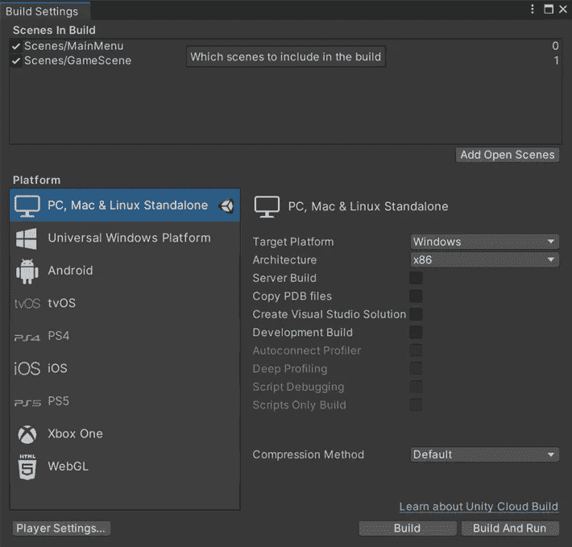

然后，我们需要制作一个新的脚本来加载我们的场景。你可以这样称呼它，但是我认为将处理场景管理的逻辑与其他类型的行为分开会更方便。

在这个脚本中，我们需要添加 ***UnityEngine。场景管理；*** 命名空间给我们提供了访问**场景**和**场景管理器** **类**的相关功能。

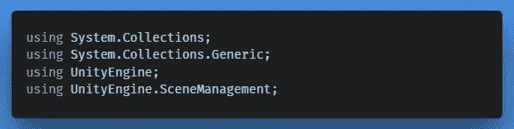

*UnityEngine.SceneManagement; namespace*

要加载一个场景，我们可以调用静态方法 ***Load Scene()*** ，或者传入一个 ***场景名称(字符串)*** 、一个 ***场景索引(int)*** 或者一个 ***场景路径(字符串)*** 。

Loading a Scene

可以在**单模式**中加载一个场景，在加载下一个场景后立即卸载前一个场景。或者，它可以在**加法模式**中加载，在游戏视图中保持两个场景在层级中同时活动，同时相互重叠。仅仅声明一个参数将会以单一模式加载场景。

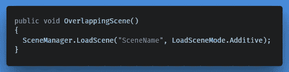

Loading an overlapping Scene

## 何时使用哪个参数

这取决于你的游戏结构和需要什么样的功能。有几个例子可以证明这一点；

Loading a Named Scene by Name Ex.1

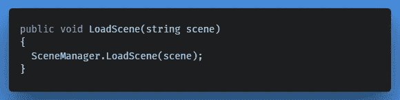

Loading a Named Scene by Name Ex.2

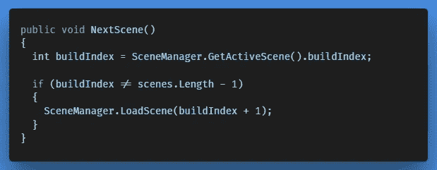

Loading the Next Scene by Index

*   *如果场景索引号不是最后一个，给索引加 1 并加载该场景。*

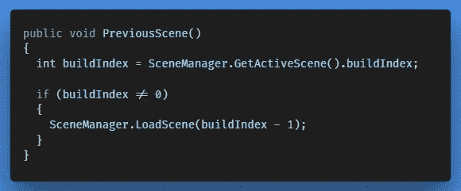

Loading the Previous Scene by Index

*   *如果场景索引号不是第一个，从索引中删除一个并加载该场景。*

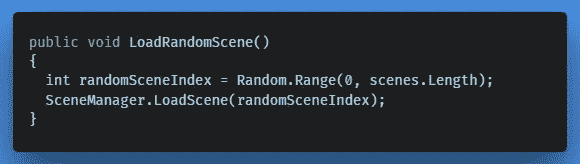

Loading a Random Scene by Index

请记住，如果您通过场景索引来加载场景，索引号必须与构件设置中的相应场景相匹配。但是，您可以轻松地重新排列它们。

# **加载场景 vs 加载场景异步**

重要的是要知道有两种方法可以加载场景:**加载场景**和**加载场景异步**。

## 加载场景

**加载场景**直接加载场景，加载发生在下一帧。这种半异步行为会导致帧中断，并且会造成混乱，因为加载不会立即完成。

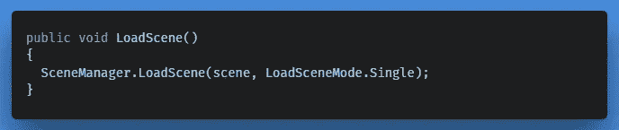

This is only useful for specific purposes

更多关于 *LoadScene()* 的信息，点击[这里](https://docs.unity3d.com/ScriptReference/SceneManagement.SceneManager.LoadScene.html)。

## 异步加载场景

**加载场景异步**在后台加载场景，并分布在多个帧上。

一般来说，建议使用 Async 方法，因为它可以更有效地将负载分散到几个帧上，而不是一个帧上，它在播放器构建中工作得很好，但是在编辑器本身中，它可能会断断续续和冻结，因为编辑器不太支持后台操作。

另外，它给我们留下了访问加载过程的选项，这在我将在本文的第二部分向游戏介绍**加载屏幕行为**时很有用。

因为 Load Scene Async 是一个 ***异步操作*** ，我们有能力从加载过程中产生信息(类似于协程的工作方式)。

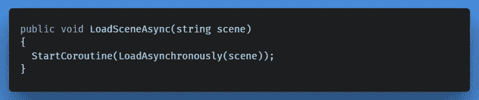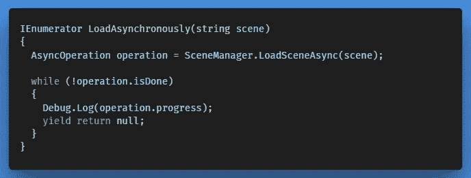

To access the progress of the load, we need to cache a reference to the Asynchronous Operation

更多关于 *LoadSceneAsync()* 的信息，点击[这里](https://docs.unity3d.com/ScriptReference/SceneManagement.SceneManager.LoadSceneAsync.html)。

这是对 Unity 中场景管理的介绍，当我们深入开发过程时，我们将涉及其他感兴趣的类和类属性。然而，如果你已经想要更深入的信息，你可以访问官方的 Unity 文档。我们现在要做的是将一些基本的场景管理功能应用到我们自己的游戏中。

## 履行

为了在 Space Shooter 项目中开始使用**场景**和**场景管理器类**，我将实现一个 ***Restart()*** 方法，玩家可以通过一个按钮来触发该方法，以防需要重启关卡。

首先我将添加一个新的 ***游戏管理器. cs*** 脚本到一个新的空游戏对象中。这个脚本将包含任何与游戏逻辑相关的信息，例如游戏结束逻辑、暂停和播放等等。

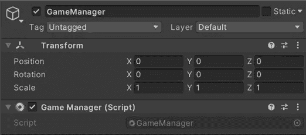

GameManager.cs

我现在也可以从 *Player.cs* 中移除游戏结束逻辑，并将其添加到 *GameManager.cs* 中，因为我们有一个单独的脚本来处理这种行为。

然后，对于场景层次中的另一个新的空游戏对象，我附加了一个名为***Scene loading manager . cs***的脚本。这个脚本将处理我们游戏中与场景管理相关的任何事情。

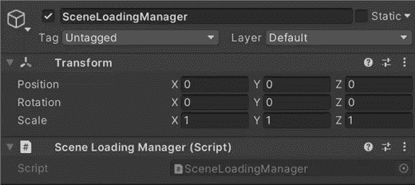

SceneLoadingManager.cs

在“游戏结束”窗口中，我添加了两个新按钮，并更新了它们的文本，显示为“退出”和“重启”。

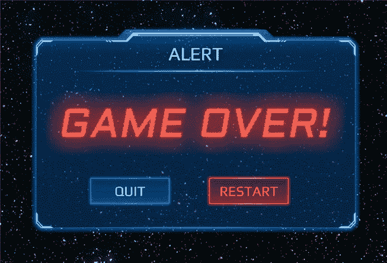

在***Scene Loading manager . cs***中我创建了一个公共方法，可以被 *GameManager.cs* 访问，负责通过索引号加载一个场景。

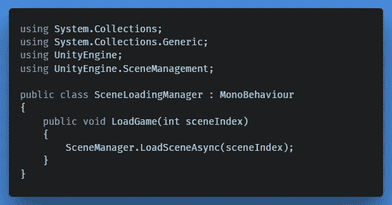

我还创建了一个方法来返回当前活动的场景，这个场景可以通过 *GameManager.cs* 再次访问；

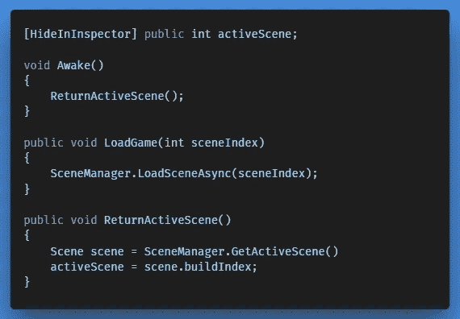

然后在***Game manager . cs***中，我们应该抓取一个对 *SceneLoadingManager.cs* 的引用，连同游戏结束逻辑它应该是这样的；

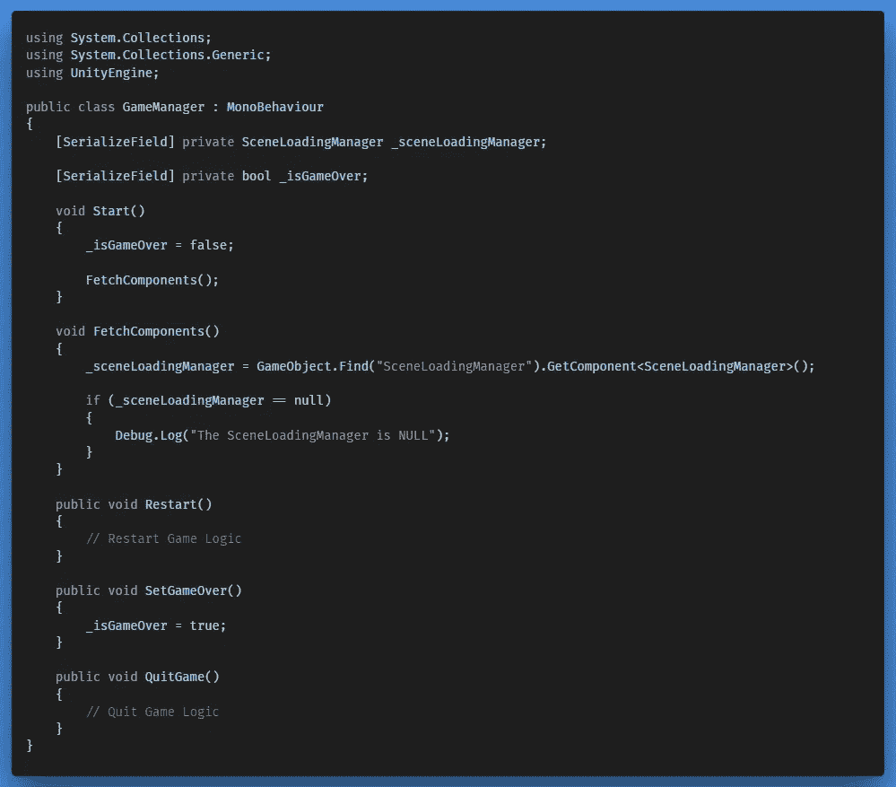

GameManager.cs

在 ***Restart()*** 方法中，我们现在可以通过 *SceneLoadingManager.cs* 请求活动场景，并在游戏结束时重新激活它。

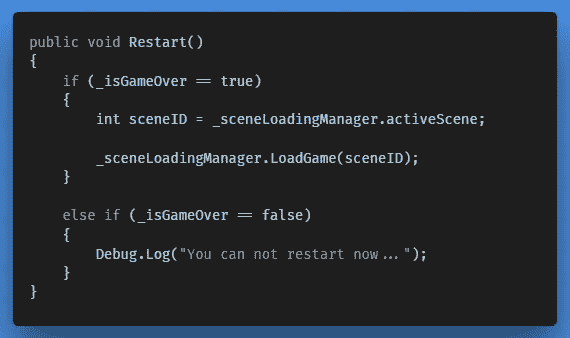

在编辑器中，GameManager 的****Restart()***方法应该分配给 Click 事件上的‘Restart’按钮，就像这样；*

*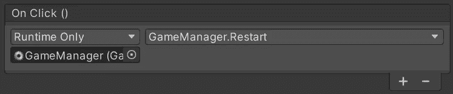*

*在 ***Player.cs*** 中，剩下要做的就是在玩家死亡时通知 *GameManager.cs* 游戏结束。*

*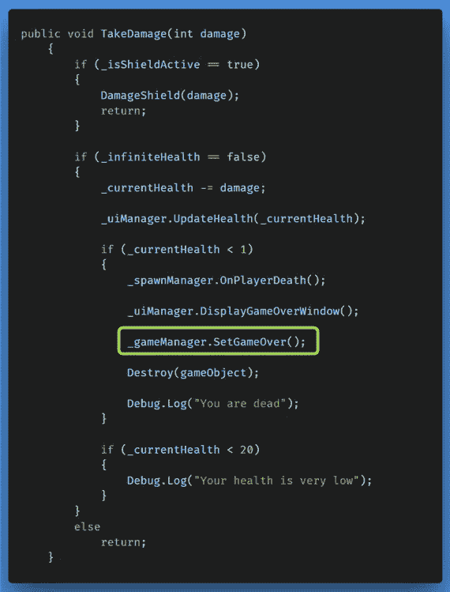*

*Game Over Logic Activation*

*现在当游戏结束时，我们有能力重新启动活动场景。当重启按钮被按下时，我们通过获取当前活动场景并通过游戏管理器重新加载它。*

*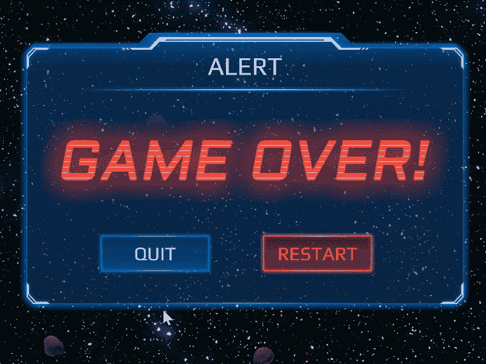*

*Restart by pressing the Restart Button on the Game Over Screen*

*这篇文章将为理解 ***如何统一引擎提供坚实的基础。场景管理*** 的工作原理，以及我们如何在我们的项目中使用它来处理场景相关的功能。我们学习了加载场景以及如何从场景中获取信息，这是我们在未来向用户界面系统添加更多功能的关键一步，例如动态加载屏幕或其他 UI 菜单。我很期待继续下去，你呢？祝你好运！*

*← [上一个](https://gert-coppens.medium.com/switching-weapons-a743b59bf9b5) |下一个→*