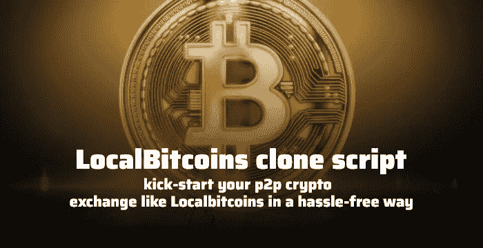
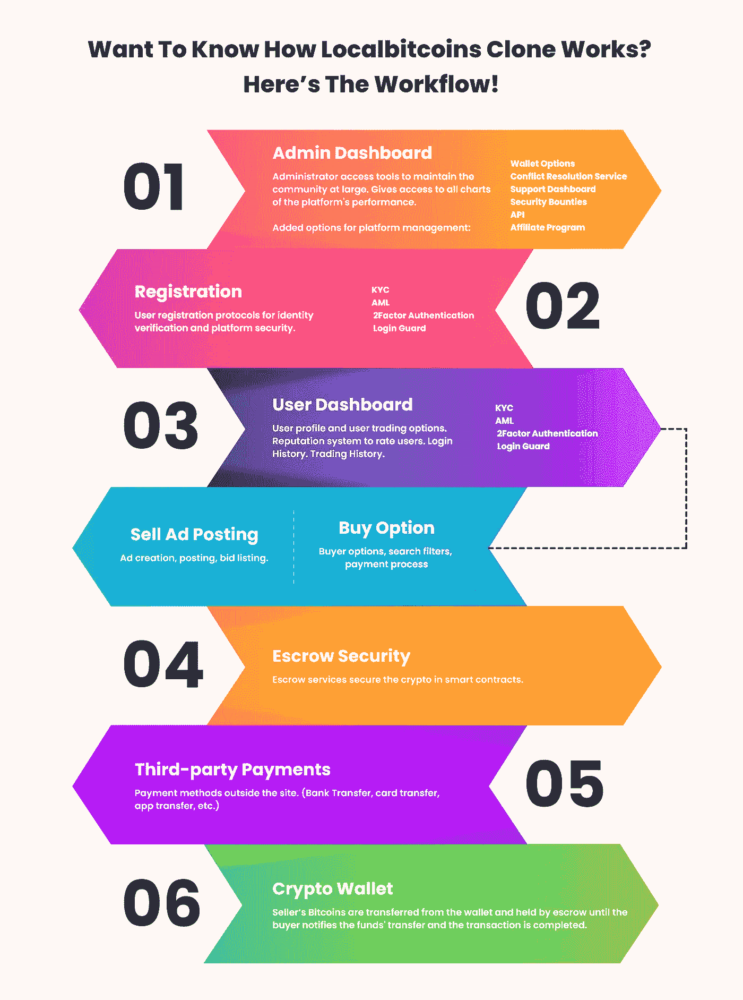

# LocalBitcoins 克隆脚本来启动一个类似 Localbitcoins 的 p2p 加密交换

> 原文：<https://medium.com/geekculture/localbitcoins-clone-script-5bcbbc658a7b?source=collection_archive---------5----------------------->

[LocalBitcoins clone script](https://www.coinsclone.com/localbitcoins-clone-script/?utm_source=2810bi&utm_medium=gkculturerv&utm_campaign=MSP)

2012 年，第一个点对点加密交换出现了。LocalBitcoins 就是其中之一，这是一个面向加密用户的集中式、基于广告的点对点生态系统。

LocalBitcoins 起源于芬兰，是一个用当地法定货币交易比特币的在线门户网站。这是密码领域的革命性发展。为什么？因为它是第一家使用托管支付服务来促进密码到票据交换的公司。

2020 年，LocalBitcoins 发展成为使用最多的交易平台之一，日交易量几乎达到 3 万笔。今天，它仍然是最受欢迎和信任的 p2p 加密交易所之一，平均年收入为 3000 万美元。

在加密领域，企业的经验带来了一定程度的信任。加密货币非常需要信任。这就是为什么 LocalBitcoins 是集中式点对点加密生态系统的领跑者。这些原因使得本地比特币成为有抱负的加密初创公司和企业家的理想商业模式。

采纳先于创新。如果你愿意建立一个 p2p 加密交易所，这就是为什么现在我们来看看本地比特币克隆脚本 的概念。

# **什么是本地比特币克隆脚本？**

LocalBitcoins clone script 是一个现成的 p2p 加密交易所克隆软件，可以帮助初创公司创建和部署类似 LocalBitcoins 的托管式 p2p 交易所。它可以在 7–10 天内托管和启动。白标 Localbitcoins 克隆软件的功能类似于 Localbitcoins 平台，并拥有其所有当前功能和插件。使用这个克隆脚本的主要好处是定制。

您在这个定制的克隆脚本中获得的定制范围很大。因此，您可以根据自己的喜好和口味轻松修改整个脚本。通过获得这个脚本，你可以顺利地修改交易所的外观、交易功能、视觉效果、后端、核心属性和其他重要方面。

本地比特币克隆软件是用最新的 API 制作的，它可以兼容多种设备。它配有清晰的用户界面/UX，因此任何交易者都可以安全地买卖加密资产，您的用户可以获得最佳的交易体验。和 Localbitcoins 一样，这个克隆脚本也支持多种支付方式和用于交易的密码。此外，白色标签的本地比特币克隆软件只有在经过一系列安全检查后才能交付。

## **本地比特币克隆脚本的工作流程**

**Workflow of the LocalBitcoins clone script**

## **为什么创业公司应该更喜欢 LocalBitcoins 克隆脚本？**

作为一个新兴的加密初创公司，当你创建一个 p2p 加密交换时，你可能会期望没有风险的最佳结果。可能吗？是的，100%可能，当你有一个无缺陷的功能齐全的本地比特币克隆软件的时候。

使用 LocalBitcoins 克隆软件，你可以在不到一周的时间内创建和部署一个类似 Localbitcoins 的 p2p 加密交易平台。当你从市场上的专业加密交换克隆脚本提供商那里得到适当的指导时，将克隆脚本托管到网站域并将其与区块链集成会更容易。

通过获得这个白标加密交换克隆软件，你也可以产生很高的收入。你可能会问——怎么做？？？它附带了一个可定制的管理门户，您可以在其中为您为全球用户提供的加密交易服务设置自己的费用结构。例如，您可以收取广告发布费、加密提现费和您在平台上启用的其他收入模块。

与从头开始开发相比，获得一个优质的 Localbitcoins 克隆脚本将让您节省 85%的投资。例如，假设您正在开发一个类似于 Localbitcoins 的 p2p 加密交换。这可能需要长达 12 到 18 个月的时间，仅开发和安装就需要 25 万美元。听起来很贵，对吧？？？

# **获得一个本地比特币克隆软件需要多少钱？**

当你从一个业内知名的脚本提供商那里获得一个超现代的 [**本地比特币克隆脚本**](https://www.coinsclone.com/localbitcoins-clone-script/?utm_source=2810rv&utm_medium=gkculture&utm_campaign=MSP) 时，你就不会面临这个财务障碍。但是，质量是你必须仔细选择的因素之一。不是所有的 crypto exchange 克隆脚本服务商都能保证质量，也不是所有的优质产品都很便宜。优质的白标本地比特币克隆软件通常不会以很低的价格出售。但它总是比从头开始构建软件更实惠。平均而言，最好的本地比特币克隆脚本的成本大约在 8000 美元到 15000 美元之间。

除此之外，Localbitcoins 克隆软件的机制响应速度非常快，并且为了稳定性和安全性，实施了最新的加密货币交换架构设计。对于一家加密初创公司来说，软件稳定性是一个福音。

这些令人震惊的原因使得 LocalBitcoins 克隆软件成为初创公司和企业家创建 p2p 加密货币交易平台的最佳选择。

现在，让我们看看…

## **本地比特币克隆软件的主要特性**

在获取脚本之前，您需要检查脚本附带的特性。这是因为交易所提供的功能将决定你的 p2p 交易的成功率。此外，它还展示了您的 p2p 交易平台在全球市场中的独特性。启用 LocalBitcoins 克隆脚本中的尖端功能将有助于您领先于竞争对手。

以下是您可以在 Localbitcoins 克隆软件中作为完整软件包获得的功能列表。

1.  用户仪表板
2.  管理门户
3.  自定义用户界面/UX
4.  KYC/反洗钱验证
5.  内容管理
6.  争议管理
7.  行政利润管理
8.  线上/线下交易
9.  API 文档
10.  流动性 API 集成
11.  附属系统

这样的例子不胜枚举。

正如已经说过的，它带有可定制的选项。因此，在部署 exchange 之前，您可以根据自己的愿望和需要修改这些功能。即使在服务器上托管您的 exchange 之后，您也可以轻松管理所有这些功能，因为您是通过管理门户控制整个平台的。

让我用…来包装这篇文章

## **哪里可以获得最好的 LocalBitcoins 克隆脚本？**

我们生活在一个科技在所有发展中扮演重要角色的现代时代。所以当涉及到加密货币交易所克隆脚本提供商时，会有很多选择。在搜索引擎中简单地浏览一下，你就会看到来自不同来源的一百个不同的结果。当一个初露头角的加密公司寻找最好的脚本提供者时，太多的选择也是一个小问题

当务之急是找到最好的加密货币交换克隆软件服务提供商与该领域的经验。要找到合适的，您必须检查他们的克隆脚本演示、反馈、评论和多年经验，他们使用的技术堆栈，以及他们在脚本中启用的功能。为什么？因为他们不仅是您的软件提供商，也是您的技术支持合作伙伴。这就是为什么与专业的 [**密码交换克隆脚本**](https://www.coinsclone.com/?utm_source=2810hp&utm_medium=gkculturerv&utm_campaign=MSP) 提供商握手是非常可取的。

因此，明智地选择脚本提供商，开始你的 p2p 交换业务，并通过你令人兴奋的商业概念获得大量利润。