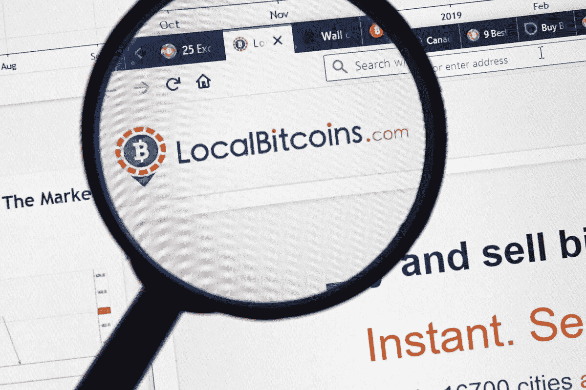
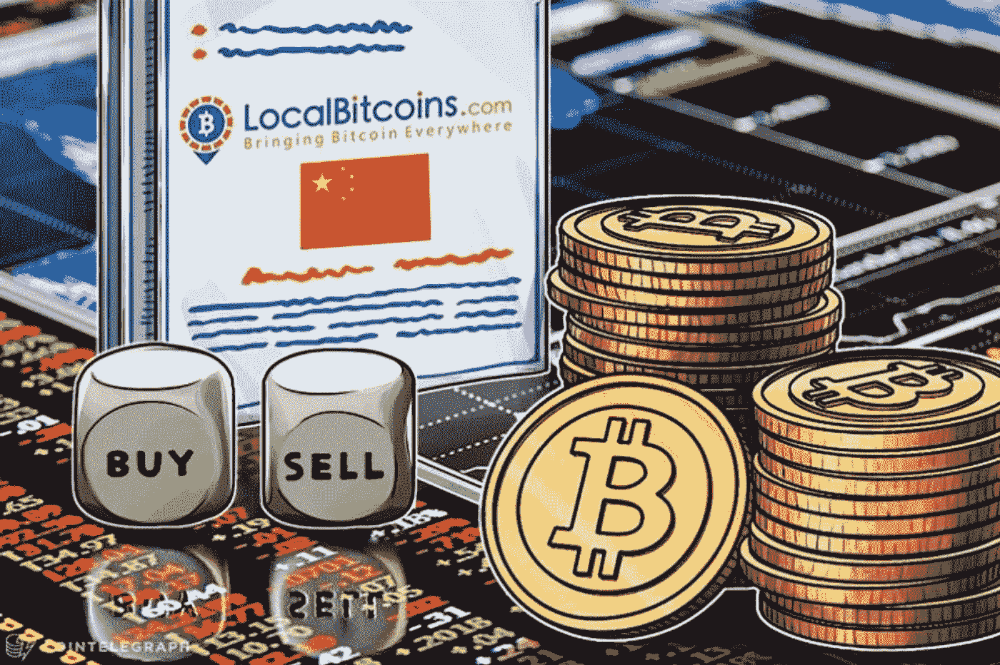
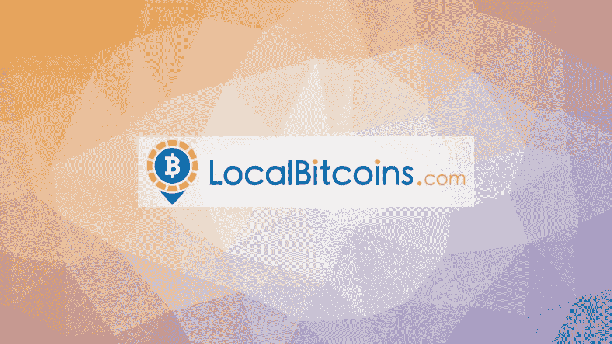

# 本地比特币克隆脚本(9 大特色)

> 原文：<https://medium.com/geekculture/localbitcoins-clone-script-9-top-features-d6caabc4fb6d?source=collection_archive---------15----------------------->

克隆脚本是从成功和流行的网站(如币安克隆脚本或 Wazirx 克隆脚本)开发出来的， [**本地比特币克隆脚本**](https://radindev.com/localbitcoins-clone-script/) 也是如此。使用克隆脚本创建一个网站意味着该网站具有原始网站的功能和可用性，这样它可以更快地在用户中找到自己的位置。与其他加密交换平台一样，该平台具有特定的特性和功能，因此受到加密爱好者的欢迎。因此，本文致力于简要介绍它的克隆脚本，使用这种克隆脚本的优点和缺点，以及使它在加密交换社区中流行的主要特性。

# 什么是本地比特币克隆脚本？

最初的 Localbitcoins 是一个点对点加密交换平台，旨在连接比特币的买家和卖家。在这个平台上，卖家可以发布一个买卖比特币的广告，或者在令人兴奋的广告中选择一个。相反，购买者可以回复广告；之后，会出现一个聊天框，方便交易者之间的交流。这个平台与其他加密交易平台的区别在于，它利用用户的位置来联系交易者。所以，离得很近的买家和卖家可以交易比特币，而不需要和远离他们的人交易。

这个平台的克隆脚本允许用户使用它将他们的法定货币或当地货币兑换成比特币。他们还可以宣传支付方式和兑换比特币的汇率。

# 加密交换平台的优势和劣势

与 GitHub 上提供的免费加密交换脚本相比，使用其克隆脚本创建交换网站有几个优点。使用克隆脚本可以确保您拥有一个定制的 exchange 网站，并且不会遇到使用免费源代码(例如，币安免费克隆脚本或任何免费加密 exchange 脚本)时可能会遇到的问题。

# 赞成的意见

## P2P 比特币购买

这种购买是完全分散的；没有银行或第三方介入，因此您的交易保持私密。

## 没有买卖费

由于在这个平台上买卖比特币不收取任何费用，许多投资者愿意通过它进行交易，他们处理的障碍也较少。发布广告后，克隆人对每笔交易收取 1%的托管费。你可以通过回复广告而不是发布广告来避免支付这笔费用。

## 不同的付款方式

类似于[比特币基地克隆脚本](https://radindev.com/coinbase-clone-script/)或币安脚本，这个交换平台及其克隆脚本支持几乎所有的支付方式。用户可以在广告中列出他们愿意接受的支付方式。交易员还可以根据支付方式对报价进行分类。

## 声誉系统

这被归类为安全特征。正如我们将在下一节中详细讨论的，该平台包括每个用户的交易历史信息和其他交易者对用户档案的评论。这有助于用户找到一个信誉良好的贸易商，减少骗子。

# 骗局

## 诈骗风险

P2P 交易在本质上很容易受到骗局和欺诈。例如，买家可以通过可逆支付方式支付比特币，在他们获得比特币后，他们会质疑交易是欺诈。

## 询问私人信息

像任何其他交换平台一样，这个克隆平台希望其用户通过设置四个帐户验证步骤来获得值得信赖和安全的氛围。这些验证是基于用户已经完成了多少身份验证来选择的。在确定你每年可以交易的最大金额时，身份验证的数量是必不可少的。然而，一些用户认为这是对隐私的侵犯，尽管匿名一直是这个交流平台的一个重要因素。

## 只提供比特币

这个交易平台只支持比特币，因为它是最古老的交易平台之一。最初的平台缺乏更新以适应当前的需求。虽然在过去的一年里，加密货币选项的缺乏并不那么重要，但现在，随着许多可用的加密货币的出现，这种限制可能会成为交换平台的一个负面因素。

## 有限的功能

最初的交易所平台及其克隆脚本(从 Localbitcoins 克隆脚本发展而来)只支持一种交易工具:将卖家或买家与其他想要出售或购买比特币的用户联系起来。相比之下，其他可以被视为其竞争对手的交易平台提供了先进的交易工具。这可能使这种加密交换与其他交换平台相比利润较低。

# 本地比特币克隆脚本的主要特性

与 paxful 克隆脚本或币安克隆脚本一样，作为两个截然不同的交换平台，一个类似本地比特币的交换网站具有特定的功能。一些最重要的如下:

# 1.条件交付帐户

托管钱包是克隆平台中的用户创建帐户时生成的虚拟钱包。这个钱包是在网络的主钱包下开发的。这个钱包用来保存用户的加密货币。值得一提的是，如果交易正在进行中，用户希望将加密货币从一个钱包转移到另一个钱包。

# 2.简化的 KYC 验证

KYC 验证在这个克隆交换平台上是一个 5 星级的过程，它被很好地简化了。使用该功能，当用户创建他们的帐户时，他们能够上传个人文件进行验证。此功能提高了克隆交换平台的安全性。

# 3.符合通用数据保护法规(GDPR)

这意味着本地比特币克隆脚本与 GDPR 兼容。

# 4.确定两点间距离的邻近映射

这是克隆脚本的一个专门功能，允许用户与其他人进行互动，以在附近交易或交换加密货币。该功能遵循邻近算法，显示附近的跑步者。该功能的另一个好处是，用户可以在开始交易前看到支付选项、反馈和不同的安全评级。

# 5.审查和反馈机制

该功能允许[本地比特币](https://localbitcoins.com)交易者在完成交易后提交反馈。每笔交易的分数是根据回复率、档案完整性、透明度和整体状况等特征计算的。

# 6.纠纷调解

Localbitcoins 克隆脚本使用了一个成熟的争议管理系统。这一系统包括核实索赔和解决争端的所有基本工具。

# 7.易于使用的界面

这样一个交换网站优化了 CSS，并在 web 应用程序中使用 HTML minification，使页面加载更快。任何想要开发 Localbitcoins 克隆应用的公司都应该使用最好的编码标准，以确保程序无缝快速运行，不会臃肿。

# 8.有效的报告系统

这一功能可以添加到 Localbitcoins exchange 平台的管理员仪表板中，提供关于如何解决总体负面评论和管理瓶颈的宝贵统计数据。这些报告有助于网站所有者了解公司运营的成功程度。

# 9.个性化和即时消息

在开始交易之前，用户可以向其他人发送快速、个性化的消息，以便进行交易或互换。

# 安全功能

由于许多原因，这个平台是一个非常安全的交换软件。在向卖家付款后，如果卖家没有释放托管资金，买家可以举报并冻结卖家的账户。另外，客服会介入交易，网站在买家证明付款的情况下释放资金。下面列出的功能是开发公司可以添加到 exchange 平台的安全层，以确保用户对其高度安全。

# KYC:

如前一节所述，这个安全特性由几个步骤组成，用于验证用户的身份。这些连续的步骤阻碍了骗子的活动并减少了欺诈。

# 托管服务:

这种交易是通过托管账户进行的，钱包里没有任何密码。相反，当卖方确认并完成交易时，这些资金从托管账户中释放。

# 登录保护

每次交易者登录交易平台，网站都会确认是否在同一个网络浏览器上。如果交易者使用不同的网络浏览器，exchange 克隆平台要求再次进行电子邮件验证才能登录。

# 声誉和排名

交易所网站的一个安全特征是，并非所有交易者都被允许在加密交易所平台上交易。只有在与其他方的交易活动中具有排名声誉和良好历史的用户才能进行交易。因此，买家必须查看卖家的交易历史。

# 隐私

交易所平台的隐私政策从不与任何交易所或钱包共享交易者的信息。因此，他们可以买卖用户隐私维护的比特币。

# Pin 验证

如果你选择建立类似本地比特币平台的开发公司使用 pin 验证安全功能，交易者每次登录账户时，都会向注册的电话号码发送一个一次性密码。

# 冲突解决服务

类似本地比特币的交易平台的支持团队应该随时准备帮助买卖双方之间的任何客户冲突，为交易和交易做出贡献。尽管所有的开发公司都试图为平台提供高水平的安全层，但用户在交易过程中应该始终保持谨慎。骗子甚至可以黑掉最复杂的平台。如果交易者调查交易中的所有买家和卖家以避免任何可能的问题，那将是最好的。

# 双因素身份验证

这个关键的安全特性意味着这个平台设置了两个安全标准。例如，除了电子邮件 id 和密码之外，用户还应该输入一个附加的 PIN 码发送到他们的电话号码。

# 平台的工作流程:类似 localbticoin 的平台是如何工作的？

# 登记

首先，用户应该按照步骤注册并登录交换平台。在交易平台上创建个人资料后，您可以匿名买卖密码。

# 广告

卖家可以通过网站建立销售比特币和其他加密货币的广告。买家也可以同时看到卖家的广告。

# 处理

如果买方和卖方对所有条件都满意，他们将交换他们的加密货币。

# 托管服务

在交易过程中，托管方法将是最好和最有益的服务之一，因为它可以安全地持有加密货币，直到卖方获得资金。

# 留下反馈

类似 Localbticoin 的平台上的交易者可以在任何时候交易时留下反馈。反馈有助于用户防范诈骗和其他黑客活动。

# 本地比特币克隆软件插件

虽然在上面提到的部分中，我们解释了原始的 localbticoin 加密交换有一些限制，但是一些开发公司，如 RadinDev，他们构建了交换克隆脚本，合并了插件来增加该平台的功能。该公司的开发团队提供的一些附件如下:

- **场外交易**:这种交易发生在两个合伙人之间，证券的过程是在一个去中心化的平台上进行交易。

-**:这个过程允许用户从经纪人那里借入资金，进行金融资产交易，获得更多收益。**

**——**P2P 交易**:两个交易者之间的直接交易。**

**- **限价单**:该流程仅在达到确定价格或更高价格时执行，反之亦然。这意味着可以以指定价格或低于指定价格购买资产。**

**- **代销商系统**:这种附加功能意味着代销商如果为公司获得另一个客户，就可以获得佣金。**

**- **订单簿**:指当时可用于交换特定交易对的所有未平仓订单的列表。**