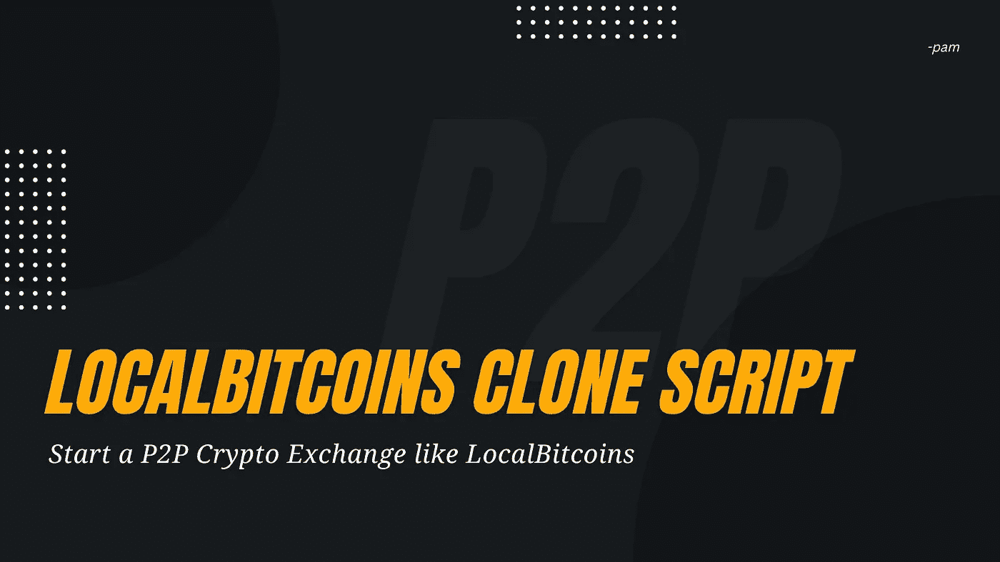

# 本地比特币克隆脚本—启动一个类似本地比特币的 P2P 加密交换

> 原文：<https://medium.com/geekculture/localbitcoins-clone-script-start-a-p2p-crypto-exchange-like-localbitcoins-e0071b3805d5?source=collection_archive---------17----------------------->

## Localbitcoins 克隆脚本是您的 p2p 加密货币交易业务的一步解决方案！

权力下放已经成为当今时代的流行词汇。每个人都希望在一个分散的平台上处理金融交易。这推动了加密货币在本地比特币交易平台的发展。如果你是一个小商人或企业家，并希望像本地比特币一样启动自己的交易平台，那么你来对地方了。

你可能会认为启动加密货币交易所很复杂，需要长期投资。这可能是真的，如果你是从零开始，这需要时间。但事实是，你也可以在本地比特币克隆脚本的协助下开始你的加密货币兑换，本地比特币克隆脚本具有与本地比特币相同的功能。

因此，不要等待太多时间，我们必须了解更多关于 LocalBitcoins 克隆脚本、业务优势、功能以及从哪里获得它们的信息，这将有助于您启动像 LocalBitcoins 这样的加密货币交易平台。

# **什么是 LocalBitcoins 克隆脚本？**

本地比特币克隆脚本是一个点对点加密交易脚本，使企业家能够启动一个加密交换网站，人们可以在那里即时安全地买卖加密。在 p2p 托管服务的帮助下，用户可以即时买卖所有类型的加密货币。您可以自定义或修改软件和应用程序的任何独特功能。本地比特币克隆脚本允许人们发布分类广告和展示广告，并显示兑换密码的汇率和支付选择。作为一个创业者，精力充沛地推出 LocalBitcoins 这样的去中心化 p2p 密码交易所是很正常的。让我们浏览一下本地比特币克隆脚本的商业优势、高级功能和高级安全选项，当您开始自己的加密交易(如本地比特币)时，这些可能对您有用。

## **使用本地比特币克隆脚本启动加密货币交易平台的商业利益**

**1。多重交易**

基于用户便利性，支持多种高级交易选项。

**2。快速交易**

交易将在一个快速会话中完成，不会超过一分钟。

**3。多种加密货币支持**

本地比特币支持 200 多种货币。

**4。高级安全功能**

除了高级功能之外，您还可以为您的加密货币交换平台添加多种高级安全功能，如加密机制。

**5。可定制软件**

您可以根据您的业务需求向您的软件或应用程序添加任何独特的功能。

**6。多语言兼容性**

这是一个基于全球的平台，因此 LocalBitcoins 克隆脚本提供了多语言支持。

**7。可扩展性**

本地比特币克隆脚本旨在管理多项交易。它具有高度的可伸缩性，可以根据用户需求处理多个事务。

## **local bitcoins 克隆脚本的高级特性是什么？**

*   **场外交易选项**

本地比特币克隆脚本具有场外交易(OTC)功能，允许交易者离线交易加密货币，无需手动中断。

*   **聊天机器人支持**

它允许用户在交易过程中直接发送或接收消息。这将克服沟通不畅导致的可能性。

*   **零点篡改**

该软件和应用程序构建了一个点对点平台，使您的用户能够在不篡改的情况下交易加密货币并将其兑换为法定货币。

*   **安全管理**

为了防止交易过程中的黑客攻击和数据窃取，本地比特币克隆软件采用多重签名安全性构建。

*   **打桩**

该软件使用户能够根据他们在赌注过程中的积极参与来接收数字奖励和交易。

*   **融资融券交易**

它通过提供保证金交易功能，允许交易者以适当的支付进行交易。

*   **令牌列表选项**

它支持令牌列表过程，这意味着任何用户都可以在 exchange 平台上列出他们的加密令牌。

## 哪里可以得到最好的本地比特币克隆脚本？

目前市场上有很多本地比特币克隆脚本提供商。但是要筛选出最好的是一件很难的事情。如果你在寻找物美价廉的服务，是时候考虑一下硬币皇后了。Coinsqueens 是目前加密市场上最好的加密货币交换克隆脚本提供商之一。它有助于创建您的加密货币交易业务，并带来巨大的投资回报，让他们立即获得您的可靠、安全和高度定制的 p2p 加密货币交易平台，并启动您的加密业务。

免费即时演示> > [**本地比特币克隆脚本**](https://coinsqueens.com/localbitcoins-clone-script/?utm_source=LB+Clone+Script+Pst&utm_medium=Medium&utm_campaign=geekculture)