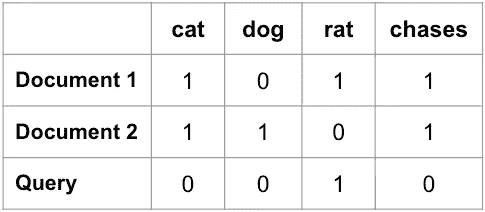
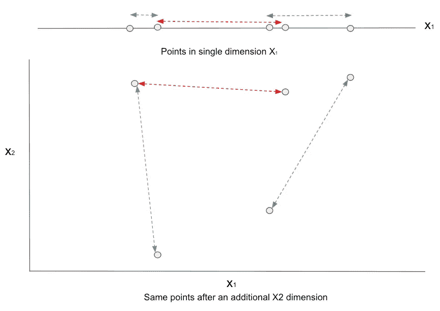
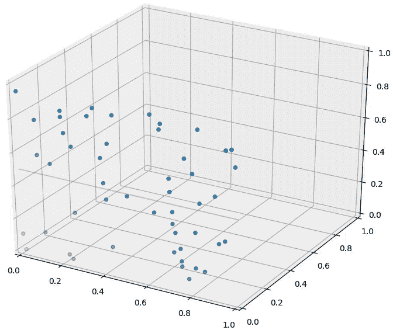
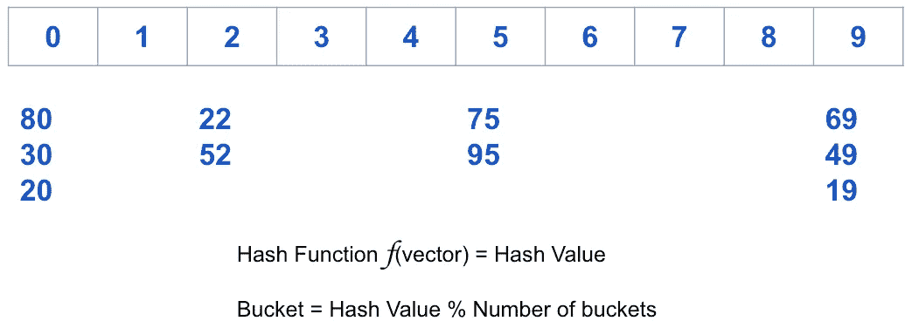
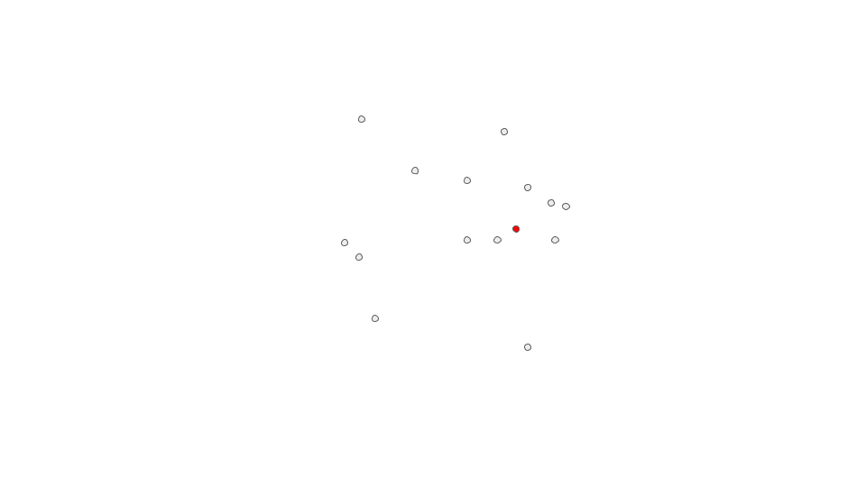
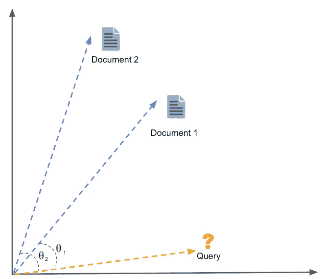
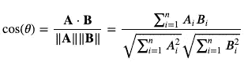
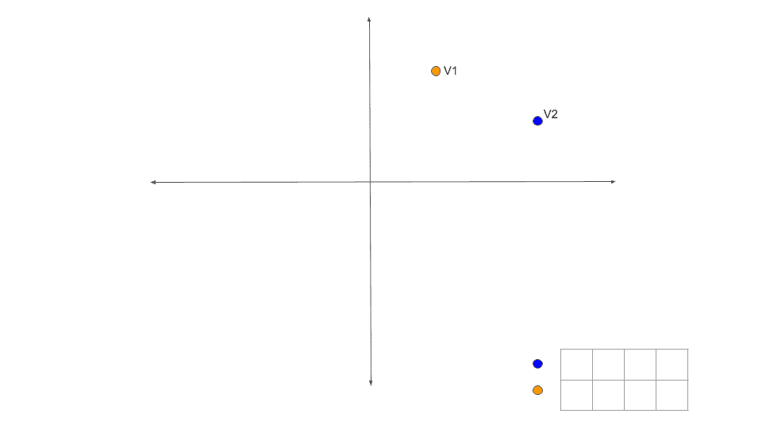
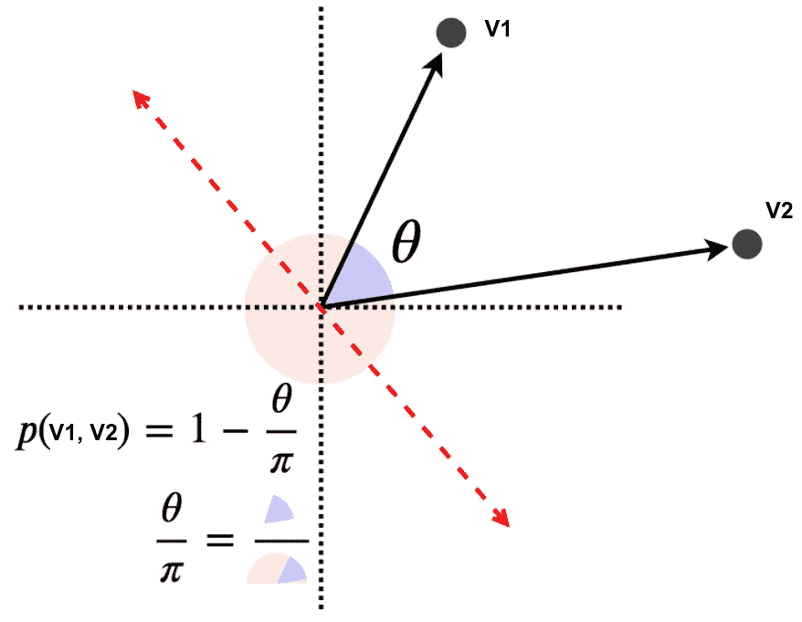

# 高维数据中快速搜索的位置敏感哈希算法。

> 原文：<https://medium.com/geekculture/locality-sensitive-hashing-for-fast-search-in-igh-dimension-data-a2cdef1b6eff?source=collection_archive---------3----------------------->

image credits: Christopher Burns @ Unsplash

# 现实世界的问题

在许多现实世界的问题中，我们必须处理和分析大量的文本数据。例如:文本挖掘、垃圾邮件过滤、产品推荐、在线广告等..

这种数据通常以高维度为特征，例如:谷歌新闻模型是在约 1000 亿词的数据集上训练的。该模型包含 300 维向量，包含 300 万个单词和短语。

在某些情况下，我们会分析大量文档，以识别高维数据中的类似项目，例如:

*   网络搜索和文本挖掘
*   文件分类
*   剽窃
*   聊天机器人

所有这些问题的一个共同问题是在高维空间中寻找最近的邻居。在某些情况下，我们感兴趣的是一组最近的邻居，而不是精确的匹配。

我们将关注位置敏感散列(LSH ),这是一种可以在高维数据中使用的技术，用于在具有几乎恒定的查找时间的大规模数据库中寻找最近的邻居。

LSH 是一种通用的算法，可应用于无数问题，包括:

*   **近似重复检测** : LSH 通常用于消除大量文档、网页和其他文件的重复数据。
*   **全基因组关联研究**:生物学家经常使用 LSH 来识别基因组数据库中相似的基因表达。
*   **大规模图片搜索**:谷歌使用 LSH 和 [PageRank](https://en.wikipedia.org/wiki/PageRank) 来构建他们的图片搜索技术 [VisualRank](https://research.google.com/pubs/pub34634.html) 。
*   **音频/视频指纹**:在多媒体技术中，LSH 被广泛用作音频/视频数据的指纹技术。
*   **欺诈检测**:优步利用 LSH 快速检测平台滥用，从垃圾邮件到虚假账户和支付欺诈

# 将文档表示为数字向量

向量空间是自然语言处理中许多应用的基础。如果我们想要表示文档，以便我们可以应用数学模型来分析内容，我们需要将它编码为一个向量，其中维度是构成文档的单词或 n-grams。

让我们用一个例子来理解。考虑下面的语句和一个查询词。这些声明在下文中称为文件。

*   *文件一:猫追老鼠*
*   *文件二:狗追猫*
*   *查询:谁在追老鼠*

在对文档进行预处理后，我们将它们表示为单词向量

*   *文件 1:(猫，追逐，老鼠)*
*   *文件二:(狗，追逐，猫)*
*   *查询:(谁，追，鼠)*

要检索的相关文档将是。

*相似性得分(文档 1，查询)>相似性得分(文档 2，查询)*

我们可以将上述文档向量以数字格式表示为术语文档矩阵。

在创建术语文档矩阵时，还有一些额外的步骤，如词干提取、词汇匹配、TF-IDF，为了简单起见，我们将跳过这些步骤。

现在想象一下，如果我们想要绘制真实世界的数据，例如整个维基百科语料库有大约 30 亿个单词，而谷歌新闻数据集有超过 1000 亿个单词。你可以在 https://code.google.com/archive/p/word2vec/的[找到这两个数据集](https://code.google.com/archive/p/word2vec/)

维度的数量将大大增加，使得将查询与每个可能的文档进行比较以找到最相关的文档在计算上不可行或效率低下。

# 维度的诅咒

维数灾难指的是在分类、组织和分析高维数据时出现的问题，这些问题在低维空间中不会出现，特别是数据稀疏性和数据邻近性的问题。

*   随着嵌入这些点的维数的增加，点与点之间的平均距离不断增加
*   随着词汇量的增加，矩阵变得越来越稀疏，因为大多数文档不包含大多数术语。

一种解决维数灾难问题的方法是寻找近似结果，而不是搜索精确结果。在许多不需要 100%准确性的应用中，搜索足够接近的结果比搜索精确的结果要快得多

# 位置敏感散列法

*位置敏感散列法* (LSH)是一套技术，可以显著加快数据的邻居搜索或近似重复检测。为了理解算法，让我们首先理解我们所说的散列和对位置敏感是什么意思。

**什么是哈希**

散列函数的一个传统用途是在*散列表*中。提醒一下，哈希表中使用的哈希函数被设计为将一段数据映射到一个整数，该整数可用于在哈希表中的特定*桶*中查找，以检索或删除该元素。

您可以将哈希函数看作是一个接受任意大小的数据并将其映射到固定值的函数。返回的值被称为*哈希值*甚至*哈希值*。

上图显示了一个非常简单的散列函数的例子，它接受一个向量并返回一个散列值。然后，为了将这个散列值分配给一个桶，我们取模数值。

现在给定一个输入，你不需要将它与所有其他的例子进行比较，你只需要将它与输入被散列到的同一个 *hash_bucket* 中的所有值进行比较。

在散列文档时，您希望将相似的文档散列到同一个桶中。用于比较文档的 LSH 技术之一是余弦相似度。

**什么是区分位置的**

一个词的意义取决于上下文或该词使用的“位置”。

例如，如果像“皮”或“馅饼”这样的词也出现在当地，那么“苹果”指的是水果。但是如果诸如“iphone”或“computer”之类的词在附近，则可以指消费者技术。但是，“在本地”在低维环境中是一回事，在高维环境中又是另一回事。

对位置敏感的散列函数被设计为，对于两个距离*很近的输入值*，散列值冲突的可能性*大于距离很远的输入值*。对于不同的数据类型和不同的“靠近”定义，LSH 函数有不同的实现方式。

根据数据类型，有不同的本地敏感散列函数:

1.  比特采样 LSH(汉明距离)
2.  明哈什 LSH(雅克卡德相似性)
3.  欧几里得和曼哈顿 LSH(欧几里得(L2)和曼哈顿(L1)的距离)
4.  聚类或 K 均值 LSH(通过 K 均值学习哈希函数)
5.  有符号随机投影(余弦相似性)

一会儿我们将仔细看看余弦相似性的带符号随机投影 LSH。

具有相似内容和上下文的文档将具有相同的散列值，从而映射到相同或附近的散列桶。

**LSH 的动机**

假设我们需要在 N = 100 万个文档中找到近似重复的文档。

天真地说，我们必须为每一对文档计算成对的相似性，即 N(N-1)/2 ≈ 5*10 次比较。即使使用最先进的处理器，这也需要几天的时间来计算。

我们可以通过减少需要计算相似度的候选项来加快计算速度。这可以通过将文档向量散列到桶中来实现。

*   给定文件 D1 和 D2
*   如果我们能找到一个散列函数 h，使得:
*   如果 sim(D1，D2)很高，那么 h(D1) = h(D2)的概率很高
*   如果 sim(D1，D2)低，那么 h(D1)高概率≠ h(D2)
*   然后，我们可以将文档散列到桶中，并期望“大多数”接近重复的文档对将散列到同一个桶中，然后我们在每个桶中有一组候选文档对，以查看它们是否真的相似。

Dividing vector space into hash buckets to reduce the number of candidate pairs to compare

# **文档相似度的余弦距离**

余弦相似性是一种度量，用于确定文档的相似程度，而不考虑它们的大小。

As simplified representation of Documents and Query vectors in 2D vector space

在数学上，它测量的是在多维空间中投影的两个向量之间的角度余弦。

在我们的上下文中，向量空间由词汇表中的单词组成，向量是这些文档的数字表示。

向量之间的余弦可以使用以下公式计算。

余弦相似性函数表示为:

𝐴和𝐵代表单词向量，𝐴𝑖或𝐵𝑖代表该向量的索引 I。&注意，如果 a 和 b 相同，你会得到𝑐𝑜𝑠(𝜃)=1.

*   否则，如果他们是完全相反的，意思是，𝐴=−𝐵，那么你会得到𝑐𝑜𝑠(𝜃)=−1.
*   如果你得到𝑐𝑜𝑠(𝜃)=0，这意味着它们是正交的。
*   介于 0 和 1 之间的数字表示相似性得分。
*   介于-1 到 0 之间的数字表示相异分数。

# 余弦相似性的 LSH

有符号随机投影(SRP)输出二进制值，但 SRP 对向量之间的角距离很敏感。

与我们一直使用的典型桶不同，您可以考虑通过确定这些点是在线上还是线下来对它们进行聚类。现在，当我们进入更高维度时(比如说 n 维向量)，你将使用平面而不是直线。

**余弦距离的签名**

选择一些随机向量，并为每个向量散列你的数据。结果是每个数据点的+1 和–1 的签名(草图)

Hash signature for two document vectors

这个函数本质上是将空间一分为二，并将一半的点指定为 1，另一半的点指定为-1。决策边界基于投影向量，投影向量与超平面边界正交。

然后可以通过使用 AND 和 OR 结构或散列函数来放大签名。

下图为为什么有符号随机投影对角度敏感提供了直观的解释。

h(v1)≠h(v2)的概率是随机选择的一条线落在 **V1** 和 **V2** 之间的概率。

如果我们随机选取一个角度，有θ/π的几率它落在两点之间并把它们分开。

最后，我们可以识别相同桶中的近似相似的文档，从而减少用于比较的候选对的数量和问题的维度。

按照上述过程，我们可以列出在大型文本语料库中使用 LSH 进行相似性搜索所涉及的步骤。

1.  将所有文档映射到向量空间模型中
2.  构建 LSH 散列表，将这些文档分组。
3.  对于新的查询，构造特征向量并计算查询的散列
4.  基于散列值，在与查询相同的散列桶中识别候选对。
5.  对于每个候选对，计算文档和查询之间的距离度量
6.  最后，具有最小(阈值)距离的结果是与查询最相关的文档。

# **结论**

我们发展了对本地敏感散列的直觉和对算法背后的数学的高度理解。

我们可以看到 LSH 是如何成为搜索或查询大规模文本数据的高效技术的。LSH 可以处理高维数据，有效地降低维数，加快搜索速度。

许多现实世界的应用程序使用 LSH 来查询或搜索大规模的大型数据库。

# **参考文献**:

1.  [https://web.stanford.edu/class/cs345a/slides/05-LSH.pdf](https://web.stanford.edu/class/cs345a/slides/05-LSH.pdf)
2.  https://web.stanford.edu/class/cs345a/slides/05-LSH.pdf
3.  [http://www . cs . jhu . edu/~ vandurme/papers/vandurmelallacl 10-slides . pdf](http://www.cs.jhu.edu/~vandurme/papers/VanDurmeLallACL10-slides.pdf)
4.  [https://www2 . cs . duke . edu/courses/fall 15/compsci 590.4/slides/compsci 590.04 _ fall 15 _ LEC 12 . pdf](https://www2.cs.duke.edu/courses/fall15/compsci590.4/slides/compsci590.04_fall15_lec12.pdf)
5.  [https://eng.uber.com/lsh/](https://eng.uber.com/lsh/)
6.  [https://randorithms.com/2019/09/19/Visual-LSH.html](https://randorithms.com/2019/09/19/Visual-LSH.html)