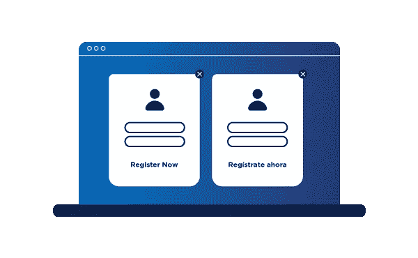
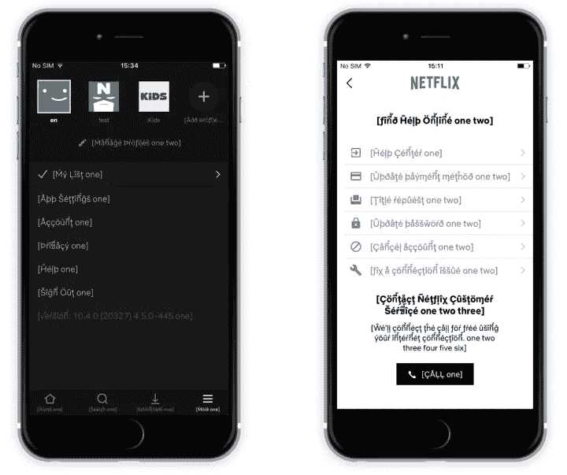

# 本地化测试&如何进行

> 原文：<https://medium.com/geekculture/localization-testing-how-to-do-it-a059199f7e02?source=collection_archive---------13----------------------->

想知道什么是本地化测试吗？

本地化测试就是预览您对网站或应用程序所做的任何本地化更改，这是您在上线之前发现错误和问题的方式。

这可以帮助您构建更高效的本地化工作流程，同时[削减本地化费用](https://www.transifex.com/blog/2022/how-to-cut-localization-costs/)。以下是它是什么，为什么它很重要，以及你如何做到这一点！

# 什么是本地化？

如果您不熟悉，[本地化](https://www.transifex.com/blog/2021/what-is-localization/)就是让您的软件和数字内容更适合特定的地区。

例如，如果你在日本推出一个产品，你会发现把你的内容翻译成日语并考虑文化因素会有更高的转化率。

想想像握手这样简单的事情。日本人更习惯鞠躬，不像美国人那样喜欢身体接触。这意味着，如果你的产品有一个握手的图像，你可能会用两个人互相鞠躬来代替它，从而对日本观众更有吸引力。

# 什么是本地化测试？

你曾经使用过文字或字符有问题的网站或产品吗？这通常发生在你没有首先确保网站或应用程序准备好接受新的语言和与之相关的文本/符号就进行本地化的时候。

因此，通过本地化测试，您可以在上线之前检查软件如何处理新的内容条目。

但值得记住的是，这不仅仅是内容的问题。本地化通常还涉及 UI 的更改。

# 为什么本地化测试很重要？

穿着一件从未经过测试的防弹衣，你会感到舒适和安全吗？这和本地化你的软件和数字内容是一样的。

软件是一台复杂的机器。一段错误的代码会破坏用户体验，这就是为什么测试很重要。

你想在上线时感到自信，知道你的网站和产品将会为你的观众发挥作用。

除此之外，您还可以获得以下好处:

*   尽早发现 bug:一个软件扩展得越多，就越难识别 bug 并修复它们。通过适当的流程，更容易在早期发现它们。
*   更高的投资回报率:投资回报率与效率直接相关。您越快地推进一个过程，您的回报就越高，并且更有效地推进是本地化测试的主要目标之一。
*   工作量更少:设计师和开发人员不喜欢回头去修复那些本应及早发现的 bug。本地化测试使您可以少做一些修复工作，多做一些创建工作。
*   质量保证:没有人喜欢如履薄冰。通过测试您的本地化工作，您可以显著降低用户遇到问题的几率。

# 如何对应用和网站进行本地化测试

您主要想测试本地化的两个方面:

1.  UI/UX
2.  民族性格

任何其他关键的工程痛点，比如占位符和热键映射，都将通过测试上述两个方面浮出水面。

# 用户界面/UX 本地化测试

当您从设计阶段开始进行本地化时，效果最好。所以，不要按照这个顺序:

1.  设计
2.  使局部化
3.  回去适应新地区的设计

相反，您可以在本地化时实时预览设计。

使用这种方法，您可以不断地为其他地区测试您的设计。因此，也降低了出错的几率，以及以后必须修复的几率。

要实施此工作流程，您需要:

*   像 Transifex 这样的翻译管理系统
*   [草图](https://www.transifex.com/blog/2021/sketch/)或[图玛](https://www.transifex.com/blog/2020/figma/)插件，这取决于你的设计师更喜欢什么

一旦您的设备就位，您就可以看到本地化是如何影响设计的，并且可以实时做出适当的更改。

# 国民性测试

网站和应用程序需要支持各种各样的字符。确保这一点的最佳方法是依靠伪本地化和伪文件。

伪文件是一组包含许多国家字符的预制字符串，这样您就能够很容易地识别出什么是不工作的。

例如，伪文件中的典型句子通常是这样的:"[εðiţþr0ģяãmsətτıиğ](https://en.wikipedia.org/wiki/Pseudolocalization)"

如果你用的是 Transifex，可以直接[从平台](https://help.transifex.com/en/articles/6231812-testing-localized-apps-with-pseudo-files)下载一个伪文件，在你的网站或者 app 上测试。

# 最佳本地化测试提示

1.  积极主动。在继续之前，请确保您的软件已准备好进行本地化。这也是[国际化](https://www.transifex.com/blog/2021/what-is-internationalization-i18n-in-software/)的一部分
2.  使用[本地化软件](https://www.transifex.com/blog/2022/localization-tools/):如翻译管理系统及其集成。在没有合适工具的情况下执行本地化和本地化测试将比软件花费更多的时间和费用。
3.  在模拟环境中测试:你应该在“真实的”软件和网站上测试。但这并不意味着你的观众需要展示这些变化。使用 [Android Studio](https://developer.android.com/studio/run/emulator) 开发你的手机应用程序，发布你的网站测试页面，但不对外公开。
4.  让测试成为你工作流程的一部分:任何测试都比没有好。但是您的本地化努力会随着您的产品和业务而增长。今天行之有效的东西可能在几周或几个月后就不再有效了。将本地化测试作为工作流程的一部分，以获得最高效率。

# 包扎

总而言之，本地化测试就是要确保您的本地化工作在您的软件上完美无缺。通过使其成为您工作流程的一部分，您可以使您的团队更加高效，并使他们能够专注于本地化而不是解决问题。

如果您需要更多关于如何解决本地化测试或任何其他本地化相关问题的帮助，请前往我们的[帮助中心](https://help.transifex.com/en/)、[博客](https://www.transifex.com/blog/)，或者使用屏幕右下角的图标联系我们的支持团队。

本文为[原载于本页](https://www.transifex.com/blog/2022/localization-testing/)。