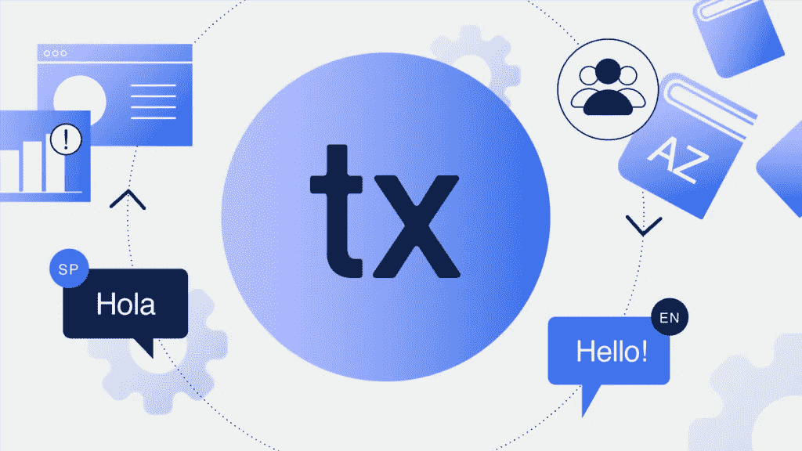
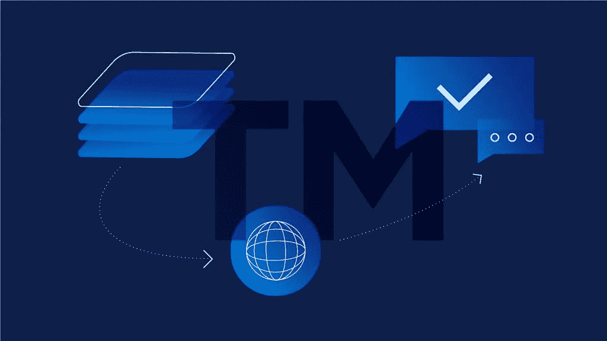
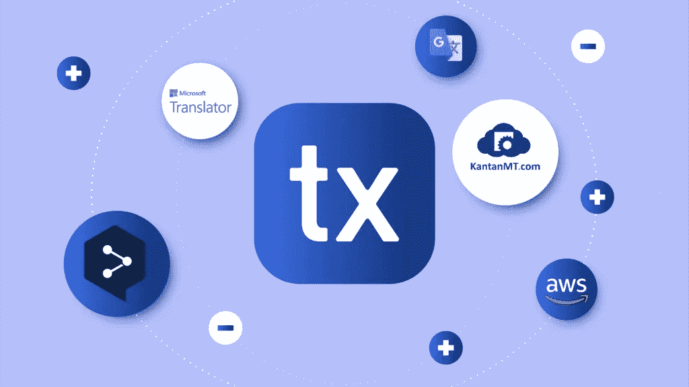
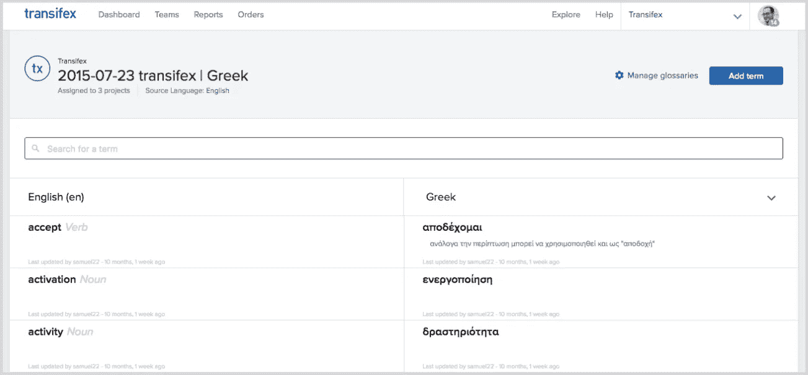
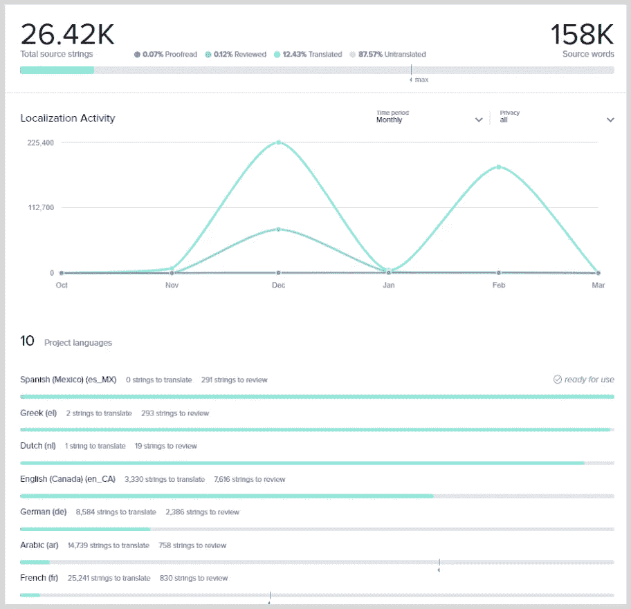
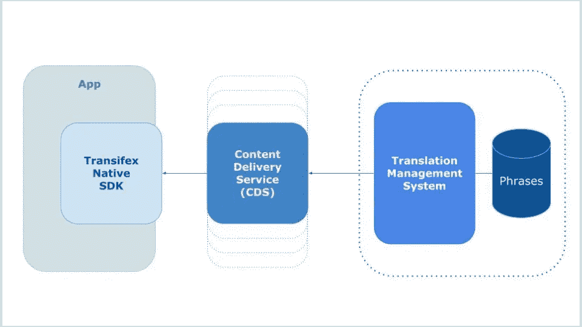
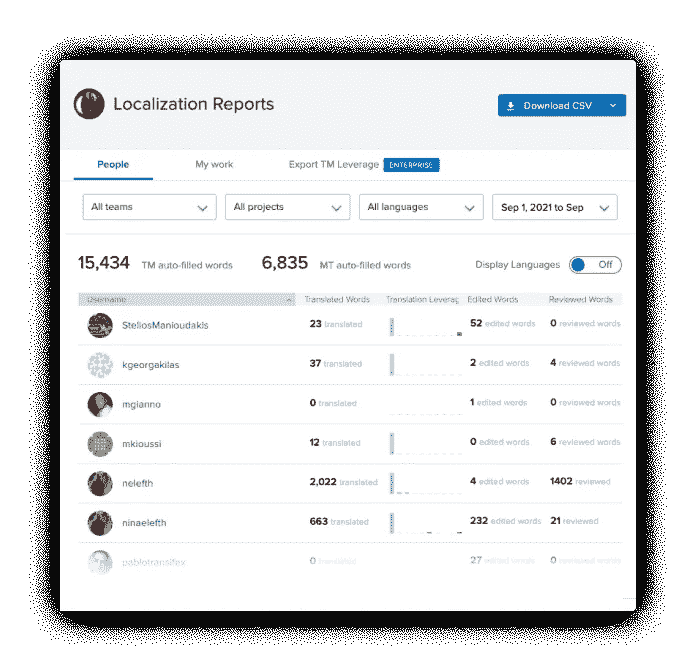

# 本地化工具:本地化经理的十大选择

> 原文：<https://medium.com/geekculture/localization-tools-top-10-picks-for-localization-managers-a394e5f3f702?source=collection_archive---------15----------------------->

在没有任何软件帮助的情况下快速完成[本地化过程](https://www.transifex.com/blog/2018/software-localization-process/)变得越来越困难。这就是本地化工具的用武之地，它可以让您的全球扩张任务更容易、更成功。

您可以使用它们更快、更有效地进行本地化，同时使您的生活更加轻松并减少开支。

# 什么是本地化工具？

本地化工具是可以用来翻译和/或本地化某些东西的软件。这可能是任何东西，从文档到[应用](https://www.transifex.com/blog/2021/app-localization/)或网站。

但这不仅仅是完成工作。这也是为了让它更容易、更快、更有效，同时也让你能够更好地做你所做的事情，不管你的角色是什么。

当然，这是一个非常宽泛的概括，因为有很多不同的工具可以帮助不同类型的专业人员，从翻译到经理和开发人员。

这就是为什么每家公司要么需要工具的组合来帮助其团队蓬勃发展，要么需要一个本地化和内容管理平台，在一个包中提供一切，这可以说是理想的解决方案。

抛开这些不谈，以下是我们的 10 大精选！

# 1:翻译/内容管理系统

在翻译软件出现之前，翻译人员和管理人员过去常常手动跟踪翻译和字符串。您可以通过文档、电子表格或您能想到的任何定制解决方案来实现这一点。

如果你以前以这种方式工作过，你就会知道这是一个具有挑战性的工作流程。即使像跟踪需要翻译的内容和已经完成的内容这样简单的事情也成为一种挑战；尤其是当你在处理大型项目的时候。

现代[翻译管理系统](https://www.transifex.com/blog/2021/what-is-a-translation-management-system/)通过在一个包中提供各种解决方案来帮助您解决这一挑战。解决方案，例如:

*   [内置团队协作工具](https://www.transifex.com/features/team-management/)
*   [自动推送&拉动请求](https://www.transifex.com/native/)
*   用于[注释](https://docs.transifex.com/translation/tools-in-the-editor)和[上下文](https://docs.transifex.com/translation/tools-in-the-editor#section-details-&-context-for-translators)或视觉上下文的专用空间

还有更多。事实上，我们将在本指南中提到的所有本地化工具都是 Transifex 附带的。

在过去，这些大多是在计算机辅助翻译软件(CAT)中发现的。

但是，如今，翻译管理系统通常既可以充当 CAT，也可以用于翻译管理和内容管理。

# 2:翻译记忆库

不得不一次又一次地翻译同一个单词/短语对每个人来说都是浪费时间。项目越大，你不得不这么做的几率就越高。

[翻译记忆库](https://www.transifex.com/blog/2021/translation-memory-software/)通过检测已完成的翻译是否与您必须完成的另一个翻译相同来解决这一问题。之后，你要么得到一个建议，自动填充该翻译，要么让翻译记忆库自动填充相同的翻译，而不必动一根手指。

这两个选项都是可行的，具体取决于您要本地化的内容以及如何使用翻译记忆库。

所以，简而言之，TM 是一个自动为你完成相同翻译的本地化工具。强调“一模一样”。与机器翻译不同，TM 需要您从以前的翻译中输入信息才能工作。

# 3:机器翻译

当我们说[机器翻译](https://www.transifex.com/blog/2021/what-is-machine-translation/)时，我们指的是谷歌翻译、 [DeepL](https://www.transifex.com/blog/2021/deepl/) 等工具。

我们知道你在想什么。诸如此类的本地化工具还不足以取代翻译人员，这是事实。但这不是他们的首要目的！

机器翻译应该是第一稿。你有工作可做，总比什么都没有好。

如果你有成千上万的字符串要翻译，即使机器翻译只能正确翻译 1%，这是一个保守的说法，你只需按一下按钮，就可以自动完成一百多种翻译！

所以，从长远来看，MTs 可以节省大量的时间和精力。尤其是在更大的项目上。

# 4:质量保证工具

即使是最好的翻译也会出错。我们都是人，这就是为什么在翻译和本地化项目中质量保证是必须的。

在使用本地化工具之前，您别无选择，只能手动检查每一个翻译，以确保可以进行。

令人欣慰的是，我们现在有太多的软件属于这一类别，来自动化这个过程，并帮助我们找出更多的错误。我们谈论的软件包括:

*   自定义翻译检查
*   [卫莱质量保证](https://docs.transifex.com/transifex-integrations/lexiqa)
*   [标签](https://www.transifex.com/features/translation-quality-and-speed/)
*   翻译下的注释
*   视觉环境(稍后会详细介绍)
*   字符限制

以及更多您可以在 Transifex 中找到的功能。

在所有的质量保证工具中，如果我们必须选择一个最重要的，那将是为所有需要翻译的内容留下评论/上下文的选项。

语境在翻译中至关重要，在本地化中更是如此。专家需要知道他们在处理什么。

这是因为在大多数语言中，一个单词可以有多种含义。以简单的希腊语“嗨”为例。

根据这个词在哪里使用，翻译可能是完全不同的结果。这是因为不像英语中的“嗨”只是一种问候，希腊语中的“Geia”也可以用来表示离别。

这意味着，如果译者不知道这个词的上下文，无论他们多么优秀和有经验，他们都很有可能翻译错误。

# 5:词汇表

一种语言通常有多个术语，可以用来描述同一种情况。语调很重要，这取决于您要本地化的地区和/或行业。

翻译人员在开始工作之前需要了解这些信息。所以，问题是:让他们知道这件事最有效的方法是什么？

理想情况下，您希望翻译人员在一个地方拥有他们需要的一切。这就是术语表作为软件的用武之地！

在 Transifex 中，词汇表与“自定义翻译检查”QA 工具集成在一起。这意味着，如果翻译人员没有按照他们应该做的那样遵循术语表，他们要么会收到警告，指出他们的翻译没有遵循术语表指南，或者您甚至可以设置它，以便他们在正确完成之前无法保存翻译。

因此，一个适当设置的术语表与翻译管理系统相结合，可以节省您大量的精力和时间，同时使整个团队的协作更加容易。

# 6:文件管理

随着巨大的全球扩张，随之而来的是巨大的内容管理责任。每个本地化专家都需要一个针对[本地化相关文件](https://docs.transifex.com/formats/introduction)的解决方案，无论是源和翻译后的字符串导出还是图像、视频字幕等。

大多数人依赖云平台，如 [Google Drive](http://drive.google.com) 。这对于大多数类型的文件和保护重要内容的安全非常有用。

然而，下载、[上传](https://docs.transifex.com/projects/uploading-content)，以及最重要的，编辑包含字符串的文件，是一项随着产品的扩展而变得越来越复杂的任务。

这是翻译管理软件的另一大用途。这是因为一些翻译软件工具，如 Transifex，不仅仅是为了管理翻译。它们还可以有效地作为满足您本地化需求的内容管理解决方案。

整个上传/下载过程仍然存在，但是定位、编辑和管理文件，一般来说，使用本地化软件变得容易多了。

除非您使用无文件解决方案，比如 Transifex Native。以下是更多相关信息。

# 7:无文件本地化 SDK

本地化中的文件管理长期以来一直是一项单调乏味的任务。不仅对于那些管理文件和字符串的人，而且对于需要应用任何更改的开发人员。

一个相对较新的解决方案是[的无文件工具](https://docs.transifex.com/formats/fileless)，比如[的 Transifex Native](https://www.transifex.com/native/) 。

与名字所暗示的不同，无文件并不意味着你没有任何文件。您仍然需要上传包含字符串的文件。

但它真正实现的是，它消除了在翻译管理软件和您的产品之间不断下载和上传文件的需要。

此外，从长远来看，它还消除了参与发展的必要性。

实现这一点的方法是在代码堆栈中插入 SDK。这段代码允许您的产品与翻译管理软件无缝同步，这意味着您所做的任何更改或翻译都将自动传输到您的应用程序或网站。

因此，在一天结束时，您会得到一个工作流程，您所要做的就是管理翻译，而不必担心文件管理和开发人员。

# 8:用户管理

本地化一个网站或应用程序不仅仅是管理文件和翻译或本地化。本地化也需要你管理人。可能是翻译人员、审核人员、开发人员、协调人员或项目维护人员。

Slack 显然是我们大多数人首先想到的工具之一。虽然它在沟通方面做得很好，但在按角色划分人员方面并没有提供太多帮助。你需要别的东西来使这项工作更容易。

用于本地化的独立用户管理工具不容易找到。所以，你可能想再次选择本地化管理工具，因为他们有内置的用户管理工具。

使用角色和权限的内置用户管理的一个最重要的原因是，您不希望每个人都能够管理项目和完成翻译。每个角色都有自己要坚持的部分。

# 9:分析/绩效报告

理想情况下，每个人都希望对自己的进展有一个清晰的印象，尤其是管理员、项目维护人员和评审人员。

手动处理像工作表这样的东西是一项非常具有挑战性的任务。这就是为什么一个自动化的软件是非常有用的。

例如，Transifex 带有内置的性能报告和监控工具，您可以使用这些工具始终准确地了解您所处的位置。

# 10:集成

如今，我们大多数人使用过多的工具来完成工作。有不同的工具用于沟通、项目管理等。

因此，当你需要一个本地化工具时，你会希望它能与你的大部分程序无缝地结合。

比如说，你有 Transifex 来翻译你的内容，有 Slack 来交流。在这种情况下，您可以使用[transi fex+Slack integration](https://www.transifex.com/slack-integration/)，这样当一个翻译准备好被审阅时，审阅者将自动得到 Slack 内部的通知。

如果你选择的本地化工具不提供与你使用的软件的本地集成，你也可以看看 [Zapier](https://www.transifex.com/integrations/zapier/) 。

Zapier 让你可以选择在两个或更多的应用程序之间自动操作。因此，这是创建集成的一种方式，而您选择的软件本身并不具备这种集成。

# 包扎

这些是我们挑选的十大本地化工具。总结一下:

1.  翻译/内容管理系统:TMS 是存储和管理翻译的最基本的工具之一。
2.  **翻译记忆:**厌倦了必须翻译同一个单词/句子？然后关注翻译记忆。
3.  **机器翻译:**Google Translate 等机器翻译工具完全自动化翻译。他们不如翻译，但作为一个起点是不错的。
4.  **QA 工具:**质量保证是本地化的必备条件。虽然有很多 QA 工具，但是在 TMS 和“上下文”下检查翻译的选项是两个绝对要注意的。
5.  词汇表:作为一个本地化工具，词汇表包含了从一种语言到另一种语言的所有常用术语。
6.  **文件管理:**文件管理解决方案通常与 TMS 密切相关。如今，从本地化的角度来说，已经越来越难分辨两者的区别了。
7.  **无文件本地化 SDK:** 无文件解决方案使您能够通过无线方式执行更新，这对于本地化经理和开发人员来说都是一件好事。
8.  用户管理:与这么多不同类型的人一起工作，仅仅用通讯工具来管理他们是一个挑战。解决方案是本地化的用户管理工具。
9.  **分析/绩效报告:**正如一句流行的名言所说，“你不能改进你没有衡量的东西。”这也适用于本地化。所以，一个衡量你表现的本地化工具是必须的。
10.  **集成:**确保您的本地化工具能够与其他服务很好地协同工作是一个很好的实践。当他们不这样做时，像扎皮尔这样的人也许值得关注。

本文为[原载于本页](https://www.transifex.com/blog/2022/localization-tools/)！