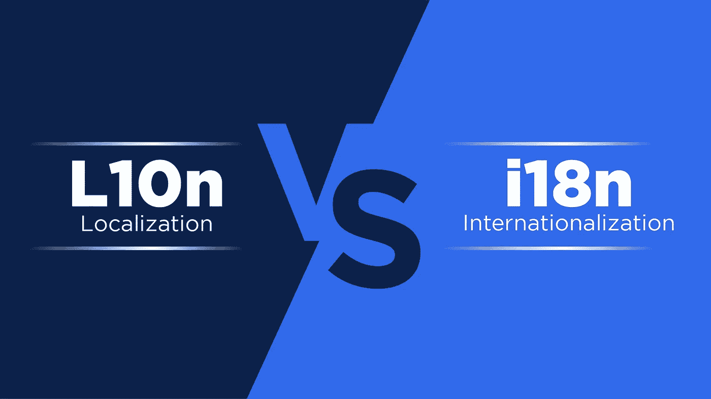
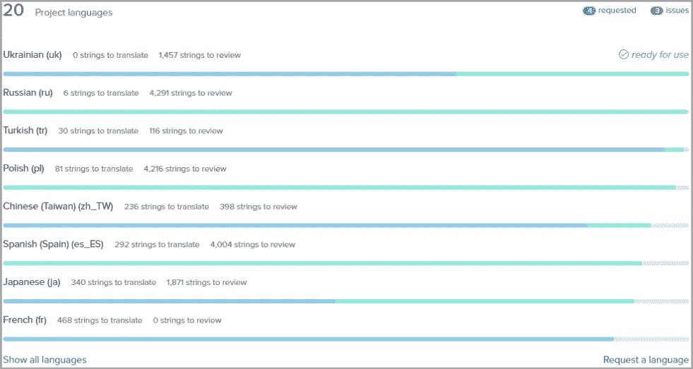

# 本地化与国际化:L10N 与 i18n 比较

> 原文：<https://medium.com/geekculture/localization-vs-internationalization-l10n-vs-i18n-comparison-b818718b81e1?source=collection_archive---------5----------------------->

谈到本地化过程，最常被问到的问题之一是本地化和国际化之间的区别。换句话说，从字面上看，这也被称为 L10N VS i18n。

简而言之，这就是它们之间的区别以及每个过程所指的内容！

# 本地化(L10N)

[本地化](https://www.transifex.com/blog/2021/what-is-localization/)就是让你的产品、平台或内容更适合某个地区。这一过程通常包括:

*   翻译内容
*   调整它的音调
*   多媒体本地化
*   添加当地货币
*   使用本地测量单位

以及更多，这取决于您想本地化什么以及如何本地化。例如，美国、加拿大、英国和澳大利亚都使用英语。

然而，尽管使用相同的语言，美国和英国在文化、词汇、发音，甚至有时在如何造句方面有很大的不同。

英国有运动鞋，美国有运动鞋。这也适用于裤子对裤子，背心对背心，衣柜对衣柜，垃圾对垃圾，玉米对玉米等。

然而，实际上，在差异巨大的地区，您更有可能费心进行本地化。把英语想成法语、俄语、日语、汉语等。

[但是，不要将本地化与翻译或口译混淆](https://www.transifex.com/blog/2021/what-is-localization/#Translation_and_Interpretation)。值得强调的是，上面提到的一切都只是本地化的一部分。归根结底，本地化涉及到一切可以帮助您在特定地区更好地工作，甚至避免灾难的事情。

例如，在希腊，挥手会被误认为是一种冒犯的手势。这意味着，如果你有一个有人挥手的广告，你可能必须在希腊为你的活动使用不同的图像，这被认为是本地化，根本不涉及翻译。

# 软件本地化:如何完成？

本地化世界中另一个非常常见的表达是“软件本地化”。

顾名思义，软件本地化就是将您的软件本地化。至于[做那个](https://www.transifex.com/blog/2015/software-localization-guide/)的步骤，基本的是:

1.  从软件中提取您的资源文件
2.  将它们上传到[您选择的 TMS](https://www.transifex.com/blog/2021/what-is-a-translation-management-system/)(或者选择[无文件解决方案](https://www.transifex.com/native/))
3.  通过 TMS 翻译和检查你的字符串
4.  将翻译后的字符串拉回到应用程序中
5.  用翻译后的版本测试你的软件，以确保一切正常

当将翻译后的字符串放回应用程序时，如果您没有使用翻译管理系统(TMS ),或者使用了一个不好的系统，您还必须将翻译后的文件正确地复制到您的代码结构中。

另一方面，一个合适的 TMS 给了你准备在软件中使用的资源。这与一个好的 API 结合在一起，可以节省几个小时的工程时间。

# 国际化(i18n)

[软件国际化](https://www.transifex.com/blog/2021/what-is-internationalization-i18n-in-software)就是你要为本地化做的所有准备，主要是在编码方面。如果您不为本地化准备您的软件，不仅您会遇到许多问题，而且您可能实际上根本无法本地化！

国际化最常见的例子之一是字符限制。在本地化你的网站、应用程序或任何类型的内容之前，你必须[确保翻译的文本不会破坏任何东西](https://www.transifex.com/blog/2021/3-common-localization-issues-translators-face-how-to-solve-them/#Localization_Issue_1_Breaking_the_User_Interface)。毕竟，不同的翻译有不同的长度，你必须记住这一点。

除了句子长度，不要忘记启用对以下内容的支持:

*   日期格式
*   阅读顺序
*   杂项字符，
*   货币形式
*   这样的例子不胜枚举

最后，但并非最不重要的一点是，留意那些可能导致应用程序崩溃的意外情况是值得的。以 Apex Legends 这个游戏为例，事实证明使用某个表情符号的[会让程序](https://twitter.com/GamingMerchant_/status/1471756771500851200?ref_src=twsrc%5Etfw%7Ctwcamp%5Etweetembed%7Ctwterm%5E1471756771500851200%7Ctwgr%5E%7Ctwcon%5Es1_&ref_url=https%3A%2F%2Fwww.dexerto.com%2Fapex-legends%2Fapex-legends-players-break-the-game-by-adding-emojis-to-usernames-1723144%2F)崩溃。

# 本地化与国际化:总结

总结 L10N 与 i18n 的区别:

1.  本地化(L10N):使您的产品/内容适应特定的地区，以获得最佳性能和全球增长
2.  国际化(i18n):根据本地化软件准备您的产品/内容，以便您能够本地化它(应用程序框架、其他语言的文本规划、考虑全球扩展的编码等)

看，如果你一步一步来，本地化不一定很难[。](https://youtu.be/syGcdXFKSgQ)

[本文最初发表于本页。](https://www.transifex.com/blog/2021/localization-vs-internationalization-l10n-vs-i18n/)