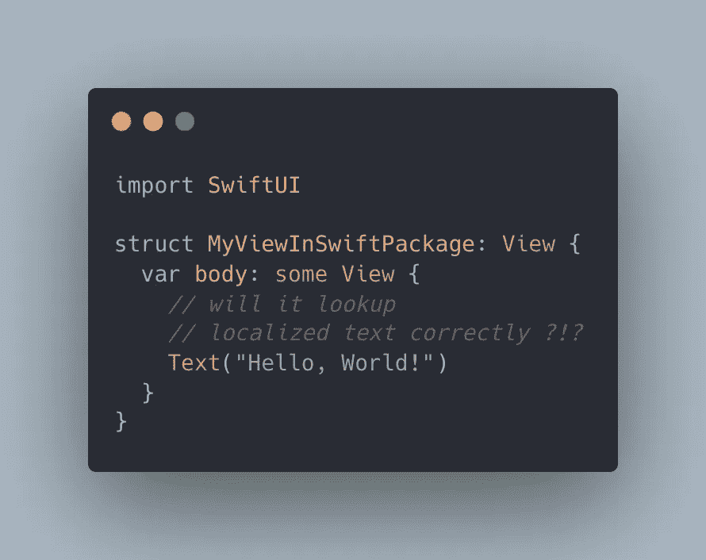

# Swift 包中的本地化 SwiftUI 视图

> 原文：<https://medium.com/geekculture/localized-swiftui-views-in-a-swift-package-b0e649bb39af?source=collection_archive---------9----------------------->



字符串文件包含一种语言的面向用户的本地化字符串的翻译，并带有可选注释。字符串文件中每个字符串的语法是一个键-值对，其中`key`是查找包含翻译的`value`的标识符。

```
/* A friendly greeting. */
"Hello, World!" = "Hallo, Welt!";
```

几种 SwiftUI 类型的初始化器——比如`Text`、`Toogle`、`Picker`等——在提供字符串文字时隐式查找本地化的字符串。

```
Text("Hello, World!") // you might expect that it will show "Hallo, Welt!"
```

**如果您在 Swift 包中使用这些 SwiftUI 类型，这种隐式查找将不起作用！**

如果用字符串文字初始化 SwiftUI `Text`视图，该视图将使用`[init(_:tableName:bundle:comment:)](https://developer.apple.com/documentation/swiftui/text/init(_:tablename:bundle:comment:)`初始化器，该初始化器将字符串解释为本地化键，并在您指定的表中搜索该键，如果您没有指定，则在默认表中搜索该键。更重要的是，如果你不指定，它将使用`Bundle.main`。

```
Text("Hello, World!") // Shows "Hello, World!" as it searches the default table in the main bundle.
```

在构建您的 Swift 包时，Xcode 将每个目标视为一个 Swift 模块。如果目标包含资源，Xcode 会在`Bundle`上创建一个资源包和一个内部静态扩展来访问每个模块。您必须使用这个扩展`Bundle.module`来定位包资源。

```
Text("Hello, World!", bundle: .module) // Shows "Hallo, Welt!" :)
```

并非所有 SwiftUI 类型都有如此灵活的初始化器。`Button`视图有一个期望有`LocalizedStringKey`的初始化器，并且将通过`Bundle.main`在`Localizable.strings`文件中查找文本，而没有指定不同包的选项。

然后你必须使用其他的初始化器(如果可能的话)

```
Button(action: { print("Label shows 'Hallo, Welt!'") }, label: { Text("Hello, World!", bundle: .module) })
```

或者直接查找本地化的文本

```
Bundle.module.localizedString(forKey: "Hello, World!", value: nil, table: nil)
```

该语句占用大量空间，可以通过在`Bundle`上引入扩展来改变

```
extension Bundle {
  func localizedString(forKey key: String) -> String {
    self.localizedString(forKey: key, value: nil, table: nil)
  }
}
```

以及`String`上的扩展

```
extension String {
    var localizedString: String {
        Bundle.module.localizedString(forKey: self)
    }
}
```

简洁地获得本地化字符串。

```
Button("Hello, World!".localizedString) { print("Label shows 'Hallo, Welt!'") }
```

给那些想从 Swift 包中生成二进制框架(xcframework)的人一个额外的提示:有必要抽象包访问，因为 Xcode 不会为 xc framework 创建内部静态扩展`Bundle.module`。您可以使用下面的代码片段来实现这一点

```
import Foundationclass BundleLocator {}extension Bundle {
    static var myModule: Bundle {
        #if SWIFT_PACKAGE
            return Bundle.module
        #else
            return Bundle(for: BundleLocator.self)
        #endif
    }func localizedString(forKey key: String) -> String {
      self.localizedString(forKey: key, value: nil, table: nil)
  }
}extension String {
    var localizedString: String {
        Bundle.myModule.localizedString(forKey: self)
    }
}
```

*最初发布于*[*https://blog . eidinger . info*](https://blog.eidinger.info/localized-swiftui-views-in-a-swift-package)*。*