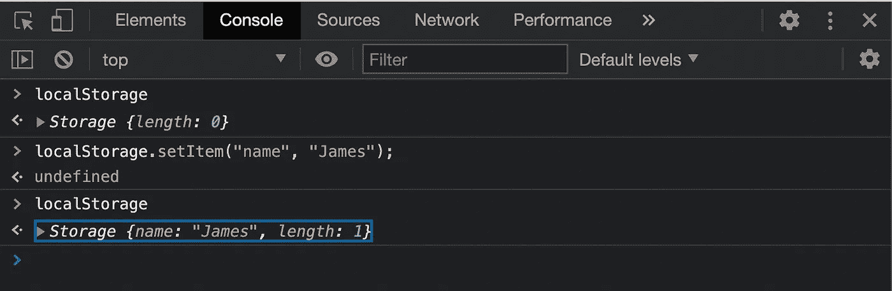
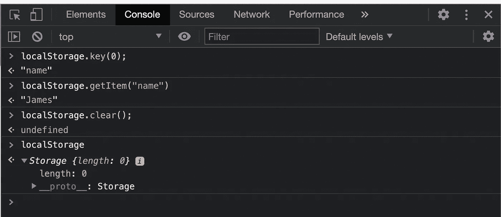

# 本地存储很酷，但要注意如何使用它。

> 原文：<https://medium.com/geekculture/localstorage-is-cool-but-be-mindful-how-you-use-it-2fedf02d37e4?source=collection_archive---------5----------------------->

并非所有数据都需要传输到服务器。

如果你是亚马逊，你在你的服务器上存储了大量关于你销售的每一个产品的信息，你真的想存储每个用户访问你的网站时的偏好信息吗？比如说，他们说什么语言，是喜欢亮模式还是暗模式，他们在购物车里放了什么但还没有承诺购买，等等。？大概不会。服务器已经在忙于处理事务、发送信息等等，它不需要让这些小信息过载。Cookies 已经存在很久了，用来存储这样的信息，但是 cookies 的问题是信息仍然存储在每个服务器请求中，而且 cookies 的存储空间有限。不适合强调更好的客户端定制和交互的更现代的 web 体验。于是本地存储诞生了。

# 什么是 LocalStorage？

很简单，这是一种客户端存储的形式！它主要用于存储不需要传输到数据库的信息。这是一个纯粹与 JavaScript 网站相关的特性，它将信息作为一个 JavaScript 对象存储在键/值对中。信息只能保存为字符串，所以不要尝试太花哨的东西。



Console in Chrome DevTools (Option⌥ +Command⌘ + I)

## 本地存储方法。

1.  )`[setItem();](https://developer.mozilla.org/en-US/docs/Web/API/Storage/setItem)` —如何在浏览器中建立键/值对。
2.  )`[getItem();](https://developer.mozilla.org/en-US/docs/Web/API/Storage/getItem)` —如何检索这些键/值对之一
3.  )`[removeItem();](https://developer.mozilla.org/en-US/docs/Web/API/Storage/removeItem)`—如何删除键/值对
4.  。)`[key();](https://developer.mozilla.org/en-US/docs/Web/API/Storage/key)` —显示给定索引号的键名
5.  )`[clear();](https://developer.mozilla.org/en-US/docs/Web/API/Storage/clear)` —这将清除本地存储中存储的所有密钥。

# 本地存储的重要特征

LocalStorage 的最大好处是可以使用它存储的数据量(5mb！虽然这是有争议的，[理论上可能更多。](https://www.w3.org/TR/webstorage/#disk-space))，同时也非常易于使用。cookies 最大为 4KB，LocalStorage 可以容纳大量信息。这可能是一件好事，也可能是一件坏事，取决于你如何利用它。在有些情况下*可能*你想要`JSON.stringify()`一些数据，但是授权令牌或用户会话数据**永远不要**在本地存储中使用，因为它 ***不安全。如果你不希望信息被公开共享，它就不应该被存储到 LocalStorage。它被设计成将键/值对作为字符串保存，而不是存储安全数据！然而，如果你想在介质上保存一篇文章或存储一个故事的草稿，LocalStorage 非常适合这类信息(除非你正在写下一部热门小说，不想让它泄露)！***



localStorage.length returns the amount of items stored.

另一件要注意的事情是 LocalStorage 永远不会过期。这在很多方面都是有益的，尤其是当客户反复访问同一个网站时。然而，除非手动完成，否则存储在 LocalStorage 中的任何数据都不会被清除。这意味着，如果你去 ibuysocks.com(不是一个真正的网站)并且他们在 LocalStorage 中存储数据，即使你再也不回去从那个域购买一双袜子，他们存储的数据仍然会保存在你的浏览器中。

> 有趣的事实:localStorage 保存在用户配置文件的 SQLite 文件中。对于 mac:

```
~/Library/Application Support/Google/Chrome/Default/Local Storage
```

# 会话存储

会话存储具有与 LocalStorage 相同的所有方法，但是，此信息仅存储到浏览器关闭为止。同样，这有很多好处，但它仍然缺乏很多安全性，即使是临时存储信息。

# 总体而言:

LocalStorage 的目的是帮助使单页 web 应用程序更加动态，并帮助卸载一些在服务器和客户端浏览器之间传输的信息。取决于如何使用，它可能非常有用，但一定要考虑存储的数据是否是关键信息。如果敏感信息或数据更适合存储在服务器中，那么就不应该存储在本地或会话存储中。但是，如果您希望您的用户能够切换亮模式或暗模式，并保持这种状态，那么 LocalStorage 是一个不错的选择！