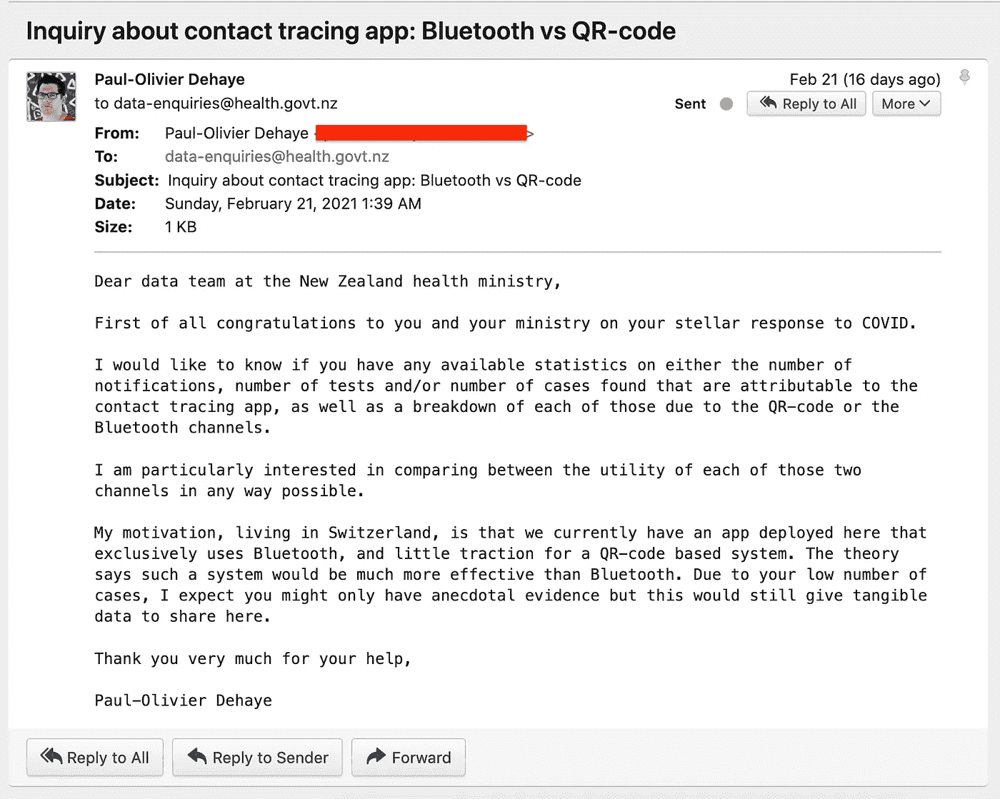
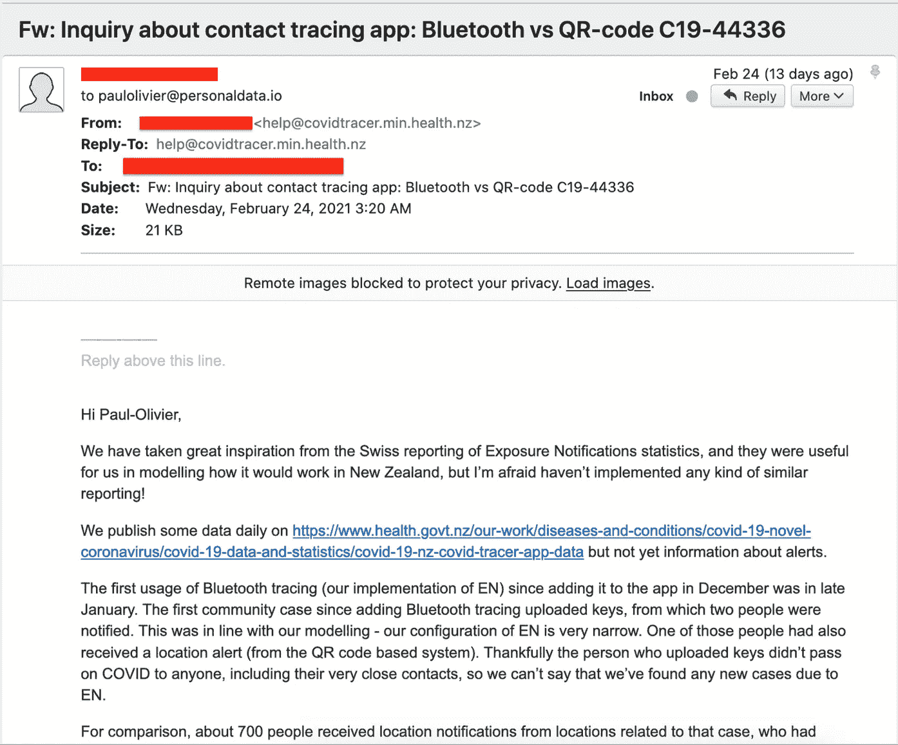
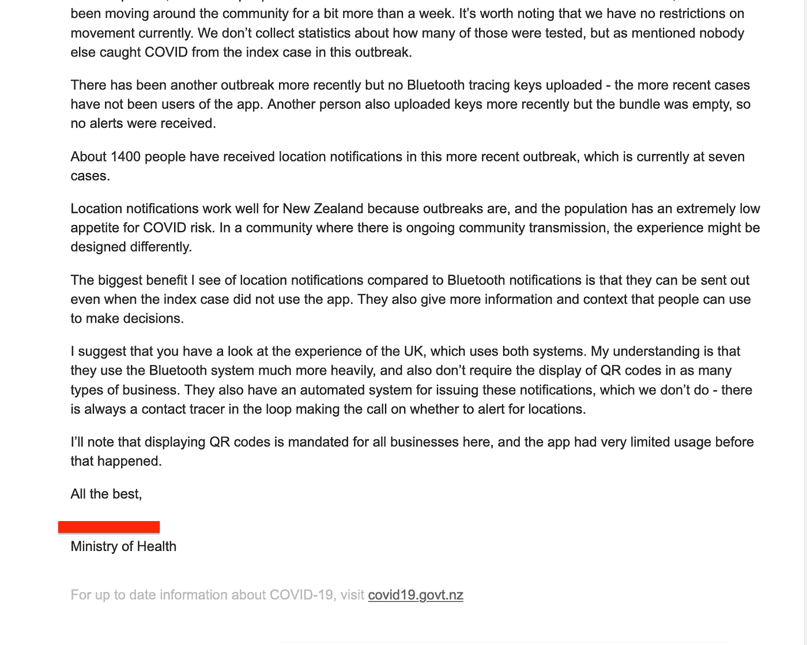
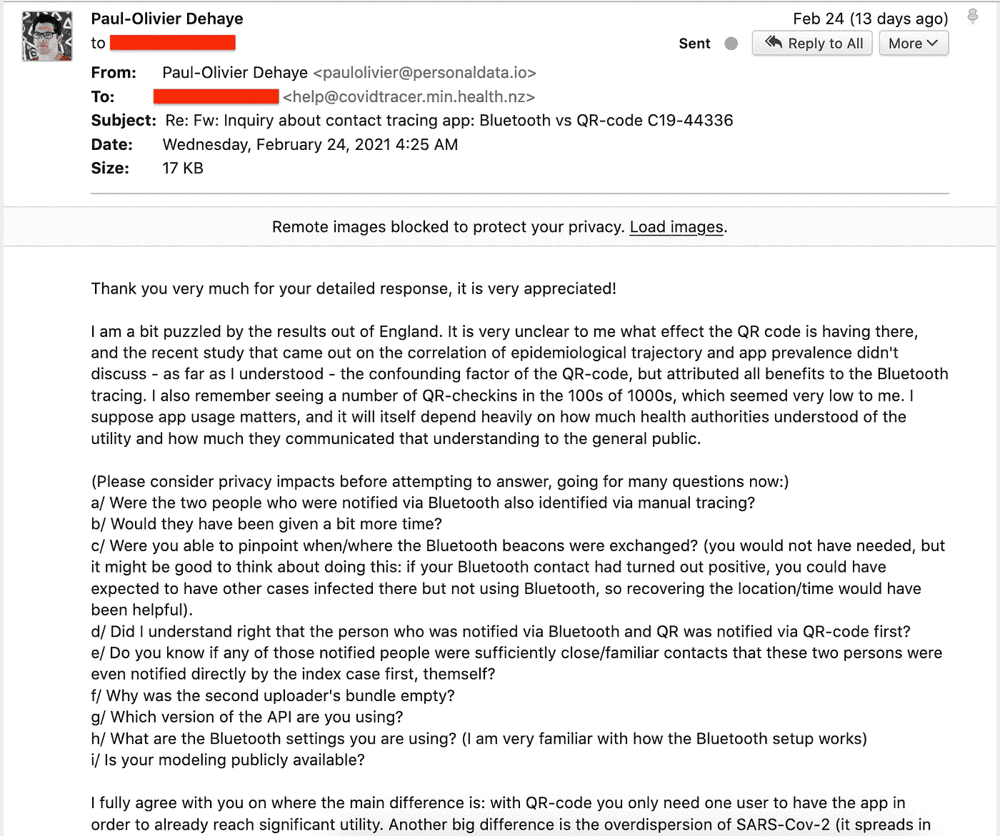
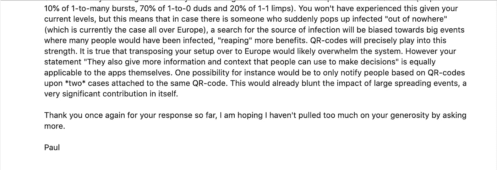
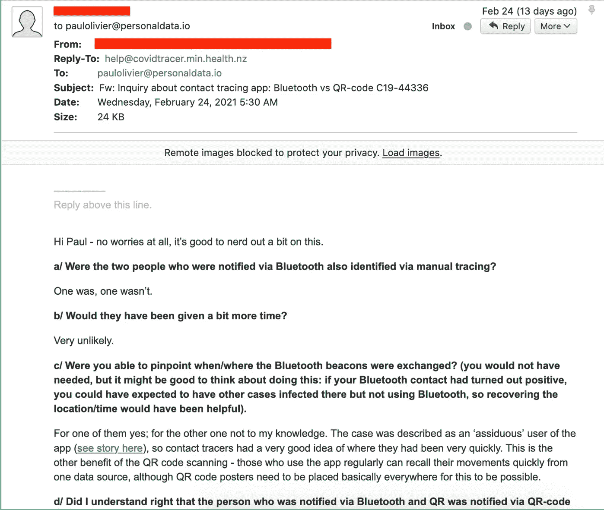
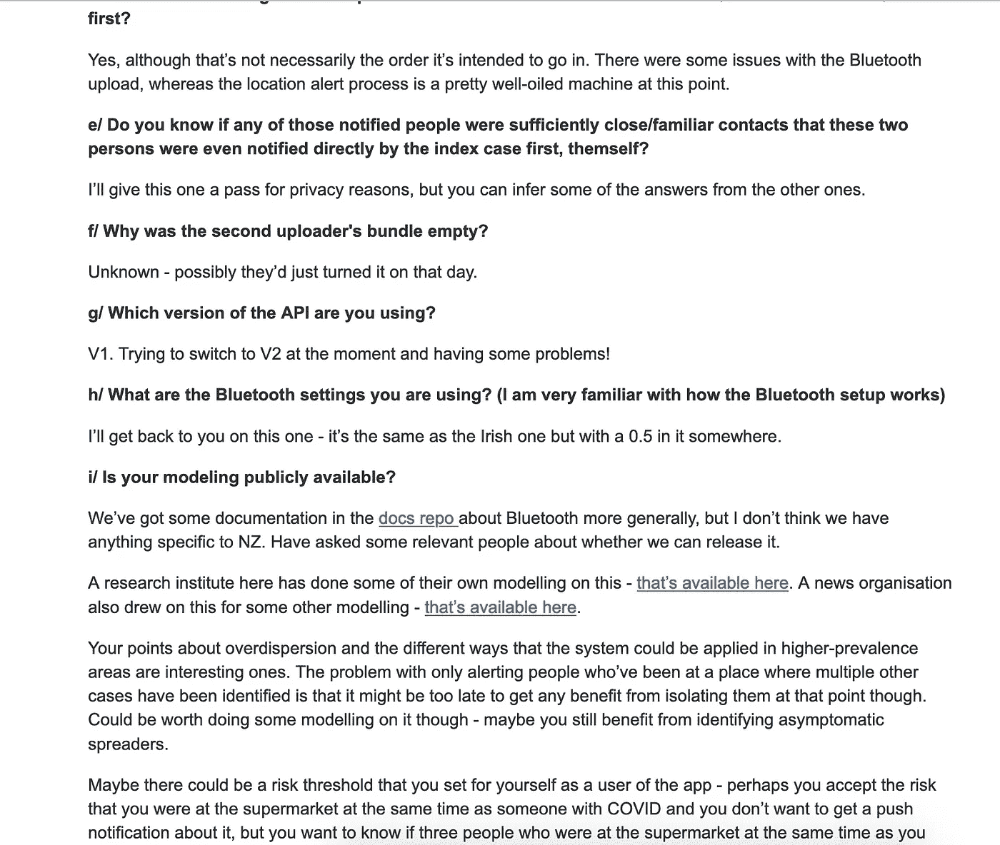
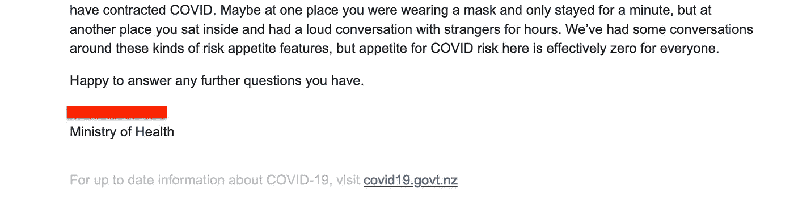
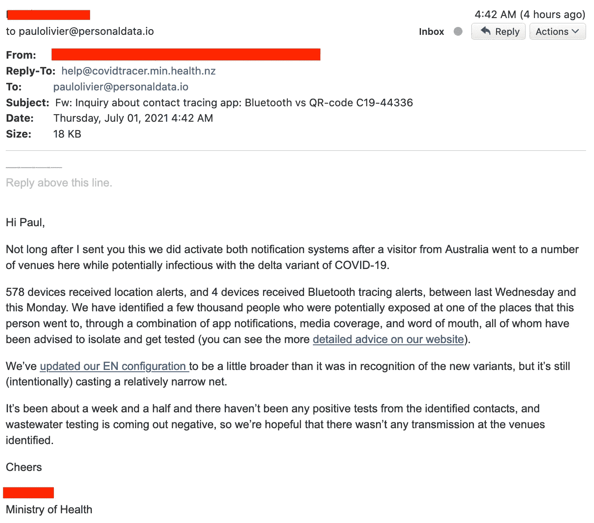

# 基于场所的追踪:来自新西兰的一些启示

> 原文：<https://medium.com/geekculture/location-based-tracing-some-insights-from-new-zealand-17a2e9295957?source=collection_archive---------20----------------------->

欧洲一直坚持使用与蓝牙相关的数字方法来追踪联系人。新西兰同时使用蓝牙和二维码已经有一段时间了，最近也有一些案例。第一个是一个专门的应用程序用户，所以她提供了一个现实生活中的测试案例，在这个环境中，我们可能会学到很多关于应用程序功能的知识。鉴于瑞士无法摆脱蓝牙/SwissCovid 的思维定势，我向新西兰卫生局提出了信息自由请求，以了解更多信息。

我首先附上了交流的截图(我觉得这样读起来更好)，然后做了一些评论，然后把邮件正文粘贴成文本。

# 截屏

## 我最初的请求

## 他们的第一反应

## 我的跟进问题

## 他们的第二个反应

# 评论

简而言之，我们知道这个病例没有感染任何人。通过蓝牙有两个通知。我推断两个蓝牙通知中至少有一个很可能没有追踪到位置(因此很可能不是已知的联系人)。另一个是通过蓝牙和二维码追踪的。有 700 个二维码通知。

这 700 份通知可以说是铺天盖地，因为它们只对应一个案例。在评估这个数字时，我认为需要考虑几个因素:1/这相当于“正常生活”:新西兰当时没有被封锁 2/这并不意味着每个人都应该去接受测试。建议可能是提高注意力，如果你被检测为阳性，一定要告知追踪人员这份通知的出处。3/将有与通知相关的集群效应，这可能导致更强的逻辑:“如果你在足够短的时间内收到两个 QR 通知，*肯定*做测试”(更容易实现这些，因为 QR 通知比蓝牙跟踪具有更明确的现实意义)。

这里有一个思考这个数字的方法。想象一下，在一个拥有 10 万居民的城市里，每个人都会像那样勤奋地使用二维码应用。想象一下，如果在过去的 14 天里，你平均有 50%的机会收到通知，那么二维码通知就非常有用。那么那就对应每天 100000/700/14/2~ 5 例。

其他一些值得注意的因素:

*   纽西兰主动通报病例出现的地方(虽然[他们不会通报*所有*的地方](https://twitter.com/TheProject_NZ/status/1354684010803257346?s=20))；
*   因为前面一点，如果只有一方使用 app，二维码已经可以派上用场了；
*   新西兰人对 Covid 风险没有兴趣(*即*教育是关键，正如[之前在重新分析瑞士 COVID 数据](https://pdehaye.medium.com/lies-damn-lies-and-swisscovid-a9c14e61b9ab)时指出的那样)
*   由于新西兰的情况(发生率非常低)，本文仅在向前追踪的情况下比较这两种方法。只有基于位置的追踪才能真正有助于反向追踪——甚至是混合追踪——这是****预计会有更高的流行病学影响，这是由于这种病毒的具体特征。****

# **更新(2021 年 7 月 1 日和 2 日)**

**我问 2021 年 6 月 22 日有什么新鲜事吗？没有新的东西马上出现，但不久之后就有了(也见下文)。**

**提到的两个环节就是这里的[这里的](https://www.health.govt.nz/our-work/diseases-and-conditions/covid-19-novel-coronavirus/covid-19-health-advice-public/contact-tracing-covid-19/covid-19-contact-tracing-locations-interest)和[这里的](https://github.com/minhealthnz/nzcovidtracer-docs/commit/dbe22b370d9b586555fedd2b9198c6fc80b978ae)。**

****

**在我要求澄清确切的层级后，进一步跟进:**

****

# **复制/粘贴**

## **我最初的请求**

> **亲爱的新西兰卫生部数据团队，**
> 
> **首先祝贺你和你的部门对 COVID 的杰出回应。**
> 
> **我想知道您是否有任何可归因于接触者追踪应用程序的通知数量、检测数量和/或发现的病例数量的可用统计数据，以及由于二维码或蓝牙渠道而导致的上述各项的细分数据。**
> 
> **我对以任何可能的方式比较这两种渠道的效用特别感兴趣。**
> 
> **我住在瑞士的动机是，我们目前在这里部署了一个专门使用蓝牙的应用程序，对基于二维码的系统没有什么吸引力。该理论认为这样的系统会比蓝牙更有效。由于你的案例数量很少，我想你可能只有轶事证据，但这仍然会提供切实的数据来分享。**
> 
> **非常感谢你的帮助，**
> 
> **保罗-奥利维尔·德哈伊**

## **他们的第一反应**

> **嗨，保罗-奥利维尔，**
> 
> **我们从瑞士的暴露通知统计数据报告中得到了很大的启发，它们对我们模拟它在新西兰的工作方式很有用，但恐怕我们还没有实施任何类似的报告！**
> 
> **我们每天在 https://www . health . govt . NZ/our-work/diseases-and-conditions/新冠肺炎-novel-coronavirus/新冠肺炎-data-and-statistics/新冠肺炎-nz-covid-tracer-app-data 上发布一些数据，但尚未发布有关警报的信息。**
> 
> **自去年 12 月将蓝牙追踪(我们的 EN 实现)添加到应用程序以来，它的第一次使用是在 1 月下旬。增加蓝牙追踪上传钥匙以来的第一个社区案例，由此通知了两个人。这与我们的建模一致——我们的 EN 构型非常狭窄。其中一人还收到了位置警报(来自基于 QR 码的系统)。谢天谢地，上传钥匙的人没有把 COVID 传给任何人，包括他们非常密切的接触者，所以我们不能说我们发现了任何新的 EN 病例。**
> 
> **相比之下，大约有 700 人收到了与该病例相关的位置通知，他们已经在社区内活动了一周多一点。值得注意的是，我们目前没有行动限制。我们没有收集关于有多少人接受了检测的统计数据，但如前所述，在这次疫情中，没有其他人从指标病例中感染了 COVID。**
> 
> **最近又爆发了一次疫情，但没有上传蓝牙追踪密钥——最近的病例不是该应用程序的用户。另一个人最近也上传了密钥，但是包是空的，所以没有收到警报。**
> 
> **在最近的疫情中，约有 1400 人收到了位置通知，目前有 7 例病例。**
> 
> **位置通知对新西兰来说很有效，因为疫情是可预测的，而且人们对 COVID 风险的偏好极低。在正在进行社区传播的社区中，体验可能会有所不同。**
> 
> **与蓝牙通知相比，我认为位置通知的最大好处是，即使索引案例没有使用应用程序，它们也可以发送出去。他们也给人们更多的信息和背景来做决定。**
> 
> **我建议你看一下英国的经验，这两个系统都用。我的理解是，他们更多地使用蓝牙系统，也不需要在许多类型的业务中显示二维码。他们还有一个自动系统来发布这些通知，而我们没有——在循环中总是有一个联系人追踪器来决定是否发出位置警报。**
> 
> **我要指出的是，显示二维码是这里所有企业的强制要求，在此之前，这款应用的使用非常有限。**
> 
> **祝一切顺利，**
> 
> **XXXXX
> 卫生部**

## **我的跟进问题**

> **非常感谢您的详细回复，非常感谢！**
> 
> **我对英格兰的结果有点困惑。我不清楚二维码在那里有什么影响，最近关于流行病学轨迹和应用程序流行率相关性的研究没有讨论——据我所知——二维码的混淆因素，但将所有好处都归功于蓝牙追踪。我还记得看到一些 QR-check in 在 100 到 1000 之间，这在我看来非常低。我认为应用程序的使用很重要，它本身很大程度上取决于卫生当局对该工具的理解程度，以及他们向公众传达这种理解的程度。**
> 
> **(请在回答之前考虑隐私影响，现在有许多问题:)**
> 
> **a/通过蓝牙通知的两个人也是通过人工追踪确定的吗？**
> 
> **b/会给他们多一点时间吗？**
> 
> **c/您能确定蓝牙信标交换的时间/地点吗？(你可能不需要，但考虑这样做可能是好的:如果你的蓝牙接触结果是阳性的，你可以预期在那里有其他感染病例，但没有使用蓝牙，所以恢复位置/时间会有帮助)。**
> 
> **d/我是否理解为首先通过二维码通知通过蓝牙和二维码通知的人？**
> 
> **e/你知道那些被通知的人中是否有任何人是足够亲密/熟悉的接触者，以至于这两个人甚至是由索引案例首先直接通知的，他们自己？**
> 
> **为什么第二个上传者的包是空的？**
> 
> **g/您使用的是哪个版本的 API？**
> 
> **h/您正在使用的蓝牙设置是什么？(我非常熟悉蓝牙设置的工作原理)**
> 
> **我/你的模型公开了吗？**
> 
> **我完全同意你的观点，主要区别在于:有了二维码，你只需要一个用户拥有这个应用程序，就已经达到了显著的效用。另一个巨大的差异是 SARS-Cov-2 的过度分散(它以 10%的一对多爆发、70%的一对零哑弹和 20%的一对一跛行传播)。鉴于你目前的水平，你不会经历这种情况，但这意味着，如果有人突然“不知从哪里”被感染(目前整个欧洲都是这种情况)，对传染源的搜索将偏向于许多人被感染的大事件，“收获”更多的好处。二维码正好发挥了这一优势。的确，把你的系统移植到欧洲可能会让系统不堪重负。然而，你所说的“它们也提供了更多的信息和背景，人们可以用来做决定”同样适用于应用程序本身。例如，一种可能性是，仅在两个案例与相同的二维码相关联时，根据二维码通知人们。这已经减弱了大型传播事件的影响，这本身就是一个非常重要的贡献。**
> 
> **再次感谢您到目前为止的回复，我希望我没有过多地要求您的慷慨。**
> 
> **保罗**

## **他们的第二个反应**

> **嗨，保罗——别担心，在这方面多花点时间是有好处的。**
> 
> ****a/通过蓝牙通知的两个人也是通过人工追踪确定的吗？****
> 
> **一个是，一个不是。**
> 
> ****他们会得到更多的时间吗？****
> 
> **不太可能。**
> 
> ****你能确定蓝牙信号交换的时间/地点吗？(你可能不需要，但考虑这样做可能是好的:如果你的蓝牙接触结果是阳性的，你可以预期在那里有其他感染病例，但没有使用蓝牙，所以恢复位置/时间会有帮助)。****
> 
> **对其中一个来说是的；另一个据我所知没有。该案例被描述为该应用程序的“勤奋”用户([见这里的故事](https://www.odt.co.nz/news/national/care-alerts-case-traced))，因此接触追踪人员很快就知道他们去过哪里。这是二维码扫描的另一个好处——那些经常使用该应用的人可以从一个数据源快速回忆起他们的运动，尽管二维码海报需要基本上放在每个地方才能实现这一点。**
> 
> ****d/我是否理解为首先通过二维码通知通过蓝牙和二维码通知的人？****
> 
> **是的，尽管这不一定是它的预定顺序。蓝牙上传有一些问题，而位置提醒过程在这一点上是一个非常好的机器。**
> 
> ****e/你知道那些被通知的人中是否有任何人是足够亲密/熟悉的接触者，以至于这两个人甚至是由索引案例首先直接通知的，他们自己？****
> 
> **出于隐私原因，我不考虑这个问题，但你可以从其他问题中推断出一些答案。**
> 
> ****f/为什么第二个上传者的捆绑包是空的？****
> 
> **未知——可能他们只是在那天打开了它。**
> 
> ****g/您使用的是哪个版本的 API？****
> 
> **V1。试图切换到 V2，现在有一些问题！**
> 
> ****h/您正在使用的蓝牙设置是什么？(我非常熟悉蓝牙设置的工作原理)****
> 
> **我会在这一点上回复你——它和爱尔兰的一样，但在某处有一个 0.5。**
> 
> ****我/你的建模公开了吗？****
> 
> **我们在 [docs repo](https://github.com/minhealthnz/nzcovidtracer-docs) 中有一些关于蓝牙的更一般的文档，但是我不认为我们有任何特定于 NZ 的。我问过一些相关人士，我们是否可以发布它。**
> 
> **这里的一个研究机构已经做了一些他们自己的模型——这里有的。一家新闻机构也利用这一点制作了一些其他的模型——这里有的[。](https://www.stuff.co.nz/national/health/coronavirus/124144775/covid19-weve-modelled-thousands-of-outbreak-scenarios-to-show-the-difference-everyone-using-the-covid-tracer-app-makes)**
> 
> **你关于过度分散的观点以及该系统在高患病率地区应用的不同方式很有意思。只提醒那些到过已发现多个其他病例的地方的人的问题是，在那个时候隔离他们可能为时已晚。可能值得做一些建模，也许你仍然受益于识别无症状的传播者。**
> 
> **作为应用程序的用户，您可能会为自己设置一个风险阈值，可能您接受了与 COVID 患者同时出现在超市的风险，但您不想收到推送通知，但您想知道与您同时出现在超市的三个人是否感染了 COVID。也许在一个地方你戴着面具只呆一分钟，但在另一个地方你坐在里面和陌生人大声交谈几个小时。我们已经就这些类型的风险偏好特征进行了一些讨论，但这里每个人对 COVID 风险的偏好实际上为零。**
> 
> **很乐意回答你的任何问题。**
> 
> **XXXXX
> 卫生部**

# **更新(2021 年 7 月 1 日和 2 日)**

> **嗨，保罗，**
> 
> **在我发给你这封信后不久，我们确实启动了两个通知系统，因为一名来自澳大利亚的游客去了这里的一些场所，同时可能感染了新冠肺炎的 delta 变种。**
> 
> **从上周三到本周一，578 台设备收到了位置警报，4 台设备收到了蓝牙追踪警报。我们已经通过应用程序通知、媒体报道和口碑的结合，确定了几千人可能在此人去过的某个地方暴露过，所有人都被建议隔离并接受测试(你可以在我们的网站上看到更详细的[建议)。](https://www.health.govt.nz/our-work/diseases-and-conditions/covid-19-novel-coronavirus/covid-19-health-advice-public/contact-tracing-covid-19/covid-19-contact-tracing-locations-interest)**
> 
> **我们[更新了我们的 EN 配置](https://github.com/minhealthnz/nzcovidtracer-docs/commit/dbe22b370d9b586555fedd2b9198c6fc80b978ae),使之比新版本更宽一点，但是它仍然(有意地)撒了一个相对狭窄的网。**
> 
> **大约一个半星期了，已经确定的接触者没有任何阳性检测，废水检测结果为阴性，所以我们希望在确定的地点没有任何传播。**
> 
> **干杯**
> 
> **XXXXXXX
> 卫生部**

**在我要求澄清确切的层级后，进一步跟进:**

> **嗨，保罗，**
> 
> **通知由卫生部的一个临床小组触发。[你可以在这里看到关于这个的技术细节](https://github.com/minhealthnz/nzcovidtracer-docs/blob/main/docs/functions/contact-alerts.md)。**
> 
> **如果有人测试呈阳性，他们会被邀请将他们的数字日记上传到联系人追踪程序——你可以在这里看到这个过程的。这为联系人跟踪器提供了允许发送通知的位置代码，但是也可以单独查询这些位置代码。这意味着案例不必是应用程序用户才能发送通知，这是位置警报系统比蓝牙追踪系统使用得更多的很大一部分原因。**
> 
> **是否发送特定位置的通知是临床决定，根本不是自动的，并且有效地与日记上传过程分开。人们可能会扫描到一个没有陌生人在场的地方，因此无需通过应用程序发送通知，就有可能联系到该位置的每个人——但即使该记录不用于发送通知，人们拥有该记录并与联系人追踪器分享仍然是有用的，这样他们就可以唤起他们的记忆，知道他们去过哪里，他们和谁在一起。**
> 
> **干杯**
> 
> **XXXXXXX
> 卫生部**