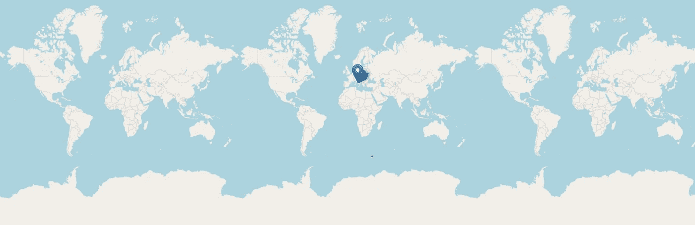
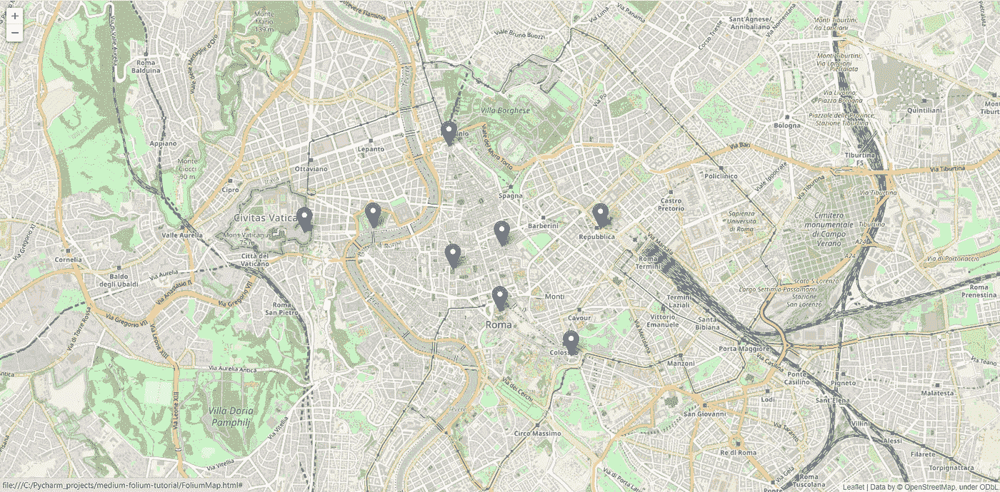
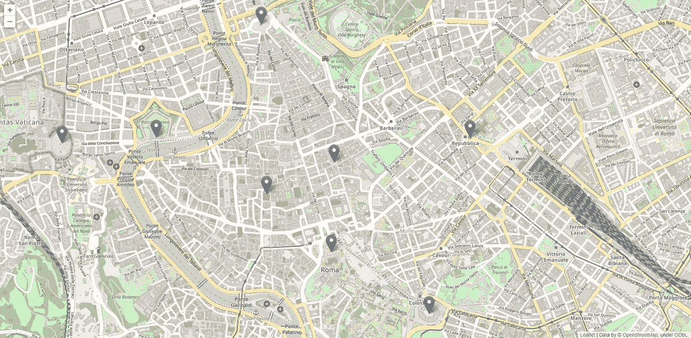
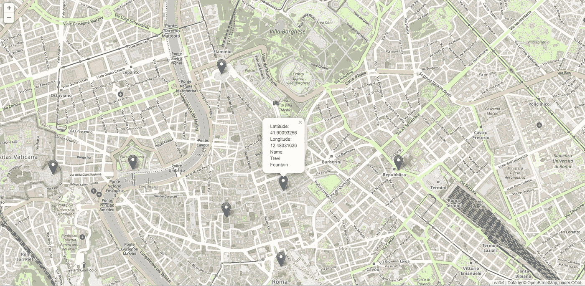

# 用 Python 中的叶子进行位置标记

> 原文：<https://medium.com/geekculture/location-marking-with-folium-in-python-329d0c11fa8b?source=collection_archive---------9----------------------->


Photo by [Timo Wielink](https://unsplash.com/@timowielink?utm_source=medium&utm_medium=referral) on [Unsplash](https://unsplash.com?utm_source=medium&utm_medium=referral)

您是否曾经需要在地图上添加标记来可视化一些数据？别再担心那个了。事实证明，使用 flour 库用 Python 在地图上添加位置标记是相当容易的。关于叶库的官方文档可以在这里找到[。](https://python-visualization.github.io/folium/index.html)

对于本教程，我将假设您已经安装了 Python。所以你需要做的第一件事就是安装叶库。您可以通过执行以下命令来实现这一点:

```
pip install folium
```

差不多就是这样。您已经准备好可视化地图上的标记。所以接下来要做的事情显然是将叶子导入到我们的代码中。

```
import folium
```

所以要开始使用这个库，你需要创建一个叶子地图对象。

```
folium_map = folium.Map()
```

接下来要做的是获得你想要在地图上显示的坐标。出于论证原则的目的，我选择了意大利的几个热门景点，罗马。坐标如下:

```
# Latitude, Longitude
LOCATION_DATA = [
    ("41.90093256", "12.48331626"),
    ("41.89018285", "12.49235900"),
    ("41.89868519", "12.47684474"),
    ("41.89454167", "12.48303163"),
    ("41.90226256", "12.45739340"),
    ("41.90269661", "12.46635787"),
    ("41.91071023", "12.47635640"),
    ("41.90266442", "12.49624457")
]
```

接下来要做的是在地图上用这些位置添加标记。最简单的方法是循环遍历`LOCATION_DATA`列表并将它们添加到 follow _ map 对象中。

```
for cords in LOCATION_DATA:
    folium.Marker(location=[cords[0], cords[1]]).add_to(folium_map)
```

最后一步是将这些信息保存到 html 文件中，该文件可以通过浏览器打开。

```
folium_map.save("FoliumMap.html")
```

现在，如果您将所有内容正确地组合在一起，您的输出应该是“FoliumMap.html”文件。当然，如果您打开这个文件，您会看到与下面提供的视图类似的视图。



Image 1 — View after opening “FoliumMap.html” file in your browser (image by Author)

当然，您可以缩放视图，但一般来说，您希望从一开始就以缩放方式查看视图。实际上，你可以在创建叶子地图对象时这样做。为此，您需要提供`location`和`zoom_start`参数。在这种情况下，我从`LOCATION_DATA`列表和`zoom_start=14`中选择位置作为第一个点，因为这在我的笔记本电脑屏幕上提供了一个很好的视图。

```
folium_map = folium.Map(location=[LOCATION_DATA[0][0], LOCATION_DATA[0][1]], zoom_start=14)
```

如果我们现在运行相同的代码，输出将如下所示:



Image 2 — View after opening “FoliumMap.html” file in your browser when providing initial location and zoom_start parameter (image by Author)

如果你知道你的标记应该在地图上的什么地方，这个方法就足够好了。但是，最好放大到标记自动出现的位置。

# **自动变焦**

事实证明，叶有一个方法，可以帮助自动放大我们的标记所在的区域。那种方法叫做`fit_bounds`。你可以在这里阅读更多相关信息[。](https://python-visualization.github.io/folium/modules.html#folium.folium.Map.fit_bounds)

根据文档，我们需要以经纬度点列表的形式提供西南和东北角。在我们的格式中有了`LOCATION_DATA`，我们可以很容易地得到这些点:

```
south_west_corner = min(LOCATION_DATA)
north_east_corner = max(LOCATION_DATA)
```

剩下的唯一一件事就是在我们的`folium_map`对象上调用`fit_bounds`方法:

```
folium_map.fit_bounds([south_west_corner, north_east_corner])
```

这给了我们如下所示的结果:



Image 3 — View after opening “FoliumMap.html” file in your browser after applying fit_bounds method (image by Author)

# **给标记添加弹出菜单**

当然，在地图上放置一堆标记可能对您有意义，但对其他人没有意义，所以这就是为什么我们应该在标记中添加一些信息——比如纬度、经度和位置名称。为此，我将添加一个新的名单，根据坐标命名的位置。

```
LOCATION_NAMES = [
    "Trevi Fountain",
    "Colosseum",
    "Pantheon",
    "Piazza Venezia",
    "St. Peter’s Square",
    "Mausoleum of Hadrian",
    "Piazza del Popolo",
    "Fountain of the Naiads"
]
```

现在唯一要做的就是将这些信息添加到我们的标记中:

```
for cords, name in zip(LOCATION_DATA, LOCATION_NAMES):
    folium.Marker(location=[cords[0], cords[1]],
                  popup=f"Lattitude:<br>{cords[0]}<br>"
                        f"Longitude:<br>{cords[1]}<br>"
                        f"Name:<br>{name}"
                  ).add_to(folium_map)
```

现在，您可以点击标记并查看更多信息



Image 4 — View after opening “FoliumMap.html” file in your browser after adding popup information to markers (image by Author)

这里需要注意的一点是，弹出窗口中的文本必须是 html 格式。此外，您可能会注意到文本在弹出窗口中显示得不太好。可以通过使用定制的弹出窗口来解决这个问题，但是我将把它留到下一次讨论。如果你想自己搜索如何做到这一点，你应该寻找`folium.Popup`类。相关文档可以在[这里](https://python-visualization.github.io/folium/modules.html?highlight=folium%20popup#folium.map.Popup)找到。

# **结论**

如您所见，使用叶库非常容易，您可以立即在地图上可视化数据。当然，这只是显示了你可以用叶子做什么的基础

我已经上传了最终的代码版本到我的 github 库:[https://github.com/vycart/folium_markers](https://github.com/vycart/folium_markers)

如果你有任何问题，我很乐意回答。