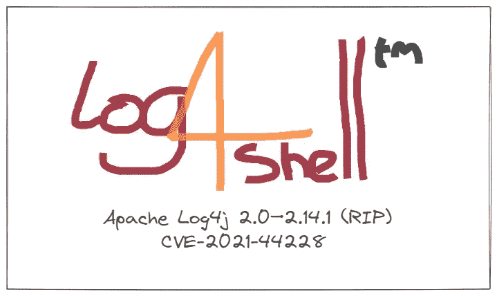

# Log4Shell 零日漏洞利用演练

> 原文：<https://medium.com/geekculture/log4shell-zero-day-exploit-walkthrough-f42352612ca6?source=collection_archive---------0----------------------->

## 在流行的 Java 库中演示 RCE，Log4j

你好，世界！如果你一直在关注最近的网络新闻，你可能已经看到了关于数百万个应用程序易受通过流行的 Java 日志库 **Log4j** 的远程代码执行零日攻击的大标题。受影响的版本是**Apache Log4j 2.0–2 . 14 . 1**和 CVE 被跟踪…