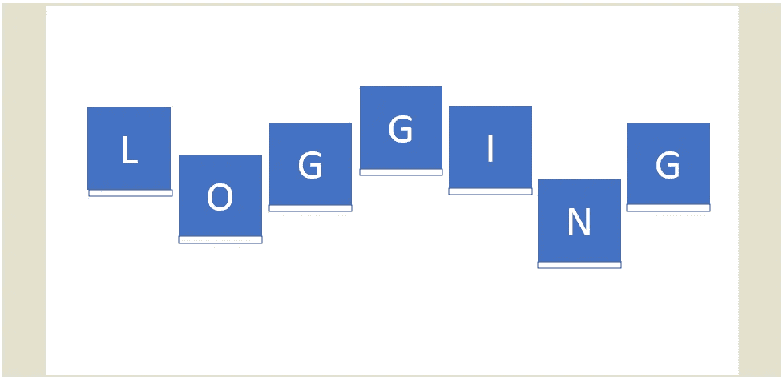

# Python 中的日志模块-高级

> 原文：<https://medium.com/geekculture/logging-module-in-python-advanced-b2f64d5eab6a?source=collection_archive---------17----------------------->

## 跟踪软件运行时发生的事件

继续上一篇文章结尾提到的共享日志概念。我们将深入探讨多个日志程序的使用，并通过处理程序和格式化程序来设置它的配置。

# 记录器