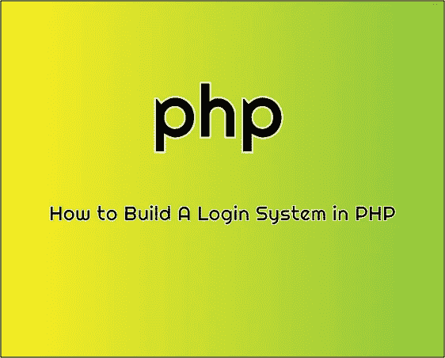

# 如何用 PHP 建立一个登录系统

> 原文：<https://medium.com/geekculture/login-system-using-php-and-xampp-local-server-758ce932915d?source=collection_archive---------0----------------------->

在本教程中，我们将使用 PHP 构建一个登录系统。

如果你是那种通过看视频学到更多东西的类型，可以随意在这里看这个视频， [**用 MySQl 和 jQuery**](https://www.youtube.com/watch?v=bINidZ1HaKU) 登录 PHP。

php

# 介绍

要求:

1.  XAMPP。
2.  基本的 PHP，HTML 和 CSS 知识。