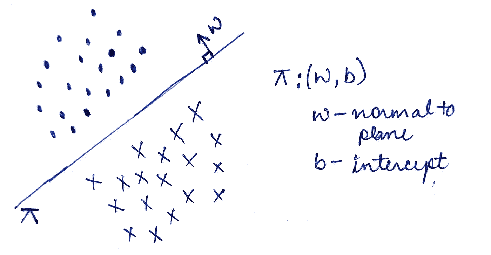
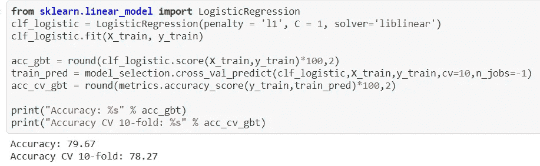

# 逻辑回归

> 原文：<https://medium.com/geekculture/logistic-regression-2111fa695cdd?source=collection_archive---------32----------------------->

Photo by [Markus Spiske](https://unsplash.com/@markusspiske?utm_source=medium&utm_medium=referral) on [Unsplash](https://unsplash.com?utm_source=medium&utm_medium=referral)

逻辑回归是用于二元分类问题的监督机器学习算法，即目标只有两个可能的值。
例如，它可用于预测患者的癌症，其中 target = 0 表示无癌症，反之亦然，或者将邮件检测为垃圾邮件或无垃圾邮件等。

## LR 的假设

*   逻辑回归假设数据几乎或线性可分。
*   它要求自变量之间很少或没有多重共线性。这意味着独立变量之间的相关性不应该太高。
*   它通常需要较大的样本量。

## 逻辑回归工作

假设你有两个可线性分离的类(用左边的点和十字表示)，你可以很容易地画一条线/超平面来分离这些类。
让我们把这个超平面表示为π : (w，b)。
平面的方程是
π= w’x+b，其中 x 是一个数据点，它是一个矢量。

我们在这里的任务是找到 w 和 b，以便我们得到超平面的方程，使得它最好地分离这两类。
假设我们的目标(y)在这里是+1 代表+ve 点(圆点)，-1 代表-ve 点(十字)。
*一个点到平面的距离(di) = w'xi，为方便起见我们假设 w 为单位向量。* 现在，让我们看看如何使用下面的 4 个案例进行分类——

*   **案例 1** : y = +ve，w'xi = +ve
    这意味着我们的模型说 xi 属于正类，我们看到
    y = +ve。因此我们可以说
    (一* w'xi) > 0
    **正确归类**
*   **案例二:** y = -ve，w'xi = -ve
    这意味着 xi 属于否定类，我们看到
    y = -ve。由此我们可以说
    (一* w'xi) > 0
    **正确归类**
*   **案例三** : y = +ve，w'xi = -ve
    这意味着 xi 属于否定类，但是我们看到
    y = +ve。因此我们可以说
    (一* w'xi) < 0
    **误分类**
*   **案例四** : y =-ve，w'xi = +ve
    这意味着 xi 属于正类，但是我们看到
    y = -ve。因此我们可以说
    (一* w'xi) < 0
    **误分类**

*为了使我们的分类器良好，正确分类的点的总数应该增加。因此我们的动机是得到****max(*σ*(易* w'xi))*** *。*

## 使用 SIGMOID 消除异常值的影响

因为带符号的距离会受到异常值的严重影响并产生误差。因此，为了防止这种情况，如果它超过某个阈值，我们将 sigmoid 应用于带符号的距离。
所以我们的平面方程变成了—

> w * = argmaxσsigmoid(yi * w ' Xi)，其中σ从 i =1 到 n，n =总数据点，arg max 代表 w

考虑到 y = (-1，+1)的逻辑回归的最终优化问题变成了:

> **w * = argminσlog(1+exp(-yi * w ' Xi))**，其中σ从 i =1 到 n，n =总数据点，arg min 代表 w

如果数据中的要素具有不同比例的值，则必须执行列标准化，因为它也会影响带符号的距离。

## L1 和 L2 正规化

我们上面推导的优化方程会导致过拟合的问题，因为为了最小化方程的值，w 可以趋向于+无穷大或-无穷大。
这反过来将导致训练数据的完美拟合，因为最小值将是完美的 0，因此过度拟合。为了摆脱上述问题，我们使用正则化。

*   我们在方程中加入一个正则项，以防止 w 趋于无穷大。
*   使用的正则项如果等于λ(w'w ),则它是 L2 正则化，如果它是λ(||w||)，则它被称为 L1 正则化。

λ这里是超参数，可以通过交叉验证找到。

> **L1 正则化**
> **w * = argminσlog(1+exp(-yi * w ' Xi))+λ(| | w | |)，**其中σ从 i =1 到 n，n =总数据点数，arg min 代表 w

使用 L1 正则化的优点是它使所有不太重要的特征为 0，即该特征的对应 w 将为 0。所以 L1 区。如果我们有高维数据的话会非常有用。但是如果我们使用 L2 正则化，那么对应于该特征的 w 将是一个非常小的值。

> **L2 正则化**
> **w * = argminσlog(1+exp(-yi * w ' Xi))+λ(w ' w)，**其中σ从 i =1 到 n，n =总数据点，arg min 代表 w

**过拟合和欠拟合**

*   如果λ = 0，则意味着我们在考虑原始方程，因此会导致过拟合。
*   如果λ ->无穷大，那么这意味着我们根本没有考虑原始方程，所以预测会非常不准确，从而导致拟合不足。

## 确定 LR 的特征重要性和可解释性

如果我们假设所有的特征都是独立的，那么我们可以通过查看它们相应的权重来确定特征的重要性。
如果特定特征的权重较高，那么我们可以说，该特定特征在确定类别中具有更大的作用。
通过这种方式，我们也可以很容易地解释模型，因为我们知道哪些特征或哪些因素负责该预测。

## 训练和运行时间复杂性和空间复杂性

*   训练时间= O(n*d ),其中 n =数据点数，d =维数
*   运行时间= O(d)
*   空间复杂度= O(d)

## **实施逻辑回归**

我们将使用来自 Kaggle 的一个非常著名的数据集，任务是创建一个模型来预测哪些乘客在泰坦尼克号沉船中幸存。数据集可以从[这里](https://www.kaggle.com/c/titanic/overview)下载。 *这也是一个二进制分类问题，其中目标“幸存”对于没有在灾难中幸存的人是 0，对于幸存的人是 1。*

我们将数据预处理成 x_train 和 y_train，并从 sklearn 导入逻辑回归。

*   在上面的代码片段中，我们看到 penalty = 'l1 '。LR 的 sklearn 实现中的这个属性决定了我们想要的正则化类型。
*   C 参数是λ的倒数。较小的 C 值决定了强正则化。

可以参考 LR 在 Titanic 数据集[上的详细实现这里](https://github.com/guptaa98/Kaggle-Notebooks/blob/master/Titanic%20kaggle.ipynb)。