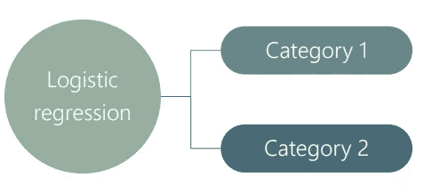
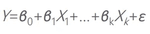
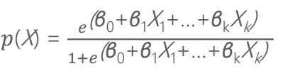
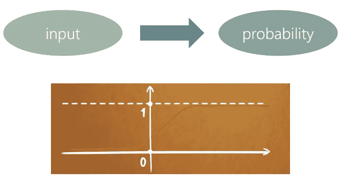
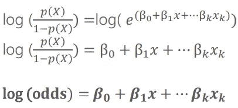
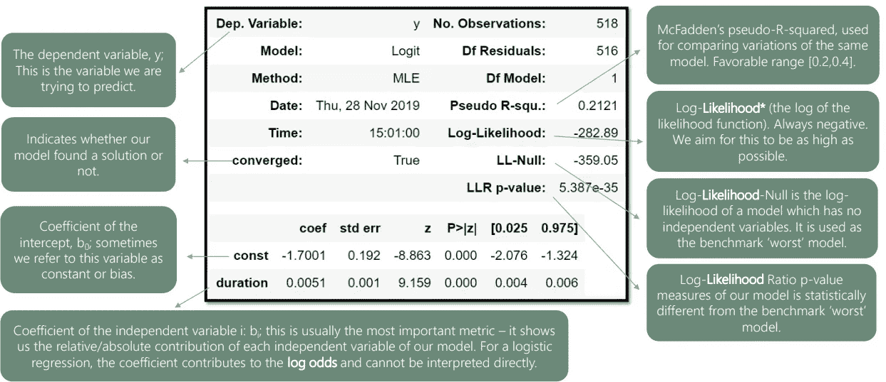
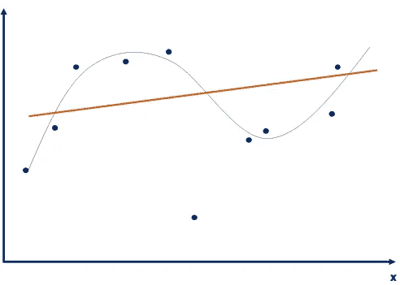

# 逻辑回归

> 原文：<https://medium.com/geekculture/logistic-regression-ac0d2a36de7a?source=collection_archive---------21----------------------->

# 逻辑回归与线性回归

逻辑回归意味着可能的结果是**而不是**数字的，而是分类的。

*类别的例子有:——*

*   是/否
*   会购买/不会购买
*   1 / 0

线性回归模型:—

逻辑回归模型:—

# 逻辑模型

逻辑回归预测事件发生的概率。

Visual Representation of Logistic Function

# 逻辑回归模型

逻辑回归模型本身不是很有用。模型的右边是一个指数，它的计算效率很低，通常很难掌握。

# LOGIT 回归模型

当我们谈论一个*‘逻辑回归’，*时，我们通常指的是*‘逻辑回归’——*模型的一个变体，其中我们取了双方的对数。

***硬币翻转赔率:*** 获得正面的赔率是 1:1(或者干脆是 1)

***公平死赔率:*** 得到 4 的赔率是 1:5 (1 比 5)

# 逻辑回归模型汇总表

*   *似然函数:*衡量统计模型拟合优度的函数。
*   *最大似然估计(MLE):* 试图最大化似然函数。

欠拟合和过拟合

*   拟合不足:模型没有捕捉到数据的底层逻辑。[高偏差、低方差]

*   过度适应:我们的训练过于关注特定的训练组合，以至于“没有抓住重点”。【低偏差，高方差】

