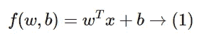
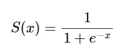
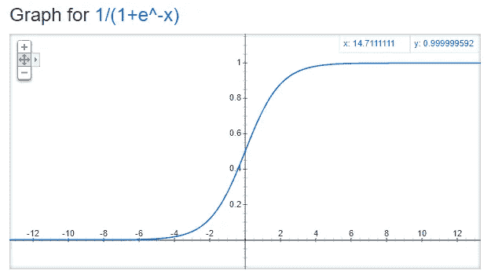
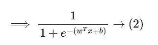
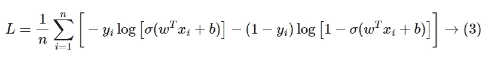
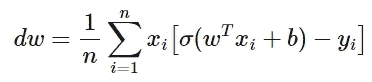
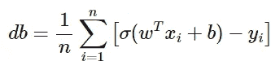
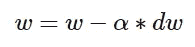
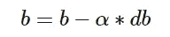
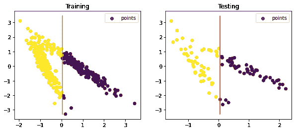

# 实践中的逻辑回归算法

> 原文：<https://medium.com/geekculture/logistic-regression-algorithm-in-practice-816dd103266?source=collection_archive---------8----------------------->

什么是逻辑回归算法，以及如何在回归任务中使用它。

Photo by [Luis Soto](https://unsplash.com/@sixthmanlou?utm_source=medium&utm_medium=referral) on [Unsplash](https://unsplash.com?utm_source=medium&utm_medium=referral)

# 介绍

逻辑回归是一种广泛用于二元分类任务的统计模型。名称**逻辑**是因为它使用逻辑函数来进行分类。逻辑函数也被称为**交叉熵。**除此之外，我们使用一个称为 **sigmoid function** 的特殊函数来防止异常值在整个建模中的影响。

# 数学模型

给定数据点，我们需要将它们分为两类(二元分类)。我们将找到一个分离超平面来划分这些类。

sigmoid 函数的符号可以表述为-

sigmoid 函数的曲线是-

Image from Google

如果我们观察曲线的边界，上界是`1`，下界是`0`。sigmoid 函数仅返回在`0`和`1`范围内的值，这足以进行二元分类。

如果我们通过代入上述近似式(1)来使用 sigmoid 函数，我们得到-

等式(2)是用于预测类别标签的实际模型。

给定`x`、`w`和`b`。我们需要在模型中传递它，然后返回一个概率值。

*   如果概率值小于`0.5`，则预测值为`0`。
*   如果概率值大于等于`0.5`，该值被预测为`1`。

一切都写得很好，除了两件事还不知道。这两个东西就是参数`w`和`b`。模型中的误差取决于这两个参数值。这里，`w`是系数，`b`是截距。我们不能简单地为`w`和`b`分配随机值。相反，它们将在随机梯度下降过程的帮助下被明智地选择。

## 随机梯度下降

最终目标是找到`w`和`b`的最佳值。这里`w`是矢量，`b`是标量值。我们将使用逻辑函数或交叉熵函数来寻找这些值。

声明如下-

**注** — Sigmoid 函数通常表示为 sigma。

SGD 是一个迭代过程，我们最初为`w`和`b`分配随机值(可能是 0)。在每次迭代中，

*   对于`w`，我们相对于`w`微分(3)，得到`dw`。
*   对于`b`，我们相对于`b`微分(3)得到`db`。

Image by Author

数学上，它可以表示为-

和

**注** —我其实已经在一篇论文上对以上进行了微分，并验证了。

我们在每次迭代中分别用`dw`和`db`更新/替换实际的`w`和`b`，直到这些值没有完全最小化。更新过程可以按以下方式理解。

和

现在我们已经理解了完整的过程，让我们从头开始实现同样的过程。

# 逻辑回归—代码

我们将一如既往地从导入必要的库开始。

## 图书馆

## 数据创建

现在，我们将依赖于一个玩具数据集，我们可以通过模块`sklearn`轻松地创建它。

## 数据分离器

我们需要将数据分成两部分——集合`training`和集合`testing set`。我们通过一个随机的分裂函数来实现。

**列车试分裂**

## 建筑

分类器的名字是`LogisticRegression`，它是一个我们定义其他方法的类。

## `__init__()`方法

上面的方法是一个接受五个参数的构造函数

*   `train_df` →指用于训练回归变量的数据子集。
*   `test_df` →指用于测试回归变量的数据子集。
*   `label` →数据系列，实际上是类标签的列名。
*   `lambda_` →指在 SGD 过程中用于更新参数的常数。
*   `n_iters` →是一个常数，用来决定 SGD 过程的总迭代次数。

## `split_features_targets()`方法

上述方法用于从数据中分离特征和目标。它需要两个参数-

*   `df` →指通过分类的整个数据集。
*   `label` →指 df 系列，实际上是类标签的列名。

## `sigmoid()`方法

上面的方法是一个带一个参数的 sigmoid 函数。用于返回`0`和`1`范围内的值。

*   `z` →指一个数据值。

## `diff_params_wb()`方法

上述方法用于区分参数。它需要两个函数参数-

*   `w` →指 SGD 过程中使用的初始权重向量。
*   `b` →指 SGD 过程中使用的初始截距值。

## `find_best_params()`方法

上述方法用于获得参数`w`和`b`的最佳(最小)值。它没有函数参数。该方法遵循 SGD 的过程，迭代更新`w`和`b`的初始值。

## `draw_line()`方法

上面的方法是用来画超平面的。它需要一个参数-

*   `ax` →指绘制超平面的轴。

## `predict()`方法

上述方法用于预测新的未发现数据的类别标签。它有一个参数(可选)

*   `with_plot` →指一个布尔值，决定是否绘制最佳拟合线和数据点。

默认情况下，该函数参数采用 False 值，因此是可选的。

## `score()`方法

上述方法用于计算确定模型是否表现良好的准确度分数。它是所有数据点总数中正确分类数据总数的一部分。通常，精度水平大于 0.80 或 80 的模型被认为是好模型。它需要两个参数-

*   `preds` →指预测数组(类别标签)。

**完整代码**

# 逻辑回归—测试

我们已经创建了一个玩具数据集。我们只需要在这些数据上测试模型。

注意——我们创建的数据是随机的。每次执行的结果可能不同。

## 对象创建

## 砝码

## 拦截

## 预言；预测；预告

**训练&测试地块**

Image by Author

## 绩效得分

精确度恰好是`>= 84%`，这是一个相当不错的百分比，因此模型是好的。

# 挑战

嗯，整个代码都是从头开始开发的，从性能上来说，肯定不如库方法高效。但是，理解这项工作背后的数学是很好的。

*   我的代码很慢。
*   在本文中，我们考虑了线性可分数据。在非线性可分数据的情况下，我们需要做特征变换。
*   没有实现正则化。
*   尽管由于使用了 sigmoid 函数，异常值不会产生太大影响。但是，我们仍然可以删除它们以避免问题。
*   在现实生活中，数据不会像玩具数据集一样。这将是完全不同的，也具有挑战性。

# 参考

*   YouTube 视频→[bit.ly/2UDmtZM](https://bit.ly/2UDmtZM)
*   维基百科文章→【en.wikipedia.org/wiki/Logistic_regression 

**结束**