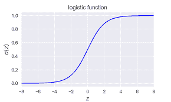
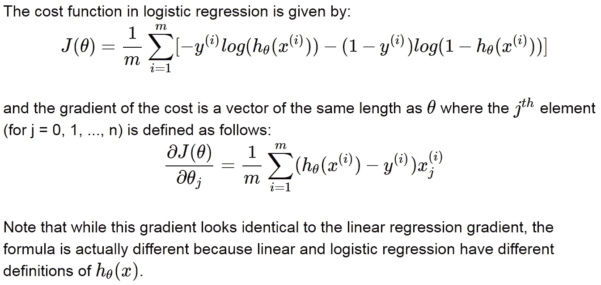
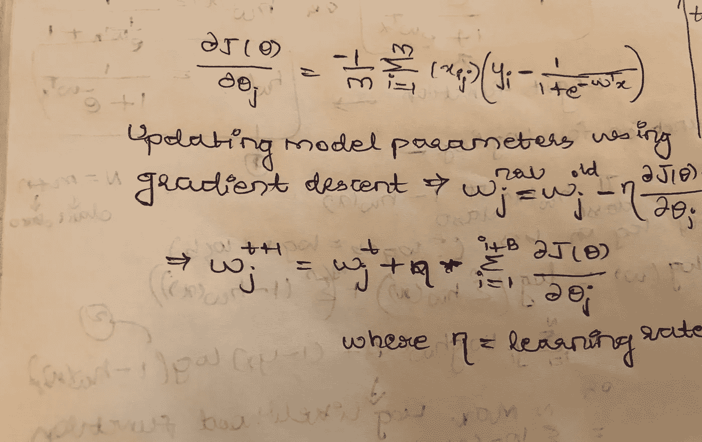
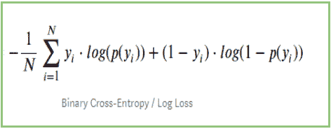
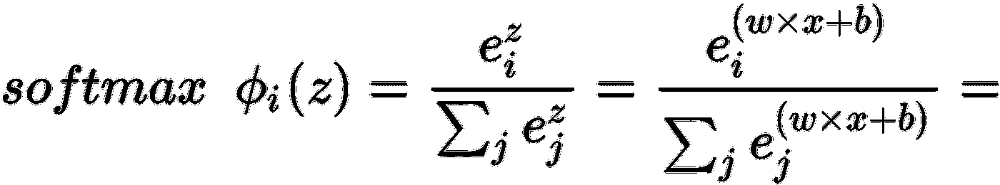
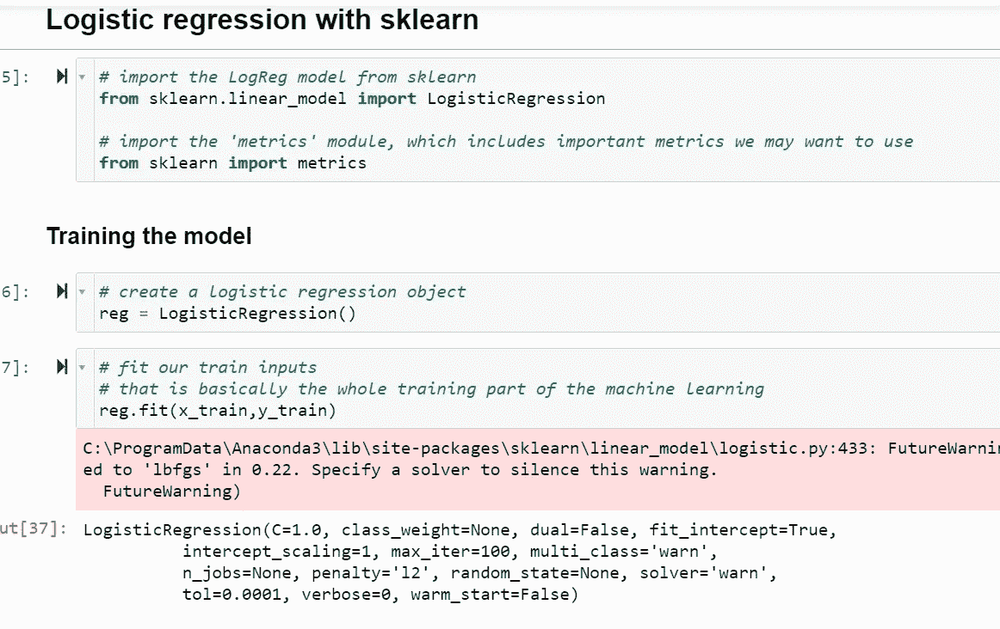
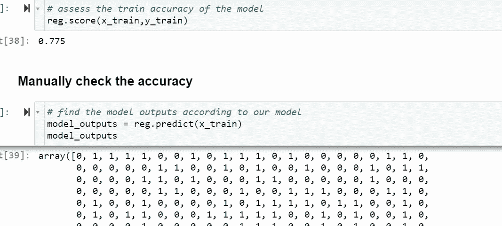
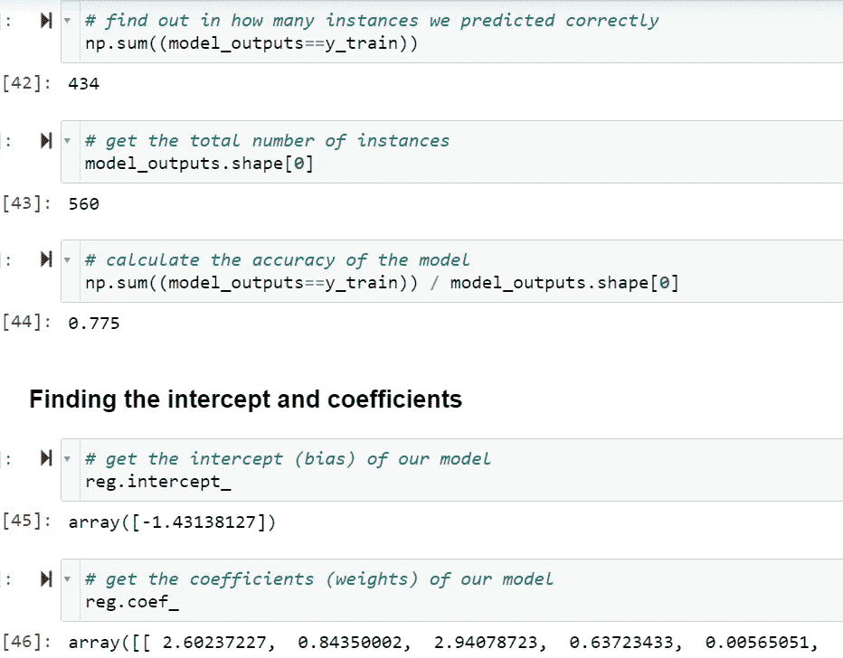
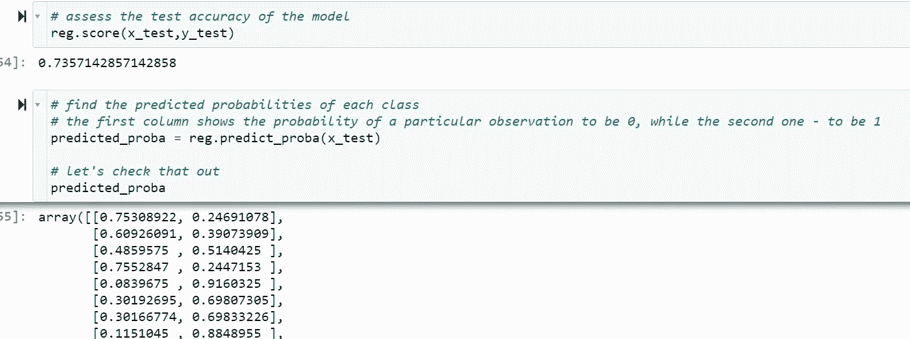

# 逻辑回归-最大似然法中的第一分类模型

> 原文：<https://medium.com/geekculture/logistic-regression-first-classification-model-in-ml-5642b28298d5?source=collection_archive---------19----------------------->

机器学习是人工智能的一部分，机器在最少的人工干预下学习给它的数据。机器学习分为四类，即监督学习、非监督学习、半监督学习和强化学习。当标签是已知的并且被提供给机器时，使用监督学习，以便可以容易地识别进一步的这种数据。受监督的 ML 进一步分为两种类型。它们是回归和分类任务。在此过程中，第一个已知的基本回归算法是线性回归，第一个已知的分类算法是逻辑回归。

今天讨论的话题是逻辑回归，在此之前最好先了解一下线性回归。不过，你可以阅读逻辑回归，如果你想了解线性回归，点击[了解线性回归](/geekculture/linear-regression-first-model-for-ml-cce82b2468e)。

问题出现了:如果逻辑回归仅用于分类，那么逻辑回归如何命名为“回归”而不是“分类”。

这里回答:这是一个有效的问题。逻辑回归是用于分类任务的线性回归模型的扩展。“逻辑回归”这个名字也是如此。此外，逻辑回归具有 0 到 1 或更大的值。所有这些都是离散值，仅用于分类问题。

仅采用两个输出值(如 0，1)的逻辑回归称为二元逻辑回归。当输出可以取两个以上的值时称为多项逻辑回归。例如，如果你想预测某人是否能拿到票，可以用二元逻辑回归来解决，而当你想知道明天是多云、下雨还是炎热时，你可以用多项式逻辑回归。

Logistic Regression

逻辑回归理论下面是为了了解逻辑回归算法背后的直觉:

在逻辑回归中，分类反应或目标或输出为真或正的对数优势被建模为特征的线性组合。数学上，log(p/1-p)= w0 + w1x1 +w2x2 + …。wjxj(=wTx)在两边应用指数，你得到=>p/1-p = e^WTx 最后求解 p 你得到=> p = e^wTx/1+e^wTx 或 hw(x)= 1/1+e^-wTx

上述 p(真值)或 hw(x)称为 logit 函数。[两个 p=hw(x)]

逻辑方程式的成本函数-π(1 类)HW(x)π(0 类)1-hw(x)。这可以进一步写成σ(I = 1 到 N) yi log hw(x) + (1-yi) log(1-hw(x))

上面的等式被称为最大似然函数，它需要最大化，因为它给出了为真的概率。上述函数可以进一步简化，因为我们已经有了 logit 函数，它可以代入上述方程得到σ(I = 1 到 N) (yi-1) (wTxi)-log(1-e-WTxi)

梯度下降也可以应用于逻辑回归成本函数，

θ和 w 表示重量，相同。对 w 或θ的导数是一样的。

对于逻辑回归，成本函数是对数损失，而对于多项式逻辑回归，成本函数是分类交叉熵。在逻辑回归中，我们有 Sigmoid 函数、最大似然估计和梯度下降，在多项式逻辑回归中，我们有 Softmax 函数、交叉熵损失函数和随机梯度下降。

Multinomial Cross-Entropy

为了解释这种交叉熵损失，它就像所有的概率，并找到它的最高值。示例如果有三个类，则计算 f(1)，f(2)，f(3)。

大多数情况下，在 ML 中，逻辑回归比多项式逻辑回归使用得更频繁，在高级 ML 中，这种情况使用得更多，因为深度学习问题很复杂，对于大型数据集，当我们遇到比简单数据集中更多的分类数据时，通常会使用这些数据。

分类模型的评估度量是准确度、精确度、召回率、假阳性率、F1 分数或 F 度量。使用混淆矩阵可以知道以上所有内容。Roc_auc 分数也是评估分类任务的一个重要度量，并且在目标类不平衡时非常有用。

逻辑回归中有许多超参数，如 penalty->其中 l1、l2 可以使用弹性网，C->用于正则化，C 值越低正则化程度越高，C 值越高正则化程度越低或不正则化，multiclass->其中它可以是“auto”、“ovr”、“multinomial”，顾名思义 ovr 表示二进制，auto 表示未说明的情况，multinomial 表示有两个以上的类，等等。在 Scikit-learn.org[**的 Sklearn Logistic 回归页面可以看到所有的超参数列表。**](https://scikit-learn.org/stable/modules/generated/sklearn.linear_model.LogisticRegression.html)

实现很简单，只有几行代码。

Fitting Logistic model to the data

Finding the accuracy of the model with true and predicted values

Intercept and coefficient can be known as in Linear regression

Even the probabilities of class 0 and 1 can be known using predict_proba

不仅概率是已知的，我们还可以重新调整预测类别的阈值。默认情况下，阈值为 0.5，这意味着如果概率为<0.5 its is predicted as class 0 else if it is > 0.5，模型会将其预测为 1 类。这可以根据需要更改为 0.2 或 0.4 或任何值。这么灵活对吧？

逻辑回归有它的优点和缺点:

*   逻辑回归**需要一个大的数据集**和足够的训练样本来识别所有需要识别的类别。
*   逻辑回归是一种统计分析模型，试图根据独立特征预测精确的概率结果。在**高维数据集**上，这可能导致模型**在训练集**上过度拟合，这意味着夸大了训练集上的预测准确性，因此模型**可能无法在测试集**上预测准确的结果。这种情况通常发生在模型根据具有大量特征的少量训练数据进行训练的情况下。因此，在高维数据集上，应考虑正则化技术以避免过度拟合(但这会使模型变得复杂)。非常高的正则化因子甚至可能导致模型在训练数据上欠拟合。
*   逻辑回归假设线性，而在现实世界的问题中很少见到。使用逻辑回归很难获得复杂的关系。更强大和紧凑的算法，如神经网络，可以轻松胜过这种算法。
*   逻辑回归不太倾向于过度拟合，但它可能在高维数据集中过度拟合。人们可以考虑正则化(L1 和 L2)技术，以避免在这些情况下过度拟合。在线性回归中，自变量和因变量是线性相关的。但是 Logistic 回归**需要自变量与 log odds 线性相关(log(p/(1-p))** 。
*   数据集中出现偏离预期范围的数据值可能会导致不正确的结果，因为此**算法对异常值**很敏感。

Photo by [Aditya Chinchure](https://unsplash.com/@adityachinchure?utm_source=medium&utm_medium=referral) on [Unsplash](https://unsplash.com?utm_source=medium&utm_medium=referral)

> ***志存高远，飞得更高***
> 
> 怀疑比失败更能扼杀梦想
> 
> 让每一天都成为你的杰作

如果你觉得这篇文章很有用，并且学到了一些东西，请给予一些支持，并与其他想了解它的人分享。如果你有什么要说的，我愿意倾听你的建议，如果你有任何问题或要求，请告诉我。继续做到最好。🥰Stay 安全了，继续给世界带来光明。会在下一部大作中相遇。😉