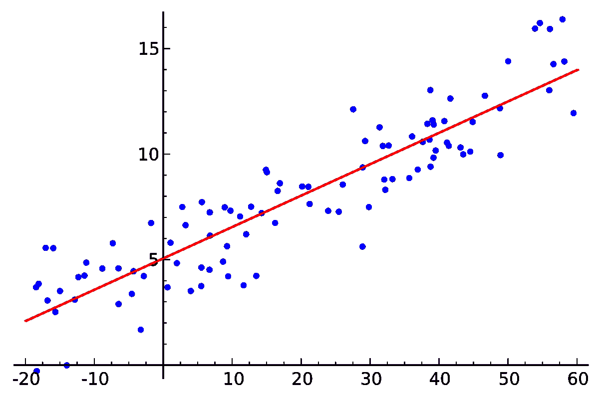
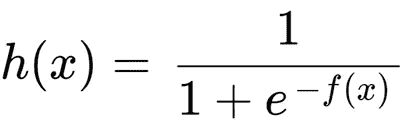
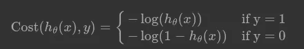
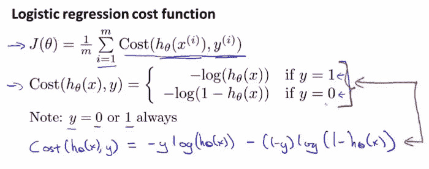
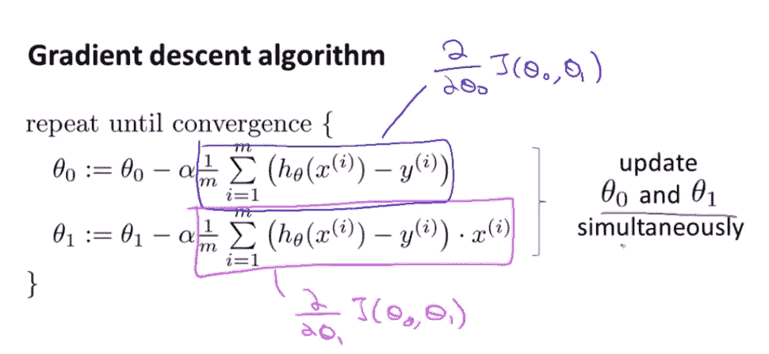

# 机器学习的逻辑回归

> 原文：<https://medium.com/geekculture/logistic-regression-for-machine-learning-22af1d008186?source=collection_archive---------50----------------------->

嗨，我是 Sathira Basnayake，在这篇文章中，我们将探讨机器学习的逻辑回归基础。正如我们所知，机器学习有三个主要类别，称为监督学习，无监督学习和强化学习。当我们谈论监督学习时，分类和回归是使用最多的技术。逻辑回归在分类中发挥作用。

为了正确理解逻辑回归，我认为最好也对回归有所了解。所以如果你不熟悉这个概念，我建议你先了解一下，然后再回来。为了简单起见，我们将举一个单属性线性回归的例子。最常用的例子是房屋预测，我们假设数据集包含面积(X)和房价(Y)。在这种情况下，价格是目标变量。我们可能有一个这样的数据集。因为你对线性回归有所了解，你就知道如何找到最适合预测的直线。

该行的功能类似于“ *wx + b = y_hat* ”。你知道用梯度下降法或其他方法找到最佳的 w 和 b 值。在这种情况下，我们使用 MSE(均方误差)作为损失函数。但是如果目标变量是有类值的变量呢？

在这种情况下，我们需要使用逻辑回归。它基本上是一种分类算法，可用于使用独立变量执行二元分类。所以如果你知道线性回归，你可能会想，为什么我们不能直接用线性回归，画一条线，然后根据阈值划分结果。其实可以做到但不是很有效。所以我们要做的是采用相同的" *wx + b = y_hat* "类公式，并将其输入到 Sigmoid 函数中。

这就是我们所说的 sigmoid 函数。我们必须使用“ *wx + b = y_hat* ”这样的函数来获得预测值，并将其馈送给 sigmoid 函数。通过这样做，我们总能得到一个介于 0 和 1 之间的值。因此，通过使用像 0.5 这样的阈值，我们可以预测高于 0.5 的值属于 A 类，低于 0.5 的值属于 b 类。(我们大多数时候使用 0.5。但是在某些情况下我们必须移动阈值)。

现在下一个问题是我们如何优化参数。我们必须用什么作为成本函数？实际上，我们不能使用 MSE 作为我们的代价函数，因为代价函数不是凸的。因此，如果我们试图在逻辑回归中使用 MSE，我们可能会陷入局部最小值。

所以我们必须找到一个凸的成本函数。

这是我们在逻辑回归中使用的成本函数。这个函数是凸的，如果你感兴趣的话，你可以观察到更多关于这个主题的数学方面。这是同一成本函数的另一种形式。

(Andrew ng’s course)

*我们知道成本函数，下一步是找到使成本函数*最小的最佳 w 和 b 值。为此，我们使用梯度下降算法。在本文中，我们不打算详细讨论梯度下降。但基本上它所做的是通过迭代优化方法找到一个可微函数的最小值。开始时，我们选择 w 和 b 的初始猜测值，之后，我们通过每次迭代最小化误差，最终可以获得最佳的 w 和 b 值。梯度下降算法如下所示。

(Andrew ng’s course)

在上图中，我们可以将θ0 作为 b，θ1 作为 w。阿尔法被称为学习率，它是一个决定速度的超参数。在该算法中，在每次迭代中，成本函数的导数的某一部分被当前值减少。因为每次迭代它总是指向最陡下降方向 b，所以成本函数将指向它的全局最小值。最后，在迭代结束时，我们得到调整的参数。这是梯度下降的基本介绍。

调整参数后，我们得到了我们的模型。现在，我们可以根据需要使用模型来预测新值。在实际场景中，除了这些基本的核心概念之外，还有更多的东西需要考虑。

这篇文章给你一个关于机器学习的逻辑回归背后的理论的基本概念。这并不包括该主题的任何实际方面。现在我们已经到了文章的结尾。热烈欢迎您的评论和反馈。如果我的内容有任何错误，我强烈建议您给我指出来。谢谢大家。祝你有愉快的一天。