# 从零开始的逻辑回归

> 原文：<https://medium.com/geekculture/logistic-regression-from-scratch-59e88bea2ba2?source=collection_archive---------10----------------------->


Visualization for the Iris Dataset (Setosa vs rest)

## **简介**

本文的目标是为读者提供对逻辑回归技术的坚实理解。它假设熟悉概率论、线性代数和微分学的基础知识。它的第一部分探索逻辑回归的基本原理以及必要的数学细节。第二部分集中在实现上，为此我使用 Python。

## **为什么使用逻辑回归？**


Linear model vs logistic model

即使目标变量是二分的(也称为二元的)，它也诱使人们求助于旧的熟悉的线性回归，然而它将被证明在建模概率和适当的分类方面是无效的。原因是这样的模型具有无限的范围，这意味着它从-inf 一直延伸到+inf。发明了一种解决方案，它涉及一个在概率建模中表现出色的函数，即 sigmoid 函数:

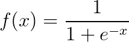

你也可能偶尔碰到它的不同形式:

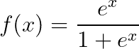

因此，当 x 走向+inf 时，函数值接近 1，当 x 走向-inf 时，函数值接近 0。逻辑回归在进行概率假设时利用了这种行为。

## **理论**

与线性回归一样，逻辑回归的输入是与其相关的特征和权重(系数)的线性组合:

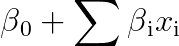

我们将改写为:

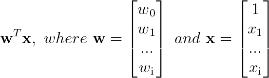

If you feel uncomfortable with multiplying matrices, see [http://matrixmultiplication.xyz](http://matrixmultiplication.xyz/) for an excellent visualization

零 w 和 1 的出现可能看起来令人困惑，但是它是零β所代表的相同的 y 截距。在权重的上下文中，w-零通常被称为偏差项。

将输入代入 sigmoid 函数，我们得到逻辑回归的概率形式:

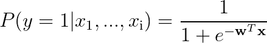

然而，在所谓的逻辑回归的 logit 形式中，也经常看到赔率的对数:

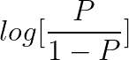

但是我们为什么要用这种奇怪的方法呢？原因是需要表达特征和权重的线性组合。

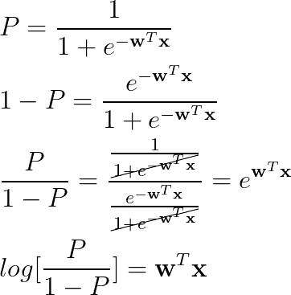

通过概率对数表达线性组合的决定有两个基础:首先，它带回了熟悉的“直线”符号，其次，系数变得更容易解释。

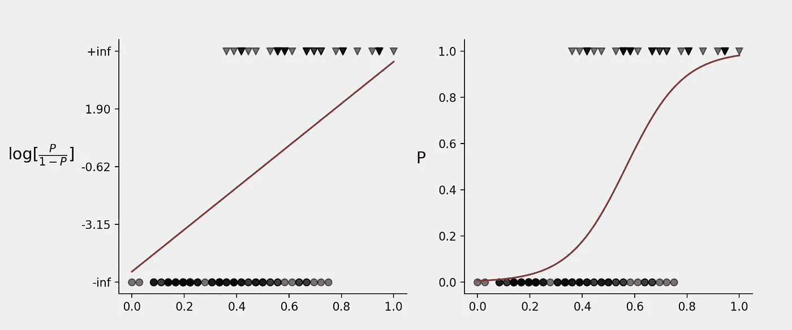

In the left plot, the classes (0 and 1) are at -inf and +inf because the logarithm is undefined at P ∈ {0, 1}

因此，这就是我们如何画出概率曲线的问题。问题出现了:我们如何选择权重来输出最佳拟合曲线？

## **最大可能性**

我们用来优化线性回归参数的 OLS(普通最小二乘法)方法不适用于 logit 函数，问题在于，无论哪条线，到数据点的距离总是无穷大。相反，我们引入了最大似然的概念，其中似然是在假设模型为真的情况下观察到我们的数据的概率:


When y_j =1, the right factor becomes 1 and we get the probability of observing 1 when the sample belongs to class 1\. When y_j = 0, the left factor becomes 1 and we get the probability of observing 0 when the sample belongs to class 0.

请注意，MLE(最大似然估计)要求观测值独立，这允许乘以概率:


然而，由于浮点数的舍入问题，我们在乘以概率时有下溢的风险，无论我们选择什么样的权重，这几乎肯定会以零可能性结束。这就是为什么在做 MLE 时，似然函数是对数变换的，它把概率的乘积转换成它们对数的和。

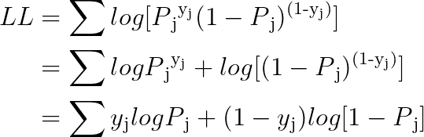

## **梯度下降**

梯度下降是一种数值优化技术，它迭代地逼近成本函数 J(w)的最小值。这是算法的概要:

*   选择学习率η(通常在. 001 和. 1 之间的数字)和迭代次数(建议至少取 1000 次);
*   生成初始权重，通常是随机数；
*   相对于所涉及的每个参数 w_i 计算梯度(导数);
*   使用以下公式计算新的权重:

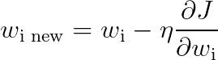

As the value of gradient decreases, smaller and smaller steps are taken towards the minimum

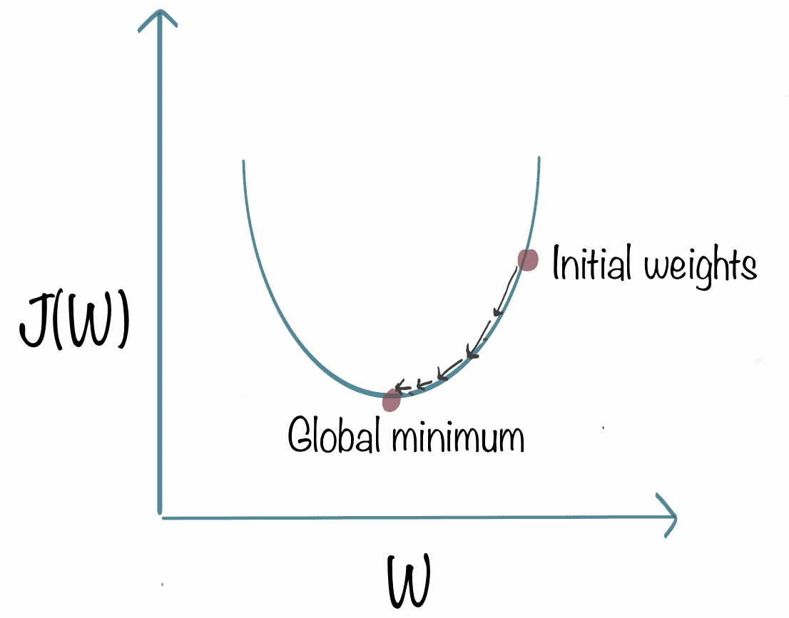

source: [https://www.kdnuggets.com/2018/06/intuitive-introduction-gradient-descent.html](https://www.kdnuggets.com/2018/06/intuitive-introduction-gradient-descent.html)

注意:注意你选择的学习速度。如果你选择一个相对较大的值，你的权重将会无限反弹而不收敛。相反，如果η太小，在梯度值达到容许阈值(任意选择的接近零的参数，在该阈值上算法停止)之前，你可能会变老。

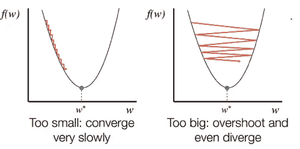

source: [https://srdas.github.io/DLBook/GradientDescentTechniques.html](https://srdas.github.io/DLBook/GradientDescentTechniques.html)

为了遵守某些约定，我们将成本函数 J 定义为-LL，因为否则它将是梯度上升，这很少被提及。下面是 J 的梯度的完整推导:

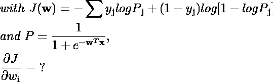

让我们分解这个问题，首先导出总和中各项的梯度:

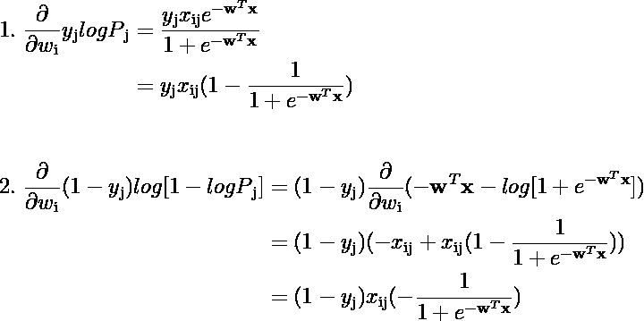

然后，将所有内容联系在一起，消除冗余:

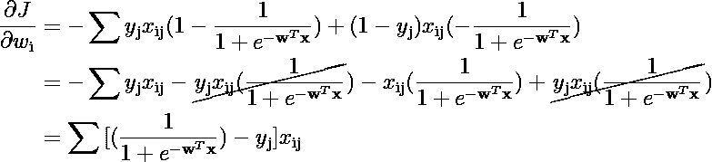

因此，我们的目标是导出所有权重的梯度，并使其接近于零。虽然从理论上来说，这个任务可以通过分析方程组来完成，但是随着特征数量的增加，事情很快就会变得疯狂。想象一下，教一台计算机找到一个包含 10 000 个特征的解析解，因此 10 001 个(记住截距)导数的系统都设置为零。看到了吗？数字方法拯救了世界。

## **多类逻辑回归**

尽管在本质上，逻辑回归的目的只是区分两类，但它也可以用于多类(n > 2)分类。本文涵盖了 One-vs-Rest 方法，这意味着用 n 个不同的预处理数据集来拟合 n 个二元逻辑模型。这个概念可以通过一个例子得到最好的理解:

考虑我们要从 Iris 数据集区分 Setosa、Versicolour 和 Virginica，这对熟悉机器学习的人来说一定非常熟悉。我们必须建立 3 种不同的物流模型:

*   Setosa (1)对 Versicolour 和 Virginica(0)；
*   Versicolour (1) vs Setosa 和 Virginica(0)；
*   Virginica (1)对 Setosa 和 Versicolour (0)，

然后我们汇总结果，最后的预测是观察到 1 的概率最高的类。比方说，对于一次观测，我们得到 Setosa 的概率等于. 035，Versicolour 的概率等于. 23，Virginica 的概率等于. 0006。因此，Versicolour 将成为预测的职业。

## Python 中的逻辑回归

恭喜你掌握了理论，到达了文章的第二部分。这里我们要用 Python 来构建逻辑回归。我们将以一种面向对象的方式来做这件事，所以如果你觉得你对 OOP 理解不深，考虑一下你是在死记硬背。对于基础知识，我建议参观科里·斯查费的迷你球场。

对于这个实现，您还需要安装 numpy。

我们将开始声明类并指定初始化时设置的参数:

```
class LogisticRegression: def __init__(self, eta=.01, n_iter=100000, tolerance=1e-5, random_state=42): self._eta = eta
        self._n_iter = n_iter
        self._tolerance = tolerance
        self.__random_state = random_state
```

关于参数的几点说明:

*   *η*=η=学习率；
*   *n_iter* 是梯度下降停止前的迭代次数；
*   *公差*是所有**梯度需要达到的阈值，以使算法停止；**
*   *random_state* 是随机种子，在其上生成初始权重。为再现性而规定。

我们添加了 *_sigmoid* 实用静态方法，它采用一个特征矩阵和一个权重数组，并生成一个概率数组:

```
 @staticmethod
    def _sigmoid(X, w):

        denominator = 1 + np.exp(-(X * w).sum(axis=1))
        return 1 / denominator
```

我们现在完全专注于 *fit* 方法，我将通过集成注释一步一步地解释它。我已经包括了*归一化*参数，该参数可选择缩放特征，这使得梯度下降收敛更加平滑和快速:

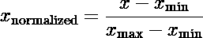

```
 def fit(self, X, y, normalize=False): # Convert the input into numpy arrays
        # Make *y* a 1-d array in case a matrix is supplied self._X = np.array(X, dtype=np.dtype('float64'))
        self._y = np.array(y, dtype=np.dtype('int64')).squeeze() # We save *normalize* as the instance attribute;
        # if set to True, test data in the *predict* method
        # will also be normalized.
        # We also save the data range as well as the minimum value. self.__normalize = normalize
        if self.__normalize:
            self.__Xmin = self._X.min(axis=0)
            self.__Xrange = self._X.max(axis=0) - self.__Xmin
            self._X = (self._X - self.__Xmin) / self.__Xrange # Check if the problem is multiclass: self._classes = np.unique(self._y)
        if len(self._classes) > 2: # If we have more than 2 classes,
            # we set the corresponding boolean to True
            # and prepare a container for n binary models.            self.__multiclass = True
            self.models_ = [] for class_ in self._classes: # Setting 1 where an observation belongs to the 
                # class and 0 where it does not. y = np.zeros(shape=self._y.shape)
                y[self._y == class_] = 1 # Initialize and fit the model. lr = LogisticRegression(
                    eta=self._eta,
                    n_iter=self._n_iter,
                    tolerance=self._tolerance,
                    random_state=self.__random_state
                )
                lr.fit(self._X, y) # We initialize *normalize* as False regardless
                # of whether or not the main model has True
                # because, if it does, self._X is already normalized # Instead, we set the necessary attributes after
                # the model is fit. if self.__normalize:
                    lr.__normalize = self.__normalize
                    lr.__Xmin = self.__Xmin
                    lr.__Xrange = self.__Xrange self.models_.append(lr) self.__fit = True return self else: self.__multiclass = False # We add the bias term to the data to fit the intercept. self._X = np.concatenate(
                [np.ones(shape=(len(X), 1)), self._X],
                axis=1
            ) # Generate the initial weights. rs = np.random.RandomState(seed=self.__random_state)
            self.w_ = rs.normal(size=(self._X.shape[1], )) # Gradient descent for _ in range(self._n_iter):
                grad = ((self._sigmoid(self._X, self.w_) - self._y)[:, np.newaxis] * self._X).sum(axis=0)
                self.w_ -= self._eta * grad
                print(grad)
                if all(np.absolute(grad) < self._tolerance):
                    break self.intercept_ = self.w_[0]
            self.coef_ = self.w_[1:] self.__fit = True

            return self
```

让我们测试一下我们目前所拥有的:

```
from sklearn.model_selection import train_test_split
from sklearn import datasetsdata = datasets.load_iris()
X, y = data['data'][:, 3:4], data['target'] # Use one feature for simplicity (petal width).X_train, X_test, y_train, y_test = train_test_split(X, y, stratify=y, random_state=42)lr = LogisticRegression(eta=.05)
lr.fit(X_train, y_train, normalize=True)print(lr.models_[0].w_)
print(lr.models_[1].w_)
print(lr.models_[2].w_)
```

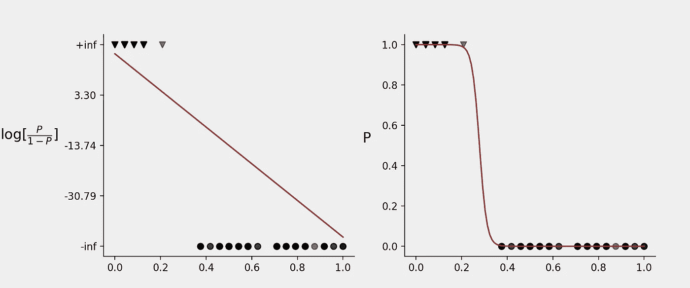

Setosa vs Rest. Output: [ 17.24983752 -61.98800334]

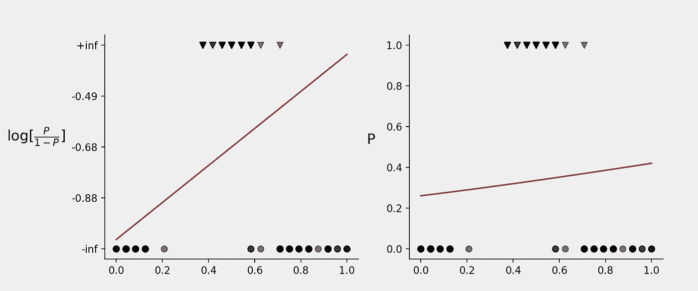

Versicolour vs Rest. Output: [-1.04412163 0.72087761]

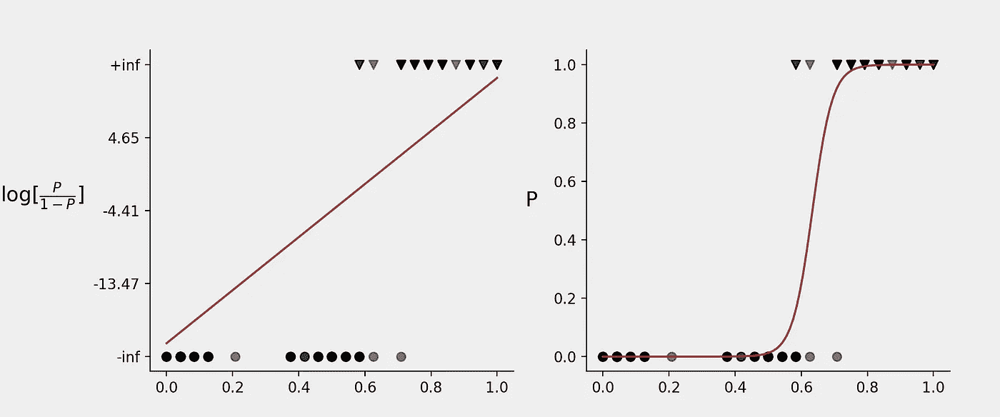

Virginica vs Rest. Output: [-20.88894019 32.95409127]

我们现在介绍接受以下参数的*预测*方法:

*   *X _ 测试。*检测数据。如果使用训练数据的规范化版本拟合了模型，测试数据也将被规范化。
*   *普罗巴*。是否返回概率。它们追加到预测类数组的右侧。
*   *阈值*。判定规则:如果 P ≥ *阈值，则*观察值被分类为 1，否则被分类为 0。应该小心操作。例如，如果患者的生命取决于发现他们是否患有疾病，那么门槛应该降低。当模型是多类时忽略。

```
 def predict(self, X_test, proba=False, threshold=.5): if not self.__fit:
            raise TypeError('The model has not been fit.') if self.__multiclass: # Extract the probabilities from each of the fitted 
            # models. probas = map(lambda model: model.predict(X_test, proba=True)[:, [1]], self.models_) # Tie them together. self.proba_ = np.concatenate(list(probas), axis=1) # Make the prediction: a class with the highest
            # probability is chosen as the predicted class. self.y_hat_ = np.array([self._classes[idx] for idx in self._classes[np.argmax(self.proba_, axis=1)]]) if proba:
                return np.concatenate([self.y_hat_[:, np.newaxis], self.proba_], axis=1)
            else:
                return self.y_hat_

        else: self._X_test = np.array(X_test, dtype=np.dtype('float64')) # Normalize the testing data. if self.__normalize:
                self._X_test = (self._X_test - self.__Xmin) / self.__Xrange # Append the bias term. self._X_test = np.concatenate([np.ones(shape=(self._X_test.shape[0], 1)), self._X_test], axis=1) # Calculate the probabilities. self.proba_ = self._sigmoid(self._X_test, self.w_) self.y_hat_ = np.zeros(shape=(self.proba_.shape[0], ))
            self.y_hat_[self.proba_ >= threshold] = 1 if proba:
                return np.concatenate([self.y_hat_[:, np.newaxis], self.proba_[:, np.newaxis]], axis=1)
            else:
                return self.y_hat_
```

让我们来看看实际使用的方法:

```
print(lr.predict(X_test, proba=True))
```

输出:

[[0.00000 1.00000 0.26618 0.00000]
【2.00000 0.00000 0.35582 0.42736】
【1.00000 0.00000 0.33544 0.01199】
…
【0.00000 0.99901 0.20]

我们看到了决策过程是什么样子的，但是这样一个模型会如何执行呢？

```
from sklearn.metrics import accuracy_scoreprint(accuracy_score(lr.predict(X_test), y_test))
```

输出:

0.8947368421052632

嗯，它确实做得很好，但是我们能做得更好吗？我不打算在本文的其余部分讨论特性选择，因为这个主题超出了它的范围，这就是为什么我们简单地插入我们所有的数据。

```
X, y = data['data'], data['target']X_train, X_test, y_train, y_test = train_test_split(X, y, stratify=y, random_state=42)lr.fit(X_train, y_train, normalize=True)
print(accuracy_score(lr.predict(X_test), y_test))
```

输出:

0.9473684210526315

让我们将我们的结果与 scikit-learn 实现的结果进行比较:

```
from sklearn.linear_model import LogisticRegression as LinearRegression_lr_sklearn = LogisticRegression_(penalty='none', tol=1e-5, random_state=42, max_iter=100000) # Same hyperparams
lr_sklearn.fit(X_train, y_train)print(accuracy_score(lr_sklearn.predict(X_test), y_test))
```

输出:

0.8947368421052632

不打算吹嘘这个小的优势，因为它最有可能归因于一个场合。

此外，如果我们消除“噪声”特征，我认为甚至有可能做得比 94.7%更好。

## 结论

在这篇文章中，我试图既简洁又全面。我试图尽可能清晰地传达材料，并特别关注我认为在其他资料中被肤浅或过于复杂地介绍过的东西，我不得不仔细阅读这些资料。我希望你喜欢这个指南，如果你有任何问题没有回答，请联系我，我会在我的专业知识允许的范围内回答他们。