# 逻辑回归:用 Python 从头实现

> 原文：<https://medium.com/geekculture/logistic-regression-implementation-from-scratch-in-python-f9d6cd4a0747?source=collection_archive---------5----------------------->

## 包括二元分类和多类分类。

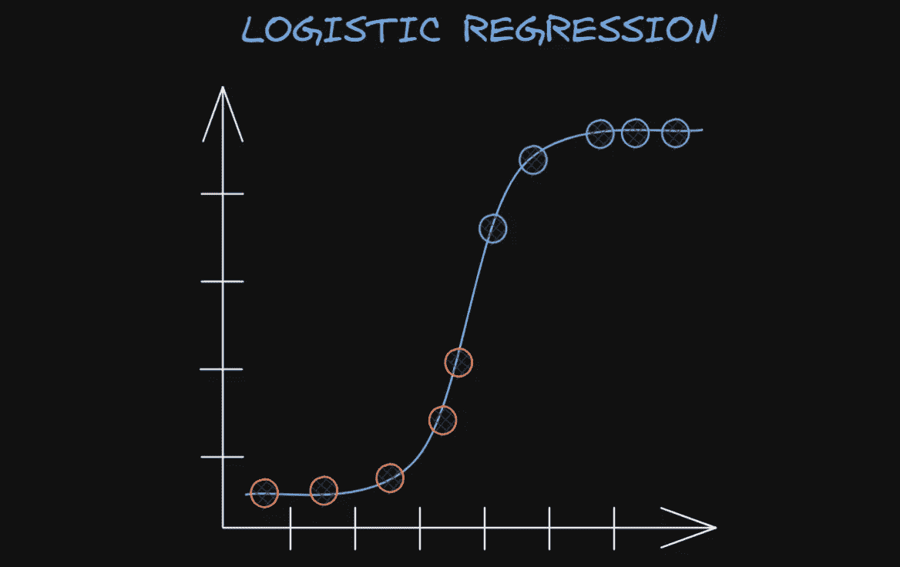

Drawn by author in excalidraw.com

你想知道机器学习模型是如何做出“这个人到底有没有心脏病”这样的分类的吗？？逻辑回归是最常用的算法之一。逻辑回归在某些方面类似于传统的线性回归。它们通常是向学习机器学习模型的初学者介绍的前两个模型。然而，逻辑回归是一个非常强大的分类模型，能够处理大型数据集和大量的特征。

我能想到的逻辑回归的一个显著应用是，在自然语言处理领域，特别是在情感分析方面。普遍存在的是，在决定是否真的有必要继续使用更复杂的语言模型，或者至少使用与复杂模型的比较之前，人们经常试图将逻辑回归模型应用于情感分析以测试性能。事实上，我已经使用逻辑回归模型构建了一个用于 IMDB 电影评论情感分析的 [Streamlit 应用](https://imdb-review-sentiment-1.herokuapp.com/)，该应用开箱即用，已经实现了 50k 条评论中 90%的准确率。

今天，我将分享我如何通过在 Python 中从头实现逻辑回归算法来巩固我对逻辑回归的理解。还将介绍二元分类和多类分类的实现。

训练大多数机器学习模型的一些关键概念已经在[我的上一篇文章](/geekculture/understanding-linear-regression-by-implementing-from-scratch-761e2a48fce4)从零开始实现线性回归中涉及到了，其中大部分可以应用于逻辑回归，因此，在本文中不再详细解释。

[](/geekculture/understanding-linear-regression-by-implementing-from-scratch-761e2a48fce4) [## 通过从头开始实施来理解线性回归

### 有梯度下降和 tf。梯度胶带

medium.com](/geekculture/understanding-linear-regression-by-implementing-from-scratch-761e2a48fce4) 

# 逻辑回归简介

逻辑回归类似于线性回归，它们都是**监督的机器学习模型**，但是逻辑回归是为**分类**任务而不是回归任务设计的。换句话说，逻辑回归用于预测离散变量(也称为分类变量)，而不是连续变量(数值变量)。

一般情况下，逻辑回归用于**二元分类**，这里只有两类需要分类，如健康或不健康。但是，它可以很容易地扩展到多类分类，因为逻辑回归的本质是用二项式概率分布建模的。在本文中，**将涵盖**二元分类和多类分类实现，但是为了进一步理解多类分类的工作原理，你可以参考[在 Jason Brownlee 的 Machine Learning Mastery 上发表的这篇惊人的文章](https://machinelearningmastery.com/multinomial-logistic-regression-with-python/)。

就像线性回归一样，逻辑回归也是对数据拟合一条线来进行预测。但是，逻辑回归拟合一个“S”形的**S 形函数**(或“**逻辑函数**”，因此得名)，而不是一条直线，如下图中的**所示。这个函数用一个称为**二项式** **分布**的概率分布来建模。**

因此，在 **y 轴**上，逻辑回归的 y 轴使用获得“是”或“否”的概率，例如在下方的**图中，“是健康的”或“不健康的”，而不是使用直接来自特征本身的连续值(如线性回归)。然后，通过与指定的阈值(通常为 **0.5** )进行比较，使用这些概率来预测该人是“健康”还是“不健康”，以决定输出类别。在本例中，任何高于 0.5 的数据点都将被归类为“健康”，任何低于 0.5 的数据点都将被归类为“不健康”。**

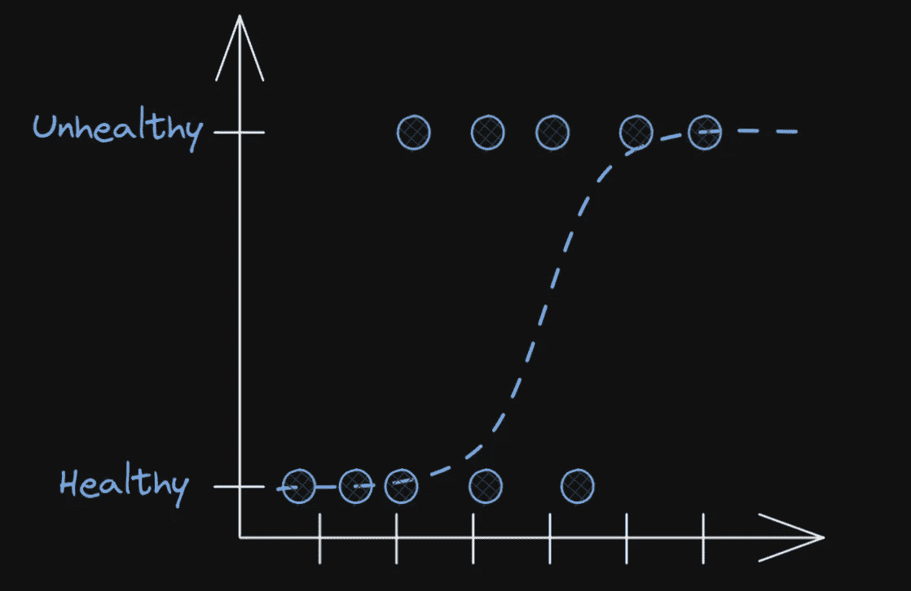

Drawn by author in excalidraw.com. Inspired by Josh Starmer’s [video](https://youtu.be/yIYKR4sgzI8).

**注意**:在这篇文章中，我将使用一些美丽的图表，这些图表的灵感来自于 [Josh Starmer](https://www.youtube.com/channel/UCtYLUTtgS3k1Fg4y5tAhLbw) 在他的 **YouTube StatQuest 视频系列**中制作的关于逻辑回归的图表(下面显示了该系列的第一个视频)，因为他的图表真的很棒，我真的很喜欢看他用这些视觉效果教学。我推荐你去看他的视频，真正了解逻辑回归是如何工作的，他清晰的解释和精彩的视觉效果(更不用说吸引人的歌曲和“BAMS”)，通过他的视频学习真的很享受，也很有教益。

> 在本文中，我将通过在 Python 中从头实现逻辑回归，在直觉和数学之间架起一座桥梁。直觉主要来自逻辑回归的 StatQuest 视频，而数学主要来自吴恩达在 Coursera 上的[机器学习课程](https://www.coursera.org/learn/machine-learning)(第 3 周)。

## 那么我们如何获得每个数据点的概率呢？

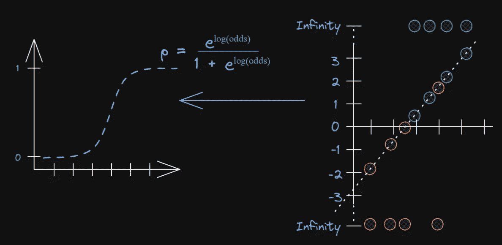

Image drawn by author in excalidraw.com. Inspired by Josh Starmer’s [video](https://youtu.be/BfKanl1aSG0?list=PLblh5JKOoLUICTaGLRoHQDuF_7q2GfuJF) about Logistic Regression.

图的右侧显示了如何将一条线拟合到数据点上(就像线性回归中一样)，以获得每个数据点的 *log(odds)* 、aka **logits** 。 *log(odds)* 通过将它们投影到拟合线上并在 **y 轴**上取值获得。因此，用于逻辑回归的 *log(odds)* 的等式可以写成:

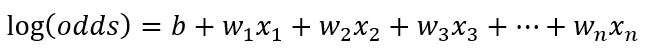

Equation to obtain the best-fit line for log(odds).

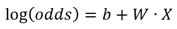

Vectorized version.

等式的右边就像我上一篇文章中的[所示，拟合一条直线进行线性回归，其中`W`是由每个特征的斜率组成的矩阵，具有`(number_of_features, 1)`的**形状**；而`X`是由每个样本的特征组成的矩阵，具有`(number_of_samples, number_of_features)`的**形状**。然后将*对数(赔率)*转换为图左侧的概率方程`p`，其中图中的 **y 轴**代表概率。](/geekculture/understanding-linear-regression-by-implementing-from-scratch-761e2a48fce4)

*赔率*类似于概率，它们是通过计算“是”类别相对于“否”类别的出现次数的比率而获得的。例如，假设有 5 个**肥胖**的人和 10 个**不肥胖**的人，那么**肥胖**的*几率*为 5:10 或 5/10，而**肥胖**的几率为 5/(5+10)。 *log(odds)* 仅仅是几率的自然对数。为了进一步理解关于赔率和 *log(odds)* 的概念，你可以参考 Josh Starmer 的这个[惊人视频](https://youtu.be/ARfXDSkQf1Y?list=PLblh5JKOoLUICTaGLRoHQDuF_7q2GfuJF)。

在上图中，我们可以看到概率的公式`p = np.exp(np.log(odds)) / (1 + np.exp(np.log(odds))`。这个公式是由*log(odds)*=*log(p/(1-p))*的方程推导出来的。要看推导过程，可以参考上图链接的视频(时间为 **4:00** )。通过将分子和分母都除以指数项`np.exp(np.log(odds)`，该公式还可以进一步简化为`p = np.exp(1 / (1 + np.exp( - np.log(odds))`。

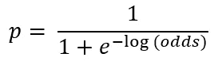

Sigmoid function of logits in logistic regression.

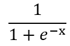

Sigmoid function.

这是最常见的公式形式，称为 **sigmoid 函数**或**逻辑函数**。在逻辑回归的情况下，我们具体使用 *log(odds)* 的 **sigmoid 函数来获得概率。**


Sigmoid function. Image from [Wikipedia](https://en.wikipedia.org/wiki/Sigmoid_function).

同时，*对数(赔率)*是通过将一条线拟合到数据点而获得的，如本节上文所述。稍后，这些概念将应用于构建实现。

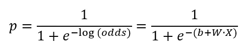

The final equation to compute the probability.

# 为二元分类训练逻辑回归模型的关键概念概述

## 进行预测的假设方程

概率从下面的等式中获得。然后，如上所述，通过与阈值进行比较来预测类别。

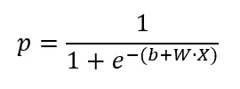

The sigmoid function of logits (equivalent to the equation from the fitted line) in logistic regression

## 因素

待训练参数与线性回归相同。

`W`:坡度系数，形状为`(number_of_features, 1)`。

`b`:y 轴截距。

## 成本函数(或损失函数)

二元交叉熵损失(又名对数损失):

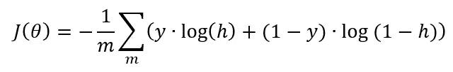

其中:
**m** =样本数。
**y** =真值，通常在二进制分类的情况下只由 0 和 1 组成。
**h** =假设方程，在这种情况下，方程获得概率(如上图)。

这种最小化交叉熵损失的方法也被称为**最大似然估计(MLE)** 。

## 派生物

成本函数相对于 **b** 的导数(图中*):*

*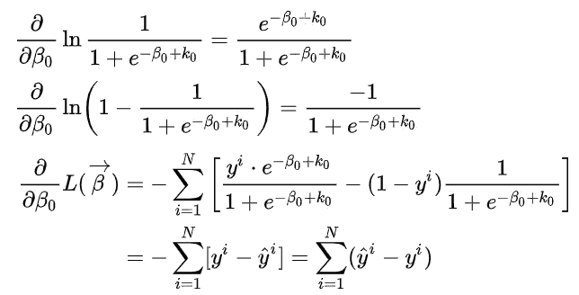*

*Derivation for the y-intercept in cross-entropy, from Wikipedia. ([source](https://en.wikipedia.org/wiki/Cross_entropy))*

*成本函数相对于 **W** 的导数(图中*):**

**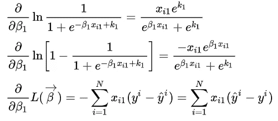**

**Derivation for the slope coefficient in cross-entropy, from Wikipedia. ([source](https://en.wikipedia.org/wiki/Cross_entropy))**

**在成本函数中有一个`(1 / m)`的乘法，但是它们不包括在维基百科的推导中。因此，代码的“翻译”应该是:**

```
**# Let y_proba = the probability computed from the hypothesis equation
db = (1 / m) * np.sum(y_proba - y)
dW = (1 / m) * (X.T @ (y_proba - y))**
```

# **二元分类的实现**

**让我们先准备好数据集。我们使用[心脏病 UCI 数据集](https://www.kaggle.com/ronitf/heart-disease-uci)来实现对一个人是否患有心脏病的二元分类。**

```
**df = pd.read_csv('heart.csv')
df.head()**
```

**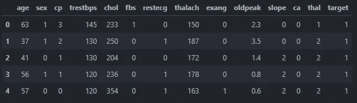**

**将数据集分为训练集和测试集:**

```
**X = df.drop(columns='target')
y = df['target']
X.shape, y.shape
# ((303, 13), (303,))X_train, X_test, y_train, y_test = train_test_split(X, y, test_size=0.2, random_state=42)
y_train.shape, y_test.shape
# ((242,), (61,))# IMPORTANT STEP (as explained in my previous article)
y_train = y_train.values.reshape(-1, 1)
y_test = y_test.values.reshape(-1, 1)
y_train.shape, y_test.shape
((242, 1), (61, 1))**
```

**缩放数据集，以确保在稍后与 Scikit-learn 实施进行比较时获得更准确和一致的结果。**

```
**scaler = StandardScaler()
X_train = scaler.fit_transform(X_train)
X_test = scaler.transform(X_test)**
```

**那么培训过程可以分为:**

1.  **随机初始化参数**
2.  **使用当前状态的模型进行预测以获得概率**
3.  **计算成本函数的导数**
4.  **使用梯度下降来更新参数**
5.  **根据给定的迭代次数，循环重复步骤 2-4**

**下面的`class`中的`fit`方法包含了整个训练过程的代码。**

****第 10 行**:`init_params`方法实现参数的随机初始化。**

****第 23 行**:使用`get_logits`方法得到拟合直线的方程，相当于逻辑回归情况下的 *log(odds)* 或 logits。**

****第 30 行**:**`predict_proba`方法是用于获得二元分类概率的 sigmoid 函数。****

******第 38 行**:`fit`方法实现整个训练过程。****

******Line 76–84**:`predict`方法用于通过将概率与指定阈值进行比较来获得预测的类别，而`predict_score`方法用于计算预测的准确性。****

****我决定继承`BaseEstimator`和`ClassifierMixin`类，以便能够使用这个类通过`sklearn`的`cross_val_score`进一步计算交叉验证。但是如果认为没有必要，你可以省略它们。****

****现在，我们来看看训练结果。****

```
****# OUTPUT:
My implementation:
0.8524590163934426
[[25  4]
 [ 5 27]]Scikit-learn implementation:
0.8524590163934426
[[25  4]
 [ 5 27]]Cross-validation score:
0.8179421768707483
0.8179421768707483****
```

****太好了！测试精度，混淆矩阵，甚至交叉验证分数都和`sklearn`实现一样。但是，有一个问题，每次我拟合模型都得到相同的结果，虽然我已经将 NumPy 的随机种子设置为 42，但我不确定为什么每次结果都不同。因此，您可能需要重复几次模型创建和训练，以获得与`sklearn`实现相同的结果。现在让我们展示一些漂亮的视觉效果。****

# ****形象化****

```
****# plot confusion matrix for binary classification
from sklearn.metrics import plot_confusion_matrix
plot_confusion_matrix(my_log_reg, X_test, y_test, cmap='Blues', display_labels=['Healthy', 'Heart Disease'])
plt.grid(None);****
```

****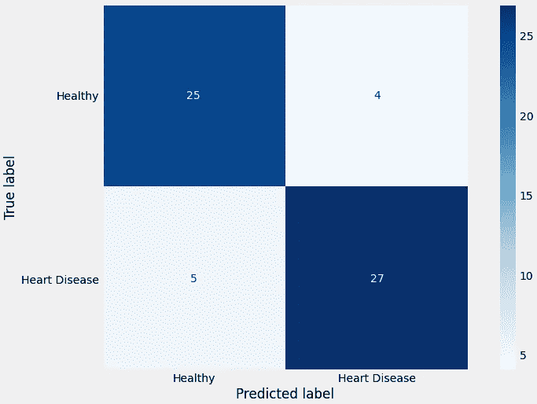****

****Image by author.****

****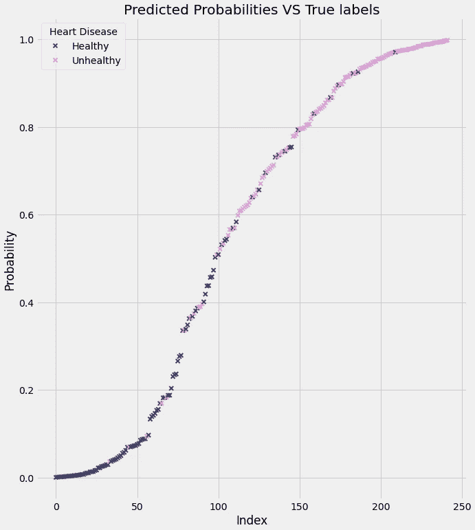****

****Image by author.****

****这种可视化显示了由训练模型计算的预测概率，然后数据点的不同颜色显示了“不健康”(患有心脏病)或“健康”的实际标签。请注意，该曲线看起来类似于 s 形曲线。****

****好的，我们对二元分类的实现结果很满意。接下来，我也想谈谈多类分类的实现，因为它实际上是当前类的简单扩展。****

# ****多项式逻辑回归的关键概念****

> ****定义多类概率的概率分布称为多项式概率分布。适于学习和预测多项概率分布的逻辑回归模型被称为**多项逻辑回归**。
> —杰森·布朗利[机器学习掌握](https://machinelearningmastery.com/multinomial-logistic-regression-with-python/)****

## ****假设方程****

******softmax 函数**用于计算概率:****

****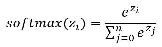****

****Softmax function. ([source](https://www.kdnuggets.com/2016/07/softmax-regression-related-logistic-regression.html))****

****在逻辑回归的情况下，上面等式中的 ***z*** 被从拟合直线的等式中计算出的逻辑矩阵代替，这类似于二进制分类版本中的逻辑，但是用`(number_of_samples, number_of_classes)`的**形状**代替`(number_of_samples, 1)`。本质上，这里的 softmax 函数将**输出每个类别**的概率，这与二进制分类中的 sigmoid 函数不同，后者只计算获得“是”类别的概率。下面是 softmax 使用代码的基本介绍。****

```
****# OUTPUT:
[[1002 1080 1100]
 [   5    7    8]
 [   2    4    6]
 [   3    4    5]]
mx = array([[1100],
       [   8],
       [   6],
       [   5]])
x - mx = array([[-98, -20,   0],
       [ -3,  -1,   0],
       [ -4,  -2,   0],
       [ -2,  -1,   0]])
denominator = array([[1\.        ],
       [1.41766651],
       [1.15365092],
       [1.50321472]])
result = array([[2.74878500e-43, 2.06115362e-09, 9.99999998e-01],
       [3.51190270e-02, 2.59496460e-01, 7.05384513e-01],
       [1.58762400e-02, 1.17310428e-01, 8.66813332e-01],
       [9.00305732e-02, 2.44728471e-01, 6.65240956e-01]])
Sum of probabilities = [[1.]
 [1.]
 [1.]
 [1.]]****
```

****如输出中所示，每一行(每一个数据记录)都被转换成概率，并且每一行的总和为 1，这证明 softmax 函数将它们转换成每个类的概率，在本例中，有 3 个类(3 列)。顺便提一下，从`scipy.special.softmax`开始`scipy`已经有了一个现有的实现。****

## ****因素****

****待训练的参数仍然与二进制分类的情况相同，但是具有不同形状的**以适应**更高数量的类别**。******

******`W`:每个特征和每个类别的斜率系数，形状**为`(number_of_features, number_of_classes).`的********

******`b`:每一类的 y 轴截距，形状为`(1, number_of_classes)`的**形状********

## ******价值函数******

******代价函数是**分类交叉熵损失**，它是二元交叉熵损失的推广。******

******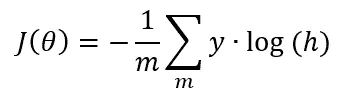******

******Cross-entropy for multi-class classification. ([source](https://ml-cheatsheet.readthedocs.io/en/latest/loss_functions.html))******

******这里的`y`代表“目标”(真实的类标签)，而`h`代表输出(通过 softmax 计算的概率； ***不是*** 的预测类标签)。******

## ******派生物******

******这里是这两个参数的偏导数，因为它们相当复杂，所以这里就不展示推导的繁琐细节了。******

******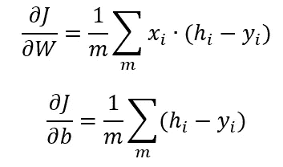******

******Derivatives obtained from the first article reference below.******

******代码的“翻译”将是:******

```
******dW = (1 / m) * (X.T @ (y_proba - y))
db = (1 / m) * np.sum((y_proba - y), axis=0, keepdims=True)******
```

******要进一步了解 softmax 如何工作，如何定义成本函数，以及它们如何与多项式逻辑回归相关，您可以参考下面的文章。******

******[](https://www.kdnuggets.com/2016/07/softmax-regression-related-logistic-regression.html) [## 什么是 Softmax 回归，它与 Logistic 回归有什么关系？- KDnuggets

### Softmax 回归(同义词:多项式逻辑，最大熵分类器，或只是多类逻辑…

www.kdnuggets.com](https://www.kdnuggets.com/2016/07/softmax-regression-related-logistic-regression.html) 

关于 softmax 的详细解释，你也可以参考下面的文章。

[](https://towardsdatascience.com/softmax-activation-function-how-it-actually-works-d292d335bd78) [## Softmax 激活功能——实际工作原理

### Softmax 是放置在深度学习网络末端的函数，用于将 logits 转换为分类概率。

towardsdatascience.com](https://towardsdatascience.com/softmax-activation-function-how-it-actually-works-d292d335bd78) 

# 多类分类的实现

二进制分类版本只有一些变化。首先，我们使用来自`sklearn`的 iris 数据集，因为有 3 个目标类。然而，首先，目标标签必须是一位热编码的，以确保 softmax 和导数的正确计算:

然后对我们的`MyLogisticReg`类的第一个更改是对系数和截距的参数初始化— `init_params`方法的更改，其中形状与上面解释的不同。

然后用 softmax 函数代替 sigmoid 函数进行多类分类。上面显示的`predict_proba`方法可以适应二元和多类分类。

在`fit`方法中，对于`b`、`db`的导数，梯度的计算也略有变化，以计算右轴的和。

接下来，`predict`方法将通过计算所有类别概率中最高概率的索引来获得预测的类别标签。`predict_score`方法将从独热编码的`y`值和预测的准确度分数中计算出真实类别。

```
# OUTPUT:
Result in accuracy:
My implementation	: 0.98
Sklearn implementation	: 0.98
```

训练结果与 Scikit 相同-再次学习实现。因此，我们的实现应该非常接近 Scikit-learn 的`LogisticRegression`类的`multinomial`实现。

整堂课可以在这里看到:

对于本文中使用的完整代码，您可以参考 GitHub 中的[笔记本。](https://github.com/ansonnn07/ML-implmentations/blob/main/logistic_regression/log_reg_from_scratch.ipynb)

# 最后的想法

在本文中，我们学习了逻辑回归的基本概念，以及二元和多类分类的关键概念及其各自的实现。我相信这将有助于巩固我们对逻辑回归的理解。

这些概念，尤其是 softmax 和分类交叉熵损失，在神经网络领域中非常常见，因为存在许多多类分类问题。因此，通过进一步理解这些的基本概念，我相信你会对将它们应用于神经网络以及这里没有提到的其他一些应用更有信心。******