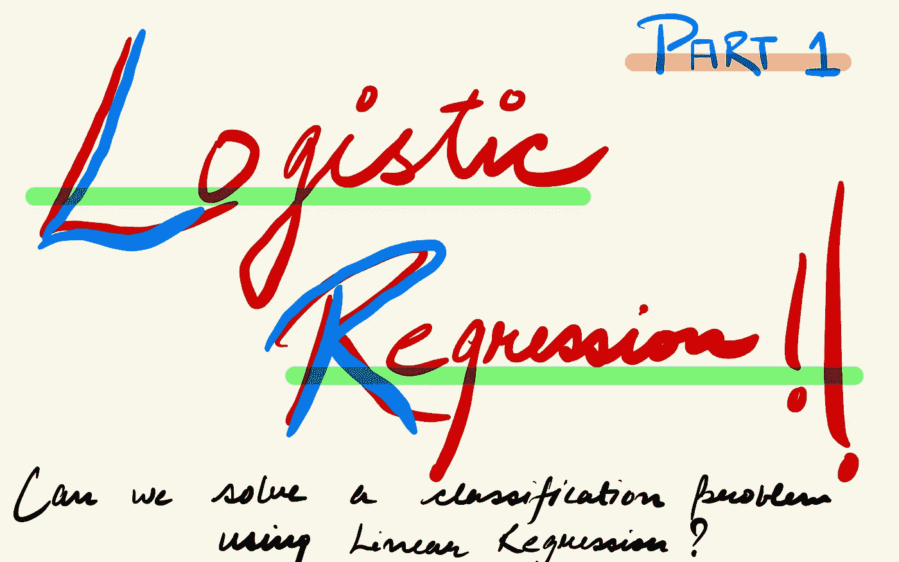
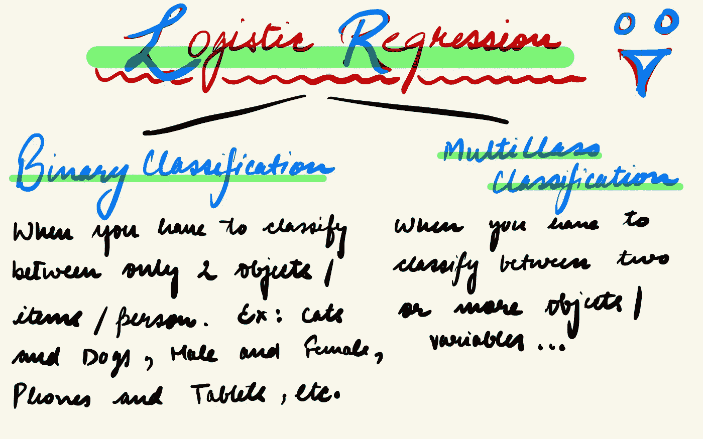
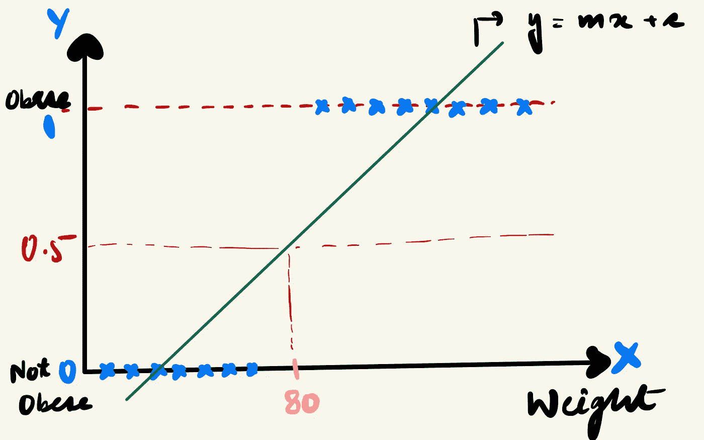
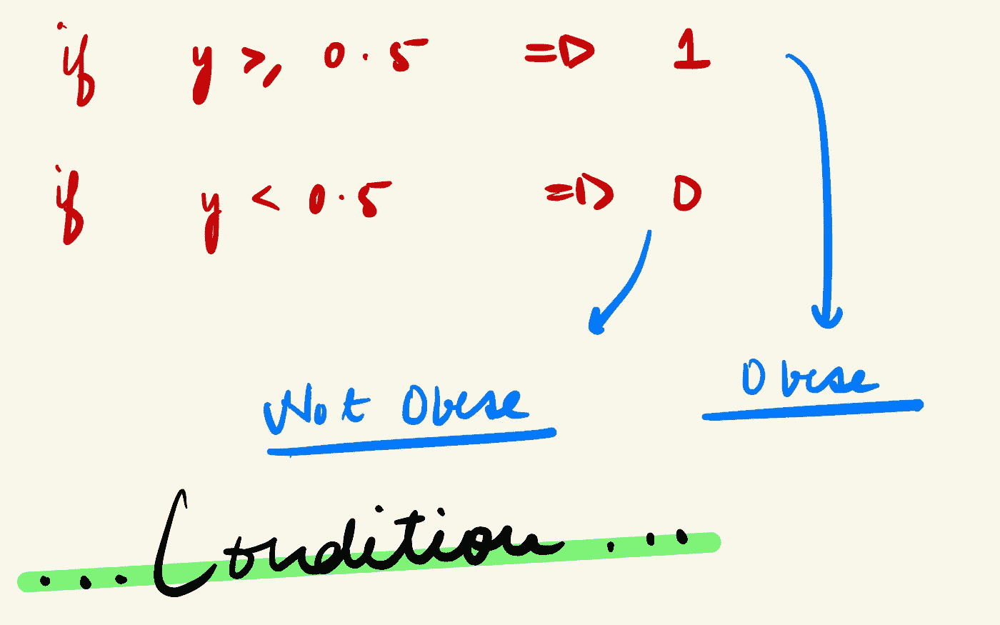
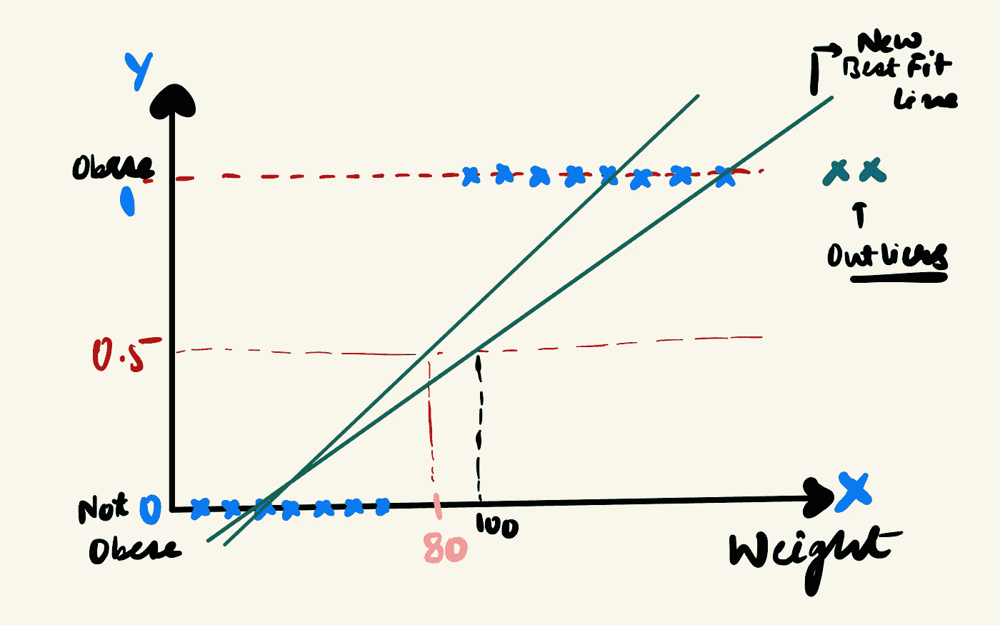

# 逻辑回归|线性回归直觉|第 1 部分

> 原文：<https://medium.com/geekculture/logistic-regression-the-linear-regression-intuition-part-1-47cfae8a8c2c?source=collection_archive---------43----------------------->

Logistic Regression | Part 1

在线性回归博客中，我谈到了进入机器学习的世界。在了解了线性回归这一回归问题后，我们通常会进入逻辑回归。在这个博客中，我们将学习关于分类问题的线性回归直觉的一切。如果你还没有看过线性回归博客，这里有链接:

 [## 机器学习初学者指南|线性回归

### 当我们进入机器学习的世界时，我们大多数人都从它是什么开始，然后从线性回归开始…

kumawatrohan.medium.com](https://kumawatrohan.medium.com/beginners-guide-to-machine-learning-linear-regression-ab4c30d3ece2) 

# 介绍

分类的目的是确定一个观察值属于哪一类，这是通过理解因变量和自变量之间的关系来完成的。这里的因变量是分类的，而自变量可以是数字或分类的。

逻辑回归是一个分类问题。逻辑回归的思想是找到特征和特定结果的概率之间的关系。当我们的目标变量是分类变量时使用它。例如:在猫和狗之间分类，学生不及格或及格，一个人是否有糖尿病，等等。

逻辑回归也有两种类型:

Types of Logistic Regression

大家心中应该产生的一个问题是，如果是分类算法，为什么是 Logistic 回归而不是 Logistic 分类？

# 为什么是逻辑回归？

让我们借助一个例子来理解这一点:

Example 1

这张图表示，在 X-Y 轴上，我们在 X 轴上绘制了体重，Y 轴表示一个人可能肥胖，也可能不肥胖。通俗地说，我们根据一个人的体重来划分这个人是肥胖还是不肥胖。如果某人体重超过 80 公斤，他/她就是肥胖，如果低于 80 公斤，他/她就不是肥胖。我们应该想出一些能直接给我们结果(肥胖/不肥胖)的东西。

可以用线性回归解决这个问题吗？

在线性回归中，我们将试图找到一条直线，使得直线和点之间的距离总和最小。我们可以设定一个条件，如果我们的“y”值超过或等于一个特定值，那么我们就认为这个人肥胖。我们可以利用线性回归来解决这个二元分类问题。

Example 2 (Condition)

如果是，那么线性回归有什么问题？

让我们考虑一下，我们得到了一个异常值，我们的最佳拟合线将随之改变。根据这条新的最佳匹配线，如果有人体重超过 100 公斤，那么这个人就超重了。这个结果不是我们想要的！

Example 3 (Flaw)

使用线性回归，我们用距离来计算一切。它引入了高错误率。如果我们的值大于 1 或者小于 0，对于这种情况我们应该考虑什么？

# 摘要

我们不使用线性回归进行分类，因为它处理连续值，而分类问题要求离散值。线性模型不输出概率，但它将类视为数字(0 和 1)。它符合使点超平面之间的距离最小化的最佳超平面(对于单个特征，一条线)。它还会给出小于 0 和大于 1 的值。由于预测的结果不是概率，而是点之间的线性插值，因此没有有意义的阈值来区分一个类别和另一个类别。线性模型不能扩展到多类分类问题。你必须开始用 2 标记下一个类，然后是 3，依此类推。这些类可能没有任何有意义的顺序，但是线性模型会在要素和类预测之间的关系上强加一种奇怪的结构。具有正权重的要素的值越高，它对预测具有较高数值的类的贡献就越大，即使碰巧相似的类并不比其他类更接近。

这篇博客是关于我们是否可以使用线性回归进行逻辑回归，我们发现从技术上来说我们可以执行这个算法，但是它有更高的错误率。因此，我们不使用线性回归来解决分类问题。在逻辑回归博客的第 2 部分，我们将理解逻辑回归背后的直觉，以及在构建我们的分类模型时，它为什么比线性回归更好。