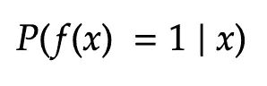
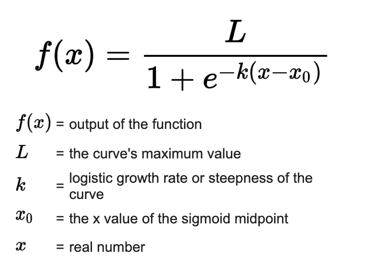
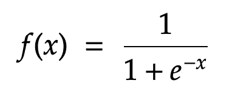
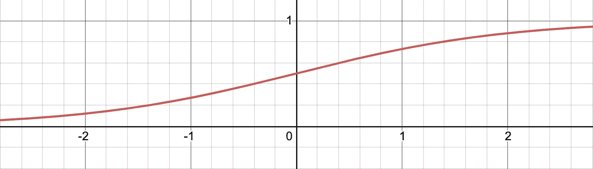
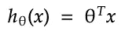
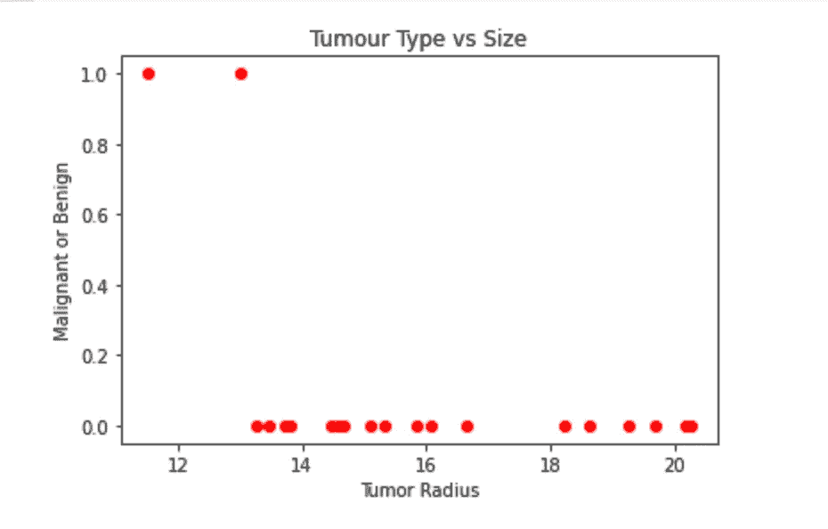

# 使用梯度下降的逻辑回归:直觉和实现

> 原文：<https://medium.com/geekculture/logistic-regression-using-gradient-descent-intuition-and-implementation-36a8498afdcb?source=collection_archive---------21----------------------->


Photo by [Isaac Smith](https://unsplash.com/@isaacmsmith?utm_source=medium&utm_medium=referral) on [Unsplash](https://unsplash.com?utm_source=medium&utm_medium=referral)

这是我正在从事的系列文章的第三部分，其中我们将讨论和定义介绍性的机器学习算法和概念。在这篇文章的最后，你会找到这个系列的所有前几篇文章。我建议你在深入研究这个之前先阅读一下[线性回归:直觉和实现](https://ali-h-khanafer.medium.com/linear-regression-using-gradient-descent-intuition-and-implementation-522d43453fc3)。因为我在那里介绍了一些与逻辑回归非常相关的概念，我会在很多场合引用它们。

在本文中，我们将详细介绍逻辑回归背后的理论，并使用 Scikit-Learn 的逻辑回归类来查看它的实际应用。

让我们开始吧。

# 个案研究

理解逻辑回归概念的最好方法是通过一个例子。因此，在阅读本文的其余部分时，想象自己处于以下场景中:

> 你是一名居住在纽约市的数据科学家，纽约的新冠肺炎病例数量正在快速上升。你的朋友发烧了，但是如果他只是得了流感，他不想在测试上浪费 250 美元。他让你训练一个模型，根据他的症状预测他是否患有新冠肺炎。

# 逻辑回归

尽管名字如此，逻辑回归**并不是**用于回归，而是用于分类。在分类中，目标是根据属性将数据分类到离散的组中。在我们的运行示例中，我们有两个不同的可能组:阳性组和阴性组。逻辑回归是一种监督学习算法，因为它从预先存在和标记的数据中学习，以便对新的、传入的数据进行分类。

逻辑回归不是给我们一个绝对值，而是输出一个概率。该模型给出了一个介于 0 和 1 之间的值。例如，值 0.75 表示患者有 75%的几率患有新冠肺炎。更正式地说，我们希望找到:



我们将看一下`f(x)`只能取两个可能值的情况，然后我们将把发言权留给您，让您来决定我们如何扩展这个模型来处理多个类。

*线性*回归可用于将患者分类为测试阳性还是阴性？技术上来说，是的。这是个好主意吗？肯定不是。原因如下:

1.  在线性回归中，因变量可以取连续数量的值。在我们的场景中，我们需要我们的模型在离散数量的值之间做出决定。
2.  为了让线性回归很好地工作，在因变量和自变量之间需要有线性相关性。

## 直觉

术语“逻辑”来自逻辑功能的使用:



**Equation 1:** Logistic Function

就像指数函数一样，逻辑函数用于模拟人口的指数增长，只是它考虑了影响人口承载能力的不同因素。我们可以操作这个函数，使它输出一个介于 0 和 1 之间的值。`L`被定义为曲线的最大值。我们希望这个值等于 1。我们不想改变增长率，所以`k`也等于 1。`x_0`被定义为中点的 x 值。将其设置为零，我们得到中点 0.5，等式简化为:



**Equation 2:** SimplifiedLogistic Function

这给了我们下面的曲线:



**Figure 1:** Logistic Regression Curve with L ,k, and x_0 = 1

关于这条曲线，有几点很重要:

1.  随着`x`接近正无穷大，`f`接近 1
2.  随着`x`接近负无穷大，`f`接近零
3.  在`y=1`和`y=0`有渐近线
4.  `f(0)=0.5`

给定`x`的一个值，这个函数将吐出一个介于 0 和 1 之间的值。那么我们的`x`是什么？

在关于线性回归的[文章](https://ali-h-khanafer.medium.com/linear-regression-using-gradient-descent-intuition-and-implementation-522d43453fc3)中，我们提出了一个处理线性相关变量的通用公式:


**Equation 3:** Multivariate Linear Regression

还是那句话，这个方程输出的是连续数，所以不能用在分类问题上。然而，它很有用，因为它描述了不同特性之间的关系。如果我们能使`h`输出的值被压缩到 0 到 1 之间，那么我们的问题就解决了。

为简单起见，将`x_0 = 1`设在**等式 3** 中，那么我们可以用矢量形式表示为:



**Equation 4:** Multivariate Linear Regression In Vector Form

其中`Theta=[Theta_0,Theta_1,...,Theta_j]`、`x = [x_0,x_1,...x_j`和`Theta^T`是行向量`Theta`的转置。这可用于我们的物流功能，以获得:


**Equation 5:** Logistic Function With x = h

这是我们用于逻辑回归的方程。根据图 1 中的**曲线和**公式 5** 我们可以得出结论:**

1.  如果`h >= 0`则`p(f(x) = 1 | x) >= 0.5`
2.  如果`h < 0`则`p(f(x) = 1 | x) > 0.5`

在我们的例子中，如果`h>=0`，我们将预测值为 1。否则，我们预测值为零。

和线性回归一样，现在剩下的就是找到使`h`最小的`Thetas`。

# 梯度下降

在本系列的第二部分中，我们强调了梯度下降不仅仅用于线性回归的事实。事实上，我们展示的算法不够通用。这里有一种更好的描述算法的方式:


其中`J`是任何[成本函数](https://en.wikipedia.org/wiki/Cost_function)，即传达您的参数执行情况的函数。

对于线性回归，我们的成本函数是 MSE。对于逻辑回归，我们不能再用这个了。为逻辑回归得出成本函数的步骤超出了本文的范围。因此，我们将提供等式，并留给您去深入挖掘:


**Equation 6:** Logistic Regression Cost Function

其中`Theta`、`x`和`y`为向量，`x^(i)`为特征向量`x`中的第 I 个条目，`h(x^(i))`为第 I 个预测值，`y^(i)`为类别向量`y`中的第 I 个条目，即第 I 个实际值。在上面定义的算法中插入这个将会给我们一个最小化`J`的`Theta`向量。

# 履行

让我们看看如何使用 Scikit-learn 的[逻辑回归](https://scikit-learn.org/stable/modules/generated/sklearn.linear_model.LogisticRegression.html)类和内置的[乳腺癌数据集](https://scikit-learn.org/stable/modules/generated/sklearn.datasets.load_breast_cancer.html#sklearn.datasets.load_breast_cancer)类来为我们的模型找到最佳参数。我们将使用肿瘤的半径来预测肿瘤是恶性还是良性。

首先，我们导入我们需要的库:

```
# Scikit learn's built-in Breast Cancer dataset
from sklearn.datasets import load_breast_cancer# Library for scikit-learn compatible arrays and matrices
import numpy as np# Library for plotting nice graphs
import matplotlib.pyplot as plt
```

然后将我们的特征(肿瘤半径)与我们的目标变量(恶性或良性)分开:

```
# Loads sklearn's Breast Cancer dataset
dataset = load_breast_cancer()# Set x as the tumour radius
X = dataset.data[:100,0]# Set y as the tumour type (malignant (0) or benign (1))
y = dataset.target[:100]
```

然后将它们分开，这样 20%的数据用于测试，其余的用于训练我们的模型:

```
# Split data into 20% testing and 80% training
from sklearn.model_selection import train_test_splitX_train, X_test, y_train, y_test = train_test_split(X, y, test_size = 0.2, random_state = 0)
```

我们的数据现在可以用于我们的逻辑回归模型了。我们需要做的第一件事是使用我们的训练集来训练它。请记住，逻辑回归是一种*监督学习算法，*意味着它从以前的数据中学习，以预测新的传入数据的值:

```
# Train the model with our training set using logistic regression
from sklearn.linear_model import LogisticRegression# Run Gradient Descent to get the values of Theta
regressor = LogisticRegression()regressor.fit(X_train.reshape(-1,1),y_train)
```

我们可以看到获得的`Thetas`和`Theta_0`的值:

```
print(regressor.coef_) # Theta Vector
print(regressor.intercept_) # Theta_0
>> [[-0.8996107]] 
>> [11.83182617]
```

让我们通过绘制图表来看看我们的模型相对于我们的测试集的表现如何:

```
plt.scatter(X_test,regressor.predict(X_test.reshape(-1,1)),color='red')plt.title('Tumour Type vs Size')plt.xlabel('Tumor Radius')plt.ylabel('Malignant or Benign')plt.show()
```



**Figure 2:** LogisticRegression Predictions On Test Data

# 结论

在本文中，我们介绍了逻辑回归背后的理论，以及如何使用梯度下降算法来查找参数，从而为我们的数据点提供最佳拟合模型。我们还研究了如何使用 Scikit Learn 的逻辑回归类在我们选择的数据集上轻松使用该模型。

尽管本文提供了大量信息，但还有很多我们没有涉及到的内容。以下是一些需要你思考的事情:

*   为什么不能用 MSE 作为代价函数？如果我们对分类问题使用 MSE 运行梯度下降会发生什么？试着画出`J`的曲线，看看结果是什么。
*   我们如何扩展本文中使用的逻辑，将逻辑回归用于多类分类？例如，将产品分类为水果、蔬菜或其他。这里，有三个不同的类。
*   尝试在分类问题上使用线性回归，看看结果会有多差。
*   试着理解我们如何得到逻辑回归的成本函数。
*   为什么我们的`Theta`向量中只有一个值？

# 过去的文章

1.  **第一部分:** [数据预处理](https://ali-h-khanafer.medium.com/data-pre-processing-ee81bbe5cc77)
2.  **第二部分:** [使用梯度下降的线性回归:直觉和实现](https://ali-h-khanafer.medium.com/linear-regression-using-gradient-descent-intuition-and-implementation-522d43453fc3)

# 参考

1.  [自由文本的逻辑方程式](https://math.libretexts.org/Bookshelves/Calculus/Book%3A_Calculus_(OpenStax)/08%3A_Introduction_to_Differential_Equations/8.4%3A_The_Logistic_Equation#:~:text=dPdt%3DrP(1%E2%88%92PK,problem%20for%20P(t).&text=If%20r%3E0%2C%20then%20the,grows%20rapidly%2C%20resembling%20exponential%20growth.)
2.  [吴恩达的机器学习 Coursera 课程](https://www.coursera.org/learn/machine-learning?page=1)
3.  [维基成本曲线](https://en.wikipedia.org/wiki/Cost_curve)