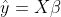
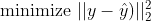
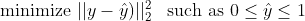
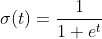
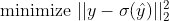
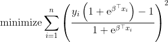
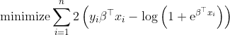
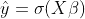
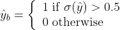

# 无概率逻辑回归理论

> 原文：<https://medium.com/geekculture/logistic-regression-without-probabilities-theory-1994000bf927?source=collection_archive---------24----------------------->

## 机器学习变得简单

## 这是一个扭曲的线性回归


by **Austin Chan**

# 介绍

逻辑回归是一种在许多方面类似于线性回归的统计模型。但是，与线性回归相反，逻辑回归涉及强概率理论概念，如对数似然、贝叶斯定理或条件概率。事实上，逻辑回归解通常是从二项式分布的对数似然性的最大化得到的。

在本文中，我们提出了一种**线性回归方法作为替代公式**，其中您不需要知道什么是二项式分布或对数似然性。但是，如果您知道什么是线性回归，您将学习如何毫不费力地导出逻辑回归，如何使用它，以及如何使用 python scikit-learn 正确地解决它。

# 逻辑回归再探

在线性回归中，我们要预测一个**连续**变量( **y)** ，用模型的参数( **β** )加权的一组特征( **X)** )。假设我们已经为两者( **y，X** )收集了 **n** 个数据点。例如，我们可以通过一名球员的位置、进球数和年龄来预测他的转会金额。在这种情况下， **X** 是一个具有 **n** 行和 3 列的矩阵，而 **y** 是一个大小为 **n.** **的向量，那么预测值(hat y)就是这三个特征的线性组合**。数学上我们有:



The linear predictor

现在，您可以为设置的参数 **β** 取任何您想要的数字，并进行预测。但是，如果您想变得更聪明，您可以定义一个函数来优化，以找到一组最佳参数。该函数将测量线性预测值和真实目标值的接近程度。

> 为了确保参数集是唯一的，我们需要函数在最小化时是凸的，在最大化时是凹的。

通常选择**均方误差(MSE)** 作为最小化函数。有像平均绝对误差、Huber 损失和许多其他的选择，它们中的每一个都有特定的属性。

在我们优化均方误差的情况下，我们将需要找到使以下量最小化的一组参数:



minimizing the mean squared error

**它是我们误差的 2 范数平方，**误差是我们预测的值( **y** )和实际目标值( **y** )之间的差值。这只是 MSE 的一个奇特符号。有时候我们可以在约束下优化。例如，如果您希望参数为正，那么您可以在约束条件下最小化 MSE，即 **β > 0** 。

所以线性回归的步骤只是:获得一些数据，有一个函数来优化(MSE)，并找到最佳的模型参数。我们不会推导出解决方案，因为网络上有成千上万篇文章在做这件事，而这不是本文的目的。

# 逻辑回归再探

本文的目标是说明逻辑回归等价于线性回归。但是有一点小小的改变。

与线性回归一样，逻辑回归也是一种线性模型:预测依赖于特征的线性组合。这次我们要预测一个**二元**变量( **y)** ，用模型的参数( **β** )加权一组特征( **X)** )。什么是二元变量？这意味着目标只能取两个值:0 或 1。这是一种数学方式来表达一个事件是否发生。例如，球队得分(y=1)对没有得分(y=0)，或者主队获胜(y=1)对主队失败(y=0)。两者之间没有可能的值。

到目前为止，它就像线性回归一样，但事实上 **y** 是二元的，这给问题增加了挑战:现在**预测必须在相同的二元尺度上**。事实上，你不可能有一个负面的预测，或者高于 1 的预测。但是你可以在 0 和 1 之间进行连续预测。我们如何实现这一目标？

> 线性回归和逻辑回归的主要区别在于预测被限制在连续区间[0，1]内。

第一种解决方案是将预测限制在相同的区间内:



MSE of constrained linear regression

这个问题是线性的，也是可解的，但是**只适用于样本**。没有什么能保证模型从未见过的新数据会满足约束。

一个始终有效的更好的解决方案是转换预测，使其始终处于正确的区间。一个可能的转换是**sigmoid 函数(σ):**



the sigmoid function

如你所见 **t** 可以取任意值， **σ(t)** 将始终在[0，1]区间内。问题解决了。要最小化的新 MSE 函数为:



MSE of logistic regression (norm form)

上面定义的均方误差被称为 **Brier 分数**。让我们用它们的值来代替所有的数学量:



MSE of logistic regression (scalar form)

不失一般性，我们可以最小化各个平方表达式的对数之和。然后，由于 **y** 只能取两个值，最小化简化为:



MSE of logistic regression (reduced form)

这种简化形式正好是逻辑回归模型的标准概率推导的对数似然比的两倍。解决方案是一样的。

> 逻辑回归是一种线性回归，其中预测值通过 sigmoid 函数进行转换

最小化可以在 scikit-learn 中使用正确的输入集通过类`LogisticRegression`来执行:

```
from sklearn.linear_model import LogisticRegression#fit_intercept can be False if we need to
model = LogisticRegression(penalty=”*none*",fit_intercept=True) 
model.fit(X, y)
```

至此，模型求解完毕，可以在`model.coef_`中找到参数 **β** 。根据我们的框架，预测如下:



the logistic regression predictor

我们可能会争辩说，我们可以使用任何在 0 和 1 之间缩放预测的函数，这并不是完全错误的。不是所有的函数都适合，因为最后一步必须是凸的或凹的才能优化。但是乙状结肠就是这种情况。

此外，sigmoid 是使线性回归框架等同于概率方法的唯一函数。

# 分类符合回归

到目前为止，我们只谈到了回归，这就是我们所做的。但是你可以在任何一本统计学书籍中查找，**逻辑回归是一个分类模型。**那么我们遗漏了什么？

使用 scikit-learn 在回归框架中进行预测，您通常称之为`model.predict(X)`。如果你用上面的`LogisticRegression`来做，你将会得到一个 0 和 1 的二进制集合，**类**。其实有点误导。你想称之为`model.predict_proba(X)`,这正是我们目前在线性回归框架中定义的预测。

由于这些预测在区间[0，1] **中是连续的，它们可以被解释为概率。**如果预测值接近 1，表示 0.87，那么更有可能是 1 而不是 0 **。因此，通过一个简单的规则，这些预测可以变成双星预测:**



这正是`model.predict(X)`为`LogisticRegression`型号所做的。显然，例如，当预测接近 0.5 时，您可以更改 0.5 阈值或使用未知决策。所以使用预测比使用类更有趣。

# 结论

在这篇文章中，我们展示了如何逻辑回归可以推导出没有知识的概率理论。仅使用线性回归框架，我们解释了约束线性回归和逻辑回归是等价的。

概率往往比经典代数更难理解。通常存在一个替代概率方法的角度，但这不应该阻止你学习概率 models⁵和贝叶斯统计。

[1] P. J. Huber，[位置参数的稳健估计](https://www.jstor.org/stable/2238020)，1994 年，数理统计年鉴，35(1)，第 73–101 页

[2]主要用于优化目的，因为它使问题变得光滑、凸和可微

【3】代数的细节可以在[这里](https://www.octosport.io/post/logistic-regression-revisited)找到。

[4] T. Hastie、R. Tibshirani 和 J H. Friedman， [*《统计学习的要素:数据挖掘、推理和预测*](https://web.stanford.edu/~hastie/ElemStatLearn/download.html) ，纽约:斯普林格，2001 年。

[5] K. P. Murphy，《机器学习的概率观点》，麻省理工学院出版社，2012 年。