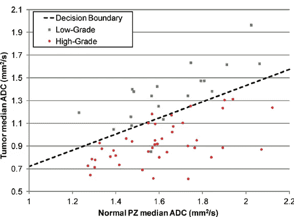
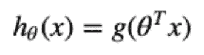
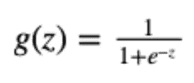
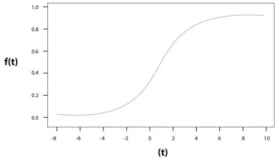
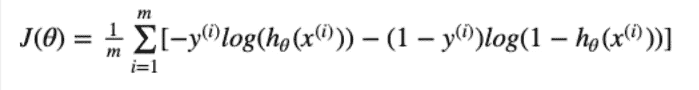
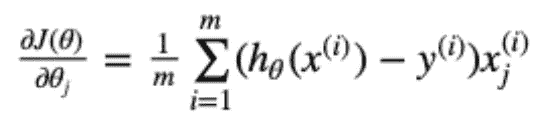

# 5 分钟内的物流回归(1/4)

> 原文：<https://medium.com/geekculture/logistics-regression-in-5-minutes-1-3-64a890ed79e1?source=collection_archive---------53----------------------->


最简单形式的逻辑回归是一种帮助分类数据的分类算法。我们有两个主要分类:

1.  **二元逻辑回归**，它给出了一个**是/否**的答案。
2.  **多项式/多类物流回归**，它给出了几个可以推导出的选项，几乎就像一个**选择题**。

# 二元物流回归

如上所述，这种给你一个是或不是的答案。我们可以用的例子是，根据一些因变量(特征)，这个人会有心脏病吗？

希望这有意义，这是一个简单的是或不是的答案。
让我们在下面的金属工业中想象一下，根据两个特征，根据“凸纹”和“正常 PZ”，我们需要确定金属是高品位还是低品位。



# 决策边界

运行物流回归，进行梯度下降，就可以确定什么叫做决策边界。在这里，我们将以

1.  θ0-或 y 轴截距
2.  θ1——斜率

有了这些，我们就可以画出如上的决策边界，这有助于我们可视化结果。

# 假设方程

为了对逻辑回归进行假设以**预测一个结果**，我们可以使用下面的等式。您将在下一篇文章中看到这些方法的实际应用，但是现在先不要放弃它们。假设函数是:



而 g 是一个 sigmoid 函数，定义如下:



在 matlab 中，这可以编码如下:

```
function p = predict(theta, x)
  m = size(x, 1); % Number of training examples
  p = round(sigmoid(X * theta));
end
```

而 sigmoid 函数，可以编码如下:

```
function h = sigmoid(z);
 h = 1 ./ (1 + exp(-z));
end
```

sigmoid 函数可如下图所示，并确保我们**将始终获得介于 0 和 1** 之间的结果。然后我们可以对这些结果进行四舍五入，得到我们的**是或否**答案。



# 计算假设的成本

所以，现在我们有了预测是/否的方法，我们还需要一种方法来计算我们预测的成本。计算成本时，我们需要计算以下两点:

**成本函数:**用以下等式定义



**梯度**:这是梯度(导数)，后面计算最佳θ时需要用到。



让我们看看上面的方程式代码

```
function [J, grad] = cost(theta, x, y)
  [m,n] = size(x);               % get sizes of x
  x = [ones(m,1), x];            % add column of 1's
  gradient = zeros(size(theta)); % initialise gradient
  h = sigmoid(x * theta);        % get hypothesis for this theta % calculate the cost of this theta 
  J = ((-y)'*log(h) — (1-y)'*log(1-h))/m;  % calculate gradients for each feature
  for j = 1:size(x,2)
    grad(j) = (1/m) * ((h-y)' * X(:,j));
  end
end
```

# 成本优化

现在，我们有了一个可以计算成本和梯度的函数，我们想通过成本优化过程来运行它，这将为我们提供用于**未来预测**的**最佳θ**。

我们很幸运，matlab 为我们提供了一个很好的功能。下面的函数称为**“寻找无约束多变量的最小值”**。该函数将代表我们完成繁重的工作，遍历各种θ，直到找到**最低成本**。下面是一个在 Matlab 中调用这段代码的例子。

```
options = optimset(‘GradObj’,’On’,’MaxIter’,400);
% Run cost optimisation 
theta = fminunc(@(t)computeCost(t, x, y, lambda), theta, options)
```

在我们看一个好的编码例子之前，我们还有一个话题要讲。当我们比较两个特性时，上面的方法很好，但是当我们有很多特性时，就不好了。

好了，是时候[进入下一篇文章](https://shaun-enslin.medium.com/logistics-regression-regularisation-2-3-4a0d8b85564c)了。