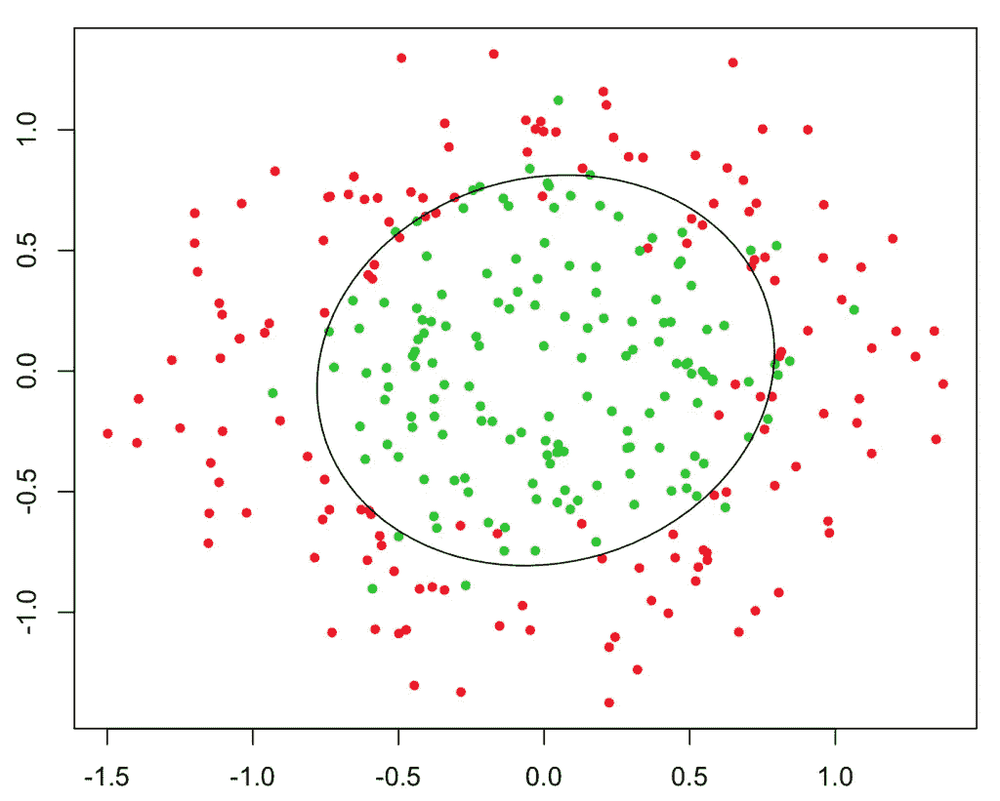
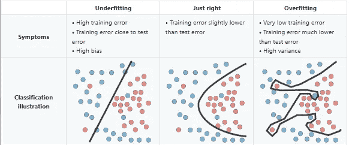
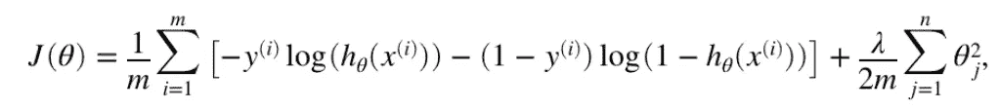
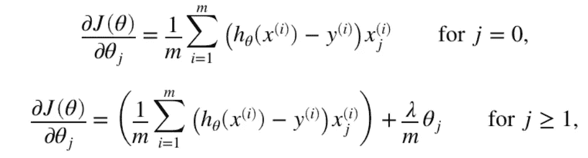

# 物流回归正规化(2/4)

> 原文：<https://medium.com/geekculture/logistics-regression-regularisation-2-3-4a0d8b85564c?source=collection_archive---------51----------------------->


好吧，那么问题是什么…到目前为止，您已经了解了逻辑回归(虽然称为回归)实际上是一种分类算法。如果你还没有这样做的话，[看一下我以前的一篇介绍文章](https://shaun-enslin.medium.com/64a890ed79e1)。

# 问题是

因此，使用线性回归，我们并不总是以线性决策边界结束。这可能发生在下列情况下:

1.  具有许多特征，例如 10 个或更多
2.  如果我们有两个特征，它不是一条决定是或否的直线。

在这些情况下，可视化数据通常如下所示:



上面很重要的一点是我们需要小心过度拟合。请注意下面，我们希望落入“恰到好处”的空间。如果我们最终过度拟合，那么我们的分类可能在训练数据上工作得很好，但在新数据上可能会失败。



# 解决办法

解决方案是**在优化过程中调整**我们的θ。这个过程包括降低θ值的幅度。这允许我们从“过度适应”到“恰到好处”。

本质上，我们将正则化参数(λ)应用于每个θ，并在计算每个θ时减少它们。这具有平滑决策边界的效果。

根据上一篇文章，计算我们的成本将稍微改变如下，以将λ应用于每个θ。



当计算梯度时，我们的方程将改变如下。请注意，我们不会惩罚 0。



在 Matlab 代码中，上述等式如下所示:

```
function [J, grad] = computeCost(theta,x,y,lambda)
  [m,n] = size(x);
  x = [ones(m,1), x]; h = sigmoid(x * theta); % excluded the first theta value
  theta1 = [0 ; theta(2:size(theta), :)]; % reduce magnitude of the thetas
  p = lambda*(theta1'*theta1)/(2*m);
  J = ((-y)’*log(h) — (1-y)’*log(1-h))/m + p; % calculate grads
  grad = (x’*(h — y)+lambda*theta1)/m;
end
```

# 结论

我相信这给了你一个很好的概述，为什么我们应用正规化。您可以阅读下一篇文章，其中会有一个很好的例子。