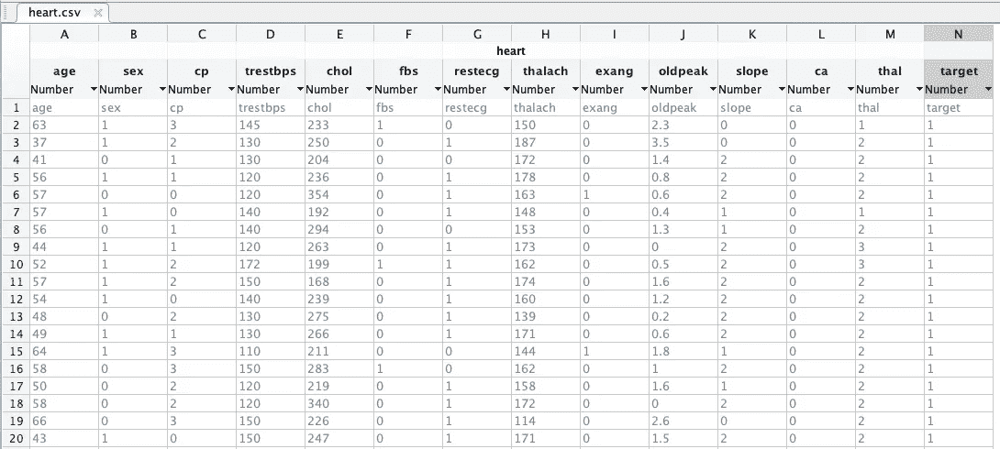
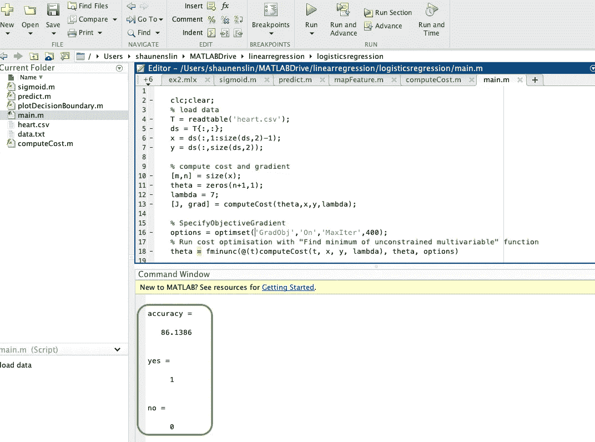

# 逻辑回归预测心脏病发作(3/4)

> 原文：<https://medium.com/geekculture/logistics-regression-to-predict-heart-attacks-3-3-6b6ab6646815?source=collection_archive---------60----------------------->


如果你没有看过我之前解释物流回归的文章，那么先看看这里的[第一部分](https://shaun-enslin.medium.com/logistics-regression-in-5-minutes-1-3-64a890ed79e1)和[第二部分](https://shaun-enslin.medium.com/logistics-regression-regularisation-2-3-4a0d8b85564c)。

一旦你对理解感到满意，让我们进入一个好的编码例子。你可以在这里得到代码。

在本文中，我们将编写一个逻辑回归来预测一个拥有某些属性的人是否会患心脏病。你可以从 [Kaggle](https://www.kaggle.com/nareshbhat/health-care-data-set-on-heart-attack-possibility) 下载数据集。

好好看看我们下面的数据。你可以看到我们有**特征**包括年龄、性别、cp、restbps、chol、restecg 等。最后，**目标**栏显示该人是否患有心脏病。由于这是逻辑回归，我们最终得到 1 或 0。



很好，我们有了训练数据集。让我们继续编码吧。

# 准备我们的数据集

我们的第一步是加载我们的 CSV 文件，并将其分为 X 和 Y。

```
clc;clear;
% load data
T = readtable(‘heart.csv’);
% convert table to matrix
ds = T{:,:};
x = ds(:,1:size(ds,2)-1);
y = ds(:,size(ds,2));
```

# 测试我们的成本函数

下一步是设置我们的初始θ和λ正则化参数。我们可以在这里执行成本函数，但这只是为了测试。

```
% compute cost and gradient
theta = zeros(n+1,1);
lambda = 7;
[J, grad] = computeCost(theta,x,y,lambda);
```

# 最佳化

接下来，我们可以运行我们的优化函数，这个函数叫做 **fminunc** 。这将为我们做些艰苦的工作，通过重复运行我们的 computeCost 函数，直到我们为以后的预测得到最低的成本和最佳的θ。

```
% SpecifyObjectiveGradient
options = optimset(‘GradObj’,’On’,’MaxIter’,400);
% Run cost optimisation with “Find minimum of unconstrained multivariable” function
theta = fminunc(@(t)computeCost(t, x, y, lambda), theta, options)
```

# 预言

我们可以首先对所有训练示例运行预测，以计算预测的准确性。此时，您可以调整 lambda 值和 MaxIter 值，直到获得最高精度。你最终应该有大约 86%的准确率。

```
% check predictions by predicting all our x’s and lets see if
p = predict(theta, x);
accuracy = mean((p == y) * 100)
```

我们的最后一步是复制几行，但是稍微改变一下值，运行一个预测，看看我们得到了一个好的结果。

```
% predict a result close to row 10
f = [52,1,2,170,201,1,1,160,0,0.6,2,0,3];
yes = predict(theta, f)% predict a result close to row 200
f = [61,1,0,118,260,0,1,94,1,1.6,1,2,3];
no = predict(theta, f)
```

# 效用函数

我们确实需要一些实用函数。让我们从计算假设所需的 sigmoid 函数开始。

```
function h = sigmoid(z);
  h = 1 ./ (1 + exp(-z));
end
```

现在，我们的 computeCost 函数用于计算特定 theta 的**成本**和**梯度**。

```
function [J, grad] = computeCost(theta,x,y,lambda)
  [m,n] = size(x);
  x = [ones(m,1), x];
  h = sigmoid(x * theta); % excluded the first theta value
  theta1 = [0 ; theta(2:size(theta), :)]; % penalize the thetas
  p = lambda*(theta1'*theta1)/(2*m);
  J = ((-y)’*log(h) — (1-y)’*log(1-h))/m + p; % calculate grads
  grad = (x’*(h — y)+lambda*theta1)/m;
end
```

最后一个函数**预测**一行 X 或者一系列 X 特征。

```
function p = predict(theta, x)
  x = [ones(size(x,1),1),x]; % get hypothesize for all x values, but round to zero or 1
  p = round(sigmoid(x * theta));
end
```

**我们开始吧**，运行上面的代码，应该会得到下面的结果。



你可以点击这里阅读我在这个系列中的文章[。](https://medium.com/p/f34ed2e5f042/edit)