# 使用 CoreML 和 CreateML 的徽标检测器 iOS 应用程序

> 原文：<https://medium.com/geekculture/logo-detector-ios-app-using-coreml-and-createml-860b0377cd7d?source=collection_archive---------3----------------------->

你能从这个博客中期待什么？

1.  什么是机器学习？
2.  CoreML 是什么？
3.  什么是愿景框架？
4.  什么是 CreateML？
5.  如何用 CreateML 训练一个模型？
6.  构建一个样本图像(徽标)识别应用程序

让我们从我最喜欢的关于机器学习的名言开始:

如果你折磨数据的时间足够长，它就会招供。

# 什么是机器学习？

**机器学习** ( **ML** )是对计算机[算法](https://en.wikipedia.org/wiki/Algorithm)的研究，这些算法通过经验和数据的使用自动改进。

它被视为[人工智能](https://en.wikipedia.org/wiki/Artificial_intelligence)的一部分。

这些算法基于样本数据建立一个模型，称为“[训练数据](https://en.wikipedia.org/wiki/Training_data)”，以便在没有明确编程的情况下进行预测或决策。

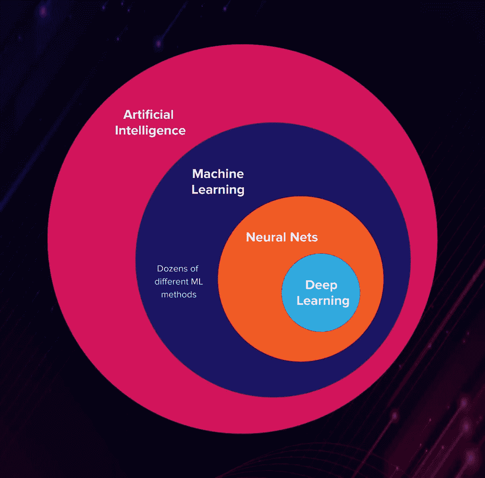

比如苹果在 ***拍照 app 中使用 ML 识别人脸*** 和 ***键盘 app 预测下一个单词建议***

# CoreML 是什么？

```
import CoreML
```

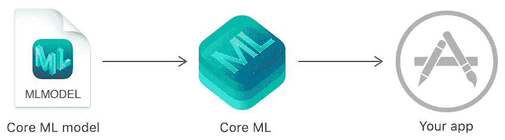

Apple 提供的一个框架，用于将机器学习模型集成到您的应用程序中。

Core ML 自动生成一个 Swift 类，提供对 ML 模型的简单访问，当我们有一个模型数据集时，CoreML 很容易在 iOS 中设置和使用

**什么是模型？**

Core ML 将机器学习算法应用于一组训练数据，以创建一个*模型*。该模型用于根据新的输入数据进行预测。例如，您可以训练模型对照片进行分类，或者直接从照片的像素中检测照片中的特定对象。

# 什么是愿景框架？

```
import Vision
```

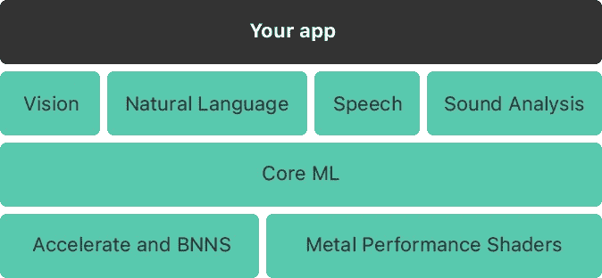

[视觉框架](https://developer.apple.com/documentation/vision)与 Core ML 合作，将分类模型应用于图像，并对这些图像进行预处理，以使机器学习任务更容易、更可靠。

来自视觉框架的一些预先存在的 API 是面部和身体检测、动物检测、文本检测、条形码检测。

# 语音、自然语言和声音分析

我们知道 Core ML 支持视觉分析图像，就像它使用自然语言处理文本一样，

使用此框架执行以下任务:

*   *语言识别*自动检测一段文字的语言。
*   *记号化*，将一段文本分解成语言单位或记号。
*   *词性标注*，用词性标注单个单词。
*   *词干化*，根据词形分析推断词干。
*   *命名实体识别*，将标记识别为人名、地名或组织名。

[语音](https://developer.apple.com/documentation/speech)用于将音频转换为文本，以及[声音分析](https://developer.apple.com/documentation/soundanalysis)用于识别音频中的声音

使用语音框架来识别录音或现场音频中的口语单词。键盘的听写支持使用语音识别将音频内容翻译成文本。

# 什么是 CreateML？

CreateML 是苹果公司(与 Xcode 捆绑的 app)提供的一个工具，用来创建机器学习模型(`***.mlmodel)`在你的 app 中使用。其他语言的 ML 模型也可以通过 CreateML app 轻松转换成我们的`.mlmodel`。

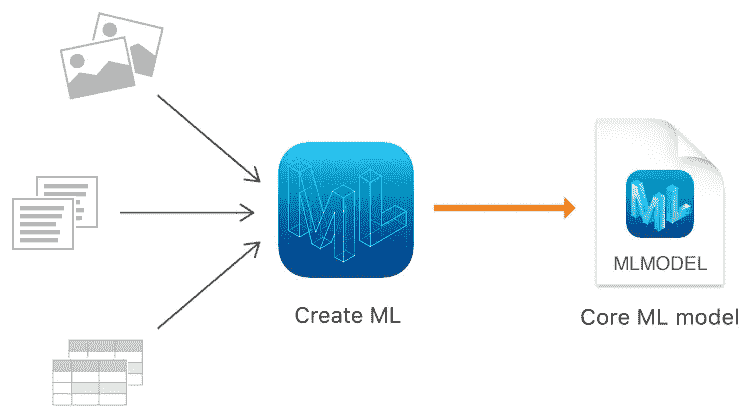

# 蜜蜂

`VNCoreMLRequest` -使用核心 ML 模型处理图像的图像分析请求。

`VNImageRequestHandler` -处理与单个图像相关的一个或多个图像分析请求的对象。

`VNClassificationObservation` -由图像分析请求产生的分类信息。

`VNObservatoinResults` -请求处理生成的 VNObservation 结果集合。

# 如何用 CreateML 训练一个模型？

打开 CreateML，方法是转到 Xcode 菜单，然后单击打开开发者工具→ CreateML。然后创建一个新项目。导航到左侧面板中的模型源部分。这是我们的模型，我们将训练、建造和使用它。(还有其他生成 MLModel 的方法，如 playgrounds 和 terminal，也可以随意探索它们)

为了创建模型，我们需要一个 logo 数据集，同样可以从 [Kaggle](https://www.kaggle.com/volkandl/car-brand-logos) 获得(Kaggle 是 Google LLC 的子公司，是数据科学家和机器学习实践者的在线社区。)Kaggle 有数千个由各种机器学习开发者上传的数据集。一旦你下载了数据集。打开 CreateML 窗口，点击模型源中的 LogoDetector 文件。该窗口有两个主要栏，1。数据和 2。参数。让我们关注数据列，它包括:

1.  **训练数据:**

第一步是为 Create ML 提供一些训练数据。打开下载的文件夹，将 train 文件夹拖放到此列中。

*额外提示:对于图像识别，尝试向图像添加增强功能，如模糊和噪声，这将提高准确性。增加迭代次数也会提高精度。但是这两种改变都会增加训练时间。*

**2。验证数据:**

该验证数据用于检查其模型:它基于输入进行预测，然后检查该预测与来自数据的真实值相差多远。默认设置为自动-从训练数据中拆分

**3。测试数据:**

打开下载的文件夹，将测试文件夹拖放到此列中。我们将使用*训练数据*中的图像来训练我们的分类器，然后使用*测试数据*来确定其准确性。

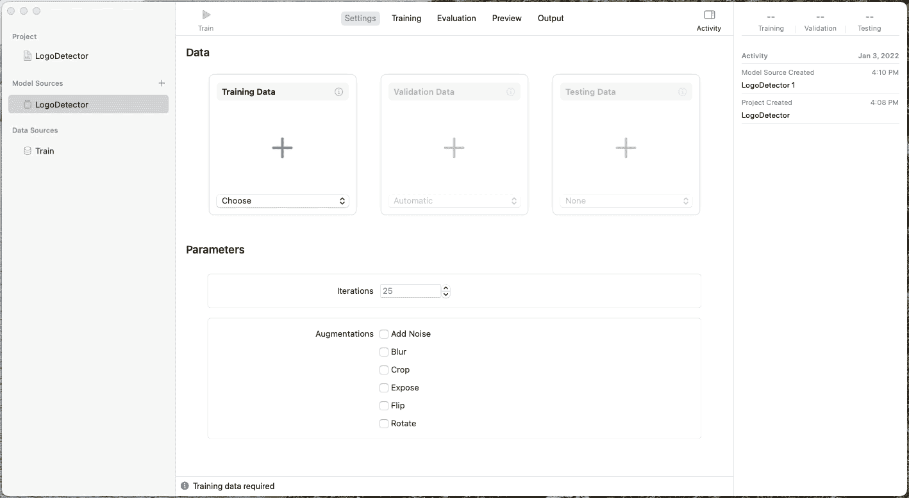

现在单击左上角的 run 按钮开始训练我们的模型。流程完成后，我们将看到培训数据:

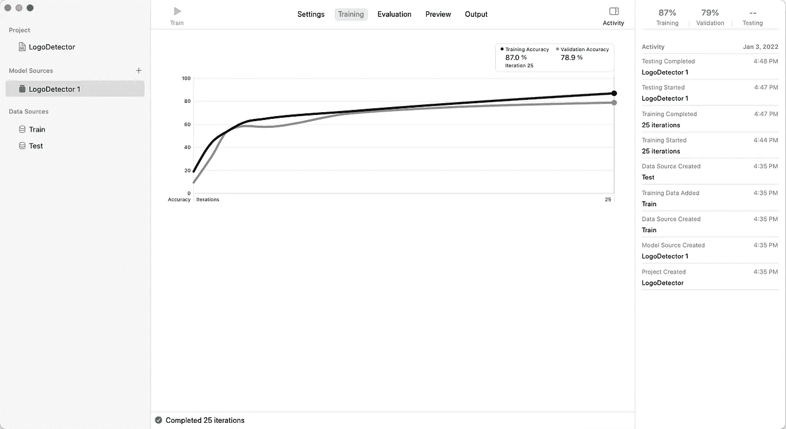

然后，它会使用我们提供的测试数据集自动启动评估(测试)流程:

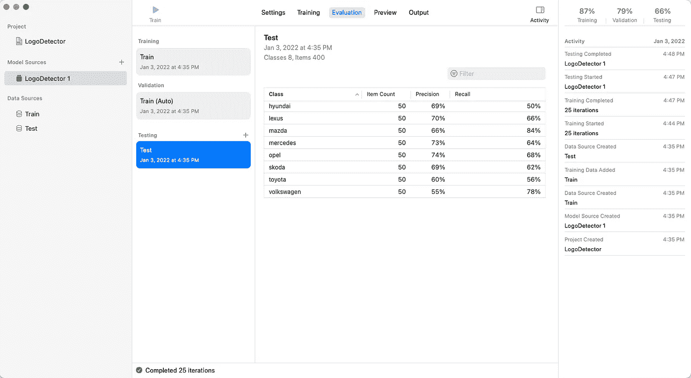

现在我们的 MLModel 已经准备好添加到项目中了，点击顶部中间的 Output 选项卡，点击⬇️ Get 图标并保存它。

# 构建一个样本图像(徽标)识别应用程序

在 Xcode 中创建一个新的 iOS 项目(storyboard one 而不是 SwiftUI)并拖放我们在上面创建的 MLModel。现在的目标是建立一个应用程序，打开摄像头视图，扫描任何捕获的徽标(图像)，并用我们创建的 mlmodel 验证它，并在标签中显示结果。

最终项目可以从[这里](https://github.com/MuralidharanKathiresan/LogoDetector)下载

1.  [删除故事板文件](https://stackoverflow.com/a/59332619/3701589)，*删除主界面，*从 Info.plist 中删除 Main.storyboard。
2.  在本教程中，我们将使用 AVCaptureSession 从相机中捕获图像，并使用 CoreML 的 Vision 框架对其进行处理，因此我们需要在 info.plist 中添加一个[相机权限](https://developer.apple.com/documentation/bundleresources/information_property_list/nscamerausagedescription)字符串。右键单击 Info.plist →作为源代码打开，在< dict >中添加以下内容

```
**<key>**NSCameraUsageDescription**</key>****<string>**Accessing your camera to take photo.**</string>**
```

3.现在让我们尝试在 viewDidLoad 中显示相机权限对话框，并尝试获得用户权限来开始捕捉图像:

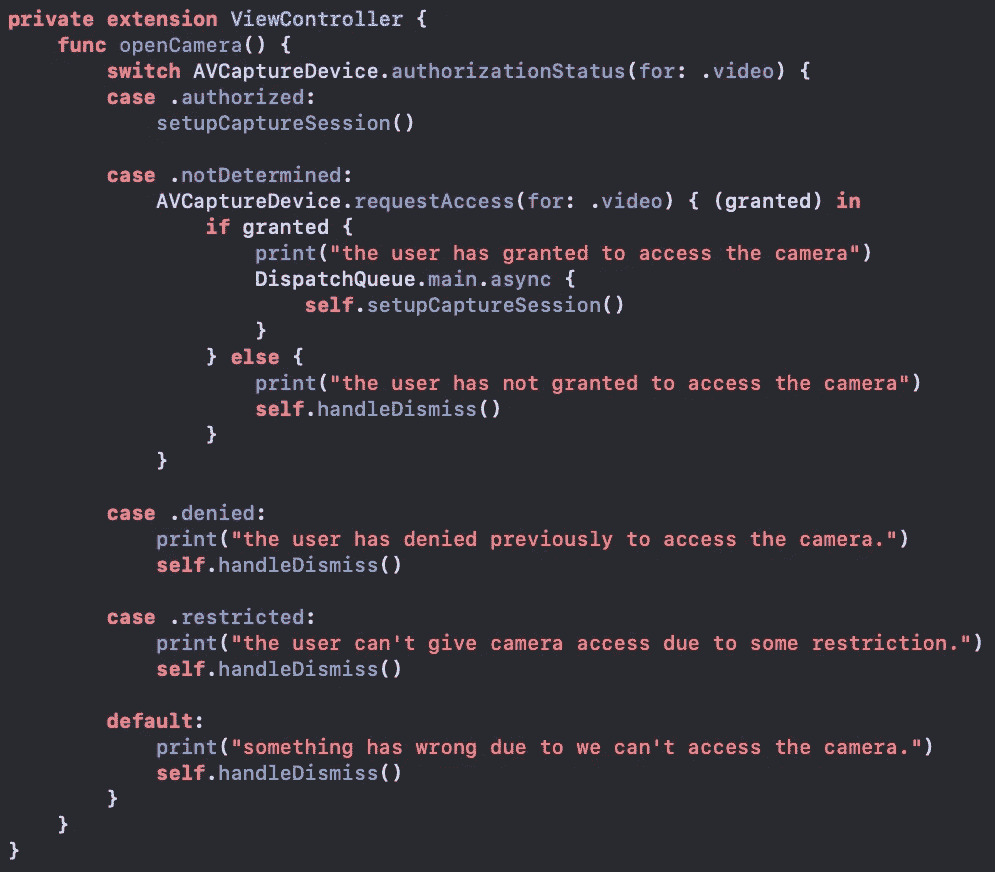

4.一旦许可被授予，我们需要创建一个 [AVCaptureSession](https://developer.apple.com/documentation/avfoundation/avcapturesession) 。

**什么是 AVCaptureSession？**

要执行实时捕获，您需要实例化一个`AVCaptureSession`对象，并添加适当的输入和输出。


一旦 AVCaptureSession 被实例化，就需要为其添加适当的输入和输出。这里的输入是→设备的默认摄像机，摄像机的媒体类型是`video`

```
AVCaptureDevice.default(for: AVMediaType.video) // MediaType
AVCaptureDeviceInput(device: captureDevice)     // Input
```

为了接收这个会话的输出，我们可以在类级别创建一个属性，这样就可以在任何地方访问它

```
**private** **let** photoOutput = AVCapturePhotoOutput()
```

一旦配置了 I/O 设置。让我们在“AVCaptureVideoPreviewLayer”的帮助下将摄像机视图添加到视图控制器的视图中，最后，必须使用

```
captureSession.startRunning()
```

这个调用启动了从输入到输出的数据流。现在我们已经配置了一个“AVCaptureSession ”,并将摄像机的视图添加到 ViewController 视图中。

5.既然会话已经准备好，我们就可以开始通过摄像机捕捉图像了

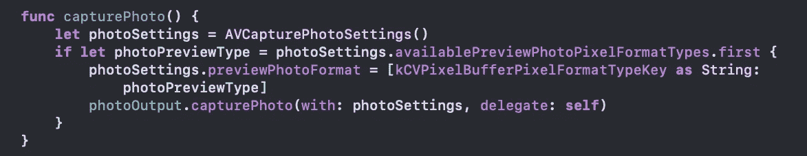

这里，我们创建了一个“AVCapturePhotoSettings”对象，从而帮助我们在捕获照片之前自定义设置，这里，我们必须调用带有照片设置和委托的方法“capturePhoto()”。

6.向 ViewController 确认“AVCapturePhotoCaptureDelegate ”,并添加其 photoOutput()方法

```
**func** photoOutput(_ output: AVCapturePhotoOutput, didFinishProcessingPhoto photo: AVCapturePhoto, error: Error?)
```

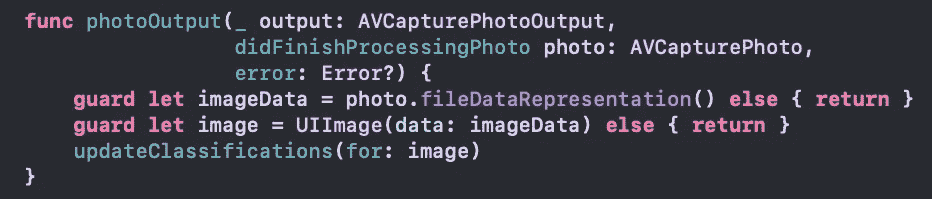

这个方法帮助我们从 captureSession 传递输出，它是一个 imageData 和来自它的一个适当的图像。

7.现在，既然我们有了从设备捕获的图像，我们需要用 MLModel 处理它以获得结果:

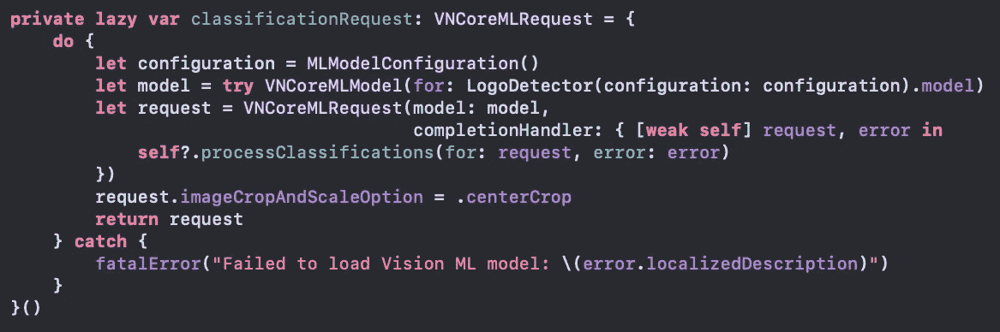

在这里，我们创建了一个类型为`VNCoreMLRequest`的“classificationRequest ”,它需要一个模型，当我们将从 CreateML 下载的 MLModel 移动到项目中时，Xcode 会自动为我们创建一个`LogoDetector` swift 类。此外，当在用模型处理之后接收到请求时，请求提供带有‘vnrequest’的 completionHandler。

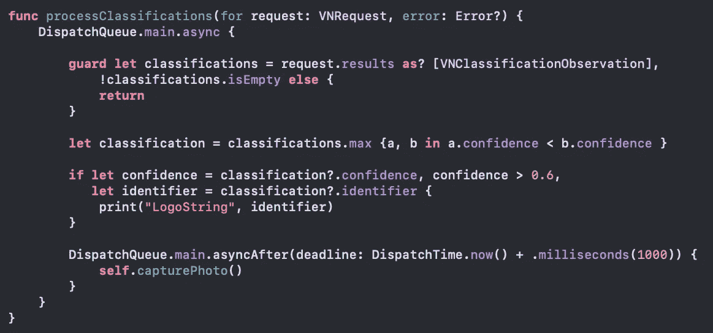

现在，最后一部分是在图像传入模型时处理来自模型的请求/结果。

在这里，我们接收一组分类作为结果的一部分，我们以最大的置信度过滤元素，

**什么是自信？**

置信度标准化为[0，1]，其中 1 最有把握

注意:信心总是可以作为 1 ☹️返回，如果信心不被支持或没有意义，那么就要小心玩弄它。

一旦我们得到了徽标名称，我将在一秒钟内再次开始捕获会话。(可根据各种使用情况进行定制)

8.每当我们从“AVCapturePhotoCaptureDelegate”的“photoOutput”方法接收到一个图像对象时，它必须被传递到“VNImageRequestHandler”中，以处理如下结果:

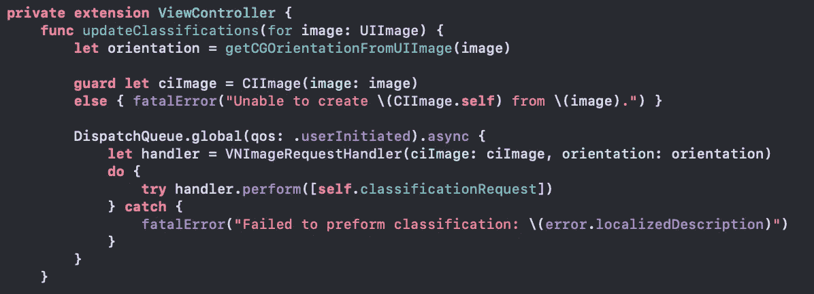

9.让我们运行我们的应用程序，看看它是如何工作的

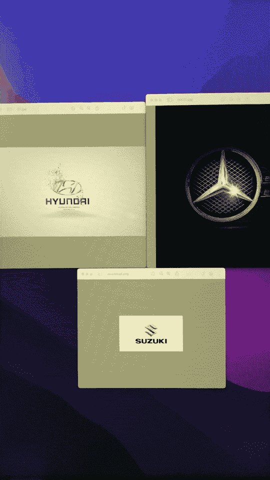

# 需要记住以下几点:

`***.mlmodel`一旦应用程序安装完毕，就无法在用户设备内部进行动态更新，如果我们需要使用新型号，那么我们必须更换现有型号。

`***.mlmodel`可以与[按需资源](https://developer.apple.com/library/archive/documentation/FileManagement/Conceptual/On_Demand_Resources_Guide/index.html)一起使用，这样它就可以在空中更新任何人，

在这个扫描和识别过程中，用户的隐私得到高度保护，因为它发生在用户的设备内部，没有 API，没有来自第三方的数据收集，

处理结果的速度在 iOS 设备中是一流的，并且创建的 ML 模型的大小远远小于 CreateML 的其他替代方案

希望文章对你有帮助。如果你喜欢这篇文章，请告诉我👏你可以在 LinkedIn[https://www.linkedin.com/in/muralidharankathiresan/](https://www.linkedin.com/in/muralidharankathiresan/)上找到我