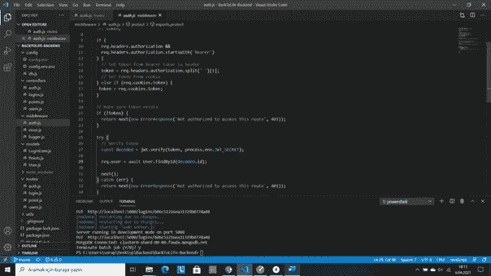
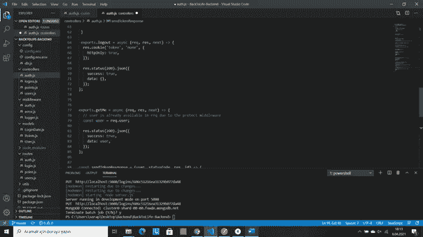
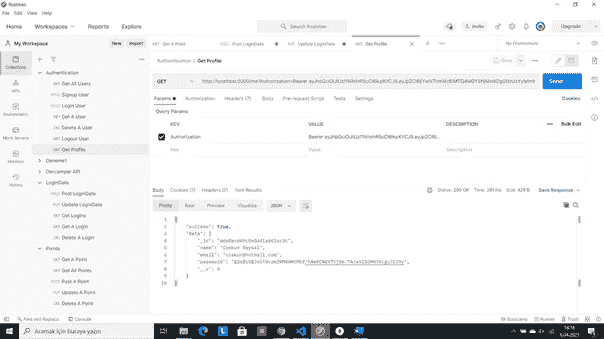
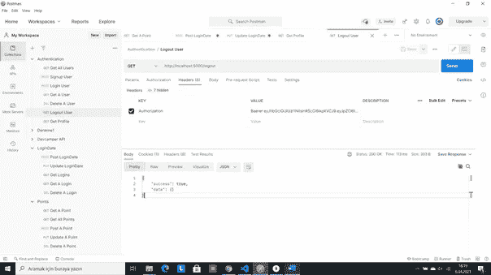

# 用 NodeJs、Express 和 MongoDB 注销(第 2 部分)

> 原文：<https://medium.com/geekculture/logout-with-nodejs-express-and-mongodb-9b73e8b01137?source=collection_archive---------8----------------------->

在以前的文章中，我写了如何用 NodeJs、Express 和 MongoDB 创建注册和登录应用程序。链接在这里，如果你想要文章，可以在这里阅读[。](https://serapbaysal.medium.com/signup-login-application-with-nodejs-express-and-mongodb-658498e580cf)

在本文中，我将用我的旧代码创建一个注销应用程序。开始吧！

首先，我们希望保护应用程序中的一些操作，如到达配置文件。为此，我们将创建一个名为 auth.js 的中间件并编写一个名为 protect 的函数。

在这个文件中，首先我们需要 jsonwebtoken、ErrorResponse 和用户模型。随着 *exports.protect = async (req，res，next) = > {}* ，我们将开始。

我们转到 Postman，创建一个 GET 请求并添加一个参数。对于这个，在关键部分，我们将写授权，在价值部分，我们将写 Baerer 和空格符。这个令牌是我们登录用户的令牌，如果你看过我的其他文章，你就知道了。

在 VSCode 中，我们将转到 protect 函数并创建一个名为 token 的变量。在 if 语句控件中，我们的头和头以' Bearer '开头。如果这两个是真的，我们将在头中用

*token = req . headers . authorization . split(')[1]；*

。拜尔字后的这个控制空格。如果语句不为真，我们将执行 else if 并从 cookie 中设置令牌。

*token = req.cookies.token*

*我们将使用*确保令牌存在

*如果(！令牌){*

*返回 next(new ErrorResponse('未授权访问此路由'，401)；*

*}*

之后，我们将验证令牌

*const decoded = jwt . verify((token，process . env . jwt _ SECRET)；*

和

*req . user = await user . find byid(decoded . id)；*

。然后捕捉错误。所有保护功能看起来都是这样的:

middleware/auth.js

现在，我们可以回到 controllers/auth.js 文件，为注销和配置文件添加这些代码:

controllers/auth.js

如果我们转到 Postman 并使用 Baerer 访问旧请求，我们可以看到最后登录用户的配置文件:

如果我们要创建一个 GET 请求并编写[http://localhosy:500/logout](http://localhosy:500/logout)，用 Baerer 和 token 添加授权，请看这个:

我试着在这之后得到一个侧写，但是它不工作，所以我们将做它的权利。

这篇文章已经完成，但我会继续更新用户的观点，所以我们会在下一篇文章中看到你！感谢阅读！