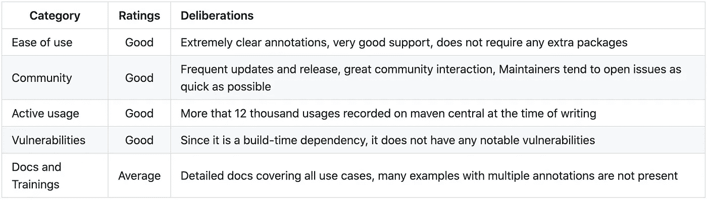

# 让自己从样板代码中脱离出来

> 原文：<https://medium.com/geekculture/lombok-unhinge-yourself-from-boilerplate-code-8535ec5391f?source=collection_archive---------6----------------------->


Photo by [David Becker](https://unsplash.com/@beckerworks?utm_source=medium&utm_medium=referral) on [Unsplash](https://unsplash.com?utm_source=medium&utm_medium=referral)

# 概观

Java 是一种强类型的、面向对象的编程语言，通常翻译成严格的请求、响应和数据传输对象。它为开发人员提供了任何类中可供使用的数据的清晰画面，但添加了许多样板代码，如 getters、setters，我们不要忘记构造函数。不仅编写和维护这些方法很痛苦，而且还会增加代码的混乱。Lombok 项目允许我们在令人印象深刻的社区支持下编写整洁的代码。

# 突出

Lombok 是一个代码生成器，在编译时运行。在深入研究软件包的特性之前，让我们看看如何将它们包含在我们的配置文件中:

```
/* Maven */<dependencies>
	<dependency>
		<groupId>org.projectlombok</groupId>
		<artifactId>lombok</artifactId>
		<version>${lombok.version}</version>
		<scope>provided</scope>
	</dependency>
</dependencies>/* Include in build section of the pom file */<annotationProcessorPaths>
	<path>
		<groupId>org.projectlombok</groupId>
		<artifactId>lombok</artifactId>
		<version>1.18.16</version>
	</path>
</annotationProcessorPaths>/* Gradle */dependencies {
	compileOnly 'org.projectlombok:lombok:$version'
	annotationProcessor 'org.projectlombok:lombok:$version'

	testCompileOnly 'org.projectlombok:lombok:$version'
	testAnnotationProcessor 'org.projectlombok:lombok:$version'
}
```

如果你正在使用 IntelliJ IDEA，建议安装 Lombok 插件以获得更好的开发者体验。

## 简化封装

*   getter 和 setter:
    getter 和 setter 是封装的一个重要方面，它们允许类决定哪些数据对其他对象可用。相反，为大型类编写 Getters 和 Setters 会增加混乱。Lombok 提供了可以放在类或字段级别的`@Getter`和`@Setter`注释。如果您希望类的所有字段都有 getter/setter，那么向整个类添加注释是明智的。让我们来看一个标准的`Student`级:

```
public class Student {

    private String name;
    private String identityNumber;
    private Integer grade;

    public String getName() {
        return name;
    }

    public void setName(String name) {
        this.name = name;
    }

    public String getIdentityNumber() {
        return identityNumber;
    }

    public void setIdentityNumber(String identityNumber) {
        this.identityNumber = identityNumber;
    }

    public Integer getGrade() {
        return grade;
    }

    public void setGrade(Integer grade) {
        this.grade = grade;
    }

    public Student(String name, String identityNumber, Integer grade) {
        this.name = name;
        this.identityNumber = identityNumber;
        this.grade = grade;
    }
}
```

现在让我们添加一些龙目岛的魔法:

```
@Getter
@Setter
public class Student {

    private String name;
    private String identityNumber;
    private Integer grade;

    public Student(String name, String identityNumber, Integer grade) {
        this.name = name;
        this.identityNumber = identityNumber;
        this.grade = grade;
    }
}
```

*   **构造函数** :
    Lombok 提供了三种不同的注释来为你的类生成构造函数。`@AllArgsConstructor`为类中的所有字段添加一个构造函数。相应地，`@NoArgsConstructor`增加了一个空的构造函数。但是，如果您只想为类中的非 final 字段构造一个构造函数，那么`@RequiredArgsConstructor`恰恰可以做到这一点。
*   `**hashcode**` **、** `**equals**` **和** `**toString**` **方法** :
    重写`toString()`和`equals()`方法是一些最容易预测的样板代码片段。有趣的是，在整个代码库中标准化它们可能会令人望而生畏。Lombok 已经提供了`@ToString`和`@EqualsAndHashCode`注释，每当我们编译时，它们都会自动生成方法。这两个注释都放在类级别，允许开发人员通过将属性`callSuper`设为 true 来包含超类中的字段。

因此您可以简化一个普通的旧的`Student`类型的 Java 对象，如下所示

```
@Getter
@Setter
@AllArgsConstructor
@EqualsAndHashCode
@ToString
public class Student {

    private String name;
    private String identityNumber;
    private Integer grade;
}
```

但是，如果你觉得在每个类中添加`@AllArgsConstructor`、`@Getter`、`@Setter`和`@EqualsAndHashCode`很麻烦。可以用`@Data`来代替，一个简单但功能强大的别名。

## 不变性增强

让我们首先编写一个不可变的类。

```
public final class Student {

    private final String name;
    private final String identityNumber;
    private final Integer grade;

    public String getName() {
        return name;
    }

    public String getIdentityNumber() {
        return identityNumber;
    }

    public Integer getGrade() {
        return grade;
    }

    public Student(String name, String identityNumber, Integer grade) {
        this.name = name;
        this.identityNumber = identityNumber;
        this.grade = grade;
    }
}
```

我们可以使用`@Value`注释将类中的每个字段标记为 final。它还向该类添加了一个`equals()`和`hashCode`方法。因此，它可以被认为是`@Data`的不可变变体。我们还可以通过在字段顶部使用`@NonFinal`使字段成为非最终字段。但是它不会是完全不可改变的。我们的学生类现在看起来像这样:

```
@Value
public class Student {

    private final String name;
    private final String identityNumber;
    private final Integer grade;
}
```

## 不要再建造建筑了

构建器模式是构建复杂对象的一种简洁方式。不幸的是，为每个复杂或大型的类编写构建器感觉很费力。Lombok 为`@Builder`注释提供了可选的`toBuilder`属性。如果属性设置为 true，那么将提供一个从构建的对象获取构建器的方法。

```
/* without @Builder */public class Student {

    private final String name;
    private final String identityNumber;
    private final Integer grade;

    public static Builder builder(){
        return new Builder();
    }

    public static class Builder {
        private String name;
        private String identityNumber;
        private Integer grade;

        public Builder name(String name){
            this.name = name;
            return this;
        }

        public Builder identityNumber(String identityNumber){
            this.identityNumber = identityNumber;
            return this;
        }

        public Builder grade(Integer grade){
            this.grade = grade;
            return this;
        }

        public Student build(){
            return new Student(name, identityNumber, grade);
        }
    }
}/* with @Builder */@Builder
public class Student {

    private final String name;
    private final String identityNumber;
    private final Integer grade;
}
```

我们可以使用构建器类，如下所示:

```
Student student = Student.*builder*()
        .name("unpackaged")
        .identityNumber("1A045")
        .grade(9)
        .build();
```

## 轻松编写同步代码

编写多线程应用程序时，大多数关键部分都用同步块标记。下面显示了一个示例代码片段:

```
public class Student {

    private String name;
    private String identityNumber;
    private Integer grade;
    private final Object lock = new Object();

    public Integer updateGrade(Integer marks){
        synchronized (lock) {
            if (marks > 40) {
                grade++;
            }
        }
        return grade;
    }
}
```

管理多个这样的锁变量增加了混乱，并可能导致一些代码味道。我们可以将这样的块卸载到 Lombok 的`@Synchronized`注释中。它将一个`$LOCK`变量添加到类的静态和非静态范围(如果不存在的话),并将临界区包装在一个同步块中。它允许开发人员只关注业务逻辑。您还可以传递一个字符串作为锁变量的名称。上面的类将被转换如下所示:

```
public class Student {

    private String name;
    private String identityNumber;
    private Integer grade;
    private final Object lock = new Object();

    @Synchronized
    public Integer updateGrade(Integer marks){
        if (marks > 40) {
            grade++;
        }
        return grade;
    }

    @Synchronized("lock")
    public String getName(){
        return name;
    }
}
```

## 实验特性

除了上面的注释，还有更多代码生成器可用。龙目岛遵循金丝雀方法。最初，实验包中有一个代码生成器。在观察了它的采用和错误修复之后，它被提升到主包。让我们简单地看看一些有趣的实验注释:

*   `@FieldNameConstants`:创建一个内部类，其中包含注释所在类中所有字段的常量。有趣的是，它没有为方法或类名生成常量。如果他们能在将它标记为稳定可用之前将它添加到注释中，那就更好了。
*   `@UtilityClass`:向带注释的类添加私有构造函数，并将类中的所有字段和方法标记为静态。
*   `@Slf4j`:用配置好的记录器向类中添加一个记录器对象。

虽然这些没有其他生成器强大，但它们仍然使代码可预测，并且不容易出现人为错误，例如创建一个实用程序类的对象或为一个类配置错误的记录器！

## 我再也不想用 Lombok 了！

如果在任何时候想要从应用程序中移除 Lombok，可以使用 Delombok 工具来生成样板代码，并从构建配置文件中移除应用程序。Delombok 在 Lombok jar 文件中可用。开发人员可以运行下面的命令来解绑他们的应用程序:

```
java -jar lombok.jar delombok <source-direcory> -d <destination-directory>
```

IDEA 还提供了一个选项来解包选定的文件。您也可以使用 maven 插件来实现同样的功能。

# 评估指标



# 结论

我们不能过分强调 Lombok 节省了多少时间，同时消除了 Java 开发人员日常生活中常见的混乱。与标准注释处理器不同，Lombok 使用内部 Java APIs 并将代码注入到类中。因此，随着 Java 采用更快的发布周期，它引起了开发者对其稳定性的关注。然而，如果你考虑到所有的优势，以及你可以随时解包你的代码，我们可以毫无顾虑地接受它。它让 Java 代码看起来又很酷了。

作为一个群体，他们非常活跃。任何人都可以加入他们的电子邮件线程，并开始一个可能的功能或增强线程。他们还对他们认为稳定的东西保持谨慎，因此，消除了任何疑虑。

# 看看这个包裹和一些阅读材料

*   [https://projectlombok.org/](https://projectlombok.org/)
*   加入 https://groups.google.com/forum/#!forum/project-lombok[的龙目岛社区，参与并为这个令人惊叹的图书馆做出贡献。](https://groups.google.com/forum/#!forum/project-lombok)

# 揭发

本文/评论中提到的内容和评估分数是主观的，是作者在无包装评论中基于日常使用和对流行开发者论坛的研究的个人意见。它们不代表任何公司的观点，也不受任何赞助/合作的影响。