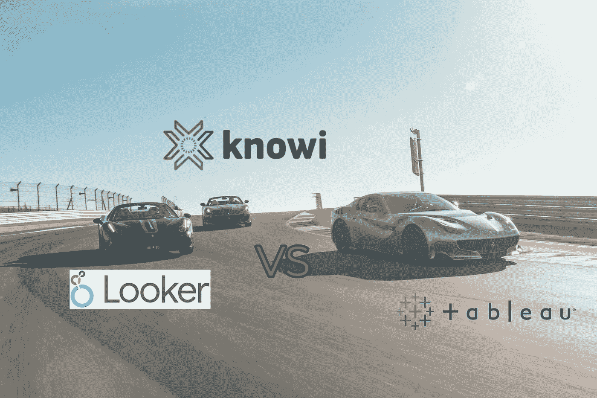
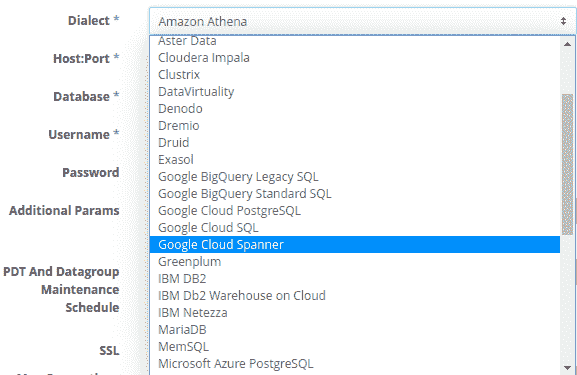
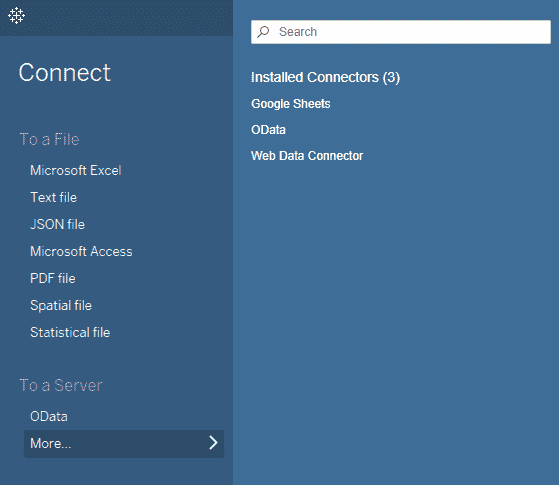
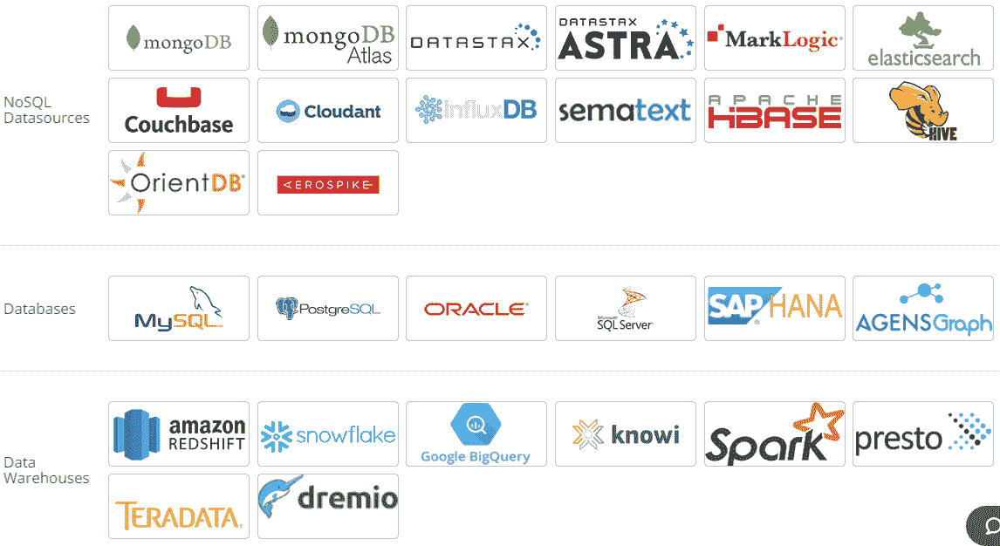
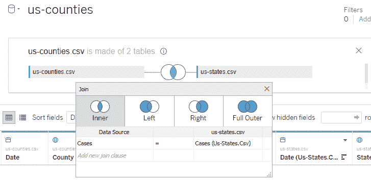
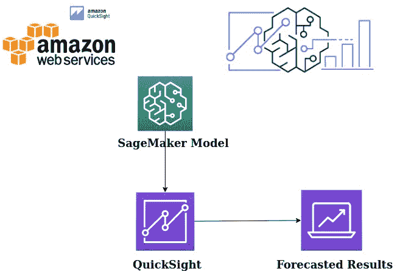
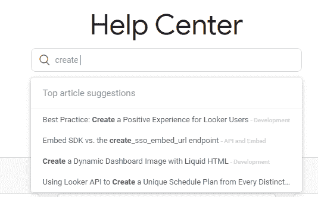
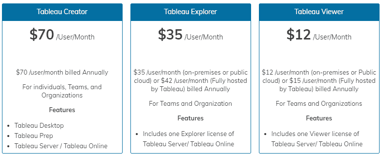

# 旁观者对场景对知识——商业智能工具之战

> 原文：<https://medium.com/geekculture/looker-vs-tableau-vs-knowi-battle-of-the-b-i-tools-76b981da52ef?source=collection_archive---------6----------------------->

三方比较，看看谁是市场上最好的 BI 平台

Image by author

# 介绍

全球商业智能市场预计将从 2020 年的 231 亿美元增长到 2025 年的 333 亿美元。2020 年商业智能的广泛采用表明企业已经对 BI 系统产生了信心。尽管围绕数据科学和机器学习有很多讨论，但企业仍在采用商业智能进行决策。

[Tableau](https://www.tableau.com/) 是市场上领先的 BI 工具，而谷歌也在 2019 年通过收购 [Looker](https://looker.com/) 进入了 BI 工具领域。 [Knowi](https://www.knowi.com/) 是一家相对较新的初创公司，正试图兼顾舞台和观众，并展示了商业智能的未来。

由于广受欢迎，Tableau 和 Looker 之间有许多比较。然而，我们发现写一篇文章，从三个方面比较旁观者、场景和知识，以了解他们彼此的立场是很重要的。在进行比较之前，让我们先对每个工具做一个简单的概述。

# 检查员

Looker logo (Source-looker.com)

Looker 是一个数据分析平台，小型和大型组织都可以使用它从数据中提取见解。它成立于 2011 年，2019 年被谷歌收购。Looker 使数据收集、可视化和分析过程更加容易。它是一个基于浏览器的工具，带有独特的建模语言 LookML。Looker 使您能够访问各种交互式图表和图形，您可以使用这些图表和图形来可视化您的数据。Looker 易于使用，您可以将其与数据库和大数据平台集成。该平台带有一个简单的链接共享功能，使团队可以轻松地在一个项目上进行协作。

# Knowi

Knowi logo (Source-knowi.com)

Knowi 宣称自己是一个统一的分析平台，从原始数据一直到业务用户。Knowi 通过使用数据虚拟化来实现这一点，这样您就不必通过 ETL 过程获取数据。这使得 Knowi 有别于 Looker 和 Tableau 等其他 BI 工具。Knowi 允许与 NoSQL 数据库进行本机集成，以允许用户直接分析非结构化数据，这是传统 BI 工具不支持的功能。这通过消除移动数据所需的耗时、繁琐的步骤，简化了现代数据体系结构。

Knowi 还支持搜索驱动的分析，这是由其自然语言 BI 平台提供的功能。将谷歌类似搜索的功能与分析结合起来，你可以用英语提问，并立即得到答案。Knowi 于 2015 年推出，如今它自豪地向世界上的大企业提供 BI 服务。

# （舞台上由人扮的）静态画面

Tableau logo (Source-tableau.com)

[Tableau](https://www.tableau.com/) 是一款数据可视化工具，被企业用于商业智能。Tableau 于 2003 年推出，并于 2019 年被 Salesforce 收购，在市场上所有 BI 工具中拥有最大的用户群。它允许用户从他们的数据中创建各种各样的可视化来展示见解。Tableau 具有高级功能，可以帮助用户深入数据，并以可视化格式呈现结果，便于所有用户理解。它还可以用于实时数据分析。

# 旁观者对舞台对知识

接下来，我们将讨论这三种 BI 工具在 9 个核心领域的比较:

*   版本和部署
*   用户友好性
*   与数据源集成
*   形象化
*   支持的数据
*   分析学
*   机器学习算法
*   客户支持
*   定价

# 版本和部署

Looker 是一款基于浏览器的 BI 工具，具有云和内部部署选项，用户可以根据自己的需求选择所需的版本。不需要桌面安装和维护。

Knowi 有一个支持云的平台和一个内部版本，也可以通过网络浏览器访问，不支持桌面安装。Knowi 为其企业用户提供内部/云/混合部署选项。

Tableau 提供对其产品的在线云和桌面客户端访问。桌面用户有两个 Tableau 选项，Tableau 桌面和 Tableau 桌面公共版(免费)。云用户可以选择 Tableau Online 或者 Tableau Server。使用 Tableau Desktop 制作的可视化效果保存在 Tableau Server 中，而使用 Tableau Desktop Public Edition 制作的可视化效果保存在 Tableau Public 中。Tableau 还提供 Tableau Mobile 和 Tableau Reader，分别用于在移动设备和桌面上查看可视化效果和仪表盘。

# 用户友好性

当你查看三个 BI 平台的仪表盘时，我的主观意见是 Looker 的用户界面更加友好。如果你对深度数据挖掘不感兴趣，Looker 可能是你最好的工具，因为它可以给你干净简单的设计美学。

Tableau 对于业务分析人员来说很容易使用，并且可能是创建复杂可视化的黄金标准。

Knowi 的业务用户界面简单、直观且可定制。对于数据工程师来说，它的用户界面是复杂的，但可能需要一点时间来适应。

# 与数据源集成

Looker 仅适用于基于 SQL 的数据源。如果你有 NoSQL、REST-API、文件等数据，它们需要被放入某种形式的 SQL 数据库中，供 Looker 查询。

Looker Dialects (Source-holistics.io)

通常，Looker 客户将他们的数据存储在某种 SQL 数据仓库中，并在后台通过 ETL 过程将数据存储到仓库中。

Tableau 带有支持与基于 SQL 的数据库集成的本机连接器。

Tableau Data Sources (Image by author)

对于非 SQL 数据源(例如像 MongoDB 这样的 NoSQL 数据库)，您可以使用第三方 ODBC 驱动程序/连接器(来自 CData、Progress 等)。)可以转换成 SQL(同样的选项也适用于 Looker)，但是将数据从 NoSQL 表单关联到 SQL 表单有其固有的局限性。

Knowi 可以集成超过 36 个结构化和非结构化数据源，如 Apache Cassandra、MongoDB、Elasticsearch 等。

Knowi data sources (Source-knowi.com)

与其他 BI 平台不同，Knowi 自带了到 NoSQL 数据源的本地连接器，因此无需安装第三方驱动程序，并且完全是本地的，无需“关系化”数据。

Knowi 的 REST API 集成是目前列表中最优秀的，因为它允许您连接到 API，并跨其他数据源转换和连接结果。

# 形象化

Looker 为用户提供了不同类型的可视化效果，用户可以使用这些效果来理解他们的数据。每个可视化都带有独特的设置，可用于定制其外观。这些可视化的例子包括笛卡尔图表、进度图表、饼图和圆环图、地图、文本和表格。

Tableau 在 BI 领域以其生成漂亮而强大的可视化效果的能力而闻名。使用 Tableau，您可以创建令人惊叹的图形、地图、图表、仪表盘和故事，您可以根据自己的需求进行定制。

Knowi 还可以用来创建可定制的仪表板和可视化。它支持 30 多种可视化，可用于可视化地呈现数据。此外，Knowi 用户可以使用 Javascript 创建定制的可视化，以满足他们的特定需求。

底线是 Tableau 是 BI 行业中领先的数据可视化工具。但是 Looker and Knowi 我可以给你所有你需要的标准可视化，并允许你自定义它们。

**数据—数量/速度/变化**

Looker 和 Tableau 由于其体系结构的固有限制，在大容量、高速度或多种数据源方面都有局限性。如果数据是结构化的，并且 SQL 查询很快，那么两者都可以很好地执行。

在比较 Looker vs Tableau vs Knowi 时，支持的数据是一个需要考虑的重要因素。Looker 和 Tableau 是著名的大数据分析工具。但是 Looker 对大数据处理的支持没有 Tableau 那么强大。这两个平台在处理非结构化数据时表现不佳。

知识我可以处理任何类型的数据，无论是结构化数据、非结构化数据、小数据还是大数据。它的数据虚拟化层使得 Knowi 能够处理任何类型的数据，而无需考虑底层的数据结构。使用 Knowi，用户可以在结构化和非结构化数据库之间执行连接操作。

就支持不同类型的数据而言，这使得 Knowi 成为三个工具中最强大的工具。

# 多源连接

在 Looker 中，查询是在单个数据库上运行的，因此，它不连接数据库之间的数据。但是，用户可以创建使用来自两个不同数据源的数据的报告和仪表板。

Tableau 支持不同类型的连接操作，这些操作可以应用于不同的数据源。这种连接操作的示例包括内部连接、左外部连接、完全外部连接和右外部连接。

Tableau joins (Image by author)

连接操作通常使用数据源中的公共字段来执行。内部联接是 Tableau 中的默认联接类型。

Knowi 支持跨多个数据源的连接，以混合和存储组合数据。连接操作也是基于数据源之间的公共字段来执行的。

Creating a join in Knowi (Source-knowi.com)

Knowi 支持内连接、左外连接、全外连接、右外连接和循环连接。内部联接被用作联接操作的默认类型。Knowi 旨在支持跨多个数据源的数百万条记录的大规模连接操作。Knowi 为用户提供了优化连接操作的机制，以加快处理速度。

# 分析学

Looker 提供分析代码块，即 Looker 块，其中包含数据模型、SQL 模式和可视化。您可以自定义块以满足您的个人需求。它的数据建模层也以简单的方式呈现原始数据。

虽然 Tableau 作为数据可视化工具而闻名，但它也是高级数据分析的强大平台。它的 Ask Data 功能允许非技术用户用英语等自然语言输入问题，Tableau 会返回一个响应。

Knowi 的数据虚拟化特性使得用户可以方便地查询数据。Knowi 有一个支持搜索驱动分析的自然语言查询。它还在 Slack 和微软团队中引入了基于搜索的分析，使其成为市场上独一无二的 BI 工具。Knowi 强大的基于搜索的分析与 Slack 和 Team 直观的消息用户界面相结合，允许用户直接从这些应用程序中用英语等自然语言提问，并立即获得答案。答案可以是图表和数据的形式。

# 机器学习算法

Looker 没有提供对机器学习算法的原生支持。然而，由于 Looker 实例托管在亚马逊网络服务(AWS)上，这两个平台正在共同努力，通过机器学习算法来改善用户体验。Looker 已经与亚马逊 Sagemaker 集成，允许用户训练机器学习模型。这意味着 Looker 用户将能够从他们的数据中删除离群值，并选择像 XGBoost 这样的机器学习算法来训练他们的模型。这也将促进预测分析。

Amazon Sagemaker Model (Source-[www.towardsdatascience.com](http://www.towardsdatascience.com))

Tableaus 支持许多机器学习功能，如预测分析、模糊匹配、推荐、聚类等。Tableau 通过其内置的机器学习功能(如聚类和预测分析)以及与第三方机器学习工具和平台的集成来实现这一目标。Tableau 的预测建模功能使用线性回归算法从用户数据中创建预测模型。Tableau 还支持与 Aible 集成，以提供无缝的 BI + AI 体验。Tableau 的 Aible 扩展允许用户在几分钟内直接从 Tableau 构建预测模型。用户还可以在 Python 中创建机器学习模型，并使用 TabPy 等库将其部署到 Tableau 中。

Knowi 还集成了机器学习算法，用于执行回归分析、分类和时序异常检测等任务。

正在计划在 Knowi 中实现深度学习和聚类算法。

Knowi machine learning algorithms (Source-knowi.com)

它还为用户提供了一个数据准备向导，帮助他们在执行监督建模活动之前清理数据。Knowi 还支持与 TensorFlow 和 Amazon Sagemaker 等第三方机器学习工具和平台的集成。

# 嵌入式分析

Looker 拥有 PBL(Powered By Looker)功能，用户可以使用该功能将复杂的分析直接嵌入到他们的应用程序或网站中。这使得提供完整的外观功能作为外部服务成为可能。

Tableau 还支持嵌入式分析，帮助用户更快地将产品推向市场，快速满足变更请求，并更快地部署新的分析内容。Tableau 生成一个简单的 HTML 嵌入代码，可以用来将仪表板嵌入到网页中。它还允许用户将他们的可视化分析嵌入到第三方应用程序、自定义门户网站以及面向自定义的软件和数据产品中。

Knowi 提供了许多选项来促进嵌入式分析。用户可以为您的仪表板生成 URL，并将其嵌入到您的外部应用程序中。它允许用户创建一个安全的 URL，该 URL 使用参数来确保用户只看到他们应该看到的数据。Knowi 还提供了单点登录 API，便于系统中的用户进行令牌交换，以映射到 Knowi 的用户权利和权限。

# 数据建模

Looker 有一个模块化的、适应性强的数据建模方法，将数据模型与数据库分离开来。这允许 Looker 用户一次创建一个模型，并在上面创建灵活的查询，以便在整个企业中重用。这使得 Looker 用户不必花费大量时间编写 SQL 查询来为利益相关者生成数据报告。

Tableau 还支持数据建模。在 Tableau 中创建的每个数据源都有一个数据模型。数据模型告诉 Tableau 如何在连接的数据库表中查询数据。数据模型的结构基于用户添加到数据源页面上的画布中的表。最初，Tableau 数据模型只有一层，即物理层。然而，Tableau 2020.2 为数据模型引入了第二层，即逻辑层。逻辑层是关系画布，因为它基于关系而不是联接来组合表。物理层允许 Tableau 用户使用连接和联合来连接数据。

Knowi 的数据模型使用了“数据虚拟化”的概念。一旦连接上，Knowi 就成为位于数据源之上的一层。这允许用户立即查询底层数据源，消除了繁琐的 ETL 过程。一旦查询被保存，它就成为一个虚拟的、可重用的数据集，被跟踪并存储在 Knowi 的 ElasticStore 数据仓库中。然后，该数据集可用于创建可视化和报告，与其他数据集和其他下游分析相结合。

# 警报/异常检测

Looker 允许用户指定条件，当达到或超过这些条件时，将触发通知，以所需的频率发送给特定的收件人。在 KPI 中检测到的异常会触发警报，这些警报会使用 Looker 的调度功能发送给用户。Looker 管理员可以从管理面板中的警报页面查看和管理警报。

Tableau 还支持视图和仪表板上的数据驱动警报，但不支持故事点。当在数据中检测到某些异常时，或者当达到某些阈值时，就会触发这些事件。警报会以电子邮件的形式自动发送给指定的人。

Knowi 还有提醒功能，可以帮助用户掌握数据或业务中可能发生的重要变化。当在您的数据中检测到特定条件、阈值和异常时，警报会发送实时通知，从而增强数据管理。用户还可以根据数据中的异常、阈值或自定义条件直接在小部件上设置警报。警报通知可以通过 webhook、电子邮件或 Slack 发送。

# 客户支持

Looker 有一个公共帮助中心，里面有很多文档和视频形式的信息。

Looker help center (Image by author)

它还有一个电子邮件支持系统，并培训用户如何使用其平台。

Tableau 允许其用户通过客户门户或网络表单提交支持票。它还有一个详细的知识库，分为 Tableau 的订阅选项，即桌面、在线和服务器。它还提供了为该工具的特定版本定制的支持资源。还有一个 Tableau 社区论坛，用户可以在那里发布问题，并从其他 Tableau 用户那里获得答案。

Knowi 带有一个知识库，允许用户键入他们的问题，并以文章的形式获得答案。当用户键入一个问题时，他们会得到可能回答他们问题的热门文章建议。

Knowi help center(Image by author)

但是 Knowi 的知识库和社区并没有 Tableau 和 Looker 那么成熟。它还附带了关于如何使用 BI 平台的发行说明。最近，Knowi 推出了一个社区论坛，提供了可能对用户有帮助的问题和答案。他们还有一个由 zendesk 支持的聊天系统，允许用户提交门票，通过门票他们可以得到他们问题的答案。

# 定价

Looker 尚未公开其定价信息。相反，他们提供了一种定制的方法，根据不同企业的需求为其创建合适的定价结构。他们在网站上添加了“请求报价”按钮，您可以点击该按钮请求报价。

Tableau 有三个选项供用户选择，创建者、浏览器和查看者。Tableau 价格是按用户每月报价，按年计费。Creator 计划带有完整的 Tableau 功能，吸引了 70 美元/用户/月的费用。探索者计划非常适合需要执行自助分析的个人用户。云部署成本为 42 美元/用户/月，内部部署成本为 35 美元/用户/月。Tableau Viewer 仅允许用户查看已经创建的可视化效果。云部署成本为 15 美元/用户/月，内部部署成本为 12 美元/用户/月。Tableau 给用户 14 天的试用期。

Tableau pricing plans ( source-[www.saasworthy.com](http://www.saasworthy.com))

和 Looker 一样，Knowi 也没有公开他们的定价信息。相反，他们在其网站上提供了一个表格，您可以填写该表格来请求价格信息。他们有三种定价方案，即基本版、团队版和企业版。每个计划都配有全面的入职培训和技术支持。Knowi 还为初创公司和非营利组织提供折扣。需要用户等的电子邮件报告不收费。在其他系统中。

Tableau 提供了一个直截了当的定价计划，但旁观者清，我专注于根据客户需求定制成本。在考虑扩大规模时，我们还可以比较 Tableau 和 Knowi 的定价。Tableau 有一个线性定价模型，这意味着每个新用户都会产生额外的费用。Knowi 将用户分组，这意味着随着用户群的增长，它变得更加经济高效。

# 旁观者 vs .舞台 vs .知识者-最后的想法

从上面的讨论中，三种 BI 工具都有其独特性。每种工具都有自己的优点，也有与其独特功能相关的缺点。

如果您是一家大型企业，正在寻找一个强大的 BI 工具来生成复杂的报告和漂亮的可视化效果，而无需连接到多个复杂的非结构化数据源，请选择 [Tableau](https://www.tableau.com/) 。然而，在去 Tableau 之前，确保你能满足预算。

如果您的目标是拥有一款具有灵活定价方案和处理非结构化数据能力的 BI 工具， [Knowi](https://www.knowi.com/) 是您的最佳选择。Knowi 还将允许您建立与 NoSQL 数据库的连接，并缩短您从拥有原始数据到采取基于数据的业务行动的旅程。如果你认为你公司的用户群在未来会增长，Knowi 可以帮你节省 Tableau 的成本。

[Looker](https://looker.com/) 是一个合适的商业智能平台，适合寻找简单工具来生成简单和可定制的可视化效果的企业。其灵活的定价方案也有利于中小型公司。

Looker 和 Tableau 目前都在尝试将机器学习功能实现到他们的平台中。虽然 Tableau 试图将这些功能实现到其原生平台中，但 Looker 是通过与 AWS 等其他云平台的集成来实现的。Knowi 作为一个现代的 BI 平台，推出了内置的机器学习功能。Knowi 是 BI 行业三个工具中最新的一个，最有潜力改变商业智能行业。