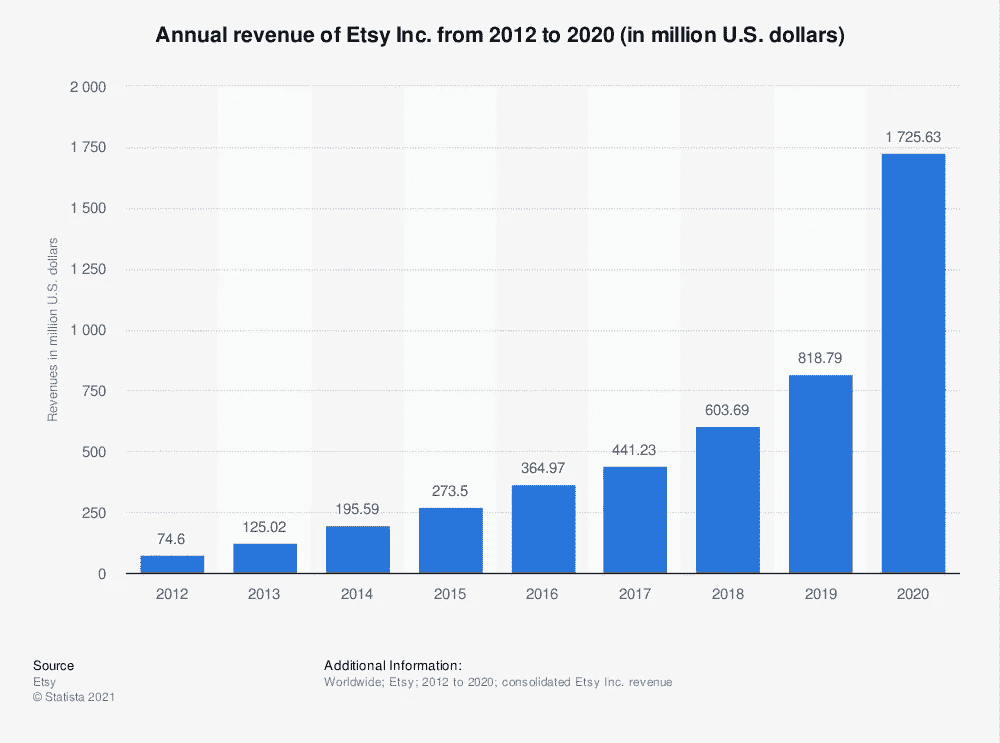
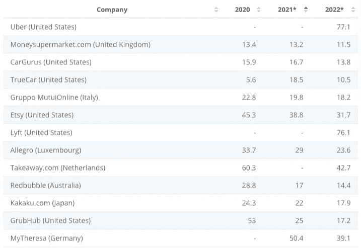

# 展望未来:2022 年商业机会的未来

> 原文：<https://medium.com/geekculture/looking-ahead-the-future-of-opportunity-in-business-in-2022-2f565d09f271?source=collection_archive---------13----------------------->

在它不再是你的机会之前开始！

image from [Statista](https://www.statista.com/statistics/409371/etsy-annual-revenue/)

## 你需要支付账单，但在不确定的情况下，这就足够了吗？

最好有一个新的收入流线，以确保你的财务安全。我在这十天里学到了很多东西，我应该与你分享，为明天做准备。

如图所示，这是 Etsy 去年的收入。在这个疫情时期，他们的收入已经直插云霄。2020 年的营收是 2019 年的两倍。2021 年会是什么样？

制作潮流是如此的热门，而且会越来越热！

为什么？

因为你无所不能！

有了 **3D 打印机**，你可以用自己的设计或购买的数字文件创作任何东西。你可以节省很多钱，这也是你的业务机会。

例如，高达在亚马逊的价格是 50 美元。如果你有一个免费的 STL 文件，你只需要花钱在素材上创建任意大小的文件。如果不违反许可，你也可以出售你的产品。

同理， **CNC 路由器**可以帮你用同样的 STL 文件雕刻木头但是最好做一些没有很多细节的东西比如高达图。我最喜欢它的一点是允许我们创造一些大的东西。

激光切割机 Glowforge 也能雕刻木头。它可以处理细节，但不能处理大问题。材料不限于木材，你可以雕刻到丙烯酸，皮革和织物。

用这些机器制造的许多产品在 Etsy 销售。

这就是为什么我在改变为时已晚之前把这个话题带到这里。

Etsy 也有自己的 SEO。这是关于命名标题和标签，但这并不容易。然后，我买了一个工具来寻找利基关键字，但它不显示我的搜索量。它不够好，正在退款中。我找到了搜索量比较好的一个，[销售武士](https://salesamurai.io/231.html)。

嗯，Etsy SEO 即将被客户看到。然而，获得订单是另一回事。你需要一个好的产品和有吸引力的图片来获得转化。是的，还有很长的路要走，如果你现在不开始，可能就晚了。有人已经从这个平台赚了数百万美元。因此，这是一个商业上的好机会。

EV/EBITDA from Statista

按需印刷也是一个热门趋势。 **Redbubble** 将在 2021 年跻身企业价值前十。这里没有 SEO。我们有的只是 Redbubble 趋势和关键词。这个操作有三个免费工具，但我认为[这个](https://podautomation.net/redbubble-trends-tool/)是其中最好的。

任何事情都需要时间去学习。我还需要等待结果，并不断提高它，以达到成功的曙光。

你可以选择现在改变，或者以后让世界强迫你改变。

你的选择。

— — — — — — -

**N.B.** 这个帖子是我在头条上的实验。是的， [Rytr](https://rytr.me/?via=suparatha) 可以生成标题和大纲，但它不能给我评分。我找到了标题生成器[context row](https://www.contentrow.com/)，并尝试了一下。

分类中有四种类型:点击诱饵型、常绿型、季节性和专题性。您可以过滤以获取任何类型的标题及其分数。

这个标题是一个话题型标题，在 Cententrow 中得了 80 分，但在 Sharethrough 中只有 68 分，share through 是一个在作家中很受欢迎的工具。

我应该相信什么？

这就是为什么我会把这篇文章作为一个调查。要参与，请鼓掌。

*   +1 鼓掌表示好
*   +2 拍手为好
*   +3 掌声表示伟大

感谢您的参与！