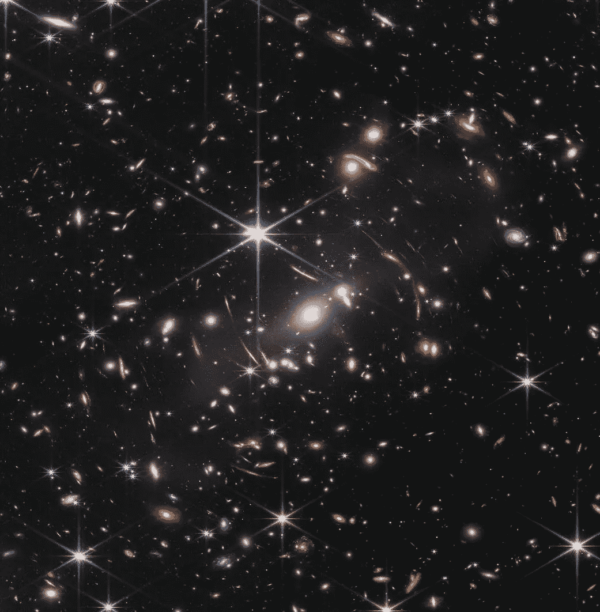

# 回顾 46 亿年前

> 原文：<https://medium.com/geekculture/looking-back-in-4-6-billions-of-years-88e35b1cf7a8?source=collection_archive---------5----------------------->

## 詹姆斯·韦伯深入浅出地描绘了红外图像

Image courtesy [NASA](https://www.nasa.gov/image-feature/goddard/2022/nasa-s-webb-delivers-deepest-infrared-image-of-universe-yet)

看了上面这幅天上的图像后，你会感到兴奋吗？还是因为它是一幅普通的天空图像而忽略了它？现在肯定存在这两类人。

美国宇航局刚刚公布了这张由詹姆斯·韦伯太空望远镜收集的超深红外图像…