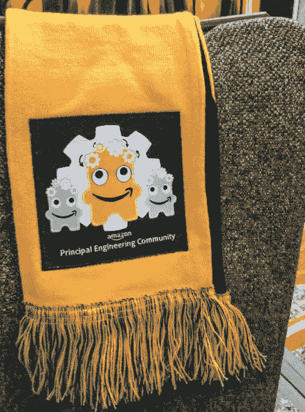
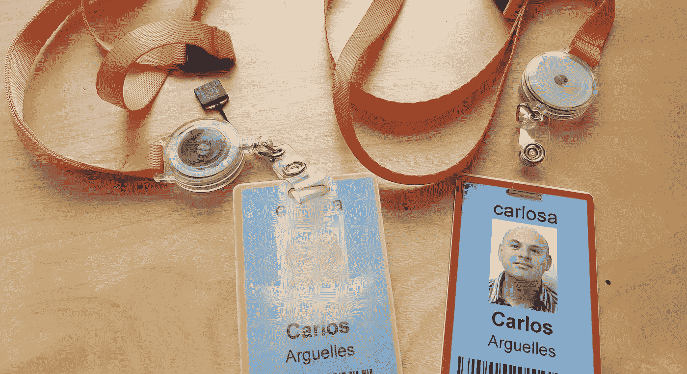
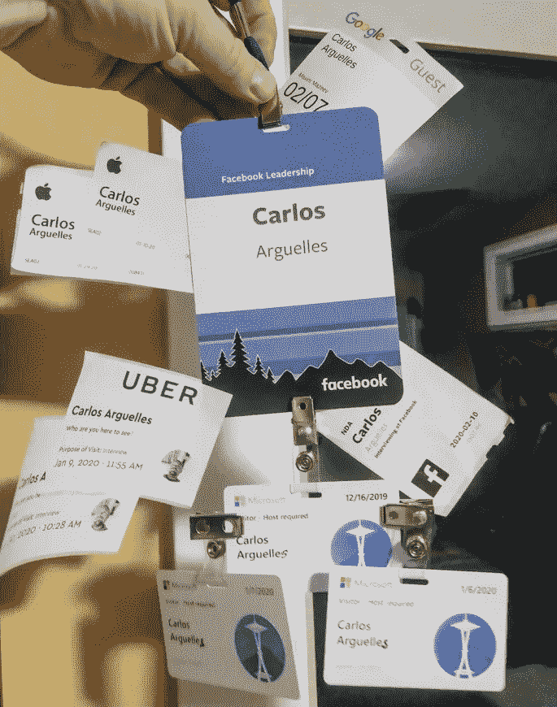
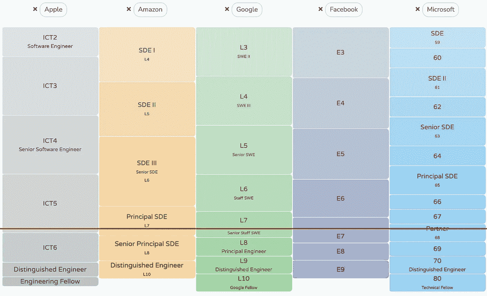
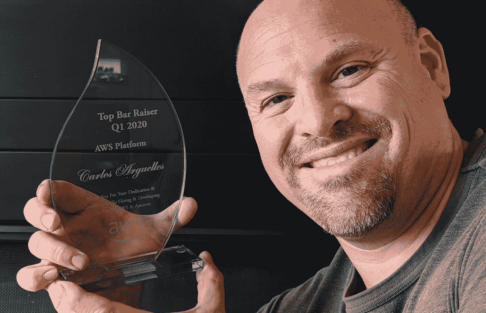

# 在疫情期间寻找一份首席工程师的工作

> 原文：<https://medium.com/geekculture/looking-for-a-job-as-a-principal-engineer-during-a-pandemic-2020-65297ecfb82b?source=collection_archive---------0----------------------->

## 有时候你只需要跳入未知！

*“你想离开亚马逊？？?"我妻子震惊地问，“但是你爱亚马逊！”是的，是的，我做到了。11 年前我来到亚马逊，我和这家公司一起成长，看着它从 3k 发展到 50k(它的股票从 40 美元涨到 3500 美元！).我很有效率。我很开心。这是家。然而，经过一番自我反省后，我准备离开一切，跳入未知的世界。在世界范围的疫情关闭世界的时候。我疯了吗？而作为[的首席工程师](https://www.amazon.jobs/en/landing_pages/principal-engineer-hiring)，这就带来了自己的一套并发症。*

Swag from the Amazon Principal Engineer community

还有很多*“破解* [*FAANG*](https://en.wikipedia.org/wiki/Big_Tech) *面试！”*博客，所以我不会重复这些。相反，我想把我的故事集中在我这个层次上做这件事的独特之处。作为一名高级职员或首席工程师找工作和作为一名初级工程师有点不同。

我决定离开亚马逊的简短原因是，这是一个促进我职业发展的好地方，也是一个与极其积极和聪明的工程师一起工作的好地方，但 11 年后，我想挑战自己的惰性和自满。我想让自己置身于一个完全不同的文化中，拥有完全不同的工具和开发实践。当然，我们不要对此含糊其辞，也有补偿方面的问题。公司最有动力在你第一次握手时给你丰厚的报酬(尤其是如果有竞争性的报价)，但你呆的时间越长，你的报酬就会偏离市场越多(除非你定期得到晋升)。

Amazon 5-yr badge (yellow) and 10-yr badge (red), last day at work at Amazon

我已经有十年没有参加过外部面试了，所以我想如果我要参加，我会全力以赴。我花了 300 个小时练习编码和系统设计问题(连续三个月每天晚上 3 个小时)。然后，我通过电话筛选，在谷歌、脸书、微软、优步、苹果、推特和 Salesforce 排队面试。我想真正了解我的亚马逊泡泡之外的世界，收集数据，为我的职业生涯做出明智的、基于事实的选择。这是一次精疲力尽但很有收获的自我发现和反省之旅，也是一次将自己推向极限的旅程。

Built a little collection of visitor badges from Google, Apple, Facebook, Uber and Microsoft. Exhausting!

一、一些语境设定: ***什么是职员或首席工程师？*** 在科技公司，你可以作为个人贡献者(“IC”)成长，也可以作为管理者成长。

对于 ICs，像微软、亚马逊、谷歌这样的公司，我相信其他公司也一样，遵循着非常相似的等级分布。你拥有大约三分之一的入门级工程师(亚马逊 SDE-I，谷歌 SWE-L3，微软 59-60)。这些人通常是职业生涯最初几年的工程师。第二桶是*标准工程师*(亚马逊 SDE-II，谷歌 SWE-L4，微软 61–62)，大概是一半人口。这是大多数工程师职业生涯的重要部分(我也是)，并且编写最多代码的地方。然后开始变薄。大多数团队会有一两个*高级工程师*领导技术决策，这大约是总人数的 10%(亚马逊 SDE-III，谷歌 SWE-L5，微软 63–64)。

除此之外的技术 IC 级别(职员、高级职员、负责人……)人数很少(5-9%的工程师)。大多数人预计在职业生涯中不会达到这些水平。你是例外而不是常态。你还在编码，但是编码少了很多。你在领导，但你通常是领导领导者，而不是领导个人。你通过他人间接地完成事情，你必须弄清楚如何在没有权威的情况下施加影响。你的时间框架更长，你投资的东西将在几年后获得回报。你经常是组织之间的粘合剂，或者是工程师和高层领导之间的粘合剂，在技术决策和商业决策之间来回转换。你为董事和副总裁提供建议，并列席他们的扩大员工会议。《员工工程师:超越管理的领导力》是一本关于这方面的好书。

From levels.fyi (red line is my best educated guess on where I am)

我在找工作时要做的第一件事就是**根据受过良好教育的人的猜测，判断我在其他公司处于什么级别**，并经常就此教育我的招聘人员。亚马逊校长(L7)是一个宽级别。它可以映射到谷歌的职员或高级职员。可以映射到微软的 66，67 或者 68。脸书的 E6 或 E7。苹果的 ITC5 或者 ITC6。棘手吧。我已经当了五年多的校长，所以我对自己的工作感到非常满意。我当时正在追求 L8(并不特别着急，但我已经仔细考虑过了，并经常和我的经理聊起这件事)。所以我估计我在亚马逊校长的上层。我对 levels.fyi 做了相当多的研究，并与我在所有这些公司的朋友聊天来验证它。最终，我收到的报价证实了我在现实世界中的数据点。

对于找工作来说，在谷歌、亚马逊或微软这样的大公司，成为统计上排名前 5%的工程人员是一件喜忧参半的事情。你的就业市场非常狭窄(除非你想改变，比如去创业公司或 T2 独角兽公司或尝试完全不同的东西)。

在我职业生涯的早期，我和其他任何工程师都是可以互换的**。但是 L7 工程师不一定可以互换**。我们经常通过专业化和成为一个领域的专家而达到我们的水平，这意味着我们 ***为需要或想要该特定领域的专业知识和高度判断力的雇主带来不成比例的价值。*******

****假设你有一辆保时捷和一辆 4x4 SUV。如果你需要在雪地上驾驶，你应该使用你的四轮驱动车。你会用你的保时捷吗？当然，这是一辆很棒的车，它有四个轮子，可以向前移动，但它可能不是最适合这项工作的车。但是，当阳光明媚，天气温暖，你有一个弯曲的乡村道路，那么是的，你想要的是保时捷敞篷车，而不是越野车，对不对？(我不确定我是保时捷还是 SUV！)****

****就我而言:我花了 24 年时间专注于大型软件公司的工程生产力。我擅长于识别软件开发经验中的小的低效点，这些低效点在规模上累积了数百万美元的浪费，并且用工具引导解决它的方法。**但这也意味着还有很多其他领域我没有带来独特的价值**。只有少数公司( [FAANG](https://en.wikipedia.org/wiki/Big_Tech) ，或 [FAANGMULA 或 FAANGULTAD](https://www.teamblind.com/post/FAANGMULA-or-FAANGULTAD-1eyty2hB) ，或任何我们现在使用的时髦缩写……)需要经验丰富的工程师专注于优化他们的工程师使用的软件开发工具链。亚马逊、微软、谷歌等都定制了专有的开发者工具来做几乎所有的事情，并对他们的内部生态系统进行了高度优化，所以他们是我的天然家园。****

****我有一个岔路口。在我人生的这个阶段， ***我是应该[1]加倍努力发挥自己的优势，冒着被逼入绝境的风险，因为自己非常有价值，但只对一小部分公司有价值，还是应该[2]利用这个机会变得更有替代性？*** 如果这发生在我职业生涯的早期，我会说毫无疑问是第二名。我选择了#1:在这个行业干了 24 年后，在做我喜欢和擅长的事情的同时，最大化我的收入更重要。这并不意味着我不想*学习:*你必须不断地在软件行业中学习和发展，无论你是留在一个团队/公司/领域还是跳槽到一个不同的领域。但是我不想重新开始我的职业生涯。我鼓励你有意识地定期重新考虑这个岔路口。#1 肯定伴随着风险。我理解并接受这些风险。****

****一旦我在自我反省和反省之后明白了这一点，我也必须告诉我的招聘人员我是谁，我在哪里带来了价值，在哪里没有。没有必要在一个不合适的角色上浪费我和他们的时间。招聘人员把我扔来扔去，直到合适的人知道该拿我怎么办。有一次，我和一位招聘经理聊天，解释了我的价值，一些公司为我创建了一个定制角色。我知道我的技能是*所需要的*，但是在公司里找到需要这些技能的人是一个挑战。****

****即使有远程工作的可能性，在西雅图大都会区拥有一间办公室对我来说也很重要。如果这不是一个大办公室，你作为一个高层领导不在中心可以吗？当你不在房间里而其他人都在的时候，在 L7 更难施加影响。具有讽刺意味的是，我们即将到来的 covid19 锁定结果是一个均衡器，在 Zoom、Google Meet、微软团队或亚马逊 Chime 上，每个人都是一个类似大小的正方形，但当我在 2020 年 1 月/2 月采访时，我幸福地意识到整个世界将发生多大的变化。我一直在亚马逊和微软的“母舰”上工作，目睹了小型卫星办公室的挫败感，有时感觉自己像个继子。作为一名高级领导人，这变得更加困难。你甚至可能是办公室里唯一的 L7。从好的方面来说，它给你一个独特的机会，让你在传播文化方面极具影响力，并与远程办公室一起成长。****

****有一个 L7 的候选人有点罕见。亚马逊拥有完全不同的高管招聘人员、面试流程，甚至为 L7+职位配备了经过专门培训的面试官。大部分公司都有 L7+的专用车道。在这方面，脸书轻而易举地获得了红毯奖。他们的高管招聘人员在各方面都是顶尖的(也是了不起的人)。他们邀请我参加内部活动。我和妻子与他们西雅图的领导一起去品酒。他们给了我很多很酷的礼物。虽然是些小细节，但它们确实给人留下了深刻的印象。我知道*客观上*认为*招聘*的经历可能和*工程*的经历完全不一样，但是*主观上*，一点点纵容确实会影响你。我和优步的经历也很突出；他们给了我一个非常有吸引力的报价，他们还寄给我一份贴心的生日礼物！谷歌招聘人员在我面试的每个会议室都设置了电视，让我说一些可爱而积极的事情——这是一个可爱的姿态，产生了很大的影响。另一方面，在微软面试时，我觉得自己有点像牛。我申请了公司内部的五个职位(听起来可能很多，但这是一个拥有> 100k 工程师的大职位)。我有一份可靠的简历，但是一些招聘经理甚至几个月都懒得回复(他们最终还是回复了，在我完成几个月后！).****

****在亚马逊工作期间，我进行了 800 多次采访，其中大部分是作为一名酒吧招待。BR 是一位特殊的面试官，除了其他事情之外，他还会做出最终的录用/不录用决定。要获得 BR 认证，你需要通过大量的培训，经验丰富的 BR 会跟踪你，并对你的面试风格、时间管理和你提取的数据提供反馈。当你坐在桌子的另一边时，成为一名酒吧招待绝对是一种诅咒。我经常发现自己遇到这样的情况，我的面试官在一些提供低质量信号的事情上浪费了 5、10 分钟，甚至直接问了我一个没有意义的问题，没有提供有价值的数据。****

********

****Top Bar Raiser Q1 2020 for Amazon AWS!****

****入门级的面试几乎只关注编码。但是 l7 的面试就不一样了。所有公司都遵循一个相似的组合:在一个循环中的大约 6 次面试中，1-2 次编码，2 次系统设计，1-2 次领导力培训。一些循环在编码中索引过高，在领导中索引过低，这很愚蠢，因为 L7 工程师编码更少，领导更多(我以 L6 的身份写了 100k 行 Java，但可能只有 L7 的一小部分)。脸书的循环有一个有趣的额外面试，我必须描述我的一个个人技术设计，我的面试官做了一个深入的调查，问了我很多关于它的问题。我很喜欢这一点，因为它最终只是两位工程师和白板之间有趣而自然的来回讨论。苹果的循环有点不协调:一半的人，在西雅图的人，是前 amzn，专注于“告诉我一次你做了 x”([行为](https://money.usnews.com/money/blogs/outside-voices-careers/articles/how-to-master-behavioral-and-situational-interview-questions))；另一半，库比蒂诺的人们，有着奇怪的理论上的“如果 x 发生了你会做什么”的问题([情景](https://money.usnews.com/money/blogs/outside-voices-careers/articles/how-to-master-behavioral-and-situational-interview-questions))。这些在亚马逊是被禁止的。通过深入探究你实际上做的事情，我可以了解你更多，我可以问足够多的试探性问题，以确保你的答案不是编造的。****

****我认为我的第一批真实世界的面试不会因为生锈而表现得特别好，随着我变得更加舒适和自信，我会逐渐改善。**作为一名书呆子工程师，我*优化了* *解决方案:*我按照“如果我没有得到一份工作，我会有多难过”的顺序对循环进行了排序我学到的是人类是不可预测的。有些循环我做得很好，有些循环我做得不好。即使在一个循环中，在一些特定的采访中我做得很好，而在一些采访中我做得不好。不是问题本身。有时候是和面试官之间的化学反应。有时是我面试的房间里的能量。有时候只是我那天的偏头痛。有时是因为我早上喝的咖啡太浓，或者前一天晚上睡了多少觉。面试中有人类随机性的因素。如果你在某个地方面试，没有得到工作，并不意味着你没有资格在那里工作！再试一次。******

****总而言之，2020 年的伟大采访狂欢是我为自己做过的最好的事情之一。在与招聘人员交谈、反思我是谁以及如何讲述我的故事、为技术面试做准备以及花在实际循环上的时间之间，我可能花了我生命中的 400 多个小时。我想更多地了解我的泡泡之外的世界，更多地了解我自己，并向自己证明我可以迎接挑战，我做到了。把自己放在那里，你会比你想象的更了解自己。无论你做什么，不要让惰性和自满阻止你每天推动自己一点点。****

****我最终在谷歌获得了一个高级职员的职位，自 2020 年 6 月以来，我一直愉快地呆在那里。我喜欢谷歌的很多东西，也想念亚马逊的很多东西。但那是不同的博客！:)****