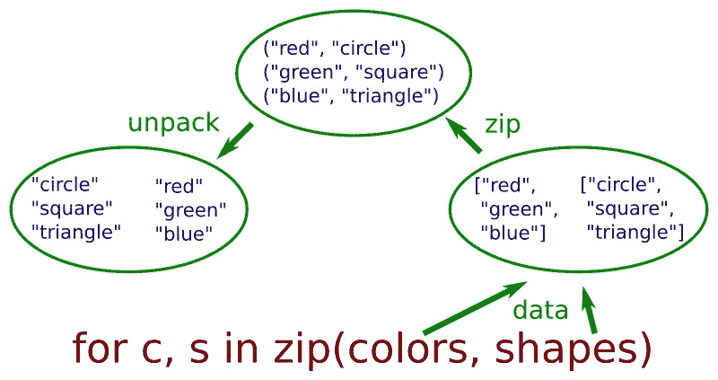

# 用 zip 循环两个列表

> 原文：<https://medium.com/geekculture/looping-over-two-lists-with-zip-129b1745ab43?source=collection_archive---------7----------------------->

避免循环计数器的 python 式技术



我们有时需要同时循环两个不同的序列。例如，如果我们有两个列表:

```
colors = ["red", "green", "blue"]
shapes = ["circle", "square", "triangle"]
```

我们想并排打印这些列表:

```
red circle
green square
blue triangle
```