# Python 中的循环——回到基础

> 原文：<https://medium.com/geekculture/loops-in-python-back-to-basics-7d305be3adf7?source=collection_archive---------17----------------------->

## 深入循环。

拥有坚实的基础在所有职业中都至关重要——成为一名专业的数据辩论者也不例外。无论是初学者还是高级用户，不时地学习基础知识总是一个好主意。在这篇文章中，我将讨论循环。

Photo by [Bru-nO](https://pixabay.com/users/bru-no-1161770/) from [pixabay](https://pixabay.com/)

# 环

简而言之，循环是一组反复执行的指令，直到满足给定的条件。这个条件可以是任何东西:一定数量的执行(吃 10 个甜甜圈)或在未知数量的执行后可以满足的条件(吃甜甜圈，直到你可以听到你的葡萄糖水平飙升)。

使用循环的原因可能各不相同，例如:不想重复需要多次执行的代码，不知道一个代码块需要执行多少次，或者您有一个程序需要主循环连续运行，直到用户决定该程序应该停止。

Python 中使用了两种类型的循环——while 的*循环和 for* 的*循环。它们都可以用一个(名字有点奇怪)else 子句扩展，for 循环实际上有一个非常有趣的 Python 版本，名为*理解*。在接下来的文章中，我将带你了解这些概念，以及*继续*和*中断*语句的用法。*

## **While 循环**

只要循环中提供的表达式计算结果为 true，就会执行 while 循环。

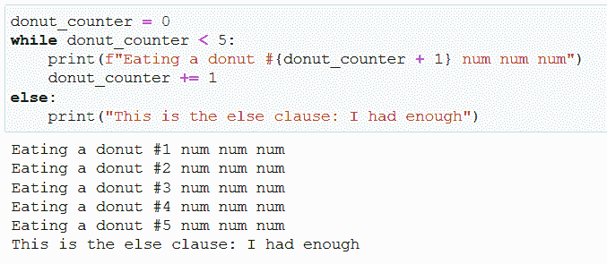

Screenshot by Author

下面的分类有助于对正在发生的事情有一点了解:

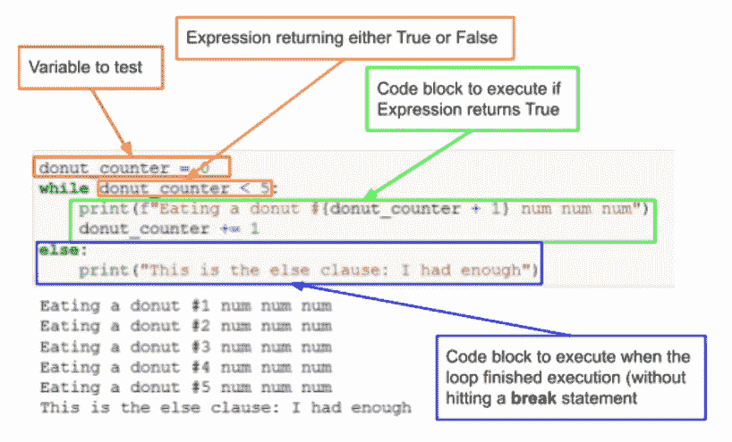

Screenshot by Author

这里有一个流程图，让您对逻辑有一个简单的了解:

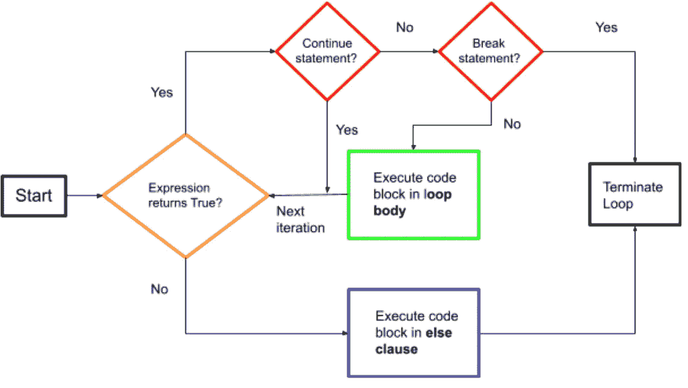

Screenshot by Author

返回布尔值的逻辑测试可以是任何东西，它只取决于代码使用的上下文。一个重要的注意事项是，除非这是您明确的愿望，否则您不应该忘记更改主表达式中被测试的值，否则您将会陷入一个所谓的无限循环，一个只有通过解释器的终止才能停止执行的循环。

> 如果你想让我保持咖啡因创造更多这样的内容，请考虑支持我，只要一杯咖啡。

## **为循环**

*for* 循环是 Python 中的一个特殊工具，因为其背后的逻辑与你可能从其他语言中得到的不同。这里的 *for* 循环用于遍历 iterable 或 iterator 对象(如列表、字典、字符串等)，然后执行很可能使用对象中的元素的代码块。说得专业一点，语句的*产生一个迭代器对象，这个迭代器提供原始序列或 iterable 中的项目。*

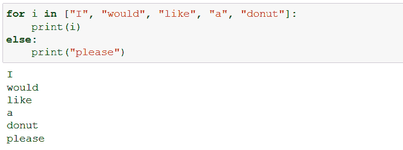

Screenshot by Author

## **Else 子句**

可选的(！)*while 或 for 循环末尾的 else* 子句使我们能够在主循环执行完毕后执行一段代码，而不会遇到 *break* 语句。这可能看起来有点多余，但是在循环之后使用 else 而不是其他逻辑检查来查看它是否运行了完整的过程或者有什么东西中断了执行，这实际上非常方便。

## **中断声明**

有时我们不希望循环运行，直到满足预定义的结束标准，或者循环中的迭代器用完为止。 *break* 语句让我们能够终止最内层封闭循环的执行，包括 *else* 语句。

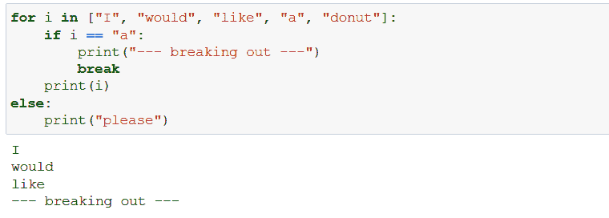

Screenshot by Author

## **继续语句**

当 break 终止它所在的整个循环时，使用 *continue* 可以停止循环中一次迭代的执行，然后让循环跳转到下一次迭代。

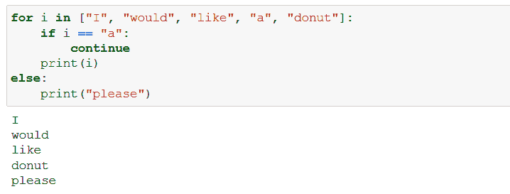

Screenshot by Author

注意，调用*继续*时，最后会执行*否则*子句。

# 理解

最重要的事情之一是运用理解，至少在我看来是这样。存在四种类型:列表、字典、集合和生成器理解。

理解本质上是一种较短的语法，用于创建基于另一个的可迭代或迭代器。我在一篇关于循环的文章中提到它们的原因是，这个想法是，通过理解，你通过循环另一个对象来创建一个对象——用 for 循环。

## **列表理解**

举个最基本的例子，假设你有一个整数列表(L1 ),你想有一个新的列表(L2 ),是 L1 整数的平方值-1。最基本的解决方案是使用一个循环来完成这项工作:

Screenshot by Author

列表理解提供了一种更优雅的方式来做到这一点:

Screenshot by Author

语法一开始可能有点模糊，但实际上相当简单:

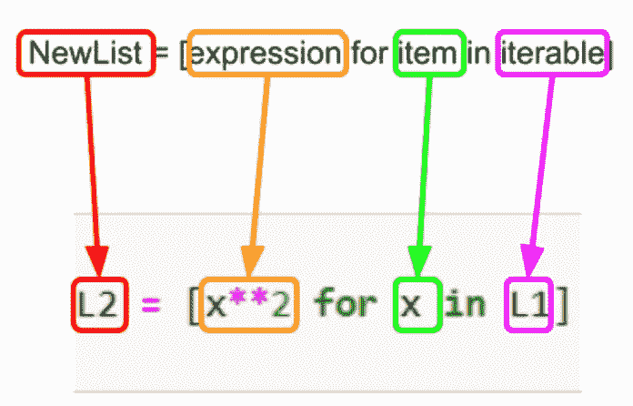

Picture by Author

当你在表达式中应用 condition 时，它会变得有点粗糙，但并不太糟糕:

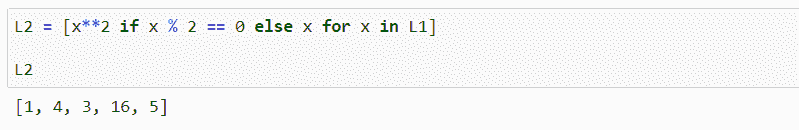

Screenshot by Author

这一细分更清楚地表明:

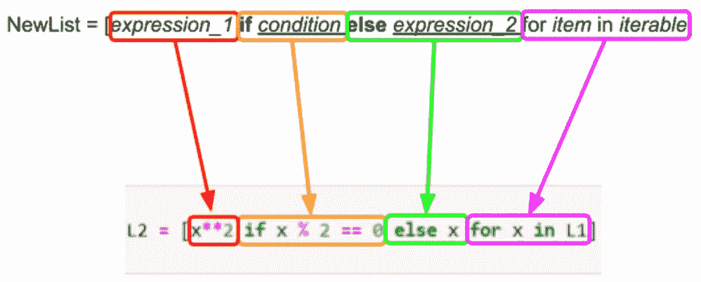

Picture by Author

由于这不是一篇理解文章，我将只涉及其他三种类型，但通过上面的分类，我认为这可以作为一个很好的介绍。

## **字典理解**

这里我们创建的是一个字典而不是一个列表(非常令人惊讶)——唯一棘手的部分可能是要记住，对于理解表达式中的循环，您需要为起始 iterable 中的每一项创建 key:value 对:

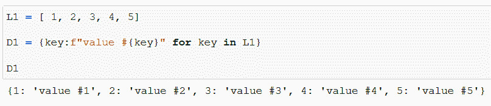

Screenshot by Author

这是有意义的，你完全可以使用多个 iterables 来创建字典:

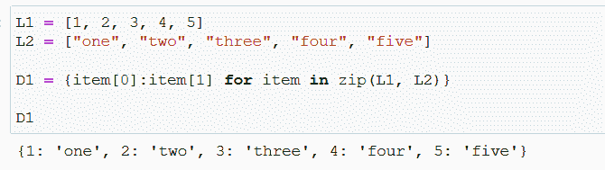

Screenshot by Author

## **设定理解**

集合理解和列表理解非常相似，除了你把表达式放在花括号里，当然，你在最后不会有任何重复:

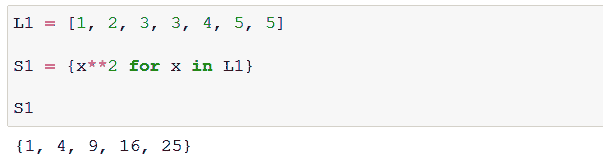

Screenshot by Author

## **发电机理解**

就像前一个一样，生成器综合式在语法方面就像列表综合式一样，除了您在表达式周围放了简单的括号:

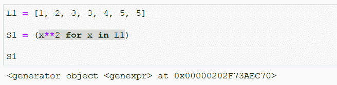

Screenshot by Author

真正的力量来自内存管理:正如您所看到的(在创建生成器时您可能已经预料到了)，这里我们没有在内存中创建完整的列表:相反，我们只有一个生成器，它可以逐个生成列表中的每个元素:

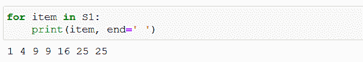

Screenshot by Author

当您需要对大量项目执行操作，并且将所有输出同时存储在内存中很困难时，这将非常方便。

感谢您花时间通读这篇文章——我希望您已经从中找到了价值，无论您是刚刚开始熟悉基础知识的初学者，还是需要简单了解基础知识的高级 Python 用户。