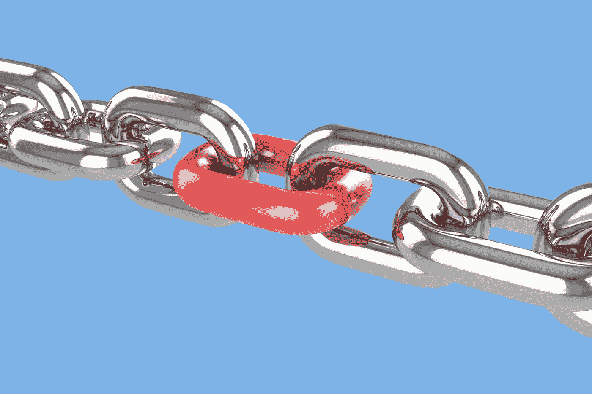
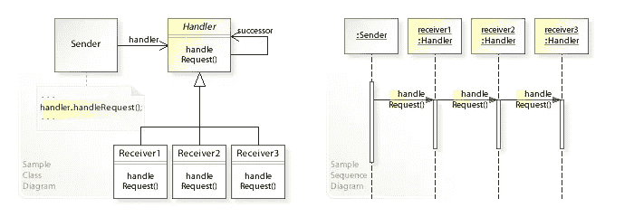

# 与责任链的松散耦合

> 原文：<https://medium.com/geekculture/loose-coupling-with-chain-of-responsibility-bf0937028276?source=collection_archive---------48----------------------->



Source: [https://services.eiu.com/](https://services.eiu.com/)

L 让我们来谈谈行为设计模式之一，责任链模式。责任链模式的主要目标是在应用程序设计中实现松散耦合。在这种模式中，当发送者发送一个请求时，该请求将通过一个由多个对象组成的链，这些对象将尝试处理该请求。

想想主席、秘书和委员会成员。由于他们的职位不同，他们拥有不同类型的权限。所以，如果你想设计一个基于权限层次的系统，你可以很容易地使用这种设计模式。

您知道 Java *记录器*使用*责任链模式*吗？。让我们试试*记录器类*来看一个例子。*记录器*类有几个级别，如

*   严峻的
*   警告
*   信息
*   配置
*   很好
*   好的
*   好的

(*重度*最高，*精细*最低)。

现在在这里，我已经将级别设置为`INFO`。看输出。它将打印我设置的所有日志消息。

输出:

```
May 26, 2021 4:34:47 PM loger.LoggerExample main
INFO: Info levelMay 26, 2021 4:34:47 PM loger.LoggerExample main
WARNING: Warning levelMay 26, 2021 4:34:47 PM loger.LoggerExample main
SEVERE: Severe level
```

现在让我们将级别设置为`WARNING`，您将会看到，它会打印出警告和严重警告这两条消息。

```
May 26, 2021 4:35:49 PM loger.LoggerExample main
WARNING: Warning levelMay 26, 2021 4:35:50 PM loger.LoggerExample main
SEVERE: Severe level
```

相应地，如果您将级别设置为`SEVERE`，它将只打印`SEVERE`级别

```
May 26, 2021 4:36:54 PM loger.LoggerExample main
SEVERE: Severe level
```

让我向你展示一下责任链是如何实施的。



Example UML class and sequence diagram of the Chain of Responsibility design pattern. (Source: [https://en.wikipedia.org/](https://en.wikipedia.org/) )

为了实现责任链模式，我们需要一个 Handler 类、ConcreteHandler 类和一个 Client 类。

处理人:

handler 类可以声明为接口或抽象。而且，它是所有 ConcreteHandler 类的超类。

混凝土处理器:

这些是处理请求的类。如果 ConcreteHandler 不能处理请求。它将请求转发给下一个后继者(下一个 ConcreteHandler)。与处理程序、抽象或接口不同，这些类有处理请求的代码。

客户端:将请求传递给对象链。

现在让我们来举个例子。还记得“[原型设计模式介绍](https://hasithas.medium.com/introduction-to-prototype-design-pattern-1ec1a3480772)”示例中的“John Bee”吗，因为 John Bee 有一个无人机送货系统，现在他想为他的客户提供“黑色星期五”购物折扣。

超过 250 美元的每笔交易享受 10%的折扣，超过 500 美元的每笔交易享受 30%的折扣，超过 1000 美元的每笔交易享受 50%的折扣。

首先，让我们创建订单详细信息类。

接下来，就像在 UML 图中一样，让我们首先创建 Handler 类。这可能是一个*接口*或者一个*抽象*类。因为处理程序应该知道后继者，所以让我们创建一个名为`successor`的处理程序对象，并为它实现一个名为`setSuccessor()`的*设置器*方法和`getDiscount()`方法。

现在我们来创建处理请求的 ConcreteHandler 类(计算折扣的折扣类)。

现在让我们创建多个订单，看看这个设计模式如何处理它们。

```
Total price of products: 250.0 USD
Discount: 10%
Discount price: 225.0 USDTotal price of products: 450.0 USD
Discount: 10%
Discount price: 405.0 USDTotal price of products: 500.0 USD
Discount: 30%
Discount price: 350.0 USDTotal price of products: 600.0 USD
Discount: 30%
Discount price: 420.0 USDTotal price of products: 1000.0 USD
Discount: 50%
Discount price: 500.0 USDTotal price of products: 1200.0 USD
Discount: 50%
Discount price: 600.0 USD
```

正如你所看到的，它工作得很好，你得到了一个解耦的代码。此外，为了启动这个链，我实现了一个名为 *Discount* 的类。这与设计模式无关，仅用于传递后继者。我这样做是因为万一“FirstDicount”被更改了。

还要记住，客户端可以将请求发送给任何处理程序，而不仅仅是第一个处理程序，并且客户端不知道哪个处理程序处理请求。如果你正在寻找完整的实现，请访问我的 Github 简介。我已经上传到这里了。

[](https://github.com/Hasitha-Su/Krish-LP-Training.git) [## hasit ha-Su/Krish-LP-培训

### 通过在 GitHub 上创建一个帐户，为 Hasitha-Su/Krish-LP-Training 开发做出贡献。

github.com](https://github.com/Hasitha-Su/Krish-LP-Training.git) 

## 参考