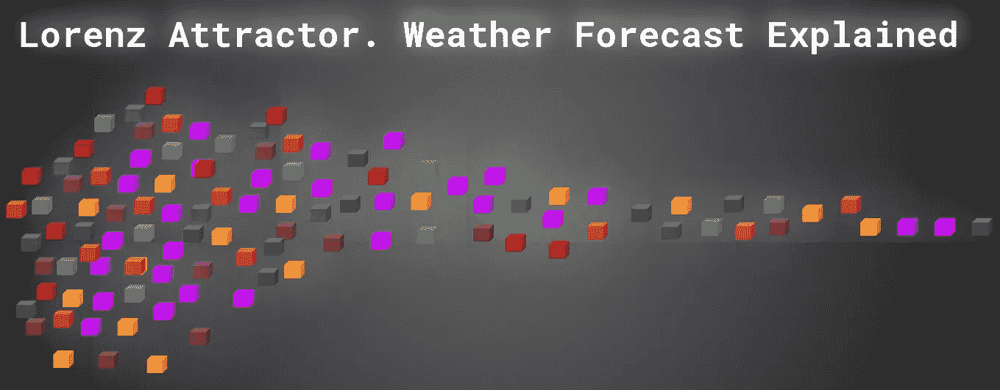
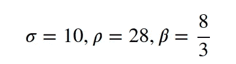
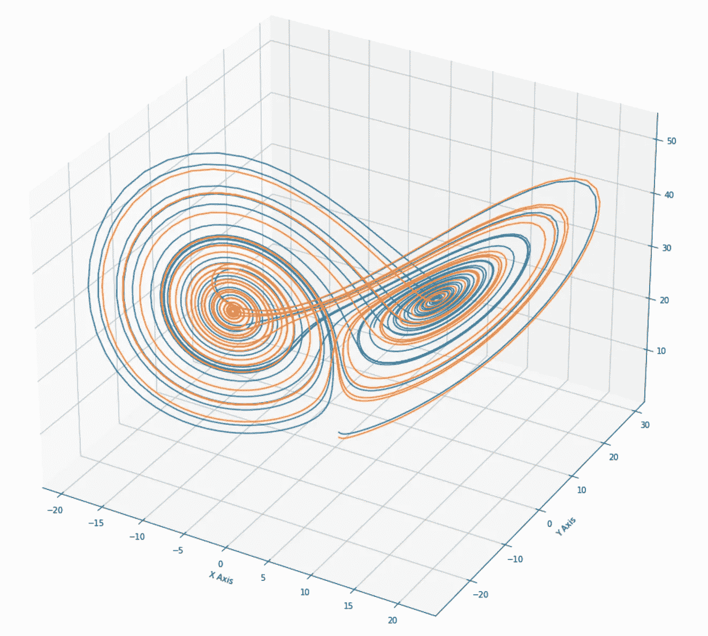
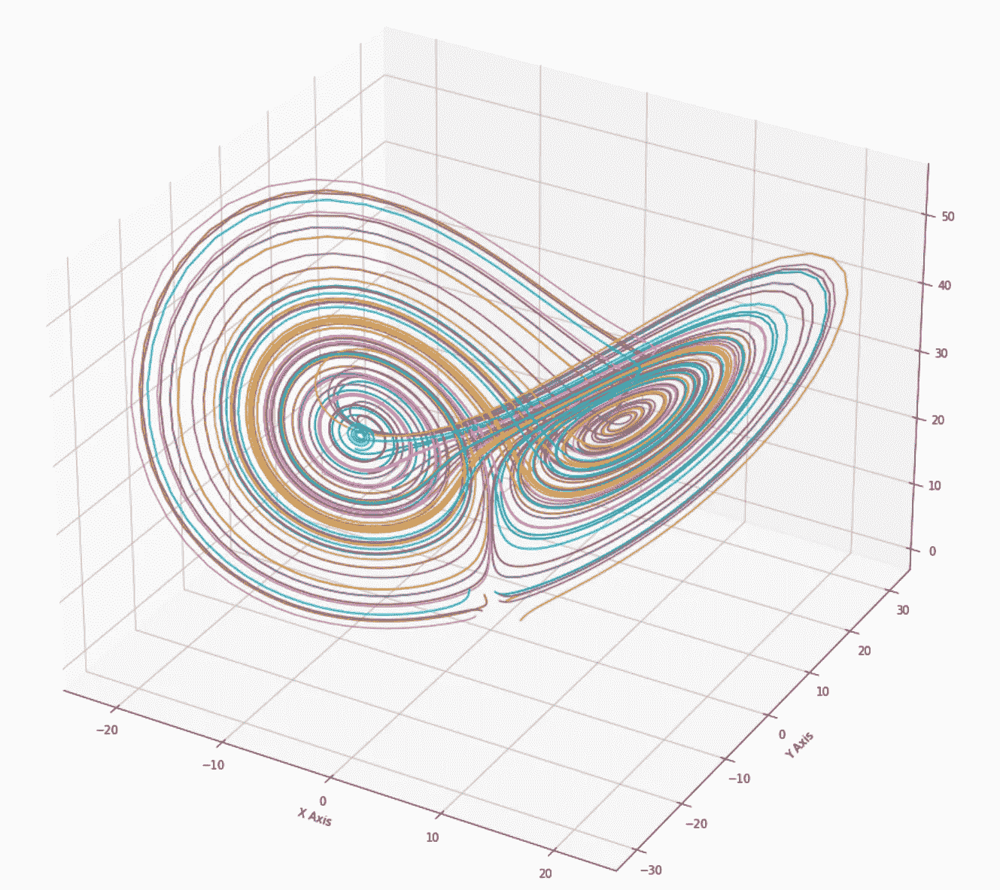
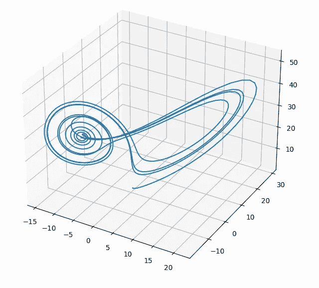
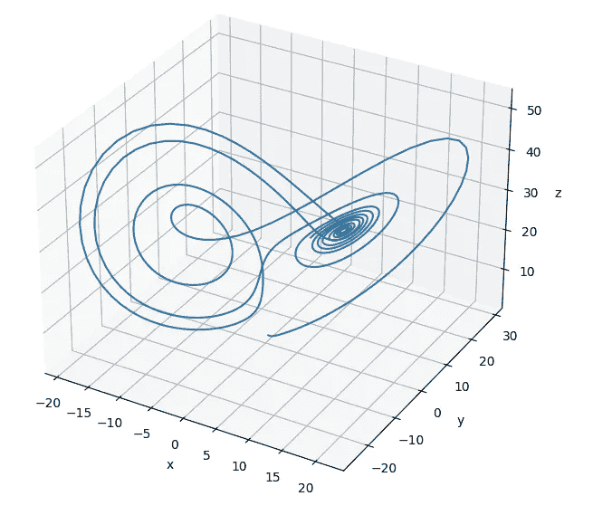

# 洛伦兹吸引子。天气预报解释。

> 原文：<https://medium.com/geekculture/lorenz-attractor-weather-forecast-explained-93703ad0ec6?source=collection_archive---------12----------------------->



by author

你经历过很多次，当你前一天查看天气预报时，情况与预期的完全不同。天气预报是一项复杂的任务。这种复杂性与地球大气密切相关，可以认为地球大气是一种流体。对于大气(流体)中每一个粒子，我们可以加上速度、密度、压力、温度等。这些参数不是恒定值，而是随时间变化，影响天气条件的变化。

请注意，本文中描述的所有模拟(Python 和 C++)都可以在我的 [GitHub 上找到。](https://github.com/markusbuchholz/Lorenz-Attractor)

可以编译和运行的 C++代码如下
[头文件](https://github.com/lava/matplotlib-cpp)(用于绘图库)必须和你的 cpp 在同一个文件夹中。

```
//compile
g++ my_prog.cpp -o my_prog -I/usr/include/python3.8 -lpython3.8//run
./my_prog//folder tree
├── my_prog
├── my_prog.cpp
├── matplotlibcpp.h
```

为了估计对象的行为，我们需要首先创建动态模型，该模型描述(在这种特定情况下)时域中大气参数之间的关系。

通常动力学由微分方程(不同阶)描述。

我之前提到的大气模型是由许多参数描述的，因此详细的模型可以复杂地创建、计算和分析。这种复杂性使得模型对于参数变化是“脆弱的”(当输入/参数变化时系统响应的波动)。

1963 年，美国数学家 [Edward Lorenz](https://en.wikipedia.org/wiki/Edward_Norton_Lorenz) 简化了这个问题，提出了“只能”用三个微分方程来描述的大气模型:


其中数字(x，y，z)指定了大气的状态，其运动遵循矢量场。常数:


是特定于某些系统。

洛伦兹使用(也用于以下模拟):



例如，x 表示温度，第二个 y 表示湿度，最后一个 z 表示压力。

当我们沿着一条轨迹(我们求解 E. Lorenz 方程提出的微分方程)时，我们可以观察天气的演变(运动)。

正如你所想象的，这个模型并不简单，所以使用这些等式是不够的。

然而，这些方程显示了非常有用的现象，称为[蝴蝶效应](https://en.wikipedia.org/wiki/Butterfly_effect)。这意味着即使初始条件的微小变化(例如某一点的温度上升了约 0.001 度等)也会对大气将遵循的轨迹形状产生巨大影响。聪明的句子(Lorenz 的会议文章的标题)被用来描述这种效果:

巴西一只蝴蝶扇动翅膀会在德克萨斯州引发龙卷风吗？

下面的模拟给你一个关于这种现象的主要概述。初始条件(橙色和蓝色点的 x，y，z 位置)略有不同。



by author

起初，两个轨迹保持不可区分(参见测试结果)，然而随着时间的推移，差异变大且更不稳定(蓝色和橙色轨迹在时域中的差异)。


by author

这就是 [**混沌**](https://en.wikipedia.org/wiki/Chaos_theory) ，这意味着它旁边的物理系统可以是确定性的(意味着相同的系统输入影响相同的系统响应)然而在相同的时间内相同的系统对于初始条件的微小变化(不同的温度或风速)表现不同。小的输入变化(局部波动)会对系统响应产生“巨大”影响(运动是不可预测的)。

我们可以在不同的领域产生蝴蝶效应，比如股票市场、宏观经济过程、交通、人们的生活以及其他你能想到的领域。总有蝴蝶效应。

我们计算这些微分方程和解还有其他令人敬畏的特征。此外，轨迹是不同的和不可预测的，但是它们累积在同一个蝴蝶形状的对象上，该对象是完全独立于初始位置创建的。
所有的轨迹似乎都被这只蝴蝶所吸引。我们把这种效应称为 [**洛伦兹吸引子。**](https://en.wikipedia.org/wiki/Lorenz_system)

请考虑下面的曲线，该曲线描述了原点(初始条件)不同的轨迹如何在同一个蝶形物体上累积。



by author

运行 C++时，我们会得到类似的结果。Plots 显示不同初始条件下的轨迹——源代码中的细节(我无法在同一个图上绘制两条曲线)。



by author



by author

感谢您的阅读。