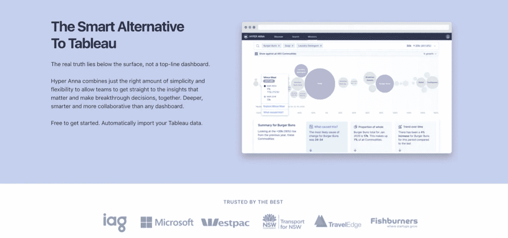

# 迷路了？要问数据分析师的 10 个问题(在下一次 Zoom 会议中)

> 原文：<https://medium.com/geekculture/lost-10-questions-to-ask-your-data-analyst-in-your-next-zoom-meeting-76ff544f7e47?source=collection_archive---------54----------------------->

*任何人都可以提出更好的数据分析问题的 10 种快速方法— &我们指的是任何人。*

10 instant ways for anyone to ask better questions of data

保存数据是一回事。但知道该问什么问题才能更清晰地描绘出商业状况，则是另一回事。

问题是，许多人没有受过训练，不知道如何提出数据问题。人们缺乏信心和将数据分析分解成小部分的知识。然后，他们努力将这些部分(分析)组合起来，描绘出一幅业务绩效的图景——这是数据驱动型决策的基本要求。

*   那么，当谈到数据时，你应该问什么问题呢？
*   你如何提高自己的批判性思维能力(与数据分析师匹敌)？

在这篇 Medium 文章中，我们分享了任何人都可以做的 10 件事，以增强自己进行分析或评估他人分析的信心。

非常适合在会议中提出更好的问题。

# 目录:

*   **那么说到数据，你应该问什么问题呢？**
*   如何提高自己的批判性思维能力(与数据分析师匹敌)？
*   **有没有一种自动化的方法？(提示—答案是‘是’)**

# 任何人提出更好的数据分析问题的 10 种方法:

1.  **有个业务问题。**成功的数据分析师不会在头脑中没有问题或假设的情况下寻找见解。如果分析没有意义，是人们过度复杂化了讨论，或者是信息太多(分析麻痹！)—然后回到基础:什么是最重要的商业问题——不是数据问题——而是你需要解决的常识性商业问题？从这里开始。
2.  **一直往下钻，越钻越深。**成功的分析师知道真正的洞察力往往隐藏在细节中——从总体上看结果，掩盖了真实情况。因此，他们不仅通过共同因素(如位置、产品、业务线)来划分顶线结果，还通过业务团队不会想到要问的因素来划分。始终要求深入调查，细分绩效。
3.  **永远基准。**区分事实和洞察力的是*背景*。优秀的数据分析师知道这一点，他们会随着时间的推移，通过有意义的比较点，主动对结果进行基准测试。基准性能就是一切。
4.  **不停地问‘为什么’。**超级明星数据分析师痴迷于“为什么”，主动寻找根本原因，即使企业提出的问题仅仅是“发生了什么？”。虽然不可能识别和衡量每一个可能的因素对你的发现的影响，但找出“为什么”是区分事实和洞察力的关键*。*
5.  *询问是否有任何“奇怪”的事情扭曲了结果。尽管 laser 专注于解决业务问题，但成功的数据分析师从未忘记数据基础——缩小范围以检查数据结构，主动识别离群值和异常值，并检查任何意外行为的驱动因素。*
6.  ***不要被人们向你展示的东西所蒙蔽。找出丢失了什么。**理想情况下，超级明星分析师更了解各个粒度级别的业务绩效。虽然他们不太可能即兴引用性能，但他们有代码或工具可以自动放大任何粒度级别的趋势。问他们做了什么假设，他们排除了什么，为什么。不要被分析师的偏见所左右。*
7.  ***不要急于下结论——第一部分。**不管结果有多大变化，你都可以问:“这些变化在统计上有意义吗？我们是否在适当的范围内看待这些结果？”。仅仅因为一些事情发生了变化，并不意味着它不是由于偶然(或测量原因)。相反，仅仅因为某件事变动很小(并且没有统计意义)，并不意味着它对业务不重要。一个好的分析师会从统计学的角度证明结果是否重要(具有统计学意义)。但是只有你有商业眼光，才能解释这个发现是否有见地。*
8.  *不要急于下结论——第二部分。如果结果变化很大，你可以问:“在我们进入兔子洞之前，这背后是数据还是系统问题？”。当数据质量或系统问题发生时，超级分析师不会采取防御措施。相反，他们将此作为改进和解决数据捕获流程和工具的机会。当结果似乎是由系统或流程问题(如数据采集/质量)驱动时，他们会识别并解决。不要失去冷静。发生数据和系统问题。寻求合作解决，保持冷静。*
9.  *不要被闪亮的新玩具分心。超级明星分析师知道什么样的分析技术可以可靠地应用于他们的数据。成功的分析师不是用一种技术、工具或模板作为锤子，而是终身学习者，对新的工具和技术充满好奇，但不会浪费时间。不管有什么宣传，专注于你的业务问题。*
10.  *继续推动简单的解释。成功的数据分析师知道[在业务上下传达见解](https://hyperanna.medium.com/the-bad-habits-to-break-now-data-analytics-leaders-9240fbf91e54)，是传递价值和成为值得信赖的顾问的关键。而不是单独说代码的能力。你不需要成为数据科学家来用简单的语言解释和记录结果，这样任何人都可以理解这些发现，而不需要博士学位。*

# *那么我如何获得全部 10 个技能呢？→机会*

*有一种新的方法可以提升整个业务团队的技能，提供所有 10 种数据能力，而不是希望雇佣具备上述所有 10 种特征的独角兽:*

> *进入[自动分析](https://hyperanna.medium.com/automated-analytics-bakeoff-hyper-anna-vs-qlik-vs-thoughtspot-d999b7a2bbed)(你好[超级安娜](https://www.hyperanna.com/))*

*Hyper Anna 最擅长的就是解决这个问题。*如何？*自动分析历史数据，不会遗漏任何一个角度的数据，因此当您需要它们时，您会有答案，并且可以发现您甚至不知道要看(或问)的真相！)对于。这意味着成功的数据分析师的所有 10 个特质都已经融入了你的组织，只差雇佣的痛苦了！*

**

*Automated Analytics like Hyper Anna helps everyone up-skill, building essential data capabilities for the information age.*

# *结论*

*一流的公司不会等到五年数字化转型完成后才考虑简化数据消费和提升业务团队的技能。相反，他们从一开始就让员工自助获得商业智能能力，帮助所有团队建立数字时代的数据技能。*

***_ _ _ _ _ _ _ _ _ _ _ _ _ _ _ _ _ _ _ _ _ _ _ _ _ _ _ _ _ _***

***关于**[**HYPER ANNA**](https://www.hyperanna.com/)**—**世界排名第一的自动化分析平台，被微软、IAG、新加坡电信和西太平洋银行等全球公司使用。[https://www.hyperanna.com/](https://www.hyperanna.com/?utm_campaign=website%20&utm_source=medium&utm_medium=everything-you-need-to-know-about-automated-analytics&utm_content=ha-homepage)*